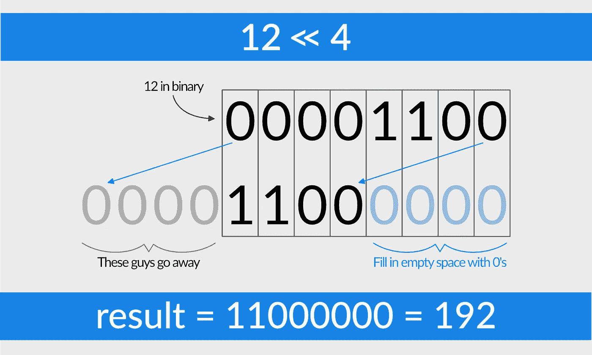
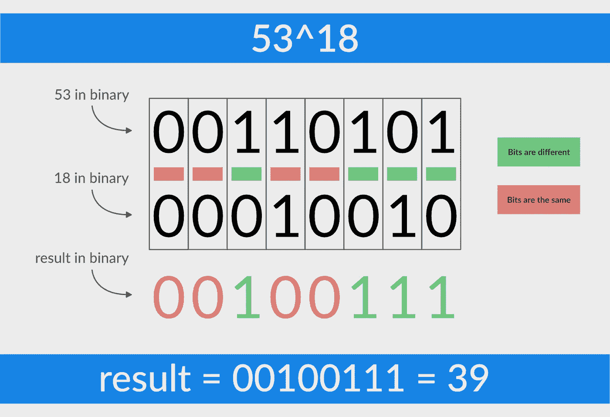

# JavaScript 的 Math.random()如何生成随机数？

> 原文：<https://medium.com/hackernoon/how-does-javascripts-math-random-generate-random-numbers-ef0de6a20131>


打开你的开发工具(Mac:cmd+option+I/Windows:ctrl+shift+I)，进入控制台，输入`Math.random()`，点击 return。

砰。你会得到一个随机数。

我得到了 0.6199322557631561。

我一直想知道这些数字到底是从哪里来的。更重要的是，它们怎么可能是随机的？毕竟，计算机不就是接受一些输入，用一些数学知识使之旋转，然后再把它吐出来吗？这似乎是一个可以预见的过程。那么当你想产生一个‘随机’数时会发生什么呢？这是怎么做到的，幕后发生了什么？

## 首先，这不是随机的

惊喜惊喜，答案是`Math.random()`并不会真的产生一个随机数。不完全是。它在模拟随机性方面做得非常好。

从本质上来说，算法随机数的产生不可能是随机的；这就是为什么它们被更恰当地称为伪随机数发生器(PRNGs)的原因。如果你使用数学和公式来创建一个数字序列，尽管它们看起来是随机的，但这些数字最终会重复出现，并显示出非随机的模式。

但是有些 PRNGs 比其他的要好。PRNG 的质量取决于许多因素，一个非常重要的因素是它的**期**；PRNG 在开始自我重复之前所经历的迭代次数。不仅对我们人类来说，长周期的 PRNG 看起来更随机，而且对计算机来说破解/预测也更困难(也就是更耗费资源);这是一个具有安全隐患的事实，尽管没有人应该使用`Math.random()`进行加密——但它还是发生了。

所以现在的问题是:JavaScript[使用什么 PRNG？](https://hackernoon.com/tagged/javascript)

答案是:没有。

## 这取决于浏览器

JavaScript 并不决定如何实现`Math.random()`，而是你的浏览器。JavaScript 中没有硬编码的 PRNG 算法。相反，创建您的浏览器的工程师决定使用符合 ECMAScript 规范的算法，如下所示:

> [Math.random]使用依赖于实现的算法或策略，返回一个大于或等于 0 但小于 1 的带正号的数值，该数值是随机选择的或伪随机选择的，在该范围内近似均匀分布。这个函数没有参数。
> 
> 为不同代码领域创建的每个 Math.random 函数必须从连续调用中产生不同的值序列。

这些是说明，由浏览器决定如何遵循它们。直到最近，不同的浏览器使用稍微不同的方法来实现这一点。他们使用的算法有着性感的名字，如 *Marsenne-Twister* 、*乘进位*或*线性同余发生器。不过，不要担心，理解所有这些东西的意思对你来说并不重要(尽管如果你理解的话，我会印象深刻)。*

关于这一切，需要知道的重要一点是:( 1)浏览器决定他们想要使用哪种算法来计算`Math.random()`;( 2)在 2015 年，几乎每个浏览器(至少是主流浏览器)都抛弃了他们旧的 PRNG 算法，现在他们都使用同一个算法:名为 ***xorshift128+*** 。

事实证明，xorshift128+在假装随机方面比老算法做得好得多；此外，它的重量非常轻，计算速度很快。因此，它几乎被全面采纳，当你考虑到以前在这个问题上有许多不同意见时，这充分说明了它的有效性。

但是它到底是如何工作的呢？

虽然每个浏览器实现该算法的方式略有不同，但我们可以看看它的一种“普通”版本，以了解它是如何工作的。

## 一些有趣的数学

首先，我将向您展示该算法，以便您能够完全理解(如 C 所示)，然后我们将进一步了解:

```
**uint64_t** state0 = 1;
**uint64_t** state1 = 2;**uint64_t** xorshift128plus() {
  **uint64_t** s1 = state0;
  **uint64_t** s0 = state1;
  state0 = s0;
  s1 ^= s1 << 23;
  s1 ^= s1 >> 17;
  s1 ^= s0;
  s1 ^= s0 >> 26;
  state1 = s1;
  **return** state0 + state1;
}
```

如果你和我一样(有前端背景，没有 CS 学位)你看着这个，想“好吧，变量赋值，变量赋值，函数…够简单了…”但是然后你来到`s1 ^= s1 << 23;`说“搞什么鬼？”

这些是**位运算符。**它们在比特级别(1 和 0)处理数据，它们构成了我们正在研究的算法的核心和灵魂。它们也是普通 web 开发人员很少有机会使用的东西。为了解释这个算法在做什么，我将快速浏览一下上面显示的三个按位运算符，以及它们是如何工作的。

第一个操作符`<<`，叫做左移。下面举个例子:`12 << 4`。在这个例子中，你需要一个数字 12 的二进制表示，并把它向左移动 4 位；因此左移。这是如何工作的:



与此相反，称为右移`>>`，做同样的事情，但向右而不是向左移动。

第二个运算符`=^`是 xor 赋值运算符。xor(*异或*的缩写)比较两个数的二进制表示，当对应的位匹配时输出 0，当对应的位不匹配时输出 1。你可以认为 xor 是“一个*或*另一个，但*不是两个*”。这里有一个随机异或`53^18`(没有赋值的异或)的可视化



现在您已经知道了所有操作符的作用，您可以开始理解上面的 [xorshift](https://hackernoon.com/tagged/xorshift) 算法了。我之前提到的那个令人困惑的位(`s1 ^= s1 << 23;`)只是将 s1 左移 23 位，然后将结果与 s1 进行异或运算，得到 s1 的新赋值。或者，换句话说，这是 xor 移位。

因此，为了完全简化事情，该算法采用两个种子值，交换它们，打乱它们的位值，将它们的位值通过一个逻辑门，重复几次，然后将它们加在一起…

砰。你会得到一个“随机”数字。

## 结论(TL；博士)

为了将所有东西打包整齐，这里有一个概述。

**问题:【JavaScript 的`Math.random()`如何生成随机数？**

**回答:**

*   JS 什么都不做，全靠浏览器
*   截至 2015 年，大多数浏览器都使用一种叫做 xorshift128+的算法
*   xorshift128+生成的数字并不是真正随机的，序列只是需要很长时间来重复，并且它们相对均匀地分布在预期的值范围内。

因此，事实证明，我们在这里真正做的是接受一些输入，用一些数学知识处理它，然后输出一个结果。一个完全可预测的，非随机的过程。但是对我们来说，它的随机性足以满足我们在 JavaScript 中随意制造混乱的目的。

*对于任何感兴趣的人，我在 GitHub 上有一个 xorshift128+的 JS 实现(链接如下),它给你一个算法‘随机性’的可视化，让你玩* ***种子*** *和* ***移位*** *值。感谢阅读！*

[](https://github.com/lordpoint/xorshift-sandbox-and-visualizer.git) [## Lord point/xor shift-沙盒和可视化工具

### xorshift+伪随机数生成(PRNG)算法的一个实现…

github.com](https://github.com/lordpoint/xorshift-sandbox-and-visualizer.git) 

— — —

***感谢阅读！如果你现在正准备转行到网络/软件开发，我会在这里写更多关于这个话题的内容:***


[https://swwwitch.dev](https://swwwitch.dev)