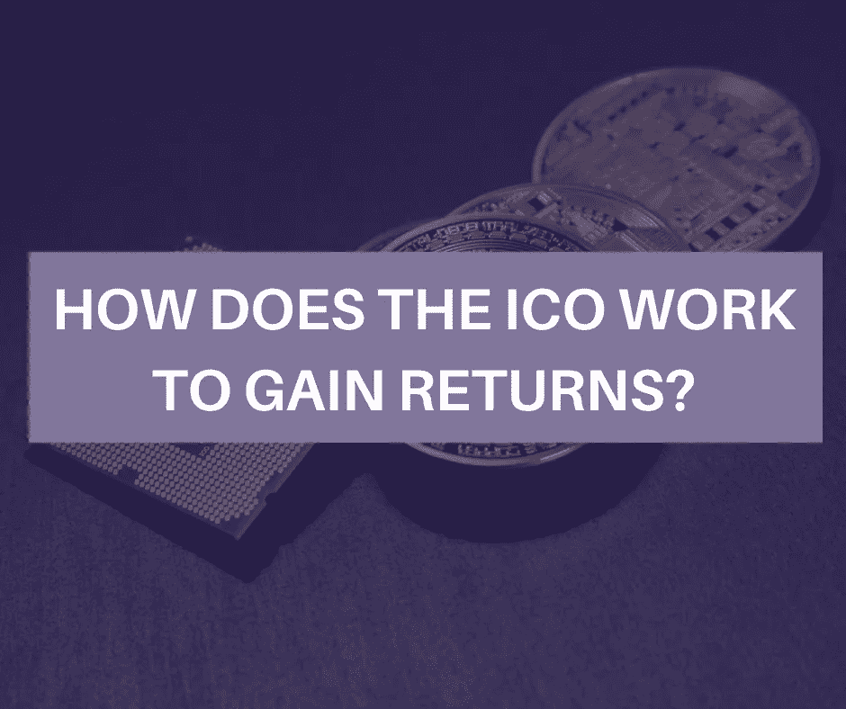

# ICO 如何获得回报？

> 原文：<https://medium.com/hackernoon/how-does-the-ico-work-to-gain-returns-dc1e415c1897>

**How does the ICO Work to Gain Returns?**

你很可能听说过 ICOs，对吗？

如果不是，它代表:首次发行硬币。

***我们来确切的了解一下，什么是初始币发售(ICO)？***

首次公开募股( [ICO](https://hackernoon.com/tagged/ico) )对于组织和个人来说是一种最简单也是最有效的技术，可以为他们的项目提供资金，也可以让老客户将资源投入到他们认为有价值的项目中。首次发行硬币通常会持续一周或更长时间，每个人都被允许购买最近发行的代币，以换取建立数字形式的货币，如比特币(BTC)或以太币(以太币)。

 [## 前 20+ ICO 营销机构|公关公司|加密货币营销服务

### ICO 营销的主要机构| ICO 公关公司|加密货币营销机构

hackernoon.com](https://hackernoon.com/top-ico-marketing-agencies-pr-firms-cb2b2deec52a) 

***初始投币(ICO)如何运作以获得回报？***

如今，有许多初创公司想出了推出 ICO 的主意，他们发布白皮书或网站，对项目和关键同事、企业的财务计划、批准投资的货币种类以及 ICO 活动的时间表进行逐点描述。

早期的 ICO 投资者被反复给予额外的好处。

大多数 ico 在活动开始前对提供的代币或硬币的数量设置了限制点。

早期的金融专家可能会被赋予特定的条款，这些条款通常会降低每枚硬币或代币的成本。

虽然一些 ico 可能在整个活动中保持价值不变，但其他 ico 会根据需求通过价格来改变成本，并有一个特定的最终目标，即尽可能多地增加资本。

人们对与 ICO 投机相关的风险存在相当大的担忧。

为了降低风险，ico 可以通过交换或托管利益来鼓励他们的产品。

第三方托管为投资者提供了一定程度的安全保障，防止骗子，也是在 ICO 活动结束后确认资金使用情况的一种方法。

**结论:**

沿着这些路线，我们都能够做的是承担一些责任，做我们自己的研究。关注白皮书，会见参与 ico 特定项目的团队，然后投资你的资金。

 [## 十大 ICO 开发公司| ICO 发布服务

### 如果你正在寻找最好的 ICO 开发公司来发布你的 ICO，你来对地方了。查找…列表

medium.com](/@icomarketing11/top-ico-development-companies-2955abc7fd0b) 

## 如果你喜欢这个故事，请点击👏按钮并分享，帮助其他人找到它！欢迎在下方留言评论。