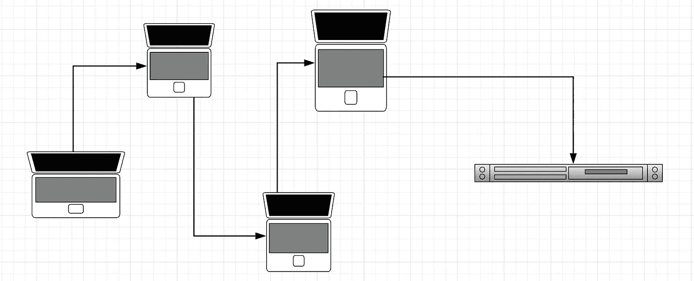
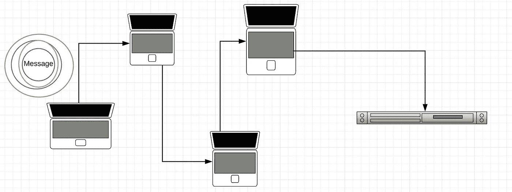
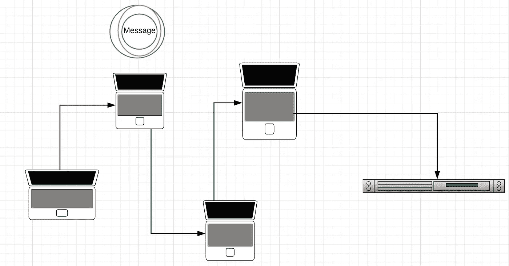
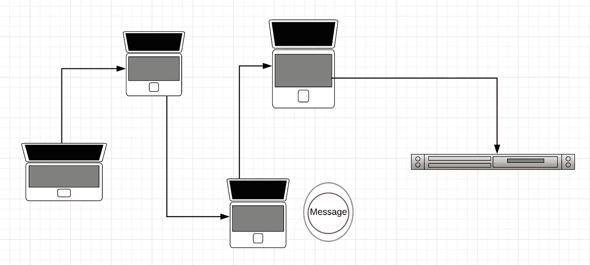
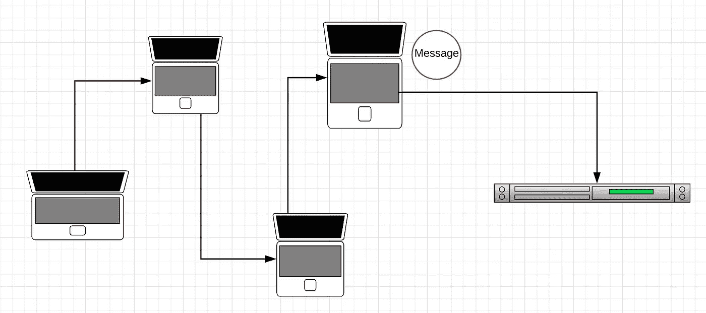
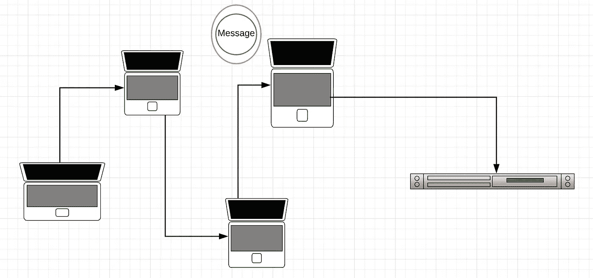
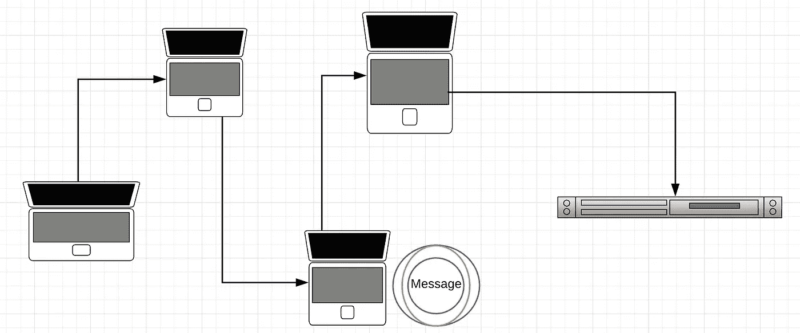
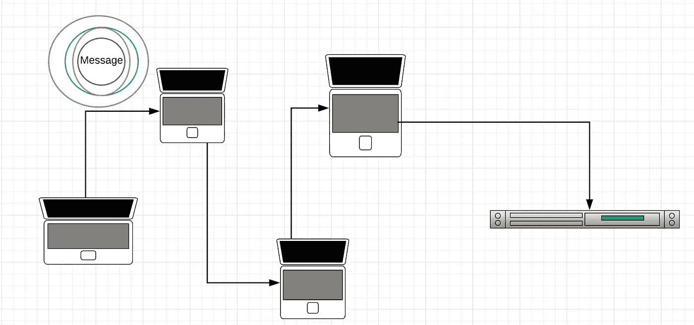
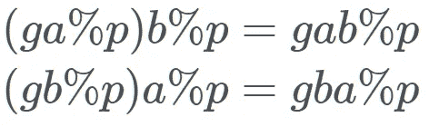

# Tor *到底是如何工作的？

> 原文：<https://medium.com/hackernoon/how-does-tor-really-work-c3242844e11f>

Photo by [Zac Ong](https://unsplash.com/photos/JHN1-mpgXjo?utm_source=unsplash&utm_medium=referral&utm_content=creditCopyText) on [Unsplash](https://unsplash.com/?utm_source=unsplash&utm_medium=referral&utm_content=creditCopyText)

我看了白皮书，所以你不用看了。

# Tor 是什么？

洋葱路由协议(TOR)是由美国海军在 20 世纪 90 年代中期在美国海军研究实验室设计的[0]。

Tor 的 pre-alpha 版本于 2002 年 9 月向公众发布[1]，维护 Tor 的公司 Tor project 于 2006 年启动。

这里引用了一篇题为“Tor:第二代洋葱路由器”的论文中关于 Tor 的一句话:

> *Tor 是一种基于电路的低延迟匿名通信服务[2]*

Tor 的核心原理是“洋葱路由”，这是一种通过公共网络进行匿名通信的技术。在 onion 中，路由消息被封装在几个加密层中，类似于 OSI 7 层模型中的封装[3]。它被称为洋葱路由，因为洋葱有层次，这个网络协议也有层次。

产生的“洋葱”(完全封装的消息)然后通过网络中的一系列节点(称为洋葱路由器)传输，每个节点剥去“洋葱”的一层，从而揭示数据的下一个目的地。当最后一层解密后，你就得到原始信息的明文。

原作者保持匿名，因为网络中的每个节点只知道路径中的前一个和后一个节点(除了知道发送者是谁但不知道最终目的地的第一个节点)。

这导致了对 NSA 运行服务器的“攻击”,以试图成为网络中的第一个和最后一个节点。如果 NSA 服务器是第一个节点，它知道消息来自哪里。如果 NSA 服务器是最后一个节点，它知道最终目的地和消息内容。[4]

# 概观

> *洋葱路由是一个分布式覆盖网络，旨在匿名化基于 TCP 的应用程序，如网页浏览、安全外壳和即时消息。*

客户端*选择*一条通过网络的路径，并建立一条*电路*，其中路径中的每个洋葱路由器都知道前任和继任者，但不知道电路中的其他节点。

数据包在网络中以固定大小的信元形式向下流动，这些信元由每个节点上的对称密钥解开，并向下游中继。

对称密钥的概念来自对称密钥加密算法。

# 对称密钥加密算法，绕道而行

在对称密钥加密中，Alice(发送者)和 Bob(接收者)使用相同的密钥，这与公钥加密相反，公钥加密中这些密钥不同。这使得它比公钥加密更快、更容易使用，但这也导致了两个问题:

*   需要安全地存储密钥
*   密钥的传送可能不安全。

如果第三方通过攻击密钥的传输或其他方法破解了密钥，他们将能够解密用该密钥加密的所有通信。

对称密钥加密的计算成本也比公钥加密低得多，这在这样的网络中非常有用。

*公钥加密*是一组基于算法的加密协议，需要两个独立的密钥:

*   公钥—它是公开的，对其他人可见
*   私钥——它是私有的，应该保密。

这两把钥匙在数学上有联系。在公钥加密中，公钥用于加密明文，私钥用于解密加密的文本。这意味着任何人都可以为特定的人加密明文，但只有那个人可以解密它。

这两个密钥是非常大的质数。假设 q 和 p 是两个分开的同样大的质数，那么 n = pq。n 用于加密消息，p 和 q 用于解密消息。

这是可行的，因为因式分解很难计算。给定一个非常大的数，找出这个数的质数因子。

通常这些数字是十六进制的。

# 数字签名

另一个有用的加密工具是数字签名。

数字签名使用公钥加密。数字签名是物理签名的数字版本。通常你可以说你已经加密/数字签名了一个文档。只有拥有私钥的人才能生成有效的数字签名，这使他们能够比实际的书面签名更安全地签署文档。

Alice 想要对消息 m 进行数字签名，为了做到这一点，Alice 必须:

然后，Alice 使用签名函数生成数字签名:

没有必要知道签名函数的*确切的*内部细节。该函数接受一条消息，一个私钥，它将产生一个数字签名。

任何人都可以使用公钥来验证数字签名:

If anyone knows how to put spaces in trueorfalse (in mathjax) I will greatly appreciate the help!

我说一个签名函数是不必要知道的，但是如果你想学习一些，继续。我没有将它们添加到本文档中的原因是，2-3 年后的人可能会阅读本文档，签名功能可能会完全不同。

# Tor 本身

Tor 需要很多用户来创建匿名性，因此如果 Tor 难以使用，用户就不会轻易采用它，从而降低匿名性。正因为如此，可用性不仅仅是 Tor 的一个设计选择，而是一个*安全需求*。如果 Tor 不可用或者设计得不好，它就不会被使用，因此也不会被保护。

因此，Tor 不得不做出一些设计决策，这些决策可能不会提高安全性，但会提高可用性。

# 不足之处

Tor 并不像许多人认为的那样是一个完全去中心化的点对点系统。如果它完全是点对点的，它就不会非常有用。Tor 需要一组目录服务器来管理和保持网络在任何给定时间的状态。

Tor 无法抵御端到端攻击。如前所述，端到端攻击是指实体同时控制路径中的第一个和最后一个节点。这是网络安全专家尚未解决的问题，所以 Tor 没有解决这个问题的方案。

Tor 不像 Privoxy 或 Anonymizer 那样提供协议标准化，这意味着如果发送方在使用 HTTP 等复杂多变的协议时希望响应方匿名，Tor 必须与 Privoxy 等过滤代理分层，以隐藏客户端之间的差异，并删除泄露身份的协议功能。[2]

Tor 不会隐藏发送者的身份。

2013 年，在哈佛大学期末考试期间，一名学生试图通过发送虚假的炸弹威胁来推迟考试。这名学生使用 Tor 和 Guerillar Mail(一种允许人们创建一次性电子邮件地址的服务)向学校官员发送炸弹威胁。[5]

这名学生被抓住了，尽管他采取了预防措施以确保自己不被抓住。

Gurillar mail 会在发送电子邮件的同时发送一个原始 IP 地址头，这样收件人就知道原始电子邮件来自哪里。对于 Tor，该学生预计 IP 地址会被加密，但当局知道它来自 Tor 出口节点(Tor 在目录服务中保存了所有节点的列表)，因此授权者只需查找在电子邮件发送时正在访问 Tor 的人。

# 洋葱路由

给定上面的网络，我们将模拟一个非常基本的洋葱路由协议。左边的笔记本电脑是发送者，右边的服务器机架是接收者。

因此，我们从用 3 层加密来加密消息开始(Tor 通常使用 3 个节点，因此需要 3 层加密)

第一层在第一台机器上剥离。这里要注意的重要一点是，每台机器只知道前任是什么或继任者是什么，它不知道最终目标是什么，除非它是路径中的最后一个节点。

当它沿着路径行进时，越来越多的层被剥离。第二个(中间)节点不知道消息从哪里发出，也不知道最终目的地在哪里。

最后一个节点知道消息是什么，它要去哪里，但不知道是谁发送的。

然后，计算机读取可能是“给我接脸书”的信息内容，然后连接到脸书，并收到一条回复信息。因为节点不知道原始消息来自哪里，所以它通过网络将它发送回前一个节点，并说“通过网络将这个传回来”。

但在此之前，它会添加回自己的加密级别。

最终，原始节点会收到一个完全加密的数据包，其中包含来自脸书的响应。因为原始节点既有私钥又有公钥，所以它可以完全解密消息。

这里的一个关键属性是，一旦节点解密了一层，它就不知道还有多少层要解密。它可以小到 1 或 2 层，大到 200 层加密。

第一个节点知道谁发送了该消息，但是它不知道该消息说了什么，因为它是加密的。最后一个节点知道消息说了什么，但它不知道消息来自哪里。

# 电路是如何产生的？

当每台机器想要创建一个电路时，它首先选择出口节点，然后选择电路中的其他节点。电路中的所有路径都遵循这些规则:

*   我们不会为同一条路径选择相同的路由器两次。
*   我们不选择同一系列中的任何路由器作为同一路径中的另一个路由器。(如果两个路由器都在其描述符的“家族”条目中列出了另一个，则这两个路由器属于同一家族。)
*   我们不会在给定的/16 子网中选择一个以上的路由器。
*   我们不会选择任何不运行或无效的路由器，除非我们被配置这样做。默认情况下，我们配置为允许无效路由器位于“中间”和“会合”位置。
*   第一个节点必须是保护节点。保护节点是特权节点，因为它看到用户的真实 IP。成为保护节点的成本很高(维持数周的高正常运行时间和良好的带宽)

这里需要注意的一点是，Tor 使用 Diffie-Hellman 算法在用户和洋葱路由器之间建立会话密钥。

# 迪菲-赫尔曼

Diffie-Hellman 是一种*生成*两个人之间共享秘密的方式，这种方式使得秘密不能通过观察通信而被看到。在密钥交换期间，您不是共享信息，而是一起创建密钥。

现在为大家介绍一些关于迪菲-海尔曼的基础知识，摘自[这里](https://security.stackexchange.com/questions/45963/diffie-hellman-key-exchange-in-plain-english)

> 我想出两个质数， *x* 和 *y* ，并告诉你它们是什么
> 
> 然后你选择一个秘密号码，但是不要告诉任何人。取而代之，你计算并将结果返回给我(我们称之为 *A*
> 
> 我做同样的事情，但是我们将我的秘密数字称为 *b* 和计算的数字称为 *B* 。所以我计算了一下，然后把结果发给你。
> 
> 现在你拿着我发给你的号码做同样的操作。所以那是。
> 
> 我用你发给我的结果做了同样的运算，
> 
> 最酷的是，我在第五步得到的答案和你在第四步得到的答案是一样的。这可以归结为模元件的一个很酷的特性:

# Tor 隐藏服务

在传统网络中，你有一个确定的输入和一个确定的输出。您知道数据的去向。在 Tor 隐藏服务中，你输入一些数据，但是没有外力可以看到它的去向。有可能在用户或服务器不知道彼此是谁的情况下与服务器通信。

当一个服务器在 Tor 上被设置成一个隐藏服务时，该服务器向一些选定的洋葱路由器发送一条消息，询问它们是否想成为该服务器的引入点。至于选择谁作为介绍点，这完全取决于服务器，选择谁并不重要。

介绍点知道他们将把人们介绍给服务器。

然后，服务器将创建一个叫做隐藏服务描述符的东西，它有一个公钥和每个引入点的 IP 地址。然后，它将这个隐藏的服务描述符发送到分布式哈希表，这意味着每个洋葱路由器将保存隐藏的服务描述符的一些信息。

如果您试图查找一个隐藏的服务，负责它的引入点会给您完整的隐藏服务描述符。

这个哈希表的关键字是洋葱地址，洋葱地址是从服务器获得的。

这个想法是洋葱地址并不在整个 Tor 网络上公布，而是你可以通过另一种方式找到它，比如从朋友那里或者在互联网上(地址以结尾。洋葱)。

所以几乎每一个洋葱路由器对隐藏的服务都知之甚少，除非他们明确地想要找到它。

如果你想访问一个洋葱地址，你应该首先从散列表中请求描述符，这个描述符有 4 或 5 个介绍性节点的 IP 地址。你随机选择一个，并要求介绍点将你介绍给服务器，而不是直接连接到服务器，你从一组给定的洋葱路由器中随机选择一个集合点。然后，你绕一圈到那个集合点，向集合点发送一条消息，询问它是否可以使用你刚才使用的介绍点向服务器介绍你，然后它说“我要你向服务器发送一条消息 X”。

集合点形成到引入点的回路，并向引入点发送单词 X 及其 IP 地址。引入点将消息发送给服务器，服务器可以选择接受它或者什么都不做。

如果服务器接受该消息，它将创建一个到集合点的电路。服务器将集合点发送到服务器，集合点查看两个消息，如果它们相同，那么它将充当电路上的另一跳并直接连接它们。

另一个需要注意的重要事项是，每个 Tor 数据包(称为一个信元)正好是 512kb，并且它们都是加密的。Tor 这样做是为了让人们猜不出更大的细胞是图像/媒体。

简而言之，隐藏服务是这样工作的，从[到这里](https://tor.stackexchange.com/questions/672/how-do-onion-addresses-exactly-work):

1.  隐藏服务计算其密钥对(私钥和公钥，非对称加密)。
2.  然后隐藏服务挑选一些中继作为它的*引入点*。
3.  它把它的公钥告诉 Tor 电路上的那些*引入点*。
4.  之后，隐藏服务创建一个*隐藏服务描述符*，包含它的公钥和它的*引入点*是什么。
5.  隐藏服务用它的私钥签署*隐藏服务描述符*。
6.  然后，它将*隐藏服务描述符*上传到*分布式哈希表* (DHT)。
7.  客户学习。来自带外隐藏服务的洋葱地址。(例如公共网站)(A $hash.onion 是从服务的公钥中导出的 16 个字符的名称。)
8.  在检索到。客户机连接到 DHT 并请求那个$hash。
9.  如果存在的话，客户端了解隐藏服务的公钥和它的*引入点*。
10.  客户端随机选择一个继电器来建立一个电路，告诉它一个*一次性秘密*。被选中的中继充当*集合点*。
11.  在用隐藏服务的公钥加密消息之前，客户端创建一个*介绍消息*，包含*集合点*的地址和*一次性秘密*。
12.  客户端通过 Tor 电路将其消息发送到其中一个*引入点*，要求将其转发到隐藏服务。
13.  隐藏服务用其私钥解密*介绍消息*以获知*集合点*和*一次性秘密*。
14.  隐藏服务创建一个*集合消息*，包含*一次性秘密*，并通过电路将其发送到*集合点*。
15.  *集合点*告诉客户端连接已经建立。
16.  客户端和隐藏服务通过这个*集合点*相互对话。所有通信都是端到端加密的，而*集合点*只是来回传递它。注意，它们中的每一个，客户端和隐藏服务，都构建了一个到*集合点*的回路；每条线路三跳，总共六跳。

 [## 给布兰登·斯凯里特买杯咖啡。ko-fi.com/hacker

### 支持自己热爱的内容。和 Ko-fi.com 一起给布兰登·斯凯里特买杯咖啡

ko-fi.com](http://ko-fi.com/hacker)  [## 用贝宝支付布兰登·斯凯里特。我

### 去 paypal.me/BrandonSkerritt 输入金额。既然是 PayPal，那就简单又安全。没有 PayPal…

www.paypal.me](https://www.paypal.me/BrandonSkerritt) 

# 参考

[0]—[http://www.onion-router.net/Publications/JSAC-1998.pdf](http://www.onion-router.net/Publications/JSAC-1998.pdf)
【1】—[http://archives.seul.org/or/dev/Sep-2002/msg00019.html](http://archives.seul.org/or/dev/Sep-2002/msg00019.html)
【2】—[http://fermatslilibrary . com/s/Tor-the-second-generation-onion-router](http://fermatslibrary.com/s/tor-the-second-generation-onion-router)
【3】—[http://ieeexplore.ieee.org/abstract/document/1094702/](http://ieeexplore.ieee.org/abstract/document/1094702/)
【4】—[https://cyber-peace . org/WP-content/uploads/2013/06/attaming-Tor _-how-the-NSA-targets](https://cyber-peace.org/wp-content/uploads/2013/06/Attacking-Tor_-how-the-NSA-targets-users-online-anonymity-_-World-news-_-theguardian.pdf)