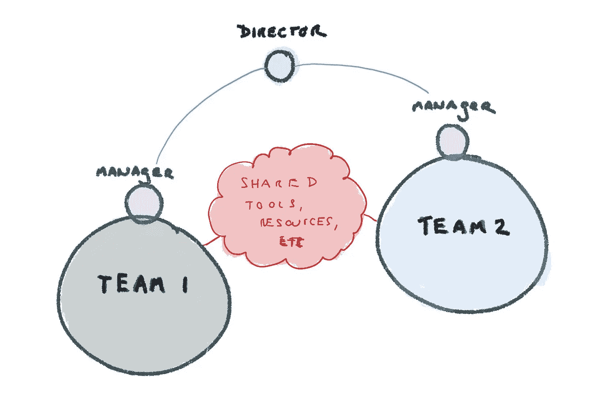
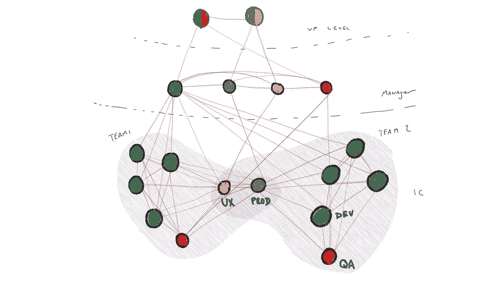

# 你的公司如何实现持续改进？

> 原文：<https://medium.com/hackernoon/how-does-your-company-approach-continuous-improvement-9fa7ec3545d3>

你的公司如何实现持续改进？

我什么意思？让我们举一个超级简单的例子:

假设**团队 1** 和**团队 2** 因共享工具而陷入困境。双方都同意为工具的维护做出贡献，但是由于来自**主管**的压力，要求更快交付(由**经理**沟通和管理)，他们放弃了工具的维护。现在两个团队都在努力满足各自**经理**的要求，而经理们也在努力满足他们**主管**的期望。

解决该问题的一些选项:

1.  在两周一次的会议上，**经理**介绍关键绩效指标。两个团队的进展都很缓慢。当被询问时，**经理**提出工具维护问题。**总监**决定让两个团队*投入一些时间来维护工具*。
2.  团队向他们的**经理**表达他们的担忧/压力，然后**经理**单独会面，然后与**主管**一起，试图找出前进的道路。**主管**促成了**经理**之间的协议，双方*都拿出一些时间来维护工具*。
3.  **团队 1** 和**团队 2** 定期开会讨论合作事宜。在其中一次会议上，他们讨论了工具的主题(以及其他挑战)，并就该工具如何影响实现**主管的**目标/目的交换了意见。**董事**和**经理**出席会议，但主要是提供背景。简单分析之后，**团队**同意*双方都花一些时间维护工具*。

有哪些利弊？

#1 更快，前提是**经理**提出问题并有合理的数据。#3 以潜在的混乱会议为代价，提高整体团队的弹性。#2 允许**经理**调解问题并共同“向上管理”。#3 让那些最接近问题的人(T50 团队)站在决策的最前沿。#3 可能会被视为一种干扰。我相信你能想到其他一些利弊…

记住，这是极度简化的。有些曲折…故事时间:

**团队 1** 的 Mala 是工具的“所有者”，但是**团队 2** 对 Mala 的奉献精神、能力以及寻求帮助和接受 PRs 的意愿提出了质疑。**经理**之间诊断问题的会议很快就变成了私人的/偏离主题的。还有别的事情在发生。玛拉被她的**经理**拉进了一个特殊的“副业”，而她的**经理**不愿意将这一努力暴露给**主管**和同事**经理**。但是，直到马拉的离职面谈真相大白(谷歌找到了她)，我们才发现这一点。

这种情况下还会发生什么？请在评论中分享。

所以让我们举一个更复杂(也更常见)的例子。

这不仅仅是稍微复杂一点。还有更多的事情在发生。考虑一些潜在的持续改进机会，以及**如何利用上述**中的#1 — #3(或其他选项，这可能更复杂):

*   QA 引进的太晚，工作被扔过了墙
*   UX 想要开始引领设计/发现冲刺
*   有毒人格上**团队二**
*   团队 1 正面临着严重的技术债务
*   团队 1 找到了一个做尸检的好方法，并想要分享
*   UX 和产品经理经理(中层)之间有一种有害的关系
*   **个人贡献者(IC)产品经理**将大部分时间花在**团队 1** 上，无法参与**团队 2** 的工作
*   **开发人员**希望轮换到其他团队，以保持职业生涯的新鲜感
*   (每个人)都希望重新考虑陪产假政策
*   个人贡献者对公司的产品策略有疑问
*   质量保证经理感觉他们没有从开发副总裁那里得到足够的资金。缺乏资金导致了普遍的延误和质量下降。
*   **团队 1** 和**团队 2** 想要分享他们如何衡量自己努力的成功的信息
*   **副总裁**需要沟通整个公司的战略变化，但是**团队**陷入了持续的承诺中。

你是做什么的？你从哪里开始？您可以开始看到问题，以及这三种方法(以及您发明的混合方法)的相对优势/劣势

让我们总结一些关键的注意事项:

*   谁最接近信息？
*   信息的流动是什么？
*   谁可能试图控制/影响信息的流动？
*   谁最接近雇佣/解雇的权力？
*   谁有知识/洞察力？
*   谁会受到决策的影响？
*   哪里存在潜在的不健康的局部优化？
*   一个人/团体的行为在哪里影响另一个人/团体的行为？
*   需求在哪里？它们在哪里分叉？
*   当前的信任和心理安全水平。
*   哪里需要一致性？可选？不可取？
*   像弹性、速度、可变性、健壮性这样的因素呢？
*   目前的结构优化是为了什么？这如何与系统中不同参与者的目标/需求以及公司的目标/需求保持一致？
*   系统的哪些部分是静态的，可变性在哪里是可取的和不可避免的？

有一件事是清楚的…可悲的是，RACI 在当今复杂的环境中表现不佳，原因我将在另一篇文章中阐述。

至少在我的职业生涯中，在问了这些问题之后，我倾向于发现自己主张 1)更扁平的组织，2)更广泛地参与持续改进…大规模的改善活动/开放空间，全部门回顾，跨团队工作组，3)作为教练/主持人的经理，以及 4) [购买近期“混乱”且“速度”略有降低的弹性](https://hackernoon.com/40-ways-to-invest-in-more-resilient-teams-c2ac7d008591)。这可能与我工作的领域有关——高增长、高可变性、不对称回报、不断变化的格局、跨职能团队等。以及我个人的偏见。

但这只是我。重要的是你要为你的环境考虑这个系统。