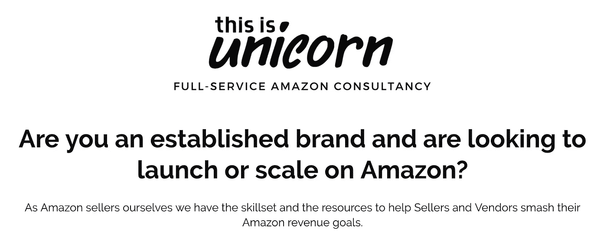

# Elise 如何以数字游牧者的身份建立一个繁荣的企业

> 原文：<https://medium.com/hackernoon/how-elise-built-a-thriving-business-as-a-digital-nomad-6bab3bf3a98>

Elise Jackson

## 从销售胡须油到帮助客户在亚马逊上赚钱的旅程——都在路上

人们在亚马逊上销售获得了难以置信的利润。伊莉斯就是这样做的，然后开始帮助别人也这样做。这就是独角兽如何诞生的！

> 我最近的亚马逊品牌在 6 个月内从零增长到了 6 位数——Elise

阅读这篇采访，了解 Elise 作为一名数字流浪者在旅行时是如何创建她的[创业公司](https://hackernoon.com/tagged/startup)的！

## 对于旁观者来说，数字游牧可能显得过于随意，但不要低估数字游牧者已经取得的成就。

2016 年，当我在巴厘岛进行第一次数字漫游时，它不仅向我展示了环游世界的乐趣，还展示了建立一个严肃企业的潜力。

我在 2016 年 9 月遇到了 Elise Jackson，当时她正在乌布(巴厘岛)救助几只小猫。这些小猫幸存下来，成长为健康的猫，现在在 Instagram 上有 10 万名粉丝。不，我们把它划掉。祝福猫，但这不是一个小猫贴(对不起，猫！).伊莉斯后来做得非常好，建立了她的创业公司，这是独角兽。

# 关于伊莉斯和生意

## 请告诉我们您具体是做什么的

*伊莉斯*:我帮助知名品牌在亚马逊上发布和扩大规模。我的咨询公司，这是独角兽，帮助亚马逊供应商&卖家从 PPC & AMS 优化&管理，列表优化，关键词排名到账户管理等等。我自己也是亚马逊卖家——我拥有自己的品牌，在美国&欧盟市场销售。我最近的亚马逊品牌在短短 6 个月内从零增长到了 6 位数。

## 你的学术背景是什么，怎么进入这个领域的？

伊利斯:我的学术背景是经济学&社会史——性别研究、文化史，诸如此类。我一直觉得自己很有创业精神，也很喜欢[营销](https://hackernoon.com/tagged/marketing)——我记得在我大约 9 岁的时候，我对一本独一无二的笑话书有了很大的想法，这本书将成为下一个大事件(有趣的是，我自己实际上不会讲笑话，所以它不会很好)——但我总是被初创公司吸引。

在我为自己跳槽之前，我最近的角色是在伦敦的一家令人惊叹的初创公司“SoPost”——我一直想在一家小初创公司工作，并从一开始就帮助塑造团队。

我有机会从零开始建立一个四人的客户管理团队，与欧莱雅、博柏利、Benefit Cosmetics、P&G 等客户合作。太棒了！

> 与此同时，我密切关注着电子商务领域正在发生的事情——新的独立品牌正在崛起，并真正挑战这些现有的家喻户晓的品牌，而有了 Shopify 和亚马逊等平台，这变得更加容易。我也想成为这场运动的一部分。

所以我离开了伦敦，搬到了巴厘岛，开始了我自己的生活，现在我在这里！

## 你做这个多久了？在此之前，你尝试过的几个想法是什么？

*Elise*:2015 年 10 月，我创立了自己的第一个电子商务品牌。我在 Shopify 博客上读到一篇文章，讲述了一个团队如何挑战自己，创造一个品牌&并在 72 小时内开始销售。我喜欢这个想法，所以我和两个朋友挑战自己做同样的事情，但是是在 48 小时内！

> 我们创立了一个名为“肖尔迪奇胡须”的品牌，销售令人惊叹的混合胡须油。通过这次经历，我开始更多地了解亚马逊平台，以及它特有的所有战略和战术。这似乎是一个很好的模式，所以我决定推出另一个品牌，只在亚马逊上。

在过去的两年里，我学到了很多东西，在短短的 6 个月里，我的最新品牌从零增长到了六位数。我的合作伙伴 Gianluca 几个月前也加入了这个团队——他是一名技术产品经理，痴迷于流程，在帮助我之前，他帮助过伦敦的风投支持的科技初创公司。

我很少看到有这些资源的品牌，尤其是在他们刚刚起步的时候。我们建立了可扩展、可重复的流程&一个帮助我的品牌成长的可靠团队。从关键词和列表优化到 PPC 管理，再到客户服务模板和 VA 招聘，等等。

所以我对自己说，我们怎样才能帮助其他品牌&使用我们为自己建立的同样的结构和流程？与其他品牌分享我们的技能似乎是合乎逻辑的，这些品牌在亚马逊上面临着与我们创业时相同的挑战。因此我们开始了“这是独角兽”。

## 为什么有意思？是什么激励你坚持做下去？

*伊莉斯*:我喜欢看到产品变得栩栩如生，无论是我自己的还是客户的——从研究市场、与客户交谈，到执行设计概念，再到看到产品到达客户手中。当我看到我们的客户对他们的业务增长感到兴奋，我们帮助他们实现了这一点，这是最大的成功。

## 请分享你这样做对你的客户的生活产生的影响。

*伊莉斯*:你知道，企业的很多问题都可以通过增加收入来解决。这是我们为客户做的主要事情。

> 我们的一个英国客户每月收入增长了 37%,而销售利润却保持不变的广告成本。

我们通过他们的 AMS(赞助广告)活动和列表优化来做到这一点。这些都是有效的工具，但是客户通常没有足够的知识和时间来充分发挥它们的潜力。

不过重要的是，我们专注于彻底了解亚马逊。我们的客户喜欢的是，他们不需要学习所有必要的专业知识来扩大和发展亚马逊，相反，他们可以专注于创造新产品和扩大产品范围。

# 它的数字游牧方面

## 告诉我们你过去的一年——在生活、旅行、工作等方面过得怎么样！

Elise :我梦想着数字游牧生活方式，一边工作一边旅行，一个月在这里，一个月在那里。我和我的搭档正是为了这个目的离开了伦敦，最后在巴厘岛呆了一年！我们意识到我们喜欢有一个可以称之为家的地方——它给我们某种稳定。

> T2:现在我可以说我是一个不受地点限制的企业家——我只需要我的笔记本电脑和我的大脑来工作，我不需要在任何一个特定的城市坐在办公桌前。

我们已经决定在未来几年里把巴塞罗那作为我们的家，同时我们也在建立我们的代理机构。我们仍然经常旅行，但现在旅行更放松了，因为我们休假了。

## 成为一名数字流浪者对你的旅程有什么帮助？

*伊莉斯*:数字游牧在几个方面影响了我的旅行业务，有好有坏。

*好的一面是*:它为我打开了一种新的工作方式，建立了一个团队，能够从&中学习，与来自世界各地的优秀人才合作。Unicorn 团队有一半在远程，一半在巴塞罗那，我们的内部流程&工具意味着团队的每个成员都可以独立于位置。那超级酷！

坏消息:离开伦敦意味着我离开了很多支持我的网络:朋友、同事、导师。当你经常旅行时，你会不断地建立友谊，加深这些友谊并建立一个强大的游牧支持网络是很困难的。找到一个新的地方需要时间，对我个人来说，这会影响我的工作效率。

## 当你旅行时，你在哪里工作？

伊莉斯:我通常在巴塞罗那的办公室工作。要么我去旅行休息一下，摆脱日常工作，想得更清楚——我尽量不要带笔记本电脑。或者，如果我出差，我更喜欢在咖啡馆或酒店休息室工作。

## 你如何维持自己当老板的纪律？你如何处理时间管理，比如责任？

*伊莉斯*:有时候很难！当然，与团队和客户一起工作很有帮助，因为这让我保持警觉，并对他们负责。我明白了，我需要例行公事来使我更加一致和高效。

> 每天早上醒来时，我都会做 30 分钟的瑜伽——这有助于我集中注意力开始新的一天。我依赖项目管理软件——我们目前在团队中使用 Asana。我也有一个智囊团，我每个月检查两次，最近我开始定期检查责任伙伴的目标设定。

我建议每个人都应该找到适合自己的**特别是*。了解你自然做事的方式——我真的推荐[柯尔伯测试。有一段时间，我非常刻板，强迫自己完全照搬别人的套路，却没有意识到它们实际上与我的天赋背道而驰。现在我允许自己有更多的灵活性——这样我更有效率，也更开心。](http://10xtalk.com/61/)*

## *作为一个创业者，你最美好和最糟糕的时刻是什么？*

*Elise :最美好的时刻——每天我都在学习新的东西，这给了我力量。这是一个不断的挑战，让我做得更好，我喜欢这种感觉。*

*最糟糕的是——当你独自工作时，会感到孤独。花太多时间在笔记本电脑屏幕前是不健康的，当然也不是我的体质！*

## *作为一名女性，你作为一名企业家和数字流浪者有什么样的体验。你认为是什么阻止了女性发挥她们真正的潜力？*

*我记得有人曾经告诉我，一个男人如果符合 60%的要求就会申请一个角色，但是一个女人只有符合 100%的要求才会申请——这真的让我难以忘怀。我经常想，在我们投入某件事之前，我们都有一种对它感到惊奇的期望。*

> *但是如果我们从来没有做过，我们怎么可能已经很棒了呢？*

## *你对其他创业者有什么建议(可以分享 2-3 条建议)？*

**伊莉斯* : 1。每天多学习——学习新技能，跟上潮流，这将使我们的头脑长期保持年轻*

*2.保持健康——只有当你充满活力时，你才能改变世界*

*3.精确行动——不要试图在一天内创建一个企业。这就像兔子和乌龟:不要急于求成，想得太短浅&筋疲力尽(我不得不经常提醒自己这一点！).*

## *每天早上是什么驱使着你？*

*伊莉斯:事实上，我每天都有责任创造自己的快乐。*

## *哦，你救的那些小猫怎么样了？:)*

*伊利斯:阿斯卡&路易吉陪我一路走到了巴塞罗那！一场逻辑噩梦，但最终都是值得的——它们让我每天都充满笑容😻🐾*

## *想成为更好的创业者？*

*我列出了 15 本你没听说过的商业书籍,这些书都是非常成功的创始人所推崇的(除了老一套的《零对一》和《精益创业》!)*

*[*在这里获取秘商书单*](http://startupbookindia.com/readinglist/) *。**