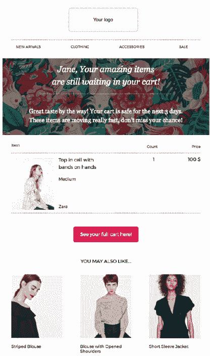

# Shopify 应用程序如何改变电子邮件营销

> 原文：<https://medium.com/hackernoon/how-email-marketing-changes-with-shopify-applications-ee4e4cf330fc>

## 任何数字业务的目的都是为了销售。很明显。

不无论你有什么样的使命和伟大的目标，只有有*真实的现金流*才会有效。几年前，在网上销售产品意味着你必须建立简讯，发送所有简讯，回答没完没了的电话，并且设法推销你的产品。

好吧，十年前这一切都还可以忍受。

然而现在，考虑到竞争与日俱增，以及**未回复邮件的数量越来越多**，这似乎是不可能的。

但这还不是最糟糕的。真正的问题开始于它没有给你任何结果的时候。

所有发送的简讯、准备好的电子邮件都没有给商店带来销售额。我们发现**网上销售根本不取决于你投入**的时间。你可以在几分钟内准备一份时事通讯，或者花上几个小时——结果不会有丝毫改变。

# **网店管理变化巨大**

幸运的是，现在我们有了 [Shopify](https://www.shopify.ca/) 。当然，它对管理订单和运输有很大帮助。您不必担心收集客户信息或误解订单细节，因为 Shopify 会保存这些信息。

## 但是如何获得顾客呢？

Shopify 博客建议使用电子邮件营销进行产品推广，因此，如果你偶然认为电子邮件营销已死，你可能会改变主意。它仍然是在网上提供商品的主要渠道之一。

*但是确实有一些修改。*

# **Shopify 提供自己的工具**

Shopify 应用商店提供了许多工具，允许收集电子邮件地址，管理用户列表，并监控结果。听起来很棒，但实际上，迟早平台用户会发现他们中大多数的功能都不够用。

我们来看看为什么。

1.  尽管电子邮件营销是推广电子商务的主要方式，但 Shopify 的主要目的并不是推广，而是店铺管理。换句话说，这个平台让你在某种程度上管理电子邮件营销，但没有给**任何工具来让这些电子邮件变得更好**。
2.  功能性还是挺差的。对于基本的时事通讯，你可能做得很好。但是如果你的目标是根据页面上**客户的行为**创建一个个性化的活动，Shopify 定制工具就不会给**这样的机会**。
3.  对大商店来说不够。如果你拥有一个大型网上商店，你会有几十个甚至几百个不同的活动，面向不同的受众群体。Shopify 给你**没有**的可能性去一丝不苟地**细分**你的观众。
4.  你还需要**的营销建议**。尽管 Shopify 官方工具确实自动化了流程的某些部分，但它们仍然不能解决大多数企业主的问题。如果你以前没有开展过电子邮件活动，不要指望这个工具会教你。

# 不要找管理工具，要找协助

有效开展电子邮件营销的最佳方式是*自动化*。也许你已经知道了，但是这里有一个主要原因的快速分类。

✔️自动化让您始终如一。手动做事，很容易忘记设置下一个活动，偏离营销策略。

✔️:如果你想扩大规模，这一点至关重要。你不可能在不感到困惑的情况下跟踪几十份时事通讯。

✔️Automation 节省你的时间。这里不需要解释。

我们真的不认为你需要说服为什么自动化是可怕的。这已经在许多畅销书中讨论过了(甚至以每周四小时工作制为例)。这个问题，也是我们经常遇到的问题，是:

> 我如何确保我的自动化真正工作？如果我花的比收到的多怎么办？。

这的确是一个合理的担忧。有这么多的自动化平台可用，很容易陷入选择你需要什么。说真的，你不需要遵守很多规则。只有一个原则，而且它完美无缺:

## *选助手，不选管理平台。*

就这么简单。如果你想找到一个电子邮件营销自动化解决方案，不要把重点放在获得工具来管理你的过程，而是在整个过程中帮助你。

让我们看看这对于现实生活中 Shopify 扩展的产品功能意味着什么。

M 毛发生长器扩展:

*   您可以管理已收集订户的列表并对其进行分段。
*   为你的电子邮件活动设定日期和基准。
*   使用舒适的构造器创建新闻稿设计。
*   在扩展中提供折扣和特别优惠，并将其添加到您的活动中。

辅助分机:

*   软件将收集电子邮件地址，并根据客户行为为您进行分段。
*   该扩展将向您建议最佳的时间表和关键绩效指标。
*   助手会向您推荐一个现成的模板，您可以进行编辑(当然，如果需要的话)。
*   您唯一要做的就是指定此类折扣的条件，其余的工作将由扩展完成—创建模板、找到合适的接收者以及细分受众。你刚按了发送键。

# 在 Shopify 应用商店里能找到这样的工具吗？

是的。你甚至不用看，因为你已经打开了正确的门。一家[的电子邮件营销自动化服务](http://bit.ly/how-em-changes-with-shopify)Triggmine，拥有自己的 [Shopify 应用](http://bit.ly/Triggmine-on-Shopify-Marketplace)。

## 人工智能跟踪网站上的客户行为，因此用户可以根据自己的搜索和购买历史接收个性化的电子邮件——就像这个一样。

电子邮件设计也是自动完成的，但如果需要，所有者可以自由进行任何编辑。此外，扩展建立了一个战略，建议关键绩效指标，并监测效率。它不仅仅管理流程，**它还管理流程**。

订阅我们的故事。我们认为你可能会喜欢它。你的 [Triggmine](http://bit.ly/how-em-changes-with-shopify2) 。