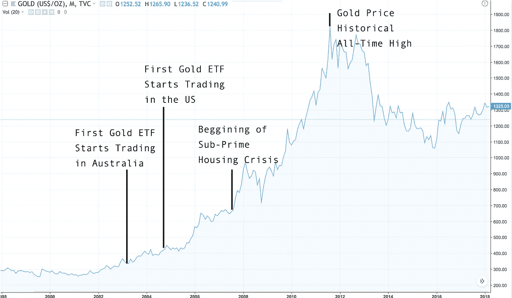

# ETF 如何永远改变比特币

> 原文：<https://medium.com/hackernoon/how-etfs-can-change-bitcoin-forever-75cbf32b8b8d>

最近有很多关于美国证券交易委员会(SEC)可能批准比特币交易所交易基金(ETF)的传言。但这种讨论并不新鲜，因为美国证券交易委员会已经在 2017 年对两项比特币 ETF 许可证申请做出了负面裁决。那么，现在围绕这个问题的炒作是怎么回事，为什么它如此重要？

# 什么是 ETF，它们来自哪里？

简单地说，ETF 是一种持有基础资产所有权的基金，比如黄金。该基金拥有一吨黄金，其价值相当于黄金在任何特定时间的价值，然后发行该基金的股票，这些股票应相对于基础资产本身的价格进行估值。股东并不拥有黄金，而只是持有黄金的“公司”(即基金)的股份。这些股票很容易交易，给投资者很大的灵活性。

从你的技术角度来看，ETF 可以被描述为一种跟踪金融资产如基金、指数、债券或商品的有价证券。它们像普通股票一样在受监管的交易所交易，根据市场需求全天进行价格发现。

它们最早出现在上世纪 90 年代的美国，在 21 世纪初迅速蔓延，使得交易员能够相对简单和安全地大幅分散投资组合。从农作物到黄金、石油和其他大宗商品，交易所交易基金让交易者能够轻松实现投资多元化，同时获得持续的流动性。

# 比特币 ETF 有什么区别？

比特币交易所交易基金的许可可能会对如今的加密市场产生相当大的影响。首先，这将给市场带来安全感，因为 ETF 有保险和抵押。这意味着投资者没有因黑客攻击或私钥丢失而损失投资的风险，这与当今密码交易员面临的情况截然不同。反过来，这种增加的安全感将吸引更多的投资者，这些投资者迄今一直对将资金投入如此不安全和动荡的市场持怀疑态度。

然而，比特币交易所交易基金将带来的真正变化是，加密世界向机构投资者开放。像 ETF 这样的机制最终会给大型投资基金带来风险缓解和监管确定性，这是它们加入加密大军所需要的。许多人预计，如果 ETF 许可证获得批准，我们可能会看到对加密资产的兴趣出现前所未有的爆炸，在这种金融机制带来的投资者资金浪潮的背景下，比特币和以太坊的价格分别达到 6 位数和 5 位数。

Photo by [SpaceX](https://unsplash.com/photos/uj3hvdfQujI?utm_source=unsplash&utm_medium=referral&utm_content=creditCopyText) on [Unsplash](https://unsplash.com/search/photos/rocket?utm_source=unsplash&utm_medium=referral&utm_content=creditCopyText)

这些估计是否会发生自然很难维持，甚至对发行其他资产的 ETF 的影响的历史观察也不能真正被视为对比特币价格会发生什么的预测。然而，看一看图表至少可以让你对未来有所了解。

既然我们在谈论“数字黄金”，那就让我们看看当 ETF 被引入时，实际的黄金发生了什么。

在黄金交易所交易基金出现之前，投资者大多只能购买实际的金币或金条，这是一种不切实际的投资机制。首个黄金 ETF 于 2003 年 3 月 28 日推出，并开始在澳大利亚证券交易所交易。在美国，GLD 是第一个获准交易的黄金 ETF，并于 2004 年 11 月 18 日上线。这是黄金价格的历史图表:

正如你所看到的，黄金交易所交易基金的推出先于黄金价格的大幅上涨。一些分析师认为，黄金价格风险敞口的容易获得，加上这种新金融产品的兴奋，至少在一定程度上是这种资产在 2004 年至 2012 年期间经历的令人难以置信的牛市的背后原因。

从这个单一的证据中提取太多东西是不明智的。从历史上看，有许多不同的变量证明了大规模投资黄金的合理性，政治和经济不稳定是贵金属价格攀升的强大推动力，就像 2007 年的次贷危机一样。然而，通过让机构投资者更容易投资于 ETF，ETF 似乎确实促进了这种增长。比特币交易所交易基金的发行是否会对“数字黄金”的价格产生类似的影响仍有待观察，但这个想法肯定让加密领域的许多人兴奋不已。

# 谁是 ETF 需求的幕后推手？

在过去几年中，美国证券交易委员会已经多次申请比特币交易所交易基金(ETF)牌照。在一些最知名的名字中，有文克莱沃斯双胞胎，更出名的是他们与马克·扎克伯格在今天的脸书的最初想法上的争端，以及在 2013 年投资比特币后成为加密亿万富翁。他们提出了迄今为止最受关注的两项比特币 ETF 许可证申请，但和其他人一样，他们未能平息 SEC 的担忧，他们的申请遭到了拒绝。

这一次，每个人都在关注的、目前正在接受美国证券交易委员会审查的最新提议是由活跃资产管理公司 VanEck 和声誉卓著的区块链公司 SolidX 提出的，SolidX 得到了 CBOE 全球市场的支持，后者是美国最大的期权交易所芝加哥期权交易所(CBOE)的母公司。VanEck SolidX 比特币信托基金将是一个纯比特币投资机制，提供每股 25 BTC(约合今天的 167，500 美元)的 5 股篮子。因此，该信托基金的目标是大型注册机构投资者，据信由于加密市场的不成熟和潜在的波动性，这些投资者在很大程度上仍置身于加密市场之外。两家公司决定在 6 月份联手开发这项提案。继 7 月初宣布成立联合基金后，美国证券交易委员会(SEC)现在正就该提议征求意见。这是 VanEck 第三次尝试申请比特币 ETF 许可证，它希望现在能够解决 SEC 的许多问题。该信托将为盗窃和不当操作资金提供全面保险，提供相当程度的投资保护，这是 SEC 的最大优先事项。如果获得批准，VanEck SolidX 比特币信托股份将自然在芝加哥期权交易所(CBOE)交易。

# SEC 对比特币 ETF 有哪些担忧？

美国证券交易委员会主要关注的是缺乏监管和加密市场的波动性，特别是考虑到投资者保护。在今年 1 月就该机构的担忧发布的一封信中，SEC 强调，该基金需要针对这种极端的市场波动充分维护基础比特币资产的价值，并有能力确保投资者的市场流动性，因为股票必须在任何时候都可以赎回。从安全角度来看，该基金提供比特币资产保管服务以及维护资产安全、保证私人钥匙及其持有的比特币安全的能力受到质疑。投资者知识的缺乏以及市场操纵的可能性和监管的持续缺乏，结束了每项提案必须解决的问题列表。

# 为什么 SEC 这次会接受比特币 ETF？

目前，尚不清楚 SEC 会倾向于哪一方，也不清楚目前的提议是否充分回答了该委员会在 1 月份首次提出的问题。

然而，自上一次 ETF 提案被 SEC 否决以来，一些事情发生了变化。首先，上个月美国证券交易委员会宣布[比特币、以太币和其他分散货币将不被视为证券](https://www.coinvision.co/articles/ethereum-the-sec-and-the-bright-future-of-cryptos?utm_source=Content&utm_campaign=BitcoinETF),这是朝着加密资产的监管地位迈出的重要一步。

此外，今年 6 月，SEC 投票允许销售 ETF 的公司推出“普通版本”,而无需事先获得监管机构的批准，此举被视为降低准入门槛的重要举措。

也就是说，尽管缺乏 ETF，但机构投资者仍有其它选择进入市场。

CBOE 本身于 2017 年 12 月在自己的交易所为合格投资者推出了比特币期货交易。与预期相反，市场对这一发展的反应不冷不热，如果机构资金在此之前撤出，期货似乎无法改变趋势，即使高盛(Goldman Sachs)和摩根大通(JP Morgan)等参与者也想分一杯羹。

比特币投资信托(Bitcoin Investment Trust)等其他基金也开始向投资者提供与加密资产互动的其他形式。投资选择的可用性是否会对 SEC 的裁决产生积极或消极的影响，还很难说。

美国证交会提出的其它问题，涉及 ETF 发行机构的托管服务，也已由第三方逐步解决，比如比特币基地最近开始为其客户提供托管服务。

然而，似乎很明显的是，ETF 牌照的批准——传统市场中的一种常见机制——将为机构投资者打开一扇舒适的大门，让他们在风险降低的情况下试水加密领域。

虽然现在还不能说，但大多数市场参与者都希望，SEC 对 ETF 的新观点，加上 VanEck 和 SolidX 在 CBOE 等主要机构的大力支持下提出的充分建议，将足以说服 SEC 做出历史性的决定，向机构资金打开加密世界的大门。就这一提议向美国证券交易委员会提出的大多数评论似乎都支持比特币基金的许可。

**我们希望在 8 月 16 日**知道答案，届时征求意见的截止日期将会是做出决定的日期，尽管**可能会再推迟 45 天**，将决定日期推至 9 月 30 日。

批准这一请求可能会永远改变加密市场的面貌。

*joo Gaspar Marques 是*[***coin vision***](https://www.coinvision.co/)*的内容经理，这是一个帮助新投资者了解加密货币市场并做出更明智投资决策的市场智能平台。*