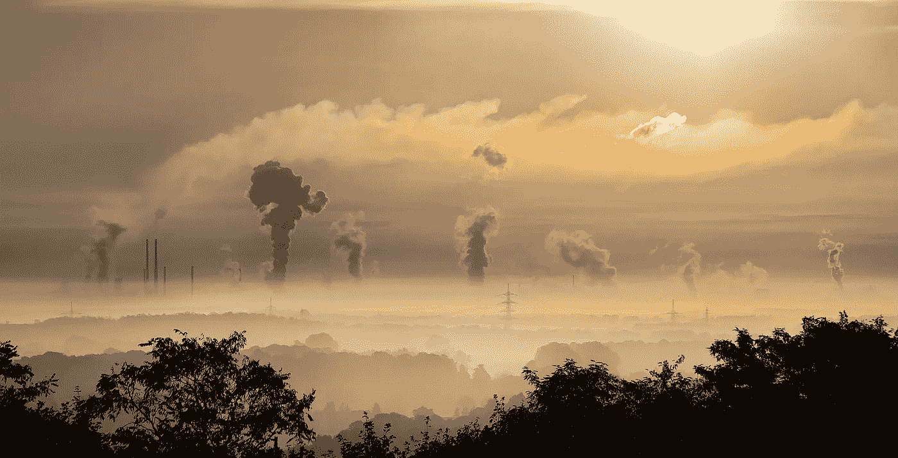

# 每个人对比特币开采所用能源的看法都是错误的

> 原文：<https://medium.com/hackernoon/how-everyones-wrong-about-the-energy-used-in-bitcoin-mining-fe3009fd9102>

天下没有免费的午餐。没有零和游戏这种东西。热力学第二定律告诉我们这一点。你知道，那个关于熵以及在几万亿年后一切将会变得非常非常糟糕的故事。在某个地方，没有同样大的 *re* 动作，就没有动作。比特币挖矿也是如此。

偶尔，一些无知的渴望点击诱饵的记者会写一篇关于比特币的能源使用以及它与全球变暖的关系的文章，或者比特币的广泛采用会因为其“浪费”的生产过程而在某一天杀死我们所有人。他们都没有解决的是他们的替代成本。首先，比特币的价值恰恰在于*，因为*它们的生产成本很高。黄金或钻石或其他稀缺和难以获得的东西也是如此。挖掘算法永远不会更节能*,因为消耗的电力与代币的价值直接相关。*

*其次，想想大多数人用比特币做什么。没什么。没错，没什么。比特币鼓励储蓄而不是消费。这与我们当前的法定货币体系正好相反，因为比特币是通货紧缩而不是通货膨胀。这意味着，如果没有花在比特币上，花在比特币上的每一美元、日元或英镑最终都会花在其他一些需要能源的事情上。要么是这样，要么它会因为通货膨胀而贬值，这意味着更多的美元、日元或欧元会被创造出来并花在无足轻重的事情上。中央银行的理念和约翰·梅纳德·凯恩斯的哲学是，快速支出和大量交易通常是推动经济的动力。比特币是这些观点的*对立面*。是的，生产成本很高，但过度生产地球上的每一种产品也是如此，因为你需要尽可能快地扩大你的业务，以偿还你的贷款。人类福祉一直并将永远与能源消耗成线性关系。你无法回避这个事实。它们不可避免地联系在一起。比特币的作用是通过激励我们为后代储蓄，消除不必要的能源消耗。这是阻止我们破坏倾向的工具。不是对我们星球健康的威胁，而是一种补救措施。*

*所以，下一次你听到比特币消耗的能源和一个小国一样多的时候，问问你自己——如果它没有被投入到唯一一项试图拯救我们的发明中，所有这些能源最终会流向哪里？进入一家中国工厂，生产通过船只、卡车和汽车运输的消费品，供西方人临时使用，可能在不到一年的时间里，最终成为一个小国大小的垃圾堆？这对地球又有什么好处呢？解决人类问题的唯一方法来自人类的聪明才智，而人类的聪明才智本身来自那些有头脑的人有机会在生活中有所成就的地方。多亏了互联网和比特币，某个地方无处不在。互联网将我们联系在一起，比特币解放了我们的时间，将我们从当前系统的破坏性机制中解放出来。比特币帮助你种下一颗种子，如果你愿意，可以看着它成长。在你批评比特币之前，仔细阅读一下*为什么*它被发明，以及通货膨胀、软货币对市场机制的影响。为什么我们会有气候问题？为什么我们过度消费。是什么潜在的力量拉动我们的心理弦，让我们借钱买新车？不先了解问题就批评 a 的解决方案是一种特殊的无知。*