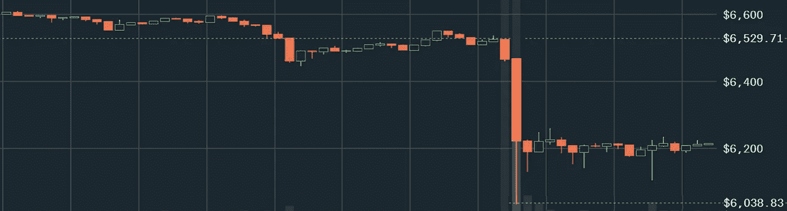
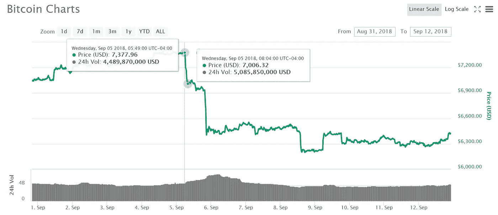
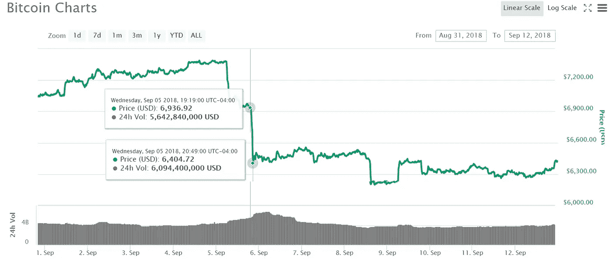
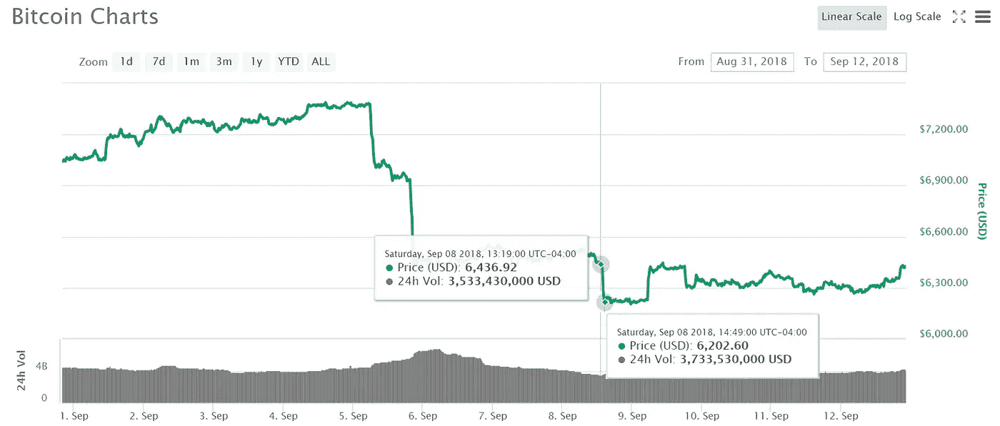
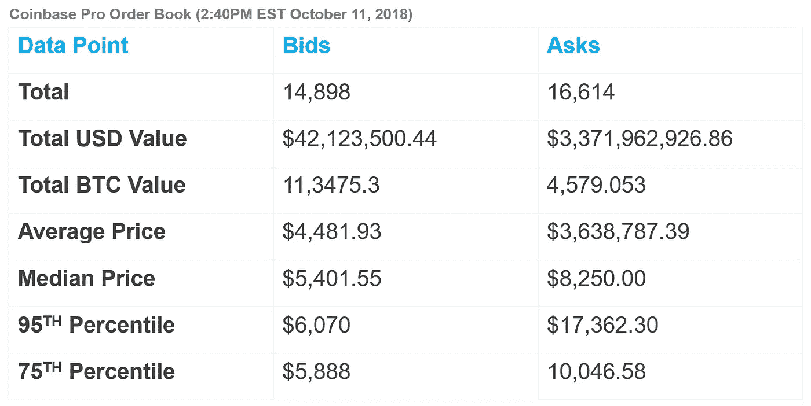
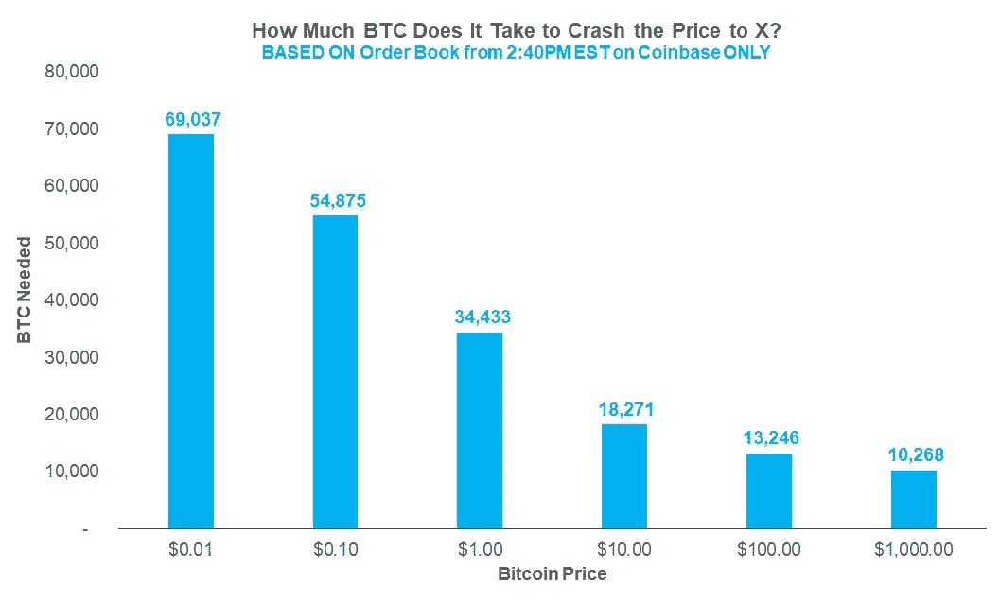

# 比特币转储有多贵？

> 原文：<https://medium.com/hackernoon/how-expensive-is-a-bitcoin-dump-91a0a9e48c07>

美国东部时间 2018 年 10 月 10 日晚 8 点到 9 点之间，市场出现比特币价格的巨幅下跌。在比特币基地，油价从 6500 美元暴跌至略高于 6000 美元。这大约 7%的下跌恢复得相当快，因为价格似乎在交易所稳定在 6200 美元左右。

但这种类型的市场运动在 2018 年的熊市中变得非常常见。这种运动的特点是相当大的市场抛售(一小时内超过 5%——尽管通常只需要几分钟)。不用说，它们是集中的——也就是说，一个人或一组人发起销售。这不是一场碰巧同时发生的集体运动。整个九月，我们已经看到了几个这样的价格变动，如下图所示:

这种类型的运动并不令人惊讶；2018 年 10 月 10 日比特币 24 小时成交量约为 38 亿美元。相比之下，2018 年 1 月 5 日的交易额为 240 亿美元。随着交易量减少 84%，交易规模对比特币价格的影响要大得多。

但是到底需要放什么进去，才能做出这个动作？我做了一个小实验来了解成本和不同的场景。在比特币基地东部时间下午 2:40，我通过使用比特币基地专业 API 调出了整个订单簿。

# 订单簿统计

请记住，这些数字并不代表比特币的趋势。收集到的这些价格只是某个时间点的快照；订单书变化频繁，我没有收集一段时间的数据，只有 10 月 11 日下午 2:40 的一次。

## 旁注 1:出价和要价

对于那些不太熟悉订单簿的人来说，它只是包含了人们所下的所有订单。例如，如果有人以 5000 美元的价格提交比特币的买入价，这个人就是在说，他们承诺以 5000 美元的价格购买比特币。另一方面，如果有人以 10，000 美元的价格提交比特币的买入订单，那么他们就在说他们承诺以 10，000 美元的价格出售比特币。订单簿一直在变化，因为交易者下新订单(买价或卖价)和取消订单。

## 旁注 2:百分位数

第 95 和第 75 百分位代表“95%或 75%的订单都是这个价格或更低。”例如，查看第 95 个百分位数，您可以说“所有投标价格的 95%在 0.01 美元到 6，070 美元之间。”

## 订单目录

我总共收集了 14，898 个买盘和 16，614 个卖盘。出价总计为 42，123，500.44 美元的订单，订单低至 1 美分——事实上，有 655 个 1 美分的订单，其中大多数订单的价格约为 70 比特币，或订单总额为 0.70 美元。

要价远远超过出价。asks 的订单簿中共有 33.7 亿美元(准确来说是 3，371，962，925.86 美元)，有 4，579.053 个比特币被出售，价格高达 9，999，999.00 美元。事实上，只有 0.160781 个比特币以这个价格出售，分布在四个订单中。

尽管要价包含更多美元价值，但出价的总 BTC 价值更大，因为出价价格低得多(回想一下，有近 100 亿美元的要价，这大大抬高了比特币在要价方面的价格)。有了这些数据，我就能确定到底要花多少钱才能以某种方式推高比特币的价格。

# 结果呢

请记住，当时比特币的市场价格是 6214.31 美元。如果你决定在某个时间点购买比特币，市场价格是你能得到的最便宜的价格，它由最低要价决定。

## 应用 7%倾角的成本

对于 6，214.31 美元的市场价格，应用 7%的下降将意味着价格下降 435.00 美元，从而得到 5，779.31 美元的市场价格。为了达到这个实际价格，有人必须卖出足够的数量来满足现有订单簿上的 5，129 个投标订单，或者整个现有订单簿的 34.4%。完成所有这些订单意味着要出售总价值为 9658386.33 美元的比特币。换句话说，1000 万美元，一个人或一个团体理论上可以让比特币价格下跌 7%，即使只有几分之一秒，如果没有限价单来阻止下跌的话。

虽然比特币的跌幅只有 7%，但请记住[其他加密货币资产是与比特币价格](https://hackernoon.com/bitcoin-dominance-5a95f0f3319e)挂钩的。因此，通过降低比特币的价格，你显著拉低了加密货币的整个市值。结果，市场恐慌，你会看到像这样的耸人听闻的文章。

由于滚雪球效应，你甚至可能不需要 1000 万美元。在实际交易中，人们还设置了其他类型的订单，即止损。一旦达到低于市场价格的某个价格，就执行止损单。当这些订单被执行时，价格会进一步下跌。

另一方面，如果买入限价单被触发，成本可能会明显增加，但不幸的是，这些不能通过订单簿来衡量，就像止损一样。

作为锦上添花，市场恐慌反应沉重的红蜡烛。在这些事件中，手动卖出也经常发生，因为许多交易者开始担心价格会跌得更厉害。所以实际情况是，为了使价格下降 7%或更多，遗嘱执行人最多需要 9，658，386.33 美元。在实际执行中，由于前面提到的止损效应和人工销售，它的成本要低得多。

## 将比特币贬为一便士

理论上，让 BTC 崩溃到一便士是可能的——至少是暂时的。然而，现实情况是，像比特币基地这样的交易所对这类闪电崩盘有防范措施。但是让我们假装。

在我拉的订单本里，一分钱以上的订单一共 14243 单，占订单的 95%。这些出价相当于 69037.26 个比特币。因此，在下单时(美国东部时间 2018 年 10 月 11 日下午 2 点 40 分)，至少拥有 69，037.26 个比特币的人可以通过简单的市场抛售将价格降至 1 美分。

至少有九个个人或团体拥有这么多比特币。在这九家交易所中，有许多是交易所，如币安、Bittrex 和 Huobi。我说至少是因为个人或团体出于各种原因使用多个钱包非常普遍:分散风险、对用例进行分类、匿名化财富等。

其他假设的比特币价格末日场景:

# 最后

## 提醒一句

如前所述，我的分析是在订单簿快照上执行的，订单簿会不断变化。因此，这个订单簿快照很可能是一个异常值；进一步的研究应包括订单簿随时间的变化趋势。

此外，限价订单将对抗价格下跌，但我无法在我的分析中解释限价订单，因为它们不在订单簿中；毕竟，只有当价格低于某个阈值时，它们才会被触发。

另外，在我分析的时候，市场价格是 6214.31 美元。根据市场对价格的总体情绪，6，214.31 美元可能会被认为是也可能不会被认为是可以促进更多买价或卖价的低价。

## 这些数据意味着什么

总的来说，这些数据和分析应该是一个指南，展示当你看到未来价格下跌或上涨时，你可以探索的一些思维方式。像[密码市场市值一夜之间损失 170 亿美元](https://hacked.com/crypto-market-cap-loses-17-billion-overnight-eth-xrp-and-iota-take-big-hits/)这样的耸人听闻的文章往往会误导不知情的读者，因为听起来好像有 170 亿美元实际上被撤出了市场。

但在现实中，[因为所有替代硬币的价格本质上都与比特币价格挂钩](https://hackernoon.com/bitcoin-dominance-5a95f0f3319e)，比特币价格的下跌将随之降低其他硬币的价值，这导致了 170 亿美元的损失，尽管事实上 170 亿美元并没有被撤出市场。数百万美元可以造成数十亿美元的损失。

# 有问题吗？

有问题吗？在 Worthyt 上问我:[worth.yt/kenny](https://worth.yt/kenny)

或者如果你想了解我的更新和想法，请在 Twitter 上关注我。