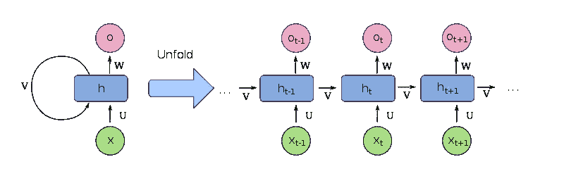

# 从 RNN 到 LSTM，我们在时间序列预测方面走了多远

> 原文：<https://medium.com/hackernoon/how-far-have-we-gotten-in-time-series-prediction-from-rnn-to-lstm-5c9db64eb805>

自从有时间以来，人类已经使用了许多方法来解决时间序列预测的问题。

人类已经使用了包括统计在内的多种方式，因为我们认为利用这种力量可以打开无限的可能性。今天，许多算法被用来解决大量类似股票市场、预测股票价格、语音识别等问题。

随着深度学习热潮的开始，人们想到为什么不使用这些 ML 算法和神经网络来解决这个问题。

# **进入递归神经网络！**

递归神经网络是在 20 世纪 80 年代开发的。一个**递归神经网络** ( **RNN** )是一类[一个](https://en.wikipedia.org/wiki/Artificial_neural_network)人工神经网络，其中节点之间的连接形成一个 [d](https://en.wikipedia.org/wiki/Directed_graph) 方向的序列。这允许它展示时间序列的时间动态行为。与前馈神经网络不同，rnn 可以使用其内部状态(记忆)来处理输入序列。这使得它们非常适合作为理想的算法或神经网络类型。这种算法出现在许多架构中，例如，完全递归

# **全循环架构**

basic recurrent neural network

基本 rnn 是由连续“层”组成的节点组成的网络，给定层中的每个节点通过单向连接与下一个连续层中的所有其他节点相连(这意味着它是完全连接的)。每个节点(神经元)都有一个时变的实值激活。每个连接(synapse)都有一个可修改的权重(在训练模型时找到)。节点可以是输入节点(从网络外部接收数据)、输出节点(产生结果)或隐藏节点(修改数据并将数据从输入路由到输出)。

来自前一层和前一层的隐藏层的输出被馈送到该层，因此它将前一隐藏状态的数据作为输入之一，因此它知道在前一层或状态中发生了什么

a simpler representation of this architecture

# **问题**

一切都有问题，这个神经网络也是如此。由于上面提到的 RNN 的特征，相同的特征具有一些缺点，并且最主要的一个是，当隐藏层和前一层的输出被馈送时，在离散的步骤(层)之后，先前步骤或层的记忆开始消失！这就是所谓的消失梯度。

在 RNN 的领导下，还有许多其他的架构，但是对这类问题(时间序列预测)最有影响力的是…..LSTM

# **LSTM**

LSTM(长短期记忆)是 RNN 的一个进化的、甚至更好的架构/子类别/部分，通过简单地添加 LSTM 细胞来实现。它有时也被称为 LSTM 网络(在本文中，我们简称它为 LSTM)。

它避免了[消失渐变问题](https://en.wikipedia.org/wiki/Vanishing_gradient_problem)(上面也提到了，一个更专业的术语)。LSTM 通常由称为“忘记”门的循环门扩充。LSTM 防止反向传播的错误消失或爆炸。相反，错误可以通过空间中展开的无限数量的虚拟层反向流动。也就是说，LSTM 可以学习需要记忆几千甚至几百万个离散时间点之前发生的事件的任务。

# **结论**

结论很简单，我们仍然有很长的路要走，在未来发展这类算法，以适应更多的任务，帮助世界变得更好