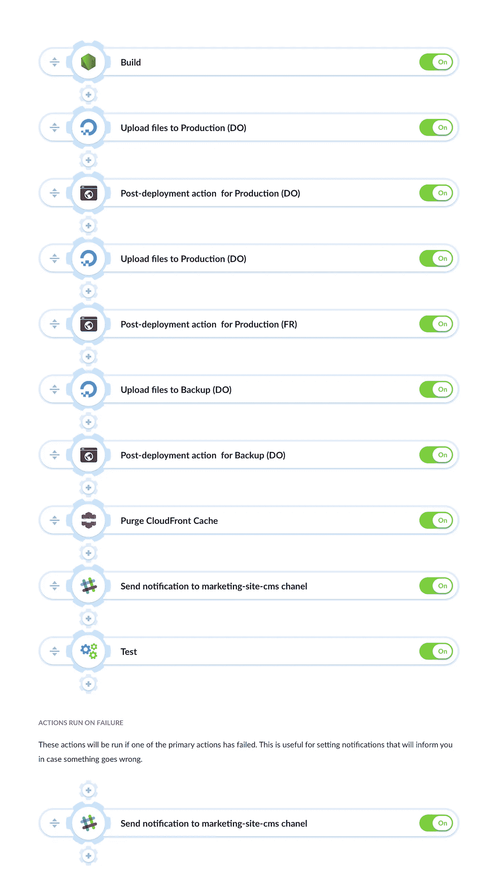

# 流程项目管理如何自动化网站部署

> 原文：<https://medium.com/hackernoon/how-flow-project-management-automates-website-deployments-32fb8f2b221d>

## Flow 是一款流行、灵活的项目和任务管理软件，被苹果、Shopify 或 TED 等公司的团队所使用。

它是由 Dribble 背后的人设计的——可能是最大的网页设计师社区。

# 软件栈

流量[营销](https://hackernoon.com/tagged/marketing)网站是一个简单的[node . js](https://hackernoon.com/tagged/nodejs)PHP 应用程序，使用 DigitalOcean，Fortrabbit & AWS CloudFront 进行托管:

> *我们想要一个工具，既简单又耐用。Buddy 能够根据需要轻松地从简单的测试运行程序扩展到完整的 CI 套件。*

–getflow.com 的丹·卡斯特洛说

# 管道

Flow 的管道都是精心制作的，不言自明的。他们保持组织有序的方式使其成为执行良好的连续交付工作流程的典范。下面是负责**交付到生产**的管道:

> *很高兴看到我们可以通过 Atomic deployment 以最少的设置轻松实现类似的东西。使跟踪发布和回滚超级容易。*

交付到 Staging 看起来也很整洁，其中一个步骤中的**应用程序被 dockered**:

Flow 还使用 Buddy**监控网站的停机时间**，并在出现问题时发送通知:

Castello 称赞了申请和入职流程的简单性:

> 巴迪非常容易安装。预先做好的动作非常棒，尤其是对于那些工具新手来说。一旦我们清楚地了解了 Buddy 的能力，我们就能够根据我们的需求对渠道进行微调。
> 
> 管道系统极其清晰。让一个新的开发人员加入系统就像带领他们走完管道的每一步一样简单。每一步都有你需要的东西。没有隐藏的配置或环境变量。

最后但同样重要的是，我们的支持被称为第一大特色。好骄傲！

> 也许巴迪最大的优点就是支持。在应用程序中使用对讲机部件非常棒。你们真是帮了大忙了！

谢谢丹，和你们一起工作总是很愉快！

🔥立即在 [**buddy.works**](https://token.buddy.works) 注册，实现部署自动化！🔥