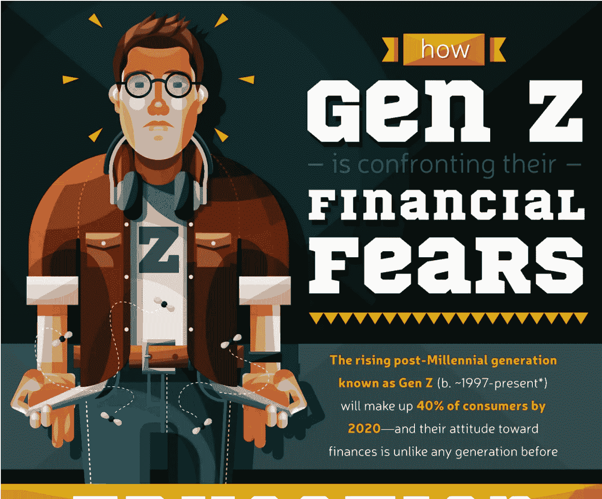
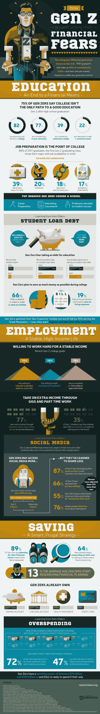

# Z 世代如何面对他们的财务恐惧

> 原文：<https://medium.com/hackernoon/how-gen-z-is-confronting-their-financial-fears-b14f9b3545ae>

到 2020 年，年轻、成长中的后千禧一代将占消费者的 40%。与 1997 年及以后出生的千禧一代不同，年轻一代与老一代不同，他们思想自由，工作努力，最重要的是，花钱谨慎。

Z 世代从老一代人有时奢侈的习惯中吸取教训，谨慎地对待他们的财务未来。特别是对千禧一代来说，40%的人为了跟上他们的社交生活，已经超支甚至负债。这种“fomo-tax”并不在 Z 世代的考虑范围之内，因为他们会考虑所有的购买行为，从杂货店到大学都会考虑。当被问到时，72%的 Gen Zers 表示，购物时成本是最重要的因素，近 50%的人在刷卡前会在店内用手机比较价格，并寻求家人和朋友的建议。从小范围来看，这看起来很节俭——但是 Gen Zers 会考虑全局。他们的消费和储蓄习惯转化为对财务责任的关注，甚至在他们年轻的时候。

请看这张信息图，了解更多关于[Z 世代的崛起，为什么他们的习惯不同于前几代人，](https://www.ravereviews.org/gen-z-financial-fears/)以及他们如何直面财务恐惧。

