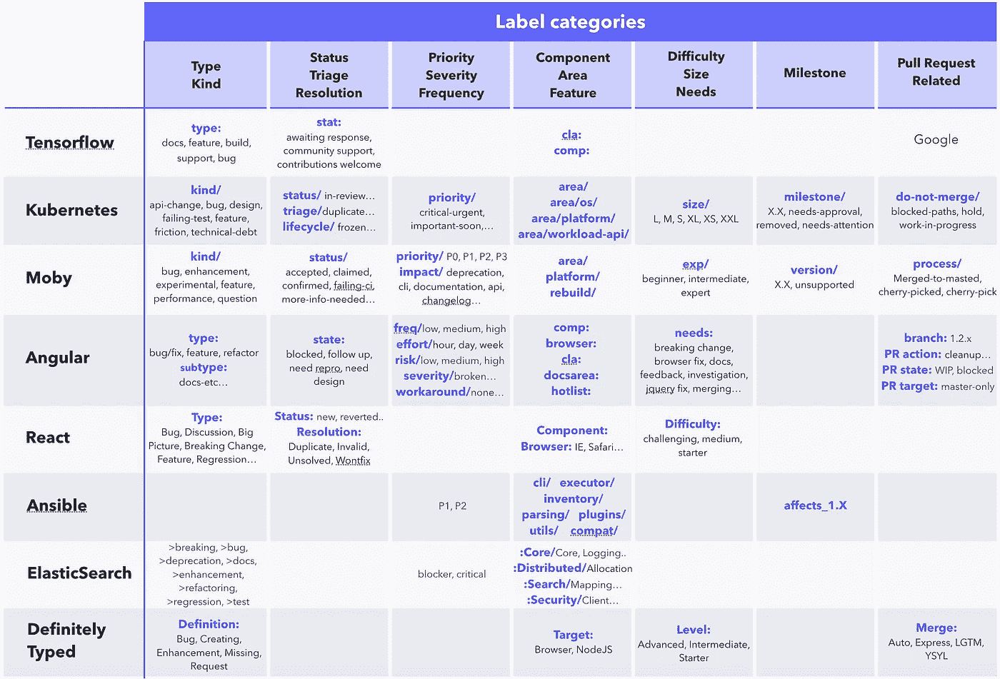

# Github 能成为最强大的抢票工具吗？

> 原文：<https://medium.com/hackernoon/how-github-can-be-the-most-powerful-ticketing-tool-bca51f038d21>

*与所有其他票务* [*工具*](https://hackernoon.com/tagged/tools) *，* [*相比，GitHub*](https://hackernoon.com/tagged/github) *Issues 是唯一一个可以完全自由定义任何你想要的标签类型的平台。所有其他工具都对标签类型有意见，如优先级、严重性、组件、epic 等。现在，如果你考虑到 GitHub 公共活动库的数量在 2017 年底达到了*[*2500 万*](https://octoverse.github.com/) *，并且大多数这些公共(理解开源)项目都是通过 GitHub 管理的，那么你可能会想知道是否出现了任何最佳实践。有没有什么独特的最佳实践不能应用于其他工具？我们是不是都应该转到 GitHub 来管理我们在那里的项目？*

在过去的几年里，我为两个开发者平台的开发做出了贡献——coding ame(T21)和 tech . io(T23)。他们总共有 100 多万开发人员。我最近联合创立了一个项目智能平台— [Anaxi](http://anaxi.com) 。可以把它看作是整个软件工程组织的可操作的商业智能。所以我工作的一部分就是识别软件开发工具的发展趋势。换句话说，这种事情我想的还挺多的！

首先，我们将分析 20 个最受欢迎的开源项目，它们是如何构建的，以及它们使用了哪些标签。

然后，我们将试图找到共同的模式，以帮助我们理解这些最佳实践何时以及如何应用到您的项目中。

最后，我们将与其他现有的项目管理工具进行比较，这样您就可以决定 GitHub 是否值得用作您的项目管理工具。

# GitHub 上的热门项目

我们分析了由 [Linux 基金会](https://www.linuxfoundation.org/blog/2017/08/successful-open-source-projects-common/)列出的 GitHub 上 30 个速度最快的开源项目，并选择了我们认为最有组织性的项目。然后我们分析了他们用来组织问题的标签，特别是我们称之为标签类别的标签。

我们怎么称呼一个**标签类别**？有些标签显示以下模式:区域/网络、区域/托管、区域/备份。“区域”是可以有许多标签的标签类别。

一些项目使用“/”来定义类别，就像上面的例子，而其他项目使用“:”，就像 Tensorflow 和 Angular 一样。

以下是我们选择的项目列表以及它们使用的标签类别:

顺便问一下，你注意到大多数项目都是由大公司支持的吗？Google 的 [Tensorflow](https://www.tensorflow.org/) 和 [AngularJS](https://angularjs.org/) ，脸书的 [React](https://facebook.github.io/react/) ，Docker 的[莫比](https://mobyproject.org/)，RedHat 的 [Ansible](https://www.ansible.com/) 以及 Elastic 的 [ElasticSearch](https://www.elastic.co/products/elasticsearch) 。在我们分析的 30 家公司中，有 9 家得到了基金会的支持，只有 6 家没有得到实体的支持。我们对它们进行了分析，并保留了项目组织方面的最佳方案，最终每个都有一个(不是故意的):[Kubernetes](https://kubernetes.io/)CNCF(基金会)，以及 [DefinitelyTyped](http://definitelytyped.org/) (不支持)。

好了，我们来深潜一下，看看现在这个有什么好玩的。

# 模式和最佳实践

我们确定了这些项目使用的 7 种不同类型的标签类别。如果你认为以不同的方式组织类别更有意义，请不要犹豫，留下你的回复——我们洗耳恭听。但这是我们对此的看法:

## 类型或种类:

在其他项目管理工具中，你会在这里得到 bug、特性、任务或子任务。但是正如你所看到的，GitHub 项目能够扩展的远远不止这些，还有*实验*、*讨论*、*技术债务*、*未通过测试*、*文档*等等。任何公司都会对此感兴趣。现在，我们通常把所有不是 bug 或特性的东西都作为一项任务，但是不管你的团队规模有多大，能够指定标签应该是有价值的。

## 状态/状况或分类/解决方案或生命周期:

我们将这些标签类别组合在一起，因为它们都告知了票证的状态。但每一个都有细微差别。这就是为什么 Kubernetes 使用所有三个——状态、分类和生命周期！伤检分类和解决方法的使用类似；他们解释了票据是如何变成这种状态的。而 Lifecycle 描述票证在其状态内的状态，其值为*活动*、*冻结*、*腐烂*、*陈旧*。如果您有大量的票要处理，这将变得非常方便，因为您可以有一个过程来重铺票或只是把它们收起来，以便能够更专注于重要的事情。

## 优先级或严重性或频率或解决方法:

我们把这四个放在一起，因为它们解决的是同一个整体问题。但是也有一些重要的细微差别。实际上，您可以认为严重性、频率和解决方法是 3 个不同的主题，可以更好地解释优先级。更好的优先级排序会对您的业务产生巨大的影响。

## 成分、区域或特征:

这些都是以类似的方式使用，不像其他大多数。例如，你不会看到一个项目使用组件*和*区域或特性。然而，有趣的部分是一些项目使用子类别，如*区域/平台/* …或*区域/操作系统/…* ，或者只是不同的标签类别但用途相同，如*浏览器:..*或 *cli:..*这使你能够有两个级别的标签来更精确地定义代码真正是关于哪个部分的。在您的团队中，您可以让一个人负责一个子类别，另一个人负责整个类别及其所有子类别。所以更好的授权和责任。这对有大项目的大团队特别有帮助。

## 困难、规模、经验或需求:

这一部分是关于解决这个问题需要什么。可以是时间，可以是经历，也可以是其他依赖。其他项目管理工具，如 Pivotal Tracker，使您能够对票据进行评估。这里的要点是，您还可以添加关于票证所需的经验级别的信息，这对开源项目非常重要。你会希望新人从简单的任务开始。Angular 还使用标签类别“需求”,其值包括*重大变更、浏览器修复、文档、反馈、调查、jquery 修复、合并、更多信息、公共 api、审查、挤压、测试、工作*。它使您能够更明确地了解要推动票证前进所要做的工作。通常，知道*突破性的改变*是非常有用的，所以你可以让社区或整个团队为这种改变做好准备。

## 里程碑相关:

在 GitHub 上，你可以添加里程碑。但有些项目增加了与里程碑相关的附加标签类别，如*里程碑/需要批准、里程碑/需要关注*或*里程碑/移除*。这创造了讨论和决定的机会。实际上，一些周会的一部分可以专门用于*里程碑/需求关注*。Ansible 还使用标签来指示票证可能影响的版本——*affects _ 1.2、affects_2.3、*等。当您的客户和顾客使用以前的版本时，这一点非常重要——向后兼容性问题——这是每个软件都有的问题，除非它是云托管的 SaaS 产品。

## 与拉式请求相关:

GitHub 首先用于代码版本控制，因此也用于拉请求。角度通常有以下标签类别:

*   公关活动:*清理、讨论、合并、合并协助、审核*
*   请购单状态:*在制品，冻结*
*   PR 目标:*仅主，主&补丁，仅补丁*

Kubernetes 具有不合并/值，如*阻塞路径、保持*和*进行中的工作*。

这使得能够澄清票据状态的原因。我个人的感觉是，这并不适用于大多数非开源软件项目。不同意请随意！

# 那么哪款抢票工具最好呢？

首先，让我们注意到你要求你的团队提供的任何额外信息对他们来说都是额外的努力。如果他们觉得不值得，他们自然不会付出努力，那就没用了！所以，如果你正在考虑编辑你的工具和过程，你最好只考虑对你的特定项目有价值的东西。

让我们举三个不同的例子来说明这一点。我绝不声称以下几点适用于你的特殊情况；只有你知道什么对你的团队有用或者没用。

## 如果你是一家拥有不到 30 名工程师的初创公司

我认为扩展文档化和重构 T21 的种类仍然有价值。您的部署流程不应该那么复杂，所以您不应该需要任何关于状态和拉取请求的附加标签。类似地，里程碑不应该有太多的复杂性。能够详细说明频率、严重性以及是否有解决方法仍然有价值，但是在启动模式下，您宁愿最大化花费在输出上的时间，而不是一个干净的过程。最后，对于你来说，产品不应该太复杂，需要几层组件。所以总的来说，GitHub 提供的灵活性是值得拥有的，但是很明显，如果没有它，通过使用其他提供更好的用户体验的工具，比如 Trello，你也可以拥有非常干净的流程。

## 如果你有几个团队在开发几个产品

如果你想对你的所有项目有某种可见性，你最好在你的所有团队中使用相同的工具，如果你想你的团队在它的基础上建立一致的报告。实际上，我们正在阿纳西解决这个问题。我待会再谈那个。我认为这与创业案例非常相似。这真的取决于团队的规模。

## 如果你有大型团队在开发相同的产品

通常，这适用于任何复杂的软件，或者实际上是开源项目。在这种情况下，标签类别中列出的所有点都适用。任何附加的标签类别都可以增加价值。重点不再是个人产出，而是最好的集体产出的最佳沟通。这也是为什么很多企业建立了自己的内部票务工具，但收效甚微。GitHub 可能是他们的一个很好的解决方案。然而，GitHub 有一个 UX 和可见性问题，但是可以修复。怎么会？请继续阅读。

# 但是 GitHub 缺了很多…？

就项目管理功能而言，GitHub 并没有提供最好的体验，尽管他们最近在这一点上取得了很大进展。但是我们仍然遗漏了很多:

*   该界面允许您以文本形式输入标签；没有提货人。所以你必须知道标签的基本结构。
*   创建问题时，您不能制作任何必需的标签
*   如果您想要监控与标签一起分配的票证，标签非常有用。不幸的是，你不能在 GitHub 上这样做。
*   老实说，你的项目在 GitHub 上几乎看不到。

这就是为什么吉拉是全世界使用最多的工具。你可以部分定制你的工作流程(可惜还没到 GitHub 的程度)；它提供了一个足够好的 UX 来管理每天的票证和一组报告，这样您就有了某种可见性。

如果我告诉你有一个工具可以集成 GitHub，并让你使用你的标签类别，就像它们最初是 GitHub 的一部分一样(通过 pickers)，会怎么样？您还可以监控每个标签的问题，并获得您所缺少的可见性。**其实那就是** [**阿那西**](http://anaxi.com) **的作用。更多精彩即将到来。**

我希望这篇文章能帮助你思考你的过程，更准确地说，你使用的标签。

# 在你走之前…

你觉得这篇文章有趣吗？请按住👏说“谢谢”并帮助别人找到它！
如果您对关于**工程和产品领导力、生产力以及如何扩展团队**的文章感兴趣，请订阅我们的时事通讯！

或者加入我们的[工程领导社区](https://community.anaxi.com/#interested-in-weekly-bytes)。

 [## 工程领导社区| Anaxi

### 由社区策划的关于工程领导力、生产力、如何扩展团队以及…

community.anaxi.com](https://community.anaxi.com/#interested-in-weekly-bytes) 

你也可以看看我的最新文章:

*原载于 2018 年 9 月 25 日*[*【anaxi.com】*](https://anaxi.com/blog/2018/09/25/how-github-can-be-the-most-powerful-ticketing-tool/)*。*