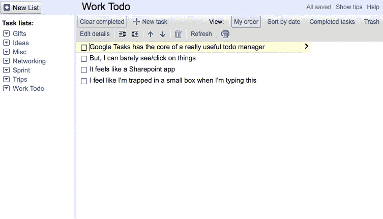
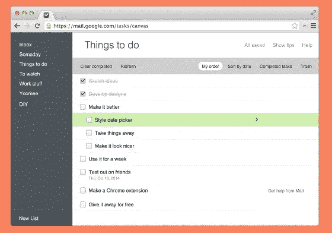
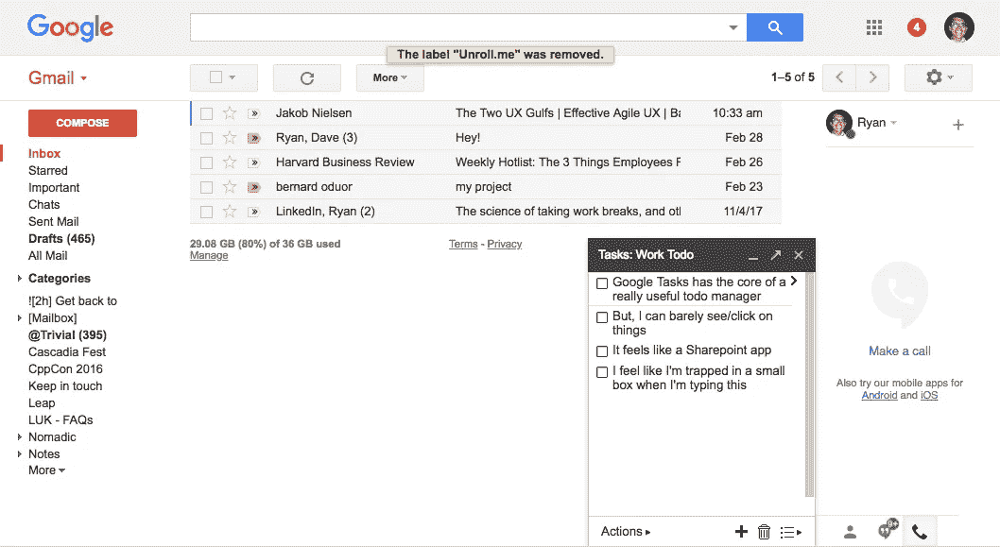
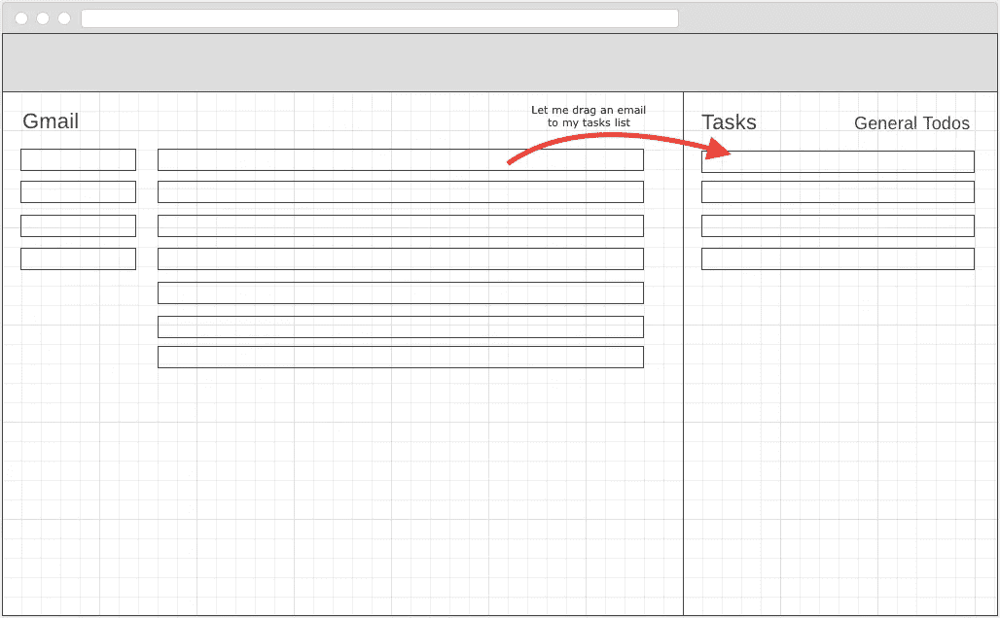
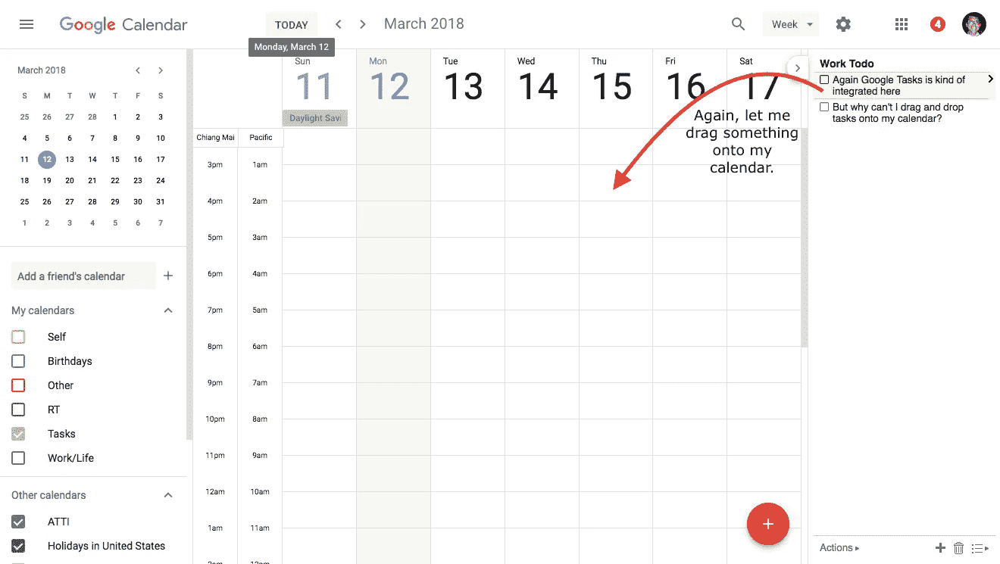

# 谷歌任务如何赢得待办事项市场

> 原文：<https://medium.com/hackernoon/how-google-tasks-could-win-the-todo-list-market-cdca49f97644>

在我 20 多岁的时候，我真的对效率很感兴趣。

我阅读了我能找到的关于这个话题的任何东西(例如大卫·艾伦的*成事*，[尝试了](http://asana.com)，[每一个](http://evernote.com)， [Todo](https://todoist.com) ， [app](https://cheddarapp.com/) ， [I](http://wunderlist.com) ，[can](http://rememberthemilk.com)，[下载](https://culturedcode.com/things/) (R.I.P. [Tadalist](https://basecamp.com/retired/tadalist) )，并尝试了非数字格式(子弹杂志)。

我试着用谷歌日历安排我一天中的每一分钟。我甚至试着用“没有目标的一年”(持续了大约 12 天)来彻底抛弃生产力。

在这十年的实验中，我一直在重温一个工具，期望它成为我生产力工具箱中的核心工具: [Google Tasks](https://mail.google.com/tasks/canvas) 。

Google Tasks — it’s looked like this for a long time.

谷歌让 Tasks 成为他们生态系统中的一等公民，这似乎是明智的。Gmail、日历、文档都是集成的——为什么没有一个地方来记录任务和待办事项呢？

所以我一直在等。还有等待。什么都没发生。我为自己的待办事项列表工具画了草图，但从未制作过——我估计改版的谷歌任务很快就会推出，让我的工具过时。

但是几年过去了，谷歌还没有推出新的任务。所以我决定把我的想法放在一起。

# 步骤 1:更新外观和感觉

以下是谷歌任务目前的样子。核心功能都是内置的，但它的风格是原创的谷歌。

What the Google Tasks app currently looks like. It makes me feel claustrophobic.

根据[材料指南](https://material.io/guidelines/)的一些 CSS 更新，任务看起来会很新鲜和吸引人。

Screenshot from “Better Google Tasks” Chrome Extension. Sadly, this extension doesn’t seem to work anymore.

# 第二步:将谷歌任务整合到谷歌生态系统中

你可能已经知道谷歌任务可以在 Gmail 中访问。然而，我不会称之为“集成”——它实际上只是一个附加组件。

Google Tasks integrated into Gmail. Kind of.

但是经过一些改变，任务可以得到提升…

A quick mockup of what it could be…

如何将谷歌任务完全整合到 Gmail 中:

1.  **让谷歌任务更容易找到:**页面右侧的拉环会很棒。
2.  **让任务占据整个右侧面板:**让任务占据屏幕宽度的 20-30%——并提供一个滑块将任务面板扩展到 50%。
3.  **让用户将邮件拖入任务:**当我将邮件拖入任务面板时，列表上会创建一个任务项。
4.  **相反，让用户将任务拖到电子邮件中:**当我将任务拖到电子邮件中时，应该为该任务生成一个公共链接，并且该链接应该粘贴到电子邮件中(可能作为一个漂亮的 HTML 小部件)。

# 第三步:整合/完善其他应用程序(日历、驱动、文档、表单、主页、助手、游戏)

Google Tasks is integrated into Calendar (if you can find it). But, why can’t I drag and drop tasks onto my calendar?

**谷歌日历:**谷歌任务已经集成到日历中(如果你能找到的话)。当我将任务拖到日历上时，应用程序应该为该任务创建一个事件。此外，我应该能够创建与日历约会相关的任务(该任务应该有一个到日历约会的快速链接)。

**Sheets:** 假设我需要检查一些单元格条目中输入的值；我应该能够创建与谷歌表中的细胞连接/相关的任务。

**Docs:** 类似于 Sheets，我应该能够创建一个与特定段落或评论相关的任务。

**Home:** 我只要问 Google Home 就应该可以创建任务了。

助手:与 Home 类似，我应该可以对着手机说话来创建任务。

**Google Play:** 在娱乐领域，为什么不让我将电影添加到我的“观看”列表中？

# 步骤 4:浏览器扩展和可能的 API

我们不必止步于谷歌的应用。第三方网站/应用程序应该与谷歌的任务。任务浏览器扩展(或谷歌 Chrome 的深度集成)可以让用户在任何地方打开任务窗格。例如:

*   **Github:** 让我将一个 Github 公关链接拖到任务中。
*   **中等:**让我把一个中等的故事拖到我的“阅读”任务列表中。
*   推特:让我把一条推文拖到我的“登月创意”任务列表中。

# 第五步:移动应用程序(包括添加到移动 Gmail、移动日历等)。

在用户体验了这个新的任务管理器之后，毫无疑问他们会想把他们的任务移动化——这样他们就可以把它们从列表中划掉，并且自我感觉良好。

除了一个专用的任务应用程序(允许用户看到他/她的任务)，让其他移动应用程序创建任务似乎是理想的。例如:

*   **移动 Gmail:** 让用户点击一下就可以从电子邮件中创建任务。
*   **其他 app:**让我“导出”某样东西作为任务。

# 超越:用短信回到基础。带着专用设备回到未来。

我在构建一个兼职项目时发现的一件事是，当你在旅途中时，短信是一个快速思考/想法的有用工具。为什么不将短信作为一种记录移动任务的方式呢？

最后:在家里，我和妻子用黑板、白板和便利贴的组合来记录家庭任务。很多时候，当我不在家时，我想添加任务。假设谷歌创建了这些板的电子版本(然后将它们连接到谷歌任务)？

— — — — — — —

暂时就这样了。我知道这是一个相当大的工作量，但我认为这对谷歌有好处——至少有足够的好处来进一步探索。