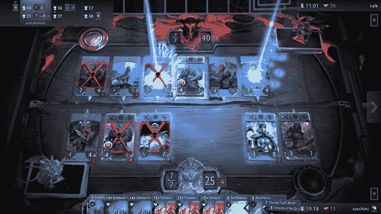

# 炉石的经济是如何让其他卡牌游戏消失的

> 原文：<https://medium.com/hackernoon/how-hearthstones-economy-bullied-other-card-games-out-of-existence-96863681c595>

## 认为神器会杀死炉石的人忽略了炉石最大的资产

Photo by [Maik Jonietz](https://unsplash.com/photos/22W93iChREU?utm_source=unsplash&utm_medium=referral&utm_content=creditCopyText) on [Unsplash](https://unsplash.com/search/photos/hearthstone?utm_source=unsplash&utm_medium=referral&utm_content=creditCopyText)

[炉石是史上最受欢迎的电子卡牌游戏](https://www.statista.com/statistics/323239/number-gamers-hearthstone-heroes-warcraft-worldwide/)。它的注册玩家比活跃的[扑克](http://pokerplayersresearch.com/toplinefindings.aspx)和[万智牌](https://www.hipstersofthecoast.com/2016/05/what-we-learned-65000/)玩家加起来还多。

炉石已经取得了惊人的 3.95 亿美元的收入，它是 Twitch 上第四大最受欢迎的游戏。

炉石是一个视频游戏和电子竞技巨头。上学期，我参加了密歇根大学综合队的炉石比赛，获得了全国第 20 名。明年，我们学校将考虑承认电子游戏是一项俱乐部运动。

炉石吸引了我，因为它简单的规则，令人惊叹的艺术作品，竞争性的游戏，廉价的游戏，和梦幻般的社区。

这些因素没有一个是特别新的或创新的。

万智牌是一款卡牌游戏，有着令人惊叹的艺术作品和竞技游戏。口袋妖怪 TCG，游戏王和扑克有充满活力的玩家群体。黑杰克有一套简单的规则，很容易掌握。

Photo by [Wayne Low](https://unsplash.com/photos/OvN4OkhkTLo?utm_source=unsplash&utm_medium=referral&utm_content=creditCopyText) on [Unsplash](https://unsplash.com/search/photos/magic-the-gathering?utm_source=unsplash&utm_medium=referral&utm_content=creditCopyText)

炉石就像是卡牌游戏的苹果。他们吸取了之前所有卡牌游戏的最佳创意，并将其与漂亮的设计相结合，创造出了一款 UI/UX 无与伦比的游戏。

这当然有助于它的成功，特别是在短期内。

然而，从长远来看，炉石做出了一个独特的设计决定，使游戏从伟大到前所未有。

不同于其他卡牌游戏，炉石是一个**封闭的经济体。**

在我竞技玩炉石之前，我竞技玩游戏王。这个游戏可不便宜。我经常会花 100 多美元来得到最好的一副牌。但是一旦我玩腻了这副牌，我就可以重新卖掉那些牌，把钱拿回来。

也许我拿不到全部 100 美元，但我经常能拿回 60 美元左右。有时我可以加价出售这些卡片。我也经常赢得锦标赛奖金。所以即使我在游戏里投入了很多钱，我也总能从游戏里得到很大一部分钱。

如果我愿意，我可以拿着游戏王的钱去赌一把扑克，然后回到游戏王那里呆一会儿，然后卖掉那些牌，玩一些口袋妖怪 TCG，然后卖掉那些牌，赌一些二十一点，等等。

Photo by [Wayne Low](https://unsplash.com/photos/OvN4OkhkTLo?utm_source=unsplash&utm_medium=referral&utm_content=creditCopyText) on [Unsplash](https://unsplash.com/search/photos/magic-the-gathering?utm_source=unsplash&utm_medium=referral&utm_content=creditCopyText)

大多数纸牌游戏都是开放经济——你可以从游戏中取出你的钱，用它来玩不同的游戏，甚至买杂货。

炉石远离了这种模式。一旦你把钱投入炉石，它就卡在炉石里了。永远。

在炉石你用钱买包，包奖励卡。你可以‘解除魔法’这些卡来给你‘灰尘’，但是你只能用灰尘来制作其他炉石卡。你不能用灰尘来退款。

而且一旦玩家把钱投入炉石，他们就很有动力坚持炉石。一旦他们收集了大量的炉石卡，感觉他们在游戏中就有优势了。很难证明留下一个收藏去玩一个不同的纸牌游戏是正当的。

暴雪——炉石的制造商——对游戏数据守口如瓶。很难找到可靠的游戏数据来源。但是让我们这么说吧:如果我们假设每个活跃的玩家都买了三张“扩展”牌。他们的收藏至少值 150 美元。很难把钱留在炉石去玩另一个纸牌游戏。

这就是让炉石变得巨大的创新。人们不会离开游戏。继续玩下去的动力太大了。

一个新的，性感的纸牌游戏正在出现:神器。

它是由 Valve 制作的——另一个令人惊叹的游戏开发者工作室，它已经证明了自己是行业的领导者之一。

人们显然在把神器和炉石相提并论。有些人称它为炉石杀手,因为神器拥有更好的游戏性、更大的竞争潜力和更好的电子竞技舞台。我不相信这些说法是真的。

然而，即使假设它们是真的，人们需要问的问题是:神器是不是一个如此优秀的游戏，以至于炉石玩家愿意扔掉他们收集的所有卡片来开始一个新游戏？

Photo by [ammiel jr](https://unsplash.com/photos/eYvoE4DwnEk?utm_source=unsplash&utm_medium=referral&utm_content=creditCopyText) on [Unsplash](https://unsplash.com/search/photos/cards?utm_source=unsplash&utm_medium=referral&utm_content=creditCopyText)

我的预测是某种意志。绝大多数人不会。自炉石发布以来，已经有许多其他令人敬畏的卡牌游戏问世，如 Gwent 和 Shadowverse。这些游戏的*客观上*比炉石更好玩。

但是他们没有能力超越炉石庞大的 3.95 亿美元的封闭经济。差远了。

在我看来，更关心神器寿命的是*的*经济体系。神器有个**半封闭经济**。在 Artifact 中，你可以将钱投入游戏，然后将钱从游戏中取出，在 Steam Store 上作为货币使用。

Steam 商店是一个在线平台，可以购买其他视频游戏，如门户网站和团队堡垒 2。值得注意的是，蒸汽存储器是由阀门构成的。

这里的问题是，Valve 只赚到在 Steam Store 上购买的游戏投入资金的 20%。因此，如果玩家从神器中取出他们的钱，Valve 将不会收到全部回报。

这意味着使用神器的成本会更高。神器需要玩家支付 20 美元的前期费用，而炉石是免费的。神器中的特殊卡不可避免的会涨到 50 美元或者更多，就像游戏王和万智牌，而炉石的上限是 10 美元。

仍然有一些玩家称赞 Valve 使 Artifact 成为一个半封闭的经济体，因为这让他们想起了童年的纸牌游戏。

看看这种经济如何与炉石的经济相抗衡将会很有趣。如果有哪家公司能够成功实现半封闭经济，那就是 Valve。

但是在一个炉石这个庞然大物封闭经济存在的世界里，制作一个甚至*稍微*开放的卡牌游戏会刺激玩家离开，去玩一个不同的游戏。

如果你想获得“炉石杀手”的称号，这是非常危险的