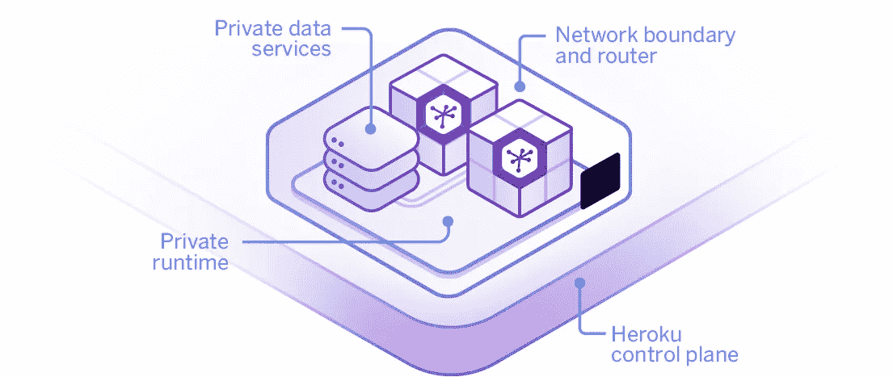

# Heroku Private Spaces 如何为我们提供 GDPR 就绪型基础设施，以快速部署敏感数据服务

> 原文：<https://medium.com/hackernoon/how-heroku-private-spaces-provides-us-with-gdpr-ready-infrastructure-for-fast-deployments-of-37d19d36e042>

## Heroku 和早期

Voucherify 的故事始于 2015 年。在与柏林一家快速发展的初创公司 Book A Tiger 合作时，该团队发现了对 API 优先优惠券管理系统的需求。但这不是他们唯一拿走的东西。Book A Tiger 还教会了他们如何在快节奏的环境中成功地发布软件。他们的平台一直基于 [Heroku 和 Salesforce](https://www.linkedin.com/pulse/ideal-relationship-matias-bonet/) 。

从一开始，Voucherify 团队就在 [Heroku](https://www.heroku.com/) 平台共享机器上托管他们的所有服务。快速的部署流程和经济高效的设置对于早期采用者启动和测试新功能特别有用。Heroku 从开发人员的肩上卸下了配置和监控的重担。它还为最流行的软件工具提供了几十个预建插件，如 New Relic、Postgres、LogEntries 或 Compose。这些特性帮助 Voucherify 构建了一个可靠的产品，吸引了第一批企业客户。

有了它们，业务开始增长，流量也开始增长。Heroku 自动伸缩机制帮助我们处理 API 的负载，而不需要我们开发团队的任何努力，更不用说需要雇用一名 devops 工程师了。为了确保冗余，获得对资源利用的更多控制，并使调试更容易，我们将一些服务转移到基于 AWS 的托管实例。但是每天要进行几次部署的服务仍然托管在 Heroku 共享服务上。

## Heroku 和 Salesforce

除了可扩展性问题，这种增长也带来了组织的复杂性。发票、客户偏好、定价计划、限制、使用报告、入职进度监控等等——“运营”已经成为维护的噩梦。Voucherify 考虑了几种工具来自动化这些活动，但最终选择了 Salesforce。这一决定背后有 3 个原因:

*   Salesforce 是一个成熟的解决方案，该团队拥有以前项目的 SF 经验
*   它提供了一个深奥的 API，并且是开发者友好的
*   Heroku Connect 可以将 SF 数据与外部数据库同步

最后一点对于为所有可重复的账户管理任务、报告和进一步的营销自动化提供直观的界面非常有用。

## 赫罗库和 GDPR/PCI

GDPR 和 PCI 政策对凭证提出了新的要求。由于该平台存储最终客户的个人数据，新法规使得共享服务托管设置过时。Voucherify 向 Heroku 提出了符合 GDPR 和 PCI 标准的报价。在考虑了几个选项后，团队选择了 Heroku 私人空间。新的设置通过将实例放在同一个 AWS 区域并通过安全隧道将它们连接到集群来保护客户数据。Heroku 团队反应非常迅速，在迁移过程的每个阶段都提供了指导。

## Heroku 和未来

新的设置(Salesforce、Heroku Connect、Private Spaces)帮助[凭证](https://www.voucherify.io/)满足当前的部署、托管和数据安全要求。与此同时，新功能不仅在软件方面，而且在运营活动方面都为平台的可扩展性打开了大门。所有这些定价都适合处于“成长”阶段的[初创企业](https://hackernoon.com/tagged/startup)。