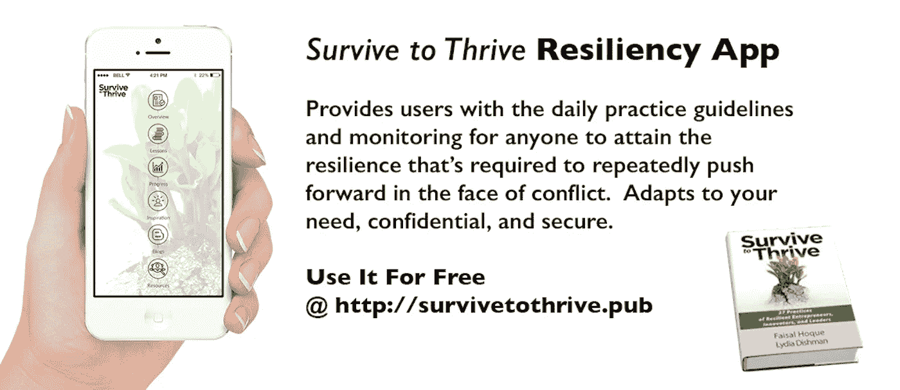

# 具有高度适应力的人如何生存并茁壮成长

> 原文：<https://medium.com/hackernoon/how-highly-resilient-people-survive-to-thrive-bc78052a451>

[**Photo by Keith Hardy on Unsplash]**

## 韧性是人类面对、克服、甚至在逆境中变得坚强的普遍能力——像竹子一样弯曲而不是折断。

> “弹性是一种态度；这是你的信念，你可以征服一切。它是从几天到几周到几个月到几年到达你的目的地的能力，在这个过程中定义和重新定义你的个人目标。有时，这意味着利用逆境寻找机会，引领我们走向真正的命运。”
> 
> ——**生存繁衍**

创造你的想法，走你自己的路，忽略怀疑者，每次跌倒时掸掉身上的灰尘，这些都需要对精力和动力的训练。

通常，这仅仅来自于内部。我们如何培养这种内在的专注，是通过在我们的个人旅程中采取一些步骤来恢复，这是这次演讲的重点。

真实和鼓舞人心的目标允许:

*   情感上的投入来决定我们的命运
*   通过重新定义我们的优先事项来聚焦
*   务实的前进道路

**版权所有 2018，作者费萨尔·霍克。保留所有权利。**

我是一名[企业家兼作家](http://faisalhoque.com/speaking/)。[沙多卡](http://shadoka.com/)等公司创始人。Shadoka 促进企业家精神、增长和社会影响。著有《 [*万物互联——如何在创意、创新和可持续发展的时代转型和领导》*](http://www.amazon.com/Everything-Connects-Creativity-Innovation-Sustainability/dp/0071830758/ref=sr_1_1?ie=UTF8&qid=1376488798&sr=8-1&keywords=everything+connects%2Bfaisal+hoque) 》(麦格劳·希尔)和《 [*生存并茁壮成长:弹性企业家、创新者和领导者的 27 种实践*](http://survivetothrive.pub/) 》(励志出版社)。在 Twitter 上关注我@ [Faisal Hoque](http://medium.com/u/66953a6e238f) 。*免费使用* [*万物互联*](http://app.everythingconnectsthebook.com/login.php) *领导力 app 和* [*生存茁壮*](http://app.survivetothrive.pub/login.php) *弹性 app。*

