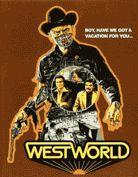
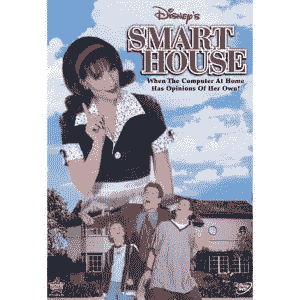
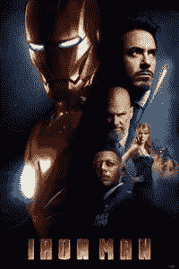

# 好莱坞如何塑造了我们对免提计算的看法

> 原文：<https://medium.com/hackernoon/how-hollywood-shaped-our-views-of-hands-free-computing-bdd8e624f9f2>

## 免提计算&银屏

免提计算出现的时间比你想象的要长。十年前，托尼·斯塔克的计算机化人工智能助理贾维斯叫醒了他，对他说:“早上好。现在是早上 7 点。马里布的天气是 72 度，有零星的云。冲浪条件是公平的，腰部到肩膀的高度。高潮将在上午 10 点 52 分。“坐在电影院看最伟大的漫威系列电影(好吧，这只是我的看法)，我绝对没有想象过我会以同样的方式醒来。

但是现在，在 2018 年，我可以醒来说“好的谷歌，今天诺沃克的天气怎么样？”我的谷歌主页会在我睁开眼睛之前告诉我天气如何。好莱坞所描绘的人工智能塑造了我们对技术未来的看法，这是任何人都无法想象的。通过使用计算机生成图像(CGI)、绿色屏幕和后期制作魔法，好莱坞工作人员已经能够描绘出机器人助手和免提计算成为规范的现实。

> 好莱坞可能比现实生活早了十几年，但我们已经赶上了，免提计算现在已经成为日常生活的一部分。

但问题是，这种技术并不总是被描绘成一件好事。当好莱坞首次设想这种技术时，它有一个负面的内涵——机器人失去控制，并反抗他们被创造出来帮助的那些人。这是否影响了今天对免提计算的整体看法？大概吧。但是在最近好莱坞对这种技术的表现中，这种描绘有了明确的转变。现在，根据好莱坞电影制片人的说法，也许这些电脑化的助手、跟班和仆人不一定试图毁灭人类，而是想出了他们自己的道德准则和生活方式。让我们来分解一些例子，看看这些年来流行文化如何塑造了我们对人工智能和免提计算的看法。

***(1973)***

*描述(如 IMDb 所写):在一个未来的成人主题游乐园，一个机器人发生故障，给不知情的游客造成了巨大的破坏和恐怖。*

**

*详细说明:西部世界是一个游乐园，有钱人可以去那里实现他们想要的任何幻想。公园里到处都是机器人，它们看起来和行动起来就像是人类，为度假者服务，满足他们的每一个需求。公园的建立是为了让游客可以随心所欲地对机器人做任何事情，而不会引起任何反响，但机器人绝不会伤害任何游客。直到一个机器人开始出现故障，变得不听话，并危及度假者的生活。*

*《西部世界》是好莱坞第一批广泛发行的这种技术的描述之一。可以理解的是，在看到这些机器人在不应该对人类造成任何伤害的时候跟踪人类之后，许多人对技术进步持怀疑态度。在 1973 年，这种技术似乎纯粹是电影制作人想象中的东西，但它塑造了人们思考技术在未来能够做什么的方式。当时不知道的是，*西部世界*为我们今天知道和使用的免提计算技术奠定了基础(只是以一种不那么致命的方式)。*

****智能屋* (1999)***

*描述(如 IMDb 所写):一个少年在一场比赛中赢得了一个全自动的梦想房子，但很快控制它的计算机开始接管，一切都失去了控制。十几岁的本必须冷静的电脑命名为帕特。*

**

*详细说明:本，他的妹妹，和他的父亲搬进了这个由帕特经营的设备齐全的“智能屋”。起初，一切都很顺利——Pat 会让他们的生活更轻松，满足他们的每一个需求。但是，她无意中听到本的父亲谈论孩子们如何需要在他们的生活中有更多的母爱的影响，所以她自己承担起学习如何成为一个母亲。一件事接着一件事，帕特把他们锁在房子里，并威胁要把本和他的家人永远关在那里。*

*在这部电影的开始，我只想赢得一个智能房子，并让它能够满足我的需求。一个可以为我做晚餐，挑选我想穿的衣服，并通过其不断变化的外观将我运送到世界上任何地方的房子似乎是最理想的情况。但是到了电影的结尾，我和许多其他人一样，对我的普通的、没有先进技术的房子完全满意。同样，这种先进的[技术](https://hackernoon.com/tagged/technology)被描绘成一种很容易变成危险的东西，一种不值得为回报而冒险的东西。*

*智能屋的运作与*西部世界*非常相似。在这两部电影中，[设计的计算机化技术](https://hackernoon.com/tagged/designed)帮助主角的故障，让他们试图找到逃离危险的方法，并让一切恢复正常。此时，好莱坞正在塑造我们对免提计算的看法，但不是以一种好的方式。好莱坞的描述让普通大众更加害怕可能出现的问题，而不是对技术创新的未来感到兴奋。但是，随着对技术空间的可能性的观点和想法发生变化，好莱坞对人工智能和免提计算的表现也发生了变化。*

****钢铁侠* (2008)***

*描述(如 IMDb 所写):亿万富翁工程师托尼·斯塔克在被囚禁在阿富汗的一个山洞后，创造了一套独特的武器化盔甲来对抗邪恶。*

**

*详细描述:托尼·斯塔克卷入了一场袭击，这场袭击让他被捕，并要求他在胸部植入一块磁铁，以防止弹片穿透他的心脏。在那里，他制作了一套武器化的盔甲准备越狱。他一回到家，就在他的电脑助手贾维斯的帮助下，建造了一整队先进的、会飞的、武器化的宇航服。贾维斯在每一个关键时刻都在帮助托尼·斯塔克，并监控他的健康状况和维持他生命的磁铁的状态。*

*这是第一次在一部大型电影中，一个电脑化的助手被正面刻画，帮助改变了公众眼中先进技术的形象。贾维斯在各方面帮助托尼——没有贾维斯的帮助，钢铁侠是不可能存在的。但是贾维斯到底是什么让人们被他吸引而不是害怕他呢？在《钢铁侠》中，这种技术在好莱坞的表现显示出电脑助手乐于助人、关心他人、勤奋，而且在这种情况下还带有一点幽默。这些特征都不符合试图反抗人类的机器人。在这一点上，我们离真正开发这项技术更近了一步，所以更容易确定它能做什么和不能做什么。好莱坞走在了这条曲线的前面，但漫威在大银幕上创造的贾维斯为大众创造免提计算奠定了更多的基础，而不仅仅是像托尼·斯塔克这样的亿万富翁。*

****好地方* (2016)***

*描述(IMDb 写的):一个女人努力定义什么是好。*

**

*详细说明:让我们详细说明一下。好的地方是人们死后可以去的城镇。活着的时候，一个人根据他们活着的时候生活的好坏来增加分数。精英中的精英去住在好地方，而其余的去坏地方。在埃莉诺·谢尔斯特朗死后，她意识到他们把这里带到那里是一个错误。她和镇上的电脑助手珍妮特(她变成了人形)一起寻找让埃莉诺成为好人的方法，这样她就能呆在好地方。*

*在整个系列中，珍妮特是知识和幽默的源泉。她被描绘的方式很有趣，因为她总是清楚地表明她不是人，她不是女孩，她只是智慧。虽然贾维斯表现得更有个性、更自然，但珍妮特显然只是由计算机生成的智能。随着 *The Good Place* 成为这样一个新节目，它对人工智能和免提计算的描绘是最接近当今流行的技术。在许多方面，Janet 代表了当今谷歌助手和亚马逊 Alexas 的理想运作方式。*

*让我们面对现实吧，我们在电影和电视上看到的会影响我们。看完《T2》《实习医生格蕾》后，我想成为一名医生。看完*犯罪心理*，我想成为一名侦探。看完*钢铁侠*，想要一套完全配贾维斯的西装。在看《好地方》的时候，我希望珍妮特能在我有问题的时候出现。我可能不是医生或侦探，也没有钢铁侠套装，但我有自己的贾维斯和珍妮特。好莱坞在他们的“电影魔法”的帮助下创造了这项技术，但是我们真的拥有它。他们为可能性奠定了基础，然后无数的工程师和创新者使之成为现实。*

*现在，它们是否运行良好，没有任何问题？当然不是。但你认为是贾维斯还是珍妮特干的？肯定不是。就在最近，很多人的亚马逊 Alexa 个人助理都在自发[笑](https://twitter.com/UberFacts/status/971482898313265152)。有点奇怪，是的。但是 Alexa 不会站起来开始反抗拥有她的人。没有一种技术会没有缺陷，但事实是，它甚至在主流市场上，并且能够理解它的数量，这是令人难以置信的。*

*现在人们在家里就有这种技术。也许还没到他们起来行走并变成人形的地步，但概念是一样的。如果你仔细想想，我们触手可及的免提计算技术真的很神奇。*

*你有什么想法？你第一次接触免提计算是什么时候？随着时间的推移，你对这项技术的看法是如何发展的？在下面留下你的评论吧！*

> *我们正在建立机器人社会，一个对话式的设计工具。可以免费嘲讽 Alexa 技能和 Google home 应用！[看看这个](https://botsociety.io)*