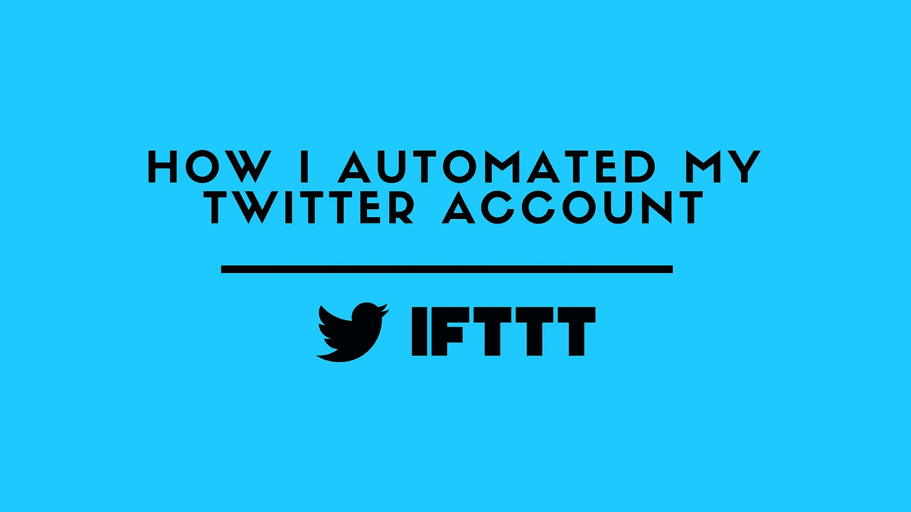

# 我如何自动化我的推特账户

> 原文：<https://medium.com/hackernoon/how-i-automated-my-twitter-account-7668fc8098b>

我们需要开始假设我不喜欢[的推特](https://hackernoon.com/tagged/twitter)，但我发现保持更新非常有用。我从没说过我是个条理清晰的人。但我真的讨厌在 Twitter 上不停地写东西(我甚至不在脸书上写)，但这并不意味着我的在线活动停止了，或者我不使用其他平台。这就是为什么我花了最后一个晚上来了解如何在我使用的平台上转变我的行为…