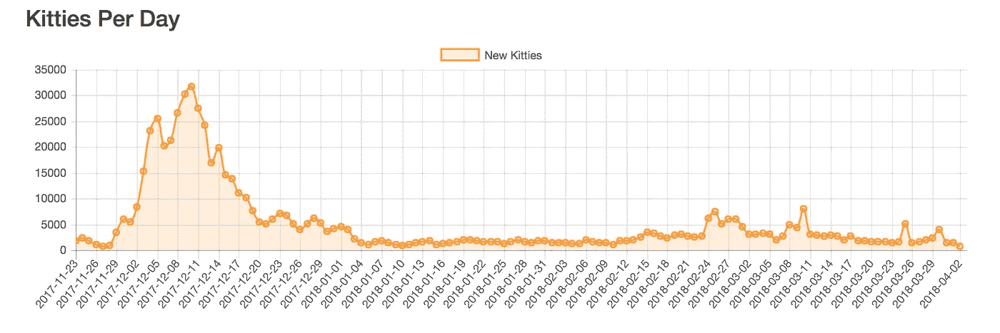
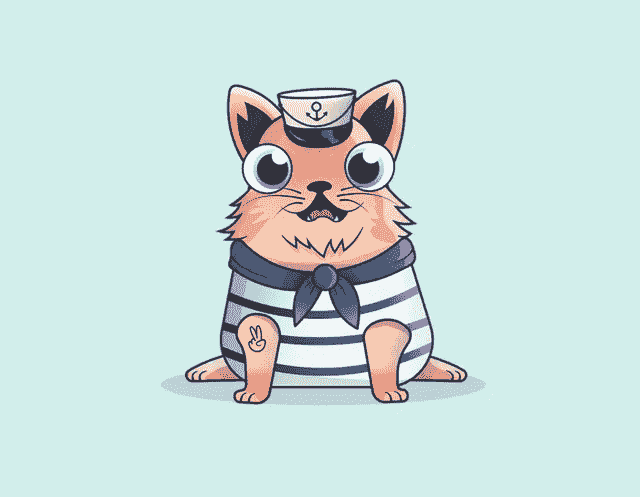
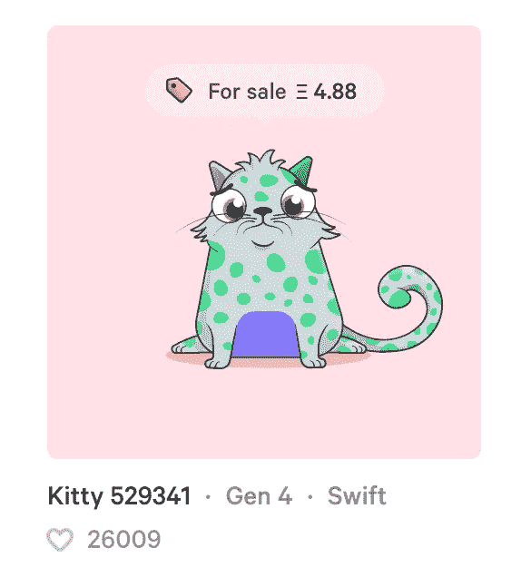
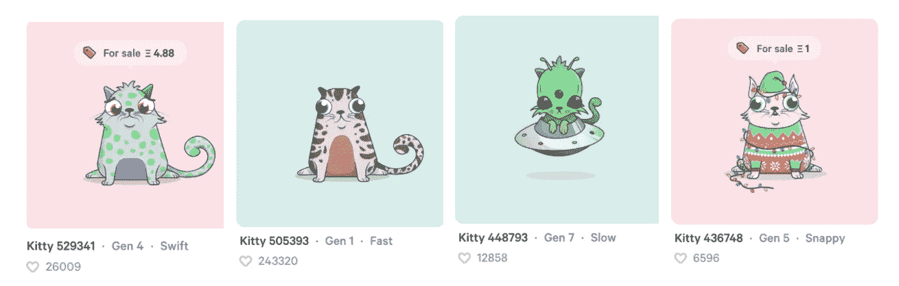
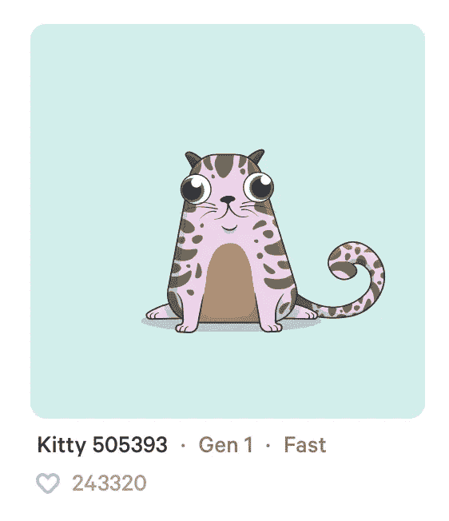

# 我是如何打败密码猫的

> 原文：<https://medium.com/hackernoon/how-i-beat-cryptokitties-f9aa71c03c87>

鉴于 CryptoKitties 的 1200 万美元融资，并为了庆祝我以 2 ETH 的价格出售了最后一只猫，下面是我如何击败 CryptoKitties 的故事。

# 开始

在 CryptoKitties 经历指数级[增长](https://hackernoon.com/tagged/growth)的前几天，我是偶然看到 Twitch 直播的幸运儿之一:



就在游戏开始和 [ETH](https://hackernoon.com/tagged/eth) 疯狂涌入的时候，我培育了一只船猫，一只为那些缺乏经验的隐猫培育者准备的奇特的猫。当时，这是第 120 只船猫，也是市场上仅有的 35 只之一。它看起来有点像这样:



这只猫最终以 0.83 ETH 的价格卖出，几天之内，我在 50 美元的投资中赚了 1000 多美元。

# 2 比 1 好

那个周末我回家了——我住在旧金山，我父母住在一个小时路程的地方。在告诉我爸爸关于隐猫的疯狂之后，我和妈妈去杂货店买了一些东西。不到一小时后我们回来了，我爸爸已经安装了 MetaMask，建立了一个比特币基地账户，并购买了他的第一个 CryptoKitty(在此之前，加密货币只是假钞和 CryptoKitties " *他听过的最荒谬的事情之一*)。

是的……crypto kitties 是我父亲对加密货币的介绍。

# 一个月后

从上图可以明显看出，隐猫热并没有持续很长时间。大多数人，比如我自己，做了一些 ETH，套现了。然而，我父亲还剩下几只猫，随着市场看起来不景气，他正在寻找新的方式来出售他的猫——从 [subreddit](https://www.reddit.com/r/CryptoKitties/) 到 discord channel 再到 [Steemit](https://steemit.com/) 。

一个周末回家，我决定帮我爸爸卖掉他剩下的猫。经过几个小时的头脑风暴和四处摸索，我们想出了一个计划。

# 黑客 CryptoKitties(嗯，算是吧)

自从我退出 Cryptokitties，一些新功能已经发布。一个特别的特性，*like*，在 it 实现中有点不稳定——它在创建后几天就被利用了。

然而，普通的 Cryptokitties 用户并不是很懂技术，所以大多数像这样的利用只是人们在 MetaMask 上创建多个帐户并喜欢他们自己的猫。虽然这可能对 10-100 个赞有效，但如果大量使用，就会非常耗时。

有了一些使用 web3.js 的经验，我试图重复这个喜欢的过程，但是用代码。以下是最终结果(这是一只拥有荒谬数量喜欢的猫):



# 代码

下面是“黑客”的一个演练:

1.  生成公钥/私钥对。
2.  对单词“Cryptokitties”进行数字签名，并将该签名与您的公钥一起发送到 CryptoKitties API。
3.  收回登录令牌。
4.  用这个登录令牌去*喜欢*一只猫。
5.  想重复多少次就重复多少次。

这是它在代码中的样子:

```
const web3 = require(“web3”)
const Web3 = new web3(‘ws://localhost:8546’);
const axios = require(“axios”);async function hackTheCats(address, signature, origin, catid) {
   try {
     const response = await axios({
     method: “post”,
     url: “[https://api.cryptokitties.co/sign](https://api.cryptokitties.co/sign)",
     data: {
       sign: signature.signature,
       address: address.toLowerCase() 
     },
     headers: {
       “Content-Type”: “application/json;charset=UTF-8”,
       Referer: “[https://www.cryptokitties.co/sign-in](https://www.cryptokitties.co/sign-in)",
     }
   })

   const response2 = await axios({
     method: “post”,
     url: “[https://api.cryptokitties.co/kitties/](https://api.cryptokitties.co/kitties/)"+catid+"/purr",
     headers: {
       Authorization: response.data.token,
     }
   })

   console.log(response2.data.purred);

 } catch(err) {
   console.log(err);
 }
}function loopTheHack(n, catid) {
 for (var i = 0; i < n; i ++) {
   const account = Web3.eth.accounts.create();
   const address = account.address;
   const signature = account.sign(“Cryptokitties”);
   hackTheCats(address, signature, i, catid);
 }
}
```

# 成功！

CryptoKitties 等游戏的一个主要缺点是你的数字资产的搜索能力——其他人找到你试图出售的资产有多容易。幸运的是，*喜欢*是 CryptoKitties 市场提供的过滤器之一。因为我是唯一一个有计划地喜欢猫的人，所以我很容易就能主宰市场。我的策略？

1.  喜欢猫，直到它成为市场上最受欢迎的猫
2.  出售
3.  重复

下面是我当时用的两个账号:
* 0x 97 B2 f 877098 b 9 ff 46 b 86650290 b 13 f 85881 fc9e 5
* 0x 4 CFC 6 CDA 90 a 0d 338 b 99 bfd 35 a 4d 75 fa 97 bfd 17 e 4

你可以在这里看到我赚了多少:[https://kittyrush.herokuapp.com/](https://kittyrush.herokuapp.com/)

以下是我卖的一些猫:



当然，拥有 240，000+赞的游戏中最受欢迎的猫:



# 我能用这个黑客吗？

不，(不)幸运的是 CryptoKitties dev 团队已经掩盖了这个漏洞，只允许那些至少有一只猫的人喜欢其他的猫。这意味着，要复制上述内容，你需要在账户之间来回传递一只猫——当你获得 20，000+赞时，你花在汽油上的$$$将超过你从一只被赞的猫身上可能获得的收入。

# 外卖食品

随着真金白银的出现，即使是最荒谬的加密游戏也会成为黑客攻击的目标。然而，我认为加密游戏更容易受到这种攻击，因为普通的在线加密游戏玩家比美元游戏玩家更容易成为目标:

1.  交易是最终的(一旦钱被寄出，就没有了)
2.  普通人仍然不知道加密货币是如何工作的，因此很难区分合法、半合法和非法的加密网站
3.  由于加密价格的波动性以及这些以太坊游戏的价格显示在以太网上，人们有时会忘记他们实际上花了多少钱

所以，如果你决定参与一个加密游戏，小心！这真的是狂野的西部。