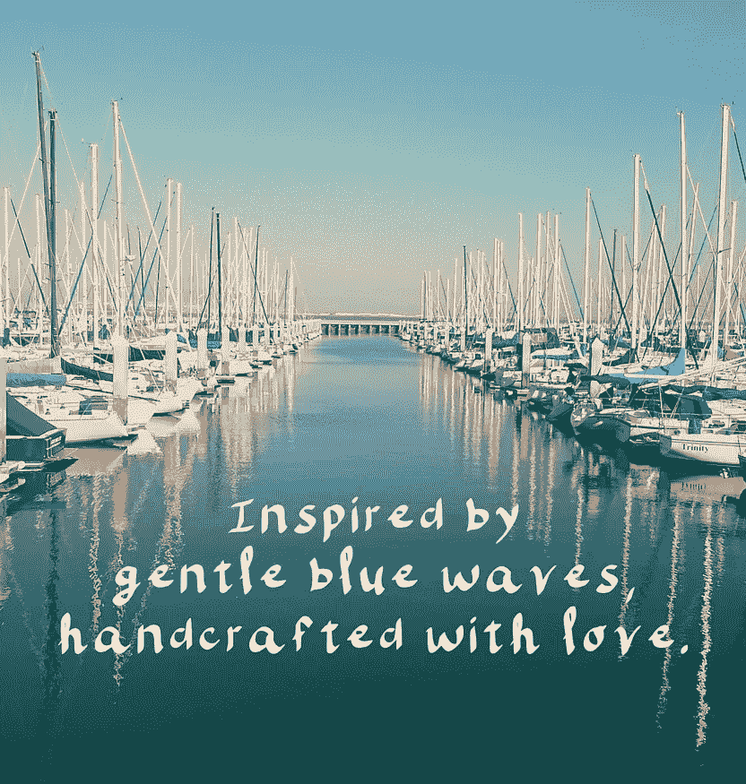

# 我是如何在摇着我的宝宝睡觉时成为一名字体设计师的。

> 原文：<https://medium.com/hackernoon/how-i-became-a-typographer-while-rocking-my-baby-to-sleep-ca117fd2a144>

当你成为新妈妈时，你几乎找不到空闲时间。因此，在喂奶、换尿布和哄女儿睡觉的间隙，我努力想办法为我的创造技能腾出时间。

多年来，我一直在研究书法(用真正的墨水在实体画布上)。我知道我必须追求一些数字化的东西，我可以很快拿起并在微小的时间空间里暂停。所以，当我那了不起的丈夫送给我 iPad Pro 时，我就一头扎进了 T2 式设计的世界。

经过研究，我找到了 calligraphr.com，在那里我可以将手绘字母转换成可用的字体。我喜欢这个网站的一点是，你可以下载角色的模板，制作角色，然后上传进行转换。

我开始用应用程序制作自己的字体。有了各种各样的笔刷和设置，你可以自由地创造美丽的视觉效果。

这是我的第一个字体。我用的是平刷，我还没想出我可以改变字母之间的间距。

…..不是很好，但这是个开始。

第二和第三种字体。好的，好的，不错。稍有好转。

这很有趣。找到窍门了！

我也试着用一些奇怪的笔刷，我有点喜欢它的效果！

在每天晚上练习之后，我的字体变得越来越好，我决定把它们都放到 [**我的创意市场商店**](http://creativemarket.com/milavisuals) **。**

几乎每天晚上摇着女儿睡觉的时候，我都在研究一种新的字体，这帮助我在字体设计技能上取得了长足的进步。

虽然我刚刚开始接触字体设计的表面，但是微小而一致的动作是进步和成长的最大贡献者。

持续不断的微小进步(即使时间非常有限)将战胜任何时候对潜在未来的过度思考和梦想。

选择一个目标。

从今天开始采取一个微小的行动。

看看会发生什么。

祝你好运！

PS。要查看到目前为止我所有的字体， [**点击这里**](http://creativemarket.com/milavisuals) **。**