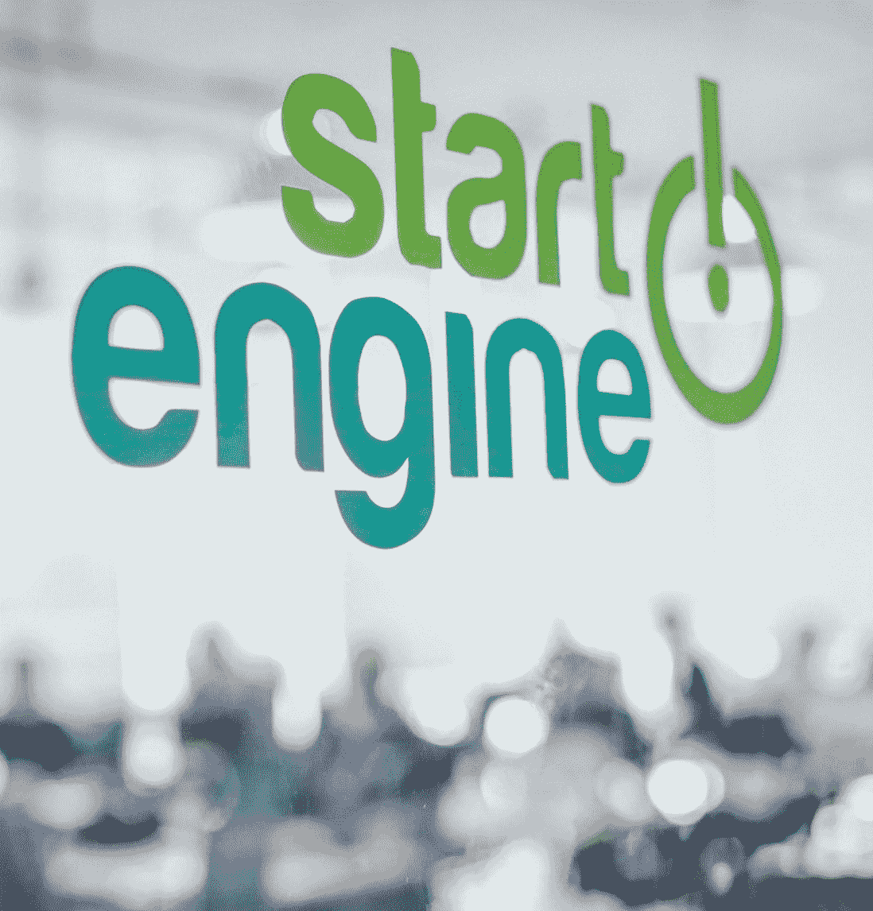

# 我如何建立一家估值 1.3 亿美元的公司

> 原文：<https://medium.com/hackernoon/how-i-built-a-company-with-a-130m-valuation-b112b166bb49>

A snapshot of the team, taken April 20, 2018

正如无数其他故事一样，StartEngine 的开始很简单。如今，StartEngine 有 33 名员工。我们已经帮助 160 家公司从 150，000 多名投资者那里筹集了资金。我们在自己的平台上以 6000 万美元的估值筹集了 500 万美元，并刚刚宣布了 1000 万美元的 ICO，以每股 10 美元的价格试水 1.3 亿美元的估值。

但在所有这些之前，StartEngine 最初只是一个单一的想法:我想投资 60 家公司。

## **设定目标**

在我创办的第二家视频游戏公司 Acclaim Games 被华特·迪士尼收购(Playdom 是最初的买家)后，我想暂停创业，成为一名投资者。请记住，我在 1991 年共同创立了动视，它最终成为市值 500 亿美元的大公司。2010 年 Acclaim 被收购时，我已经在创业领域工作了近 30 年，并取得了令我自豪的成功。我想做些不同的事情。

因此，我决定尝试投资，并设定了投资 60 家公司的个人目标。因为我当时住在洛杉矶，所以我想为什么不在这里投资。当然，它没有硅谷的声望，但洛杉矶有自己的创业公司，所有的创业公司都需要资金。

当我开始寻找想法和企业家来支持的过程时，我意识到我需要更多的结构——我如何首先找到这些公司？我的投资的交易结构是什么？我是写张支票然后消失吗？

我是 Y Combinator 的忠实粉丝，并意识到加速器模式对初创企业家是有效的。这对我正在努力做的事情很有意义。于是加速器 StartEngine 诞生了。

## **发动引擎加速**

The first rendition of the StartEngine logo

2011 年底，我与保罗·凯斯勒(Paul Kessler)合作成立了 StartEngine，他是一位精明的金融家，有着丰富的投资经历，我们两人还为我们的加速器项目采访了一些初创公司。洛杉矶没有现成的加速器(尽管其他一些公司也有同样的想法，并且和我们差不多同时推出)，所以我们有很多申请人。

我们决定对创业公司进行分组，但我没有使用 Y Combinator 的六个月模型，而是决定将每个分组分成 90 天。这是足够的时间来指导和帮助公司准备在 90 天结束时的演示日，他们将在投资者面前展示他们的业务，并希望吸引更多的投资。

我们出价 20，000 美元购买该公司 10%的股份，我们对此很感兴趣。我们接受了大约 5%的申请人。我们的第一批是 15 家公司，然后是 20 家，再后来是 20 多家。

The first companies that pitched at a StartEngine Demo Day, including hypemarks, now known as Tint, which is doing great

60 家公司中，有 50 家很快就消失了。至今仍有 10 家左右，其中一些非常成功。其中包括益智公司 TruBrain T1、内容管理和社交媒体修饰工具 T2 Tint T3、数字标牌软件 T4 en plug T5 和活跃品牌服装公司 Carbon 38 T7。

其他的，比如时尚俱乐部，在《鲨鱼池》中继续从马克·库班获得资金，但事实上是糟糕的演员。他们加入加速器只是为了假装三年后这件事从未发生过，从而剥夺 StartEngine 的股权。最后，我在 LinkedIn 上写了一篇文章，现在已经有近 30 万的浏览量。

## **狭窄的资金流向**

A screenshot of an early version of the accelerator website

我在加速器课程中学到的是*找钱很难*。在我们的加速器中，许多公司不得不寻找免租金的住所，不给员工发工资，并且在公司起飞并开始产生收入之前，一直在想办法维持生计。

由于我经常投资女性和少数族裔创始人，这个问题变得更加复杂。我亲眼看到了风险投资的偏见，因为大部分资金都投向了“来自斯坦福的白人男性”这一精英投资主题。就数字而言， [3%的风险投资资金](https://www.bloomberg.com/news/features/2018-05-01/white-male-vcs-tend-to-fund-white-male-entrepreneurs-could-robots-do-better)流向了女性企业家。通过招募优秀的女性人才加入 StartEngine 加速器，当我投资的公司无法获得更多资金时，我很快变得沮丧。

这是一个经常被视为二元的问题。不管业务质量如何，一家公司能否筹集到更多资金的决定性因素是创始人能否将自己卖给风投。能养就养，不能养就不养。经过 10 次或 20 次会面后，很明显他们是会筹集资金，继续追求自己的梦想，还是会放弃。

筹集资本变成了一场数字游戏。推介 100 个投资者，并获得 5 到 10 个投资者。但是你去哪里找那些投资者呢？加速器中的公司会参加各种活动，试图会见潜在投资者，但这很难。许多人放弃了，并对这一制度感到沮丧。

## 一个想法的曙光

这个问题让我更加欣赏 Kickstarter，它提出了一个解决资金问题的方法:把你的资金需求带给大众。让群众来决定投资是否值得。没有什么比让潜在客户投资一家公司更好的了，因为他们想成为客户。Kickstarter 是一个很好的模式，但它并不适用于所有事情，主要是一些小工具和消费品。Kickstarter 创建了非常明确的指导方针，拒绝大多数公司通过他们的服务筹集资金，因此它不适合大多数需要资金的企业。

当我从 StartEngine 项目中的企业家那里听说他们筹集资金有多么困难时，我开始研究并寻找资金问题的解决方案。事实上，我觉得我个人有责任解决这个问题。但是怎么解决呢？

The very first version of the StartEngine website

2012 年 4 月，我发现了答案的曙光。我读了一篇关于新就业法案的文章。该法案由奥巴马签署，80 年来首次允许公司通过出售证券(股票、债券等)从任何人那里在线筹集资金。突然之间，Kickstarter 创造的大门看起来可以成为那些没有面向消费者产品的公司的一个选择。新规模的众筹。

我心想这可能是巨大的。正如我们所知，这可能会改变金融业，但我也知道就业法案的实施还需要一段时间。所以我等着。在此期间，我继续做我的研究并发展加速器。

## **决定支点**

Ron Miller

大约在这个时候，我遇到了罗恩·米勒，一位连续创业者和销售大师，我们很快成为朋友。他对加入加速器感兴趣，所以我让他做我的导师。我还雇佣了约翰娜·克罗宁来管理加速器。

随着加速器的发展，我继续做功课，阅读《就业法案》和投资者用信用卡在线购买股票的概念。其他人进入这个领域，开始利用《就业法案》第二章进行众筹业务，这是《就业法案》中第一个实施的部分。但我对第二章不感兴趣，因为它只允许公司从合格投资者那里筹集资金。我的直觉告诉我这不是答案。

Johanna Cronin

从很多方面来说，Title II 只是融资方式的延续，只是更新为在线形式。我认为《就业法案》的潜力要大得多，如果牌打得好，这是一股潜在的革命性力量。

关注合格投资者似乎是一个错误:交易的结构、投资平台的展示方式，都将与它们为消费者设计的方式不同。等到消费者能够参与进来的时候，我们就没有可信度了。我们将成为我们想要重塑的那个有偏见的机构的一部分。

所以我们等待并继续在加速器上工作。在我达到 60 岁的目标之前，我没有停下来的打算，在两年半的时间里，我最终做到了。

2013 年 11 月，SEC 发布了一份监管众筹的草案，我觉得很吸引人。我有预感这将是一个怪物。一旦我实现了投资 60 家公司的目标，罗恩和我的对话就变成了这样一个问题:我们是应该在加速器中再做一批创业公司，还是应该将我们的业务转向股权众筹？我们能两者兼顾吗？

An early version of the StartEngine website, circa summer 2014

2014 年春天，很明显股权众筹是一个更大的机会，同时运行加速器和发展这种众筹是不可行的，所以我们改变了我们的业务。Ron 最初担任前两年的首席执行官，现在是董事会主席，Johanna 现在是我们的产品、营销和服务总监，我是首席执行官。

## **登陆我们的第一个客户**

The second rendition of the StartEngine logo

我们需要一个名字，我们需要一个标志。StartEngine 这个名字在洛杉矶已经有些名气了，这在新的尝试中会很有用。加速器项目的重点是为企业筹集资金，所以我认为如果这个名字适用于加速器，那么它也适用于股权众筹平台。

我们建立了一个平台的原型，保留了 StartEngine 的名称和标志，然后它变成了一个等待游戏，直到《乔布斯法案》实施。与此同时，我继续指导那些通过加速器的公司。

我们需要资金来运营 StartEngine，但去找机构投资者感觉不真诚。如果我们想彻底改革金融，如果我们从那些我们认为我们的平台让企业家可以不要的机构、风投、银行那里拿钱，会给我们的潜在客户发出什么样的信息？

因此，我们把自己的钱投入公司，并从朋友那里筹集资金，这些朋友有着相同的信念，即金融需要大规模地被颠覆，以帮助成千上万沮丧的企业家获得他们成功所需的资本。然后 2015 年 3 月 23 日早上一切都变了。前一天晚上，我们接到一个电话，说证交会将对《就业法案》中的 A+条例进行投票。我们还没有看到 A+规则的草案或任何东西，所以这是一个惊喜。委员们那天早上投票，一致通过。条例 A+的生效日期定为 2015 年 6 月。

我们有 60 天的时间来寻找客户和开发软件。由于我们还没有内部开发团队，所以我们使用了 Colab 来开发软件，并开始寻找业务。很艰难。市场不知道什么是股权众筹。

最终，我们通过达伦·马布尔(Darren Marble)联系到了一家名为 [Elio Motors](https://www.eliomotors.com/) 的汽车公司，达伦·马布尔是一位对众筹领域感兴趣的当地企业家，他正在洛杉矶建立自己的营销平台。达伦介绍我们认识，知道这将是一个很好的匹配。

Ron, Johanna, and I by an Elio car

6 月 1 日，我们会见了以他的名字命名的首席执行官保罗·埃利奥(Paul Elio)，并在第二周与他签约，高效率、轻型汽车公司埃利奥汽车(Elio Motors)的上市于 2015 年 6 月 19 日进入公开测试 waters 页面。几个小时内，我们就获得了数百万美元的预订，其中大部分来自 Elio Motors 社区。这些保留意见并不是承诺，只是在证券交易委员会批准发行之前，投资于该公司的兴趣水平。

A screenshot of the Elio Motors page, a few days after launch

这是我们第一次创办公司的一个平稳而轻松的过程。当 Elio 最终在那年 11 月上线时，他们从 6600 多名投资者那里筹集了 1690 万美元。这是有史以来第一次监管 A+发行，取得了巨大的成功。

**启动引擎，加速**

The current StartEngine logo

Elio 并没有像我想象的那样引发销售，很大程度上是因为我们必须教育市场。我期望 Elio 的成功会引发一个催化剂。加薪之后，我以为美国会醒悟过来，认为“我也需要这样做。”但现实比这要慢。

澄清一下，我从来没有怀疑过 StartEngine 会起作用。我相信这一点，因为我们采取了一种漫无目的的方法:把意大利面扔在墙上，看看会粘上什么。我们的商业模式以小企业和消费者为目标，他们是受众的巨大群体。市场太大了，StartEngine 不可能不工作。股权众筹的需求是存在的；我们只需要教育市场，让它知道选项摆在第一位。

最终，事情加速了。真正的转折点出现在 2016 年 5 月监管众筹开始实施的时候。监管众筹成本低廉，具有成本效益。更好的是，这很容易。它向更多的公司开放了 StartEngine。作为公司可行的融资选择，我们的平台开始变得更有意义。

到 2016 年底，我们做了 10 次发射。到 2017 年底，超过 100 家。2018 年过半，我们已经推出了比去年全年更多的公司，我们的团队几乎增加了两倍。

The team, circa Spring 2017

我们的平台帮助企业家获得资本，这无疑有助于我们的增长。当我们需要资金时，我们在自己的平台上从 3000 多名投资者那里筹集了 500 万美元。此次募集历时半年多，于今年 6 月结束。我们告诉我们的客户，他们应该做股权众筹，那么我们为什么不把我们的业务放在嘴边，也从人群中筹集资金呢？我真的相信这是更好的选择，所以这就是我们所做的。你猜怎么着？它成功了，所以我们再做一次。现在，我们正在试水 1000 万美元的 ICO(T1)，这意味着投资者可以保留他们的股票，这样我们就可以在证券交易委员会审核发行时衡量投资者的兴趣。

说到 ICOs，我们的成长有一部分是运气。去年夏天，当我第一次开始了解 ico 时，我立刻意识到了它们的本质:证券的众筹销售，如果不遵守联邦法律的话。这是一场完美的风暴，因为 ICOs 完全符合《就业法案》和我们在 StartEngine 所做的事情。当证交会公开回应我的信念并发出传票时，它带来了新的业务。

没有一个企业家能预料到这一点，我在创办公司时当然也没有。一家公司的成败往往取决于市场的偶然变化，随着 ico 的爆炸性流行，事情朝着对我们有利的方向发展。

尽管势头良好，但认为我们的业务可以在没有流动性的情况下继续增长还是太天真了。投资者需要能够交易他们的资产，以便这种融资策略能够真正扩大规模并取代风投。普通投资者不能或不愿等 7 年才能看到投资回报。他们需要一个更短的时间表，但这个时间表即将到来。

StartEngine 本身和许多其他公司正在努力建立二级市场，投资者可以在那里交易证券。一旦这些市场建立起来，它们将是打开整个企业的钥匙。由于时间跨度更短，更多的投资者将有兴趣参与，他们将为流动性支付溢价，创业公司将因此筹集更多资金。

在不久的将来，我相信最好的交易会首先出现在众筹上。下一个 Snapchat 不会从风投那里融资，而是从大众那里融资，因为创始人完全控制着他们的估值和条款。我计划在那一天到来时启动引擎。

*感谢阅读。如果你有兴趣了解更多关于 StartEngine 的信息，或者投资该平台，你可以在这里了解更多***。**