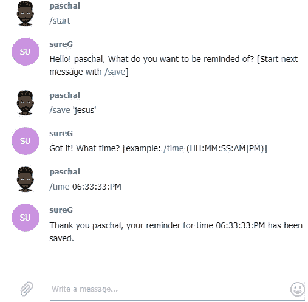
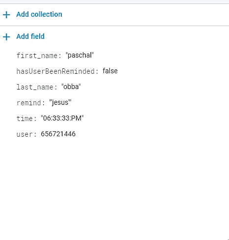
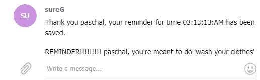
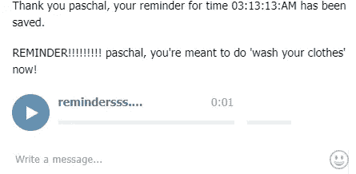

# 我如何用 Node JS、IBM Watson API 和 Firebase 构建了一个电报提醒机器人

> 原文：<https://medium.com/hackernoon/how-i-built-a-telegram-reminder-bot-with-node-js-the-ibm-watson-api-and-firebase-7128c778e3d7>


Photo by [Rock’n Roll Monkey](https://unsplash.com/photos/R4WCbazrD1g?utm_source=unsplash&utm_medium=referral&utm_content=creditCopyText) on [Unsplash](https://unsplash.com/search/photos/bot?utm_source=unsplash&utm_medium=referral&utm_content=creditCopyText)

**目录**

1.  介绍
2.  先决条件
3.  用节点 JS 创建 bot
4.  将机器人连接到实时数据库(Firebase)
5.  运行 Cron 作业
6.  连接到 IBM Watson API 的脚本
7.  部署到故障
8.  结论

# 介绍

这个电报机器人只需要三个命令。

*   /start —初始化我们的 bot。
*   /save —保存我们希望以后提醒的字符串。
*   /time —节省我们希望执行此任务的时间。

然后，将这些数据保存到 firebase，并初始化一个 cron 作业，该作业将在设定的时间运行。这个 cron 作业向用户发送文本提醒，然后使用文本到语音 IBM Watson API 将其转换为音频文件，并发送给用户。

# 先决条件

*   一个电报机器人，这个机器人可以通过向电报上的[机器人父亲](https://web.telegram.org/#/im?p=@BotFather)账户发送“/开始”消息来创建。还应该获得 bot 令牌。
*   一个 [IBM 沃森](https://idaas.iam.ibm.com)账户(免费)。
*   一个实时数据库， [firebase / firestore](https://firebase.google.com/) 。
*   一个 [Glitch 账号](https://glitch.com/)，正好需要你的 Github 账号。
*   一点点 regex 和 bash(没什么好担心的)。

# 用节点 JS 创建一个 bot

好的，首先，我们需要安装我们需要的模块。因此，从我们的目录中，我们将在终端中运行:

```
$ mkdir telegramBot && cd telegramBot
$ npm init
$ npm install node-telegram-bot-api node-cron firebase-admin shelljs
```

我们将使用**节点电报机器人 api** 作为包装器。首先，我们将在我们的目录中创建一个 **index.js** 文件。我们将在 index.js 文件中添加以下几行:

因此，我们用从机器人父亲帐户获得的令牌初始化机器人。第 6 行的轮询选项保持机器人和用户之间的通道活动。这是一个网络插座的事情。我们还声明了一个提醒变量，它保存我们希望被提醒的内容。

# /开始

然后，当用户输入“/start”命令时，我们将让服务器监听。因此，我们将在 index.js 文件中添加一个 **onText** 监听器。

它侦听“/start”命令何时被传递，然后用一个包含“msg”对象的回调来响应，该对象包含聊天 id、用户名等。

当这个条件被满足时，机器人向聊天 id 发送消息，询问用户，他希望被提醒什么。所以我们完成了第一个命令！

# /保存

这个命令将保存我们想要提醒的内容。传递“/start”命令后，将触发此侦听器。所以我们将通过这个函数，在承诺中返回(。然后)

所以我们听当了。/save ',然后回调中的' match '变量返回一个包含匹配内容的数组。

如果用户输入***/保存‘洗我的衣服’***，那么‘洗我的衣服’字符串将具有数组中的第一个索引，即['/保存‘洗我的衣服’，‘洗我的衣服']。当这个被获取并保存后，我们就发送一条消息来询问时间。我们完成了第二个命令！

# /时间

现在，我们将节省时间。这应该输入到 save 命令的承诺链中。我们希望保存格式为 **HH:MM:SS:(AM 或 PM)** 的命令。所以我们的时间函数应该是这样的:

所以正则表达式匹配格式，然后我们通过拆分匹配响应得到时间。匹配变量如下所示:

```
[ '/time 06:33:33:PM',
  '06',
  '33:33',
  'PM',
  index: 0,
  input: '/time 06:33:33:PM' ]
```

所以拆分数组中的第一项，我们得到 **06:33:33:PM** ，然后我们发送一条感谢消息。但是我们的机器人实际上并没有保存用户的请求，当然也没有提醒用户。所以我们需要解决这个问题。

在这个阶段，我们的 index.js 文件应该如下所示:

我们与机器人的交互应该是这样的:



# 将机器人连接到实时数据库(Firebase)

现在，我们将在目录的根目录下创建一个 **database.js** 文件，它将处理我们到 firestore db 的连接。我们的 database.js 文件应该如下所示:

现在，我们可以在 index.js 文件的顶部导入 database.js 文件。

```
const db = require('./database').database;
```

我们还想用用户的聊天名保存用户的请求，但是如果用户不止一次请求，就会是重复的。因此，我们可以在 firestore 上存储的每个文档中附加一个随机字符串。为此，我们将在我们的根目录下创建一个 **helper.js** 文件，它看起来像这样:

这将返回我们传递的任意长度的字符串。我们也可以在 index.js 文件的顶部导入这个文件。

```
const generator = require('./helper');
```

现在，我们将返回到处理我们的 ***/time*** 命令的函数，然后在发送“谢谢”回复之前，我们添加以下内容:

最初，我在我的数据库上创建了一个名为“提醒”的集合。然后我使用 ***传递有效载荷。将*** 命令设置为集合。现在，有一个 **hasUserBeenReminded** 键，帮助我们跟踪用户是否被提醒了某项任务。

如果我们再次与我们的 bot 交互，在运行了 ***/time*** 命令之后，我们的 db 应该是这样的:



firestore db

如果工作正常，我们就可以运行一个 cron 作业，在设定的时间提醒用户。我们可以在 index.js 文件的顶部添加依赖关系。

# 运行 Cron 作业

```
const cron = require("node-cron");
```

然后，我们可以继续听我们的 ***/time*** 命令的功能。

所以我们基本上是获取用户希望被提醒某个任务的小时和分钟，然后用 cron 依赖关系来调度它。通常，cron 调度程序有一个模式:

```
*** * * * * ***
```

这些星号分别代表秒(可选)、分钟、小时、日、月和年。所以我们忽略了第二个选项，选择了小时和分钟。到时间了，事件被触发，提醒被发送， **hasUserBeenReminded** 键也被设置为 true。



We should have a message like this, when the time comes.

# 连接到 IBM Watson API 的脚本

我们还希望机器人发送一个语音提示我们的提醒。类似于 ***【洗衣服】*** 这样的就可以了。为此，我们将使用 IBM Watson API 上的文本到语音服务。这将把文件转换成我们想要的格式的音频文件(电报接受**)。ogg** 格式)然后上传。

为此，我们将编写一个简单的 shell 脚本。我们将该文件命名为 textToAudio.sh，它应该是这样的:

当命令运行时，“$1”获取第一个参数。这将是我们的文本。然后如果参数不为空，用 curl 做一个 post 请求，否则显示一个字符串***‘无参数’***。如果运行成功，输出***reminders ss . ogg***将被添加到根目录。

我们可以在终端中用 sh 命令运行它，但是要在 node 中运行它，我们需要在 index.js 文件的顶部添加一个依赖项。

```
const shell = require('shelljs')
```

所以现在，我们将使用 ***shell.exec*** 命令运行这个命令，然后第一个参数将是我们希望被提醒的内容。

这将执行 shell 脚本，然后将提醒作为第一个参数传递。然后我们把音频发给用户！

我们与电报机器人的交互现在应该是这样的:



Audio file sent

# 部署到故障

好吧，这真的只是即插即用。在 glitch 上创建一个项目后，只需将代码复制并粘贴到那里，就可以开始了。

# 结论

这个项目仍然有许多不完善的地方，其中之一就是排队，因为它一次只处理一个请求。如果你需要澄清，有一个[存储库](https://github.com/obbap1/telegram_bot)可以提供。

非常感谢你的阅读，如果你喜欢，请鼓掌。如有任何问题或需要进一步澄清，可以留言或发邮件(paschalobba@yahoo.com)。