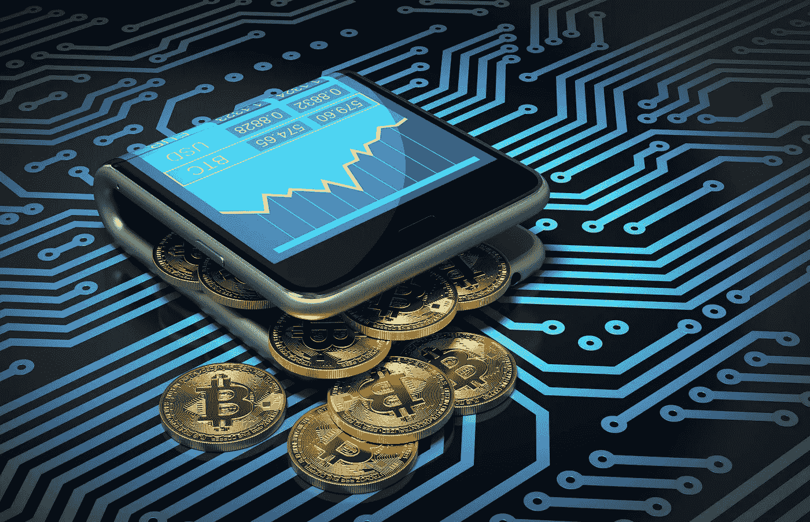

# 我如何购买和持有我的密码，为什么你做同样的事会赚更多的钱

> 原文：<https://medium.com/hackernoon/how-i-buy-and-hold-my-crypto-and-why-youll-make-more-money-doing-the-same-a207ed92be69>

# 你使用 CoinBase 买卖你的密码吗？

## 如果有，为什么？

你意识到你在交易费用上损失了多少钱吗？很少有人注意到这一点，但这意味着你要付出更高的代价。你没有支付要求的价格，而是支付给 CoinBase 一笔佣金，以促进交易的顺利进行。有些人可能会认为这是使用值得信赖的服务的代价，我认为这是由于缺乏对可用替代方案的了解或理解。

## 具有讽刺意味的是，交易一种被设计成不需要中介的货币，往往是在收取最高佣金的交易所进行的

# [我使用的替代品是币安](https://www.binance.com/?ref=12026388)

最简单的原因是费用是 0.05%

作为参考，CoinBase 对同样的服务收取 1.49%的费用

# 其他原因与选择有关

我想要一条交易另类硬币的路线。CoinBase 没有为我提供购买、持有或出售 Ripple 的机会。我想购买 Cardano 和 Digibyte，但没有办法通过我的 CoinBase 帐户购买。

这让我踏上了寻找最佳替代方案的研究之旅。我想要的东西是安全的——币安从未被黑客攻击过——由业内资深人士创建，包含大量硬币，易于使用，并且根据用户需求定期添加最新产品。

# [币安勾选了所有的方框](https://www.binance.com/?ref=12026388)

用户界面很简单

当频繁交易时，如果我允许我的硬币留在我的账户中，而将它们转移到一个硬钱包中又简单又快捷，我会感到安全

该公司得到了许多在该领域拥有丰富经验的著名加密业内人士的支持

## 币安允许我以更低的价格购买更多的硬币

在 Ripple 广为人知之前，我有机会买下它，并从它短短几个月内 10 倍的涨幅中获利

# 我不能在 CoinBase 上这样做

虽然那里的内部人士从比特币现金拙劣的上市中获利，但我能够更自由、更容易地将我的比特币兑换成替代货币。

现有品牌的问题在于，留给价值大幅增长的跑道正在缩短。

随着这些公司的市值达到数千亿美元，它们的价值能增长到什么程度呢？

## 这让我走上了另一条路

# [这就是我选择币安](https://www.binance.com/?ref=12026388)(我的推荐链接)的原因