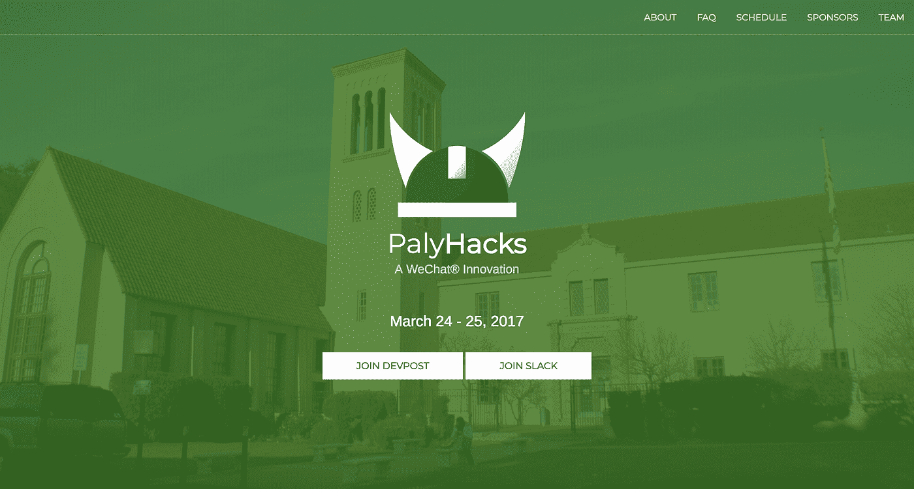

# 我如何在 365 天里每天编码

> 原文：<https://medium.com/hackernoon/how-i-coded-everyday-for-365-days-67ebb5fc7ae>

*一个高中生从 Google Drive for git 到编程成瘾的旅程*

Created by Creativeart — Freepik.com

大约 365 天前，我坐在那里思考，“我怎样才能在编程方面做得更好？我怎样才能学到更多？我怎么学？”在硅谷的中心长大，我看到人们在建设令人兴奋的项目，我也希望能够这样做。

365 天前，我阅读了许多关于 **#100DaysOfCode** 挑战的文章，在那里，人们承诺在 100 天内每天编码一小时。自然，我很惊讶——这些人从哪里得到的动力？每当我有时间，我会说服自己，我应该去睡觉或神奇地找到其他事情做。坦率地说，我对这些人的奉献精神感到惊讶。接下来的几周，我一直在考虑参加挑战。2016 年 12 月 26 日，我朝着今天的位置迈出了第一步，也是我的第一个 **#gitcommit** 。

# **入门**

我为自己制定了一些指导方针，这些方针是从其他人制定的方针中修改过来的。在很大程度上，我不擅长时间管理，所以我不认为简单地设置一个计时器并开始就能给我必要的动力。我也不认为这是可行的，对我来说，一个努力奋斗的有体育和其他爱好的高三学生，在我最需要专注于学校的时候强加非常严格的指导方针。

## 规则 1:每天用一个有意义的改变来承诺 GitHub。

对于以前从未使用过 GitHub 的人来说，这是一个巨大的变化。尽管对于移除 GitHub [条纹](https://github.com/dear-github/dear-github/issues/163)有着复杂的感觉，但我发现它们实际上非常有利于保持我的动力。为了更好地了解我的进展，我发现使用 Naramsim 的[扩展](https://github.com/Naramsim/GithubOriginalStreak)非常有用。

## **规则二:没有借口**。

找借口很容易。

> 我过会儿做它。
> 
> 如果我努力的话，我可以做到。

但事实是，你没有努力，而“以后”永远不会到来。我知道，虽然我在时间管理方面不是最好的，但如果我要像这样致力于一个长期的解决方案，我需要放弃任何借口。这意味着，即使我有一个测试或假期，我仍然会花一点时间来完成我的项目。

# **结果**

坦白地说，我学到的可能比你期望的要少。从时间框架来看，也许你期望我成为机器学习-后端-安卓-IOs-神童，或者类似的东西。事不宜迟，下面是我过去一年所做的事情的回顾！

# **iOS 应用开发**

在离开 Make School 的游戏开发暑期学校后，我带着对 Xcode 和 Swift 2.1 的破碎理解进来了。尽管以前有过经验，但构建应用程序和学习故事板对我来说是一个完全不同的难题，因为 SpriteKit 场景和故事板之间的差异是巨大的。

然而，在我坚持创建多个项目后，我很高兴地说，它已经成为我的黑客马拉松和辅助项目的前端平台。

## **紧急机器人(GunnHacks 3.0):多个日期，第 73 天**

*资源库* [*Devpost*](https://devpost.com/software/emergency-bot) *和*[*GitHub*](https://github.com/emily-yu/EmergencyBot)*。用 Swift 3，Firebase，Twilio，Flask，Alamofire 等构建！*

如果你看过 Devpost 和 GitHub 项目，它们是非常不同的，我向你保证，这是故意的。当我第一次参加真正的黑客马拉松时，我浏览了几个 iOS 教程，但不知道什么是 API 或 Flask。很自然地，由于非常失落，我从一个朋友那里得到了一些想法，我团队的其他人认为这听起来很令人兴奋。从这次经历中，我明白了不与你的团队协调就开始做某件事并独自沮丧是一个坏主意。现在这可能是一个既定的事实，但作为一个第一次参加黑客马拉松的人，我可以原谅自己。

EmergencyBot 是一款短信信使机器人，允许用户在夜间独自行走时按住紧急按钮，当放开时，它会向您的紧急联系人发送自定义消息，告知您处于危险之中。我想创建一个应用程序，让人们在可能遇到危险的情况下，比如下课回家晚了或独自去一个新地方时，感觉自己有某种安全网。因此，我制作了一个 iOS 应用程序，其中包含一个紧急按钮，一个平均编程延迟来确定你需要放开按钮多长时间才能发送消息，编辑和添加紧急联系人的功能，以及减少任何可能的错误警报的群组消息发送。

## ***保姆(多次投稿):第 41 天***

*私人储存库，Devpost:* [*去底特律*](https://devpost.com/software/babysitter)*[*洛奥特斯哈克斯二世*](https://devpost.com/software/child-tracker) *。主要由 Swift 3 和 Firebase* 构建*

*在我之前尝试构建一个 iOS 应用程序的令人失望的表现之后，我真的非常沮丧。当我参加这个黑客马拉松时，这是我的第二次尝试，不幸的是，我再次让我的朋友们失望，只能弄清楚故事板是如何工作的和 Firebase 认证。在此之后，我决定我认真尝试弄清楚 iOS 开发。*

## ****释放(实习):第 48 天****

**资源库* [*GitHub*](https://github.com/emily-yu/releaf) *。用 Swift 3 和 Firebase 打造。**

*你可能会想，这个女孩是如何突然从不擅长 iOS 开发变成一周后就能获得全面实习的。说实话，我也问过自己同样的问题，但是在我熟悉了 iOS 开发之后，我碰巧走运了。我在工作中展示了自己的学习能力，从这份工作中，我变得非常精通 iOS 开发，并且更加意识到外部视角会如何改变我的项目。*

*Releaf 最初的[web 应用程序是由两名斯坦福大学的研究生创建的，旨在为任何关注的话题提供一个支持小组，类似于较小的私人脸书小组。常见帖子包括日常问题、学术话题、育儿话题、心理问题等匿名发帖。既是 web 应用又是 iPhone 应用，可以让更多人参与进来。](http://releaf.io/)*

*最后，我成为了第三名员工，从第一次迭代完成，创始人寻找新的视角开始，我就做出了贡献。从那时起，我帮助他们回顾接下来的几个迭代，并帮助头脑风暴与设计和产品开发相关的想法。在我实习期间，一位设计师给了我建议，我从头开始创建了这个应用程序，做了一些调整以符合创始人的进步思想。*

**注意:我被授予了完全的权限来为应用程序开源代码。**

****

## ****紫外辐射检测仪(LAHacks 2017):第 97 天****

**资源库*[*Devpost*](https://devpost.com/software/uvdetective)*和*[*GitHub*](https://github.com/emily-yu/uvradiation)*。用 Swift 3，Firebase，OpenCV 等构建。**

*我是出了名的讨厌太阳，遇到我的人很快发现我有一些怪癖，这是恐惧的结果。在去洛杉矶的路上，当我试图避开耀眼的阳光时，我和我的朋友开了个玩笑，想出了这个主意，我们最终成功了。*

*此应用程序会根据您的位置来查找紫外线指数，并分析您自己的照片来查找您的大致肤色。然后，它通过用户的体重和肤色来计算用户的维生素 D 生成率以及最佳的每日维生素 D 摄入量。利用 iPhone 的环境光线传感器、加速度计和信号强度，我们确定了用户会受到多少紫外线照射。*

**

## ****接三:第 195 天****

**资源库* [*GitHub*](https://github.com/emily-yu/three-word-pickup) *。用 Swift 3 和 Firebase 打造。**

*很久以前，回到 GunnHacks 3.0，我对构建这个想法很感兴趣，但随着时间的推移，我从未真正实现过。最终，我决定把它建成一个工作之余的休闲场所。在 Releaf 的实习结束后，我决定利用我学到的设计和用户体验知识，尝试自己开发一款高质量的产品。*

*Pick Up Three 是一款适用于 iPhone 的应用程序，作为一个社交网络，专门用于分享和创建搭讪词。用户可以用三个特定的关键字请求搭讪，因此产生的搭讪将会特别迎合他们的特殊需求。*

*这个应用程序的整个想法非常荒谬，但我很高兴我做到了。*

****

# ***网页开发***

*我最初对编码感兴趣是因为 HTML，这有点尴尬，因为它只是一种标记语言。更重要的是，我喜欢制作真实项目和解决问题的感觉，这使得 web 开发成为像我这样的初学者开始学习如何使用 GitHub、管理 DNS 提供商以及其他基本主题的理想选择。*

## ****PalyHacks 推广现场 2017: Day -84****

**资源库*[*GitHub*](https://github.com/palyhacks/palyhacks-2017)*和* [*直播站点*](https://palyhacks.github.io/palyhacks-2017/) *。用 HTML/CSS 和 Javascript 构建。**

*从技术上讲，我不应该包括这个，但我在 2017 年也在这个网站上做了很多工作。我决定组织一个名为 [PalyHacks](https://medium.com/palyhacks) 的国际黑客马拉松，它成为了微信的合作伙伴。*

*在我看来，老实说，这是一个相当不错的第一网站，我对它有一定的喜爱。即使我用了这么多内联 CSS。有可怕的凹痕。*

**

## ****校友会网站:第 1 天****

**储存库* [*GitHub*](https://github.com/emily-yu/KpopDance) *和* [*直播站点*](http://emily-yu.com/KpopDance/) *。使用 HTML/CSS、Javascript 和 Firebase 构建。**

*老实说，虽然这个项目的代码相当混乱，但我也对它有一定的喜爱。我花了很多时间试图了解什么类型的颜色搭配得好，以及如何让用户体验稍微好一点。我对 Firebase 的第一次接触来自这个实验，以及如何管理用户权限和 DNS 提供商的感觉。*

*我也非常感谢 Domain.com 和 MLH 的免费推广代码。*

******

## ****个人网站:第 35 天****

**资源库*[*GitHub*](https://github.com/emily-yu/emily-yu.github.io)*和* [*直播站点*](http://emily-yu.github.io) *。用 HTML/CSS 和 Javascript 构建。**

*我认识的大多数人都有个人网站，不管他们是不是科技领域的。我决定自己制作一个，并采用了一个极简的设计，上面有我简历的链接和其他有用的链接。*

**

## ****青少年探索代码推广现场 2018:第 68 天****

**资源库*[*GitHub*](https://github.com/teensexploringcode/teens-exploring-code-2017)*和* [*直播站点*](http://teensexploringcode.org/) *。用 HTML/CSS 和 Javascript 构建。**

*我作为主要组织者加入了这个本地黑客马拉松，作为其中的一部分，我为新一季更新了网站。这是一项正在进行的工作！*

**

## ****EdgeHacks 促销现场 2018:第 132 天****

**资源库*[*GitHub*](https://github.com/EdgeHacks/edgehacks.github.io)*和* [*直播站点*](https://edgehacks.github.io/) *。用 HTML/CSS 和 Javascript 构建。**

*如果你还没有完全弄明白，我喜欢组织黑客马拉松！*

**

## ****黑客马拉松经理，又名检察官(GunnHacks 4.0):第 288 天****

**资源库* [*GitHub*](https://github.com/emily-yu/hackathon-manager) ， [*信息站点*](http://emily-yu.com/hackathon-manager/) *，以及*[*Devpost*](https://devpost.com/software/hackathon-manager)*。用 HTML/CSS、Flask、Javascript、Heroku、Shell 和 waaaaaay 构建了太多的 CSV。**

*如果你来过这里，你可能听说过我在上次的射击比赛中表现不佳。我想做一个项目，利用我在过去几年中发展的一些技能。有一段时间，我一直在与 Swift 合作，我决定开发一个实用类型的 web 应用程序。*

*如果这还没有变得明显，我喜欢组织黑客马拉松，但领导一个，有很多后勤和协作任务需要完成。管理与会者和导师的注册、评审和设定截止日期是我最后需要用多种类型的表格和谷歌表单来完成的少数几项任务中的一部分。*

*黑客马拉松管理器允许[未来的](https://hackernoon.com/tagged/hacking)黑客马拉松组织者在一个 web 应用程序中跟踪硬件库存、里程碑、项目评分和参与者。组织黑客马拉松所需的所有任务都可以在 web 应用程序内部执行，从发送电子邮件到注册黑客应用程序。*

*web 应用程序包含发送电子邮件、跟踪任务进度、安排事件、注册用户、项目评分和项目排名等功能。*

*像大多数黑客马拉松项目一样，这个项目失败了一段时间，但是我决定让它变得更实用。到今天为止，我已经完成了这两个目标，通过运行一个 shell 脚本，您可以为您的活动或黑客马拉松生成一个完整的用户门户。虽然它基本上是完整的，但它仍然缺少一些我真的想添加的功能，所以它仍然是一个正在进行中的工作！*

*查看[信息网站](http://emily-yu.com/hackathon-manager/),更深入地了解这个项目是什么以及它是如何运作的！*

**

## ****PalyHacks 推广现场 2018:第 364 天****

**储存库*[*GitHub*](https://github.com/palyhacks/palyhacks-2018)*和* [*直播站点*](http://palyhacks.io/) *。用 HTML/CSS 和 Javascript 构建。**

*我仍在努力，但我们的黑客马拉松将于 2018 年回归！当我为去年的黑客马拉松做广告和横幅广告时，经过近百次的反复，我用新的设计重新创建了主页。*

**

# ***杂项项目***

*我曾经做过几个小项目，现在还在做，或者只是一些小创意。我在大学双重注册的时候也学会了使用 MySQL，但是大部分时间都停留在课堂作业上。*

## ****。dotfiles:第 37 天****

**资源库*[*GitHub*](https://github.com/emily-yu/.dotfiles)*。使用 Shell 构建。**

****. debug cleaner . sh****:*和其他一些开发人员一样，我有一个阶段是在调试代码时留下打印语句。这种做法导致我的项目代码看起来相当糟糕，像 console.log("ASDFDSA ")和 print("hi ")这样的语句到处都是。因此，我创建了一个脚本来删除代码中各种语言的所有 print 语句。*

****. API remove . sh****:*API 键经常犯，有时候人都不用。gitignores 是因为他们不知道或者他们变得太懒了。为了解决这个问题，这个脚本提交您的代码，同时在代码中搜索您的键并用填充文本替换它们。*

****。mysql-simple-output.sh* 我创建它是因为我总是忘记可以登录的正确文件路径，所以这被证明非常有用。***

## ****VR 无处不在(在& T 形黑客马拉松):第 196 天****

**资源库*[*GitHub*](https://github.com/emily-yu/vr-everywhere)*。使用 Python，unity 3d(GitHub 上未上传)，Arduino，IBM BlueMix 构建。**

*自我演示这个项目有点困难，因为一半的代码没有上传到 GitHub 上。本质上，我们想把虚拟现实带入一个更容易接近和达到的工具。通过旋转手机并将图片拼接在一起，我们打算创建一个 360 度的视图，并使用 IBM 的语音到文本框架进行字幕语音迭代。*

## ****抽动音乐:第 308 天****

**资源库* [*GitHub*](https://github.com/emily-yu/twitch-music) *。使用 Python，AnimeLyrics 构建。**

*Streamers 经常不得不同时处理多项任务来与他们的粉丝沟通，其中一项任务就是管理他们的背景音乐。我目前正在开发 Twitch Music，它可以抓取一个流媒体工具的当前 Twitch 聊天，并播放聊天中发送的 youtube 歌曲。如果 streamer 想要单独演唱，它会使用 AnimeLyrics 模块来检索该歌曲的歌词。*

## ****万物有灵:第 310 天****

**资源库*[*GitHub*](https://github.com/emily-yu/animelyrics)*和*[*PyPI*](https://pypi.python.org/pypi/animelyric)*。使用 Python 构建。**

*最初，当我在构建 Twitch Music 时，我找不到合适的模块来检索歌词，所以我决定自己制作一个。我还认为，如果其他开发人员也可以检索歌曲的歌词，这可能会很好。*

*请随意查看 GitHub [库](https://github.com/emily-yu/animelyrics)上的文档，了解使用信息！*

## ****联盟之声(Riot Games Hackathon 2017):第 317 天****

**资源库*[*GitHub*](https://github.com/LeagueVoice/LeagueVoice)*，* [*不和谐*](https://discord.gg/WV4Y7Fg) *，* [*试玩现场*](https://leaguevoice.github.io/) *。使用 Firebase、Google Voice、Riot API、ChampionGG API、Node.js、API 构建。人工智能，并与一个了不起的团队。**

*联盟之声是一个谷歌助理参考工具，可以整合经常被引用的信息。冠军胜率，建筑秩序，符文)而不是(即。每技能等级的冠军能力伤害)。我们提供了对许多话语的支持，在比赛前或比赛中，我们可以省去导航到 op.gg 和 lolwikia 等网站的用例。*

*Yuhan Fang, Chan Pham, Jake Smith, Mingwei Samuel, Jonas Krispin, Justin Ho, Emily Yu*

# ***TL；博士***

*下面是我学会使用的技能和工具的快速总结。*

## ***工具***

*Firebase(云函数，数据库)，API。AI(以前的 Dialogflow)*

## ***特定语言***

*Swift、HTML/CSS、Javascript(使用 Express.js 的 Node.js)、Heroku 部署(在 Flask 服务器上)、DNS 管理、与 API 交互、Python (Flask、PyPI)、Shell 脚本、MySQL 数据库查询、Git 版本控制*

# ***倒影***

*我后悔在项目上花了这么多时间吗？一点点。*

*我学到了很多为什么我喜欢编码，以及如何专注于重要的事情。我放下了一些不健康的关系，重建了桥梁。通过拓展业务，我也认识了很多新朋友，并训练自己拓展自己的界限。*

*我对我最初提出的规则的唯一挑剔是，尽管我表达了我不想找借口的愿望，但这显然行不通。到了年底，我损失了差不多整整一个月的时间，按照我当初的标准，我本该花在工作上的。*

**

*My GitHub contributions chart post-challenge, with a lot of green squares.*

## ***一月***

*在第一个月，我已经两次违背了我的决心，因为学校的工作堆积如山，睡眠成了头等大事。像大多数新年决心一样，我认为我会失败并彻底放弃这次冒险。*

## ***二月到五月***

*我已经基本适应了这种围绕着高效时间管理的新生活方式。与此同时，我已经开始参加学校体育活动，这意味着我每天大约要到下午六七点才能回家。为了平衡我的实习、学业和运动，我放弃了视频游戏，开始关注我的整体健康，这是我今年做出的最好的决定之一。结果，不知何故，我的连胜一直持续到大三期末考试，最后是 45 天:一年中最长的一天。*

## ***六月到八月***

*大约在六月初，我有更多的休息时间。当时，我正在亚洲进行家庭度假，自然，时差很难腾出时间。在享受最大限度的旅行的同时还要担心项目的进展，这也是很难平衡的。大约在那时，我开始意识到，我接近目标的方式根本不是一个可持续发展的习惯。我不再坚持我的决心，这是我能够为我关心的人争取更多时间的关键。*

*在六月的最后两周、七月的最后两周和八月的前两周，我在一家名为 [Flipword](http://flipword.co/) 的初创公司兼职实习，回家后仍然远程开发 Releaf 的应用程序。然而，通过这两次实习，我在工作中学习，这意味着我必须投入额外的工作来弥补我知识的不足。这意味着从下午 12:00 到下午 5:00 左右，我会亲自工作，然后我会回家工作几个小时，完成我直到深夜才能在黑客之家完成的任务。然后我会在 Releaf 上做一些工作，这些工作最终会有助于我的日常提交。然而，因为我开始在 Releaf 上工作的时间通常会很晚，我将无法在入睡前完成新功能，这导致了夏天的许多空白。*

## ***9 月至 12 月中旬***

*由于我做出的拖延标准化测试的糟糕决定对我造成了伤害，我对我的决定更加宽松，并以许多空白的日子结束。与此同时，大学申请季又接踵而至，这让我的生活更加忙碌。*

## ***十二月(现在)***

*这是旅程的终点。*

*最终，我从这个过程中学到了一些重要的经验。*

> *GitHub 贡献排行榜真的是评价一个人工作的愚蠢方式。*

*对于一些尝试挑战的人来说，他们最终会得到一份完美的贡献表。然而，如此多的人中途辍学也是有原因的——那种生活方式，尤其是对那些有全职工作的人来说，很难持续下去。即使对于一个全日制学生来说，我甚至不能达到连续 100 天。*

*不过，如果你想参加类似的挑战，我推荐我之前提到的 chrome 扩展。*

> *照顾好自己。爱好很重要，但是你的健康也很重要。*

*我认为，像我一样尝试这一挑战的许多人都是仍在学习技能的年轻人。随着黑客马拉松成为新的“热潮”，人们很容易忘记这一点。健康不仅仅指你的身体健康，还包括你的心理健康。面对这样的挑战，你可能会觉得你只想休息一下。没关系。为生活和对你重要的人休息一下，就像多花几天时间写代码一样有益。*

*不过，有点讽刺的是，我在凌晨 2 点写这篇文章。*

*我希望你喜欢听我的故事。请留下👏如果是的话，晚安。*