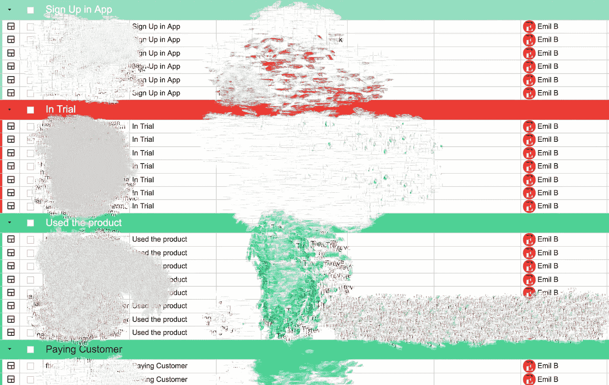

# 我如何将试用转化为客户

> 原文：<https://medium.com/hackernoon/how-i-convert-trials-to-customers-99a079af34f3>

## 我的创业之旅

## 第 5 周—回顾

点击这里阅读上周的文章。

**在这个系列中，我会努力让我的产品盈利。**
在这里阅读这个系列的第一部分:[我所学到的建造 SaaS](https://hackernoon.com/what-i-learnt-building-a-saas-e02dd3318cf5) 。
这是我的产品:[找更好的问题](https://findbetterquestions.com/)。点击阅读我的整个旅程[。](/@emilbruckner)

我想多谈一点关于个人客户的问题，但如果我单独问他们是否可以在这里写他们，会很痛苦，而且我尊重他们的隐私。但我可以给你看匿名数据。

这是我的客户关系管理:

让我来解释这些阶段:

*   在 App 中注册:
    他们下载了应用程序并注册
*   他们开始了试验。自从我把试用改为不需要信用卡后，几乎每个人都转换到了这个阶段。将来我可能还会恢复这个。但是现在，我希望尽可能多的人尝试[找到更好的问题](https://findbetterquestions.com/)。
*   使用过的产品:
    人们一创建列表就被这样标记，这是你创建账户后可以做的第一件事，也是唯一一件事。
*   付款客户:
    这个我就不用解释了。

几乎没有客户，这是一种痛苦，但更糟糕的是，有 10 多人下载了该应用程序，但从未实际使用过。我想知道那怎么会发生。他们下载 50MB+，却不用 app？这需要改进。

# 如何让人们使用[找到更好的问题](https://findbetterquestions.com/)

以下是我迄今为止为改善这种情况所做的事情:

*   问他们为什么不用这个东西。即使他们没有回答，那也是很好的反馈。他们就是不感兴趣。
*   我修复了一个 bug。
    这很尴尬。有一个错误不允许你创建列表。两个人成为了受害者。他们至今没有回来:(我猜他们删除了应用程序。很难让他们再次下载。
*   稍微改进一下入职培训。我只是稍微修改了一下文字。

我认为我正走在让人们真正使用它的正确道路上。如果这种情况继续下去，我将不得不做出更大的改变。

# 这周我还做了什么？

*   在[https://findbetterquestions.com/](https://findbetterquestions.com/)完成新动画
*   回答了两个 Quora 问题:
    1: [有哪些伟大营销的例子？](https://www.quora.com/What-are-some-examples-of-great-marketing/answer/Emil-Bruckner)
    2: [为什么创业被认为是孤独的旅程？](https://www.quora.com/Why-is-entrepreneurship-considered-a-lonely-journey/answer/Emil-Bruckner)
*   我发了几封冷冰冰的邮件。我报名参加了 [Bluetick.io](https://bluetick.io/) 。到目前为止我喜欢它。
*   多写几封电子邮件。

这一次就差不多了。

[←第四周](/@EmilBruckner/dont-let-urgency-ruin-your-plans-5685d05e0ad1)
→第六周:本周末来临。确保[跟着我](/@emilbruckner)👋