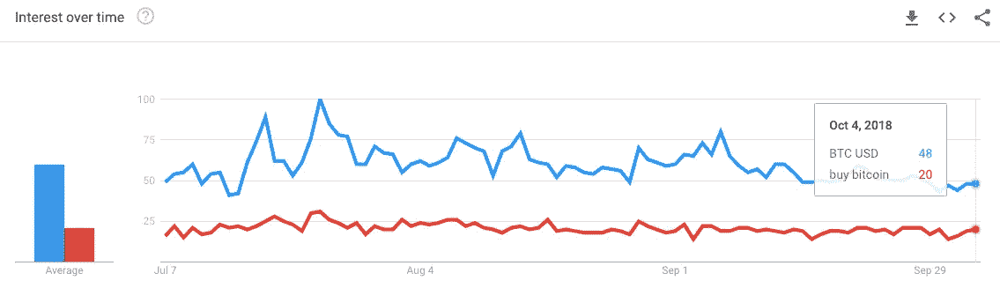
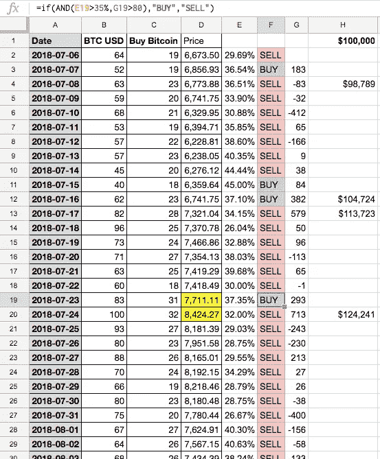
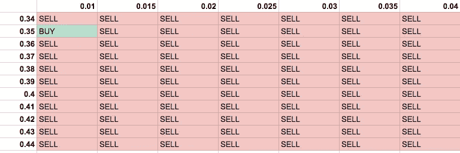

# 我如何使用情绪分析创建了一个回报率为 29%的比特币交易算法

> 原文：<https://medium.com/hackernoon/how-i-created-a-bitcoin-trading-algorithm-with-a-29-return-rate-using-sentiment-analysis-b0db0e777f4>

***TL；DR:我已经创建了一个公式，根据每日交易所价格数据和谷歌趋势关键词情绪来预测你是否应该购买或出售比特币。该模型在 90 天内产生了 29%的回报率，利润为 28，839 美元。***

比特币(BTC)价格可以预测到什么程度？如果来自[谷歌趋势](https://trends.google.com/trends)的公开数据可以帮助预测价格波动会怎样？

换句话说，我们能可靠地建立一个能跑赢市场的公式吗？这些是我寻求答案的问题。我的目标是试图弄清楚一个高度波动、令人恐慌且似乎不可预测的加密货币市场。

有很多交易者相信技术分析，其他人更相信基本面分析。事实是，没有神奇的交易策略总是跑赢市场。有太多的变量，即使是最好的基于人工智能的交易算法也无法持续获利。

今天的公式是非常基本的，我的意图是以它的原始形式呈现，并就如何使它变得更好征求反馈。**这是一个正在进行的工作，并不简单，所以请自担风险使用。**

> 事实是，没有神奇的交易策略总是跑赢市场。

# 公式

我一直在测试一个公式，我认为这是一个相对一致的 BTC 价格表现指标。具体来说，我能够用 100，000 美元作为初始投资，在 90 天内获得 29%的利润。请注意，这还没有考虑交易所交易费用，我希望像[分散交易所这样的解决方案有一天会消除](/@marcbegins/who-will-run-the-decentralized-exchange-of-the-future-59e9cd29b1ba)。

我的模型受到了 Willy Woo 最初工作的启发，他最初用谷歌趋势数据作为活跃的比特币价格检查的代理。

**以下是我使用的流程:**

1.  我在最近 90 天的谷歌趋势中搜索了“BTC 美元”和“购买比特币”:

2.我注意到，当“BTC 美元”与“购买比特币”的比率小于约 3:1 时(具体来说是<35%) at the BTC price “close” for the day, the following day’s close price *增加*)。如果比率大于 3:1(特别是 35%)(即 4:1 或 5:1)，那么这是卖出的信号，因为第二天的价格*下降*。

3.接下来，我测试了当 BTC 价差比前一天收盘价高出 80 美元时，这使得模式更加一致。$80 是在该数据集中表现良好的任意值。这是一张截图:

**BTC 美元**:直接来自谷歌趋势的每日指标。

**购买比特币**:直接来自 Google Trends 的日线指标。

**价格**:当日收盘币市值价格。

**E 列**:“购买比特币”/“BTC 美元”比率

**F 列**:买入/卖出决策公式。例如，下面是单元格 F20 的公式:
**=if(AND(E20 > 35%，G20 > 80)，“买入”，“卖出”)。**请注意，“35%”是价格高于“80 美元”时的购买门槛。

**G 列**:比特币与前一天收盘时的差价。

**H 列**:基于 2018 年 7 月 7 日 100，000 美元初始投资的累计总额(首次购买)。

# 模型的结果和后续步骤

因此，在我的模型中，90 天内，10 万美元的投资变成了*128，839 美元*—*几乎 29%的回报*。但这远远不是一个优化的模型，有几件事我想优化。

“> 35%”和“> 80 美元”是相当武断的，基于在这个有限的 90 天数据集中的工作原理。有没有更好的公式可以产生更好的买入/卖出信号？

这些变量似乎在给定的 6k-8k BTC 价格水平上起作用。我想测试过去一两年的更多历史数据。该模型将使用一个数组(~ 3:1 –~ 5:1)来比较来自买入/卖出信号的总收益，而“80 美元”将改为每日 BTC 价格的一个固定百分比*,这样它就可以解释主要的价格飙升。例如，也许最优模型最终是日价格波动为 0.014543229 时的 3.23–1 比率。*

*变量输入矩阵看起来像这样:*

**

# *如果你是数据专家，让我们来谈谈*

*换句话说，我想设置一个测试来找到最佳变量，以插入给定数据集的最大利润。这将涉及对过去价格和情绪数据的回归测试。我的假设是，不同的价格水平存在最优变量。*

*我目前正在测试这种算法的“v2 ”,并希望与任何拥有 R 或 Python 印章的数据大师合作，运行完整的回归和目标搜索脚本来优化算法。请随时给我留言或私信，我会和你保持联系。*

*去月球！🌕*

** * * * * * * * * * * * * * * * * * * * * * * * * * * * * * * * * * * * * * *
**更新**:由于一些优秀的社区反馈和一些有趣的新模式，我会用我的 v2 版本做一个后续系列。如果你想成为第一个看到我的新配方的人，请跟我来。*