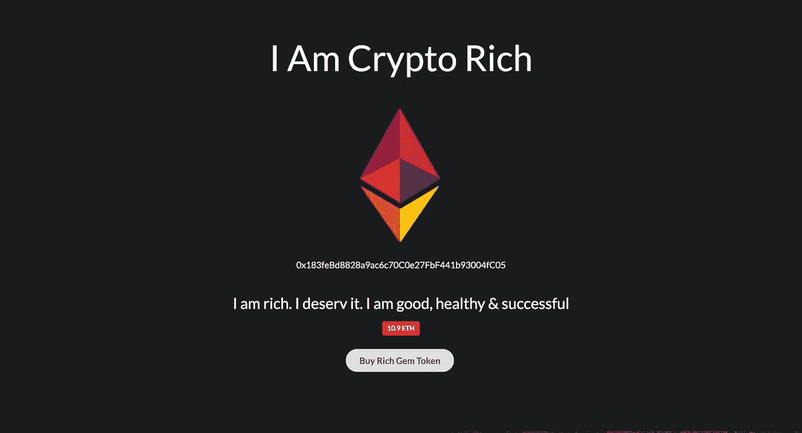
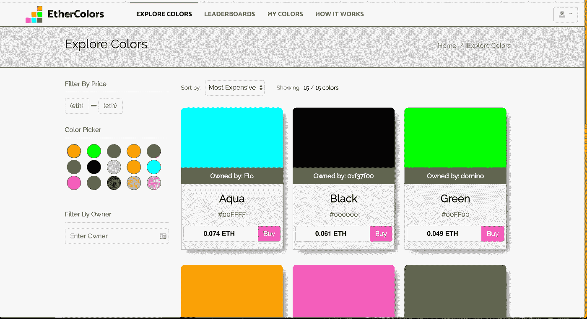

# 我如何结束购买蓝色:烫手山芋游戏第一部分

> 原文：<https://medium.com/hackernoon/how-i-ended-up-buying-the-color-blue-part-1-on-hot-potato-games-bc6b486cc862>

最近，我偶然发现了烫手山芋游戏的想法，这是一种隐藏的现象，是整个市场的良好代表。烫手山芋游戏本质上是一个游戏化的庞氏骗局。游戏过程如下:

*   有人创建了一个网站，并派生出另一个应用程序，或者在极少数情况下编写自己的代码，并将其命名为:HotPonzi.io(不是一个真正的网站，因为我肯定不会在这里做任何广告)。
*   HotPonzi 选择了一种资产来出售，比如说，土豆的图片。
*   然后 HotPonzi 大肆宣传“酷的新游戏，每个人都赢”
*   每项资产的起始价格都是固定的，比如说 1 美元，土豆合约中有一个公式规定了价格可以上涨的每一步。
*   约翰尼土豆然后以 1 美元购买“完美土豆”并拥有资产。任何人都可以以 2 美元的价格购买“完美土豆”, Johnny 在扣除 HotPonzi 的提成后获得利润。
*   “完美土豆”不断地从以前的主人那里被购买，每个人都从中获利，直到没有人愿意购买“完美土豆”

A Hot Potato with a single asset

## **庞氏游戏**

因此，我们有了一个庞氏骗局和一个完美结合的游戏。对于任何人来说，这都是一项有趣的投资，只要他能在这些资产不再被购买并因此变得毫无用处之前跟风就可以了。不久前我开始关注这些，并通过购买蓝色参加了 [*以太色彩*](https://ethercolors.com/colors) 。再说一遍，这不是该网站的广告，实际上恰恰相反。Ethercolors 是一个很好的例子，说明了一个网站在它应该存在之前就已经存在了。它不像大多数烫手山芋所允许的那样，将价格上涨的利润给予所有者，而是提供微薄的 10%的奖金(是的，我有点酸)，同时允许当有人用你的颜色绘画时获得利润，即使没有证据表明任何功能允许这样做。一个月后，终于有人从我这里买走了蓝色，我松了一口气，我可以不再担心我会永远拥有一张蓝色的照片。

Ethercolors home page

现在，没有什么是真正的“骗局”，因为很明显，如果你看得足够近，这是一个庞氏骗局。问题是大多数人不是，有些是真正的骗局。其中一个骗局 cryptoallstars 被一位关心此事的公民举报并漂亮地重定向，他买下了这个网站，以确保没有其他人赔钱，因为[http://cryptoallstars.co/](http://cryptoallstars.co/)现在重定向到博客帖子，指出这个游戏是一个骗局，以及他们为什么购买它来止血。

## **新的经济可能性**

现在，烫手山芋是一个有趣的发展，因为它们是一个在现实世界中不起作用的经济引擎，对于资产的交易和拍卖来说，可能是一个有趣的过程。烫手山芋智能合约允许这种非常规的资产所有权，其中令牌可以通过简单的合约调用来窃取。

它是区块链应用程序中拍卖的一种替代方式，因为它通过向每个投标人返还利润来克服交易成本。然而，这只有在添加了允许用户退出游戏的机制，从而从拍卖的任何物品中获得效用时才有效。随着基于代币的新经济模式的建立，代币组学已经占据了中心位置，随着区块链技术和利用它的企业的成熟，代币组学将继续发展。

Another example of a Hot Potato game, [Crypto Masterpieces](https://www.cryptomasterpieces.com/)

这是关于烫手山芋游戏的两部分系列的第 1 部分，所以请继续关注，下次我将回顾一位同事在许多烫手山芋游戏中发现的漏洞(不是赚钱的漏洞，但仍然很有趣)。