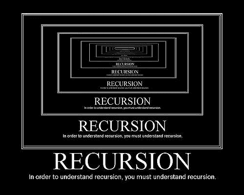
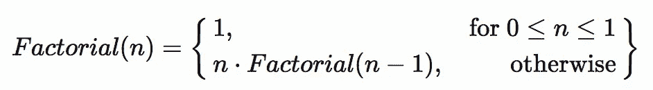

# 我是如何理解递归的，或者说递归解决了一切

> 原文：<https://medium.com/hackernoon/how-i-figured-out-recursion-or-recursion-solves-everything-9eaa9f7a1b20>



*NB。在这个* [*系列*](https://danplisetsky.github.io/tag/?how-i-figured-out) *中，我将讲述我一直在纠结的编程概念，直到有一天，它突然出现。读者，我希望它也能吸引你。关注我* [*中*](/@danielplisetsky) *或者订阅我的*[*RSS*](https://danplisetsky.github.io/feed.xml)*了解更多。*

# 什么

我认为我花了太多时间去理解递归的原因是我没有找到正确的方法去思考它，去概念化它。这里有几个想法帮助我把递归从一个我不敢使用甚至不敢看的东西变成了我今天最有价值的工具之一。

# 我

想象你要去跑道跑步，你想跑完 20 圈。你可以说，

*   “为了跑 20 圈，我会从只跑一圈开始。然后我会再跑一圈，再跑一圈，以此类推，直到我跑完 20 圈。”

或者你可以说，

*   “为了跑 20 圈，我只需要跑 19 圈，然后再跑一圈。我怎么会跑完 19 圈？我会跑 18 圈，然后再跑一圈。诸如此类。我怎么知道我什么时候结束了？当我在零的时候——没有更多的圈了。”

这就是迭代地和递归地考虑过程的区别。后者的要点是将最初的问题简化为一个更小的问题，然后再将其简化为一个更小的问题，直到达到所谓的**‘基本情况’**，这意味着没有什么可再简化的了。

# 二

另一个想法与递归无关，但它对帮助我们理解它非常有价值。它叫做**替代模型**。这就是我们要做的去解开错综复杂的…

# 罗马数字 3

递归定义函数中的递归过程和迭代过程。很重的东西，对吧？我们马上来看几个例子。

# 怎么

第一，替代模型。这里有两个简单的函数。一个函数接受两个数并返回它们的和。另一个是取一个数，然后平方它(所有的代码示例都在 JavaScript 中)。

现在，假设我们要将 3 和 4 这两个数字相加，并对结果求平方。

```
square(add(3, 4))
```

我不知道你怎么想，但对我来说这已经有点复杂了。因此，让我们用函数的参数代替它们各自的形参，看看发生了什么。以下是我们得到的结果:

```
square(add(3, 4))⬇⬇⬇⬇⬇⬇⬇⬇⬇square(3+4)⬇⬇⬇⬇⬇⬇⬇⬇⬇square(7)⬇⬇⬇⬇⬇⬇⬇⬇⬇7 * 7⬇⬇⬇⬇⬇⬇⬇⬇⬇49
```

顺便说一句，我强烈建议在纸上这样做。事实上，我要说的是，一般来说，在纸上写出代码，尤其是对于像本例这样高度专业化的功能，是非常有益的，但也许这只是我的看法。反正我跑题了。

关键是，我们在上面所做的是，我们一步一步地用相应函数的主体替换每个函数调用。

最重要的一点是，如果运行时以不同的方式评估我们的代码，这并不重要。我们只关心结果。

嗯，不完全是这样。我们刚刚看到的替换适用于严格评估的语言——JavaScript 就是其中之一。这里我们不打算深入讨论惰性求值，惰性求值是表达式求值的另一种方式，但是为了显示区别，下面是惰性求值的替换模型的样子:

```
square(add(3, 4))⬇⬇⬇⬇⬇⬇⬇⬇⬇ add(3,4) * add(3,4)⬇⬇⬇⬇⬇⬇⬇⬇⬇ (3+4) * (3+4) ⬇⬇⬇⬇⬇⬇⬇⬇⬇ 7 * 7⬇⬇⬇⬇⬇⬇⬇⬇⬇49
```

在这种情况下，结果是一样的。我们现在将坚持使用严格评估的替代模型。

现在我们准备处理递归。回想一下，在跑步圈的例子中，我们实际上是在倒计时——跑 20 圈就是跑 19 圈(再跑一圈),也就是跑 18 圈(再跑一圈)等等。*无限期？不完全是。在某些时候，我们想停下来。在这里，我们将停在零——我们不能跑少于零圈。现在让我们将同样的思想应用于定义计算阶乘的函数的问题。*

整数的阶乘是该整数和它下面所有整数的乘积。例如，四的阶乘是 4 * 3 * 2 * 1 = 24。看到递归了吗？

让我们正式定义它:



定义是，如果阶乘函数的输入是 0 或 1，则答案是 1。如果不是，答案是输入乘以阶乘函数应用于输入减去 1 的结果。抛弃一切思想，马上编码！

那很容易。它实际上自己编码了。

现在让我们代入。

```
factorial(4)
// is 4 equal to 0 or 1? Nah. Hence, we'll go with the second option:⬇⬇⬇⬇⬇⬇⬇⬇⬇4 * factorial(3)
// Now we evaluate factorial(3). Is 3 equal to 0 or 1? Nope ⬇⬇⬇⬇⬇⬇⬇⬇⬇ 4 * (3 * factorial(2))
// I add the parentheses here to illustrate that the code inside them is going to be evaluated first.
// We'll see the significance of it soon. In the meantime, 2 is still not 1\. Or 0, for that matter⬇⬇⬇⬇⬇⬇⬇⬇⬇4 * (3 * (2 * factorial(1)))
// Finally, we've reached -- you got it -- the base case. As per definition, we humbly return 1⬇⬇⬇⬇⬇⬇⬇⬇⬇4 * (3 * (2 * 1))⬇⬇⬇⬇⬇⬇⬇⬇⬇4 * (3 * 2)⬇⬇⬇⬇⬇⬇⬇⬇⬇4 * 6⬇⬇⬇⬇⬇⬇⬇⬇⬇24
```

事情是这样的。我们从尝试评估`factorial(4)`开始。我们有两个选择:如果输入是 0 或 1，立即计算为 1。否则，我们将输入放入堆栈——也就是说，我们*记住*输入——在本例中为 4——将在稍后相乘，这是我们返回最终结果之前的最后一步*。我认为，这一部分对于理解递归至关重要。再一次，把整个评估过程写在纸上让我非常清楚。*

好了，我们记住了“4 次某事”这部分。接下来呢？正在评估`factorial(3)`。想象一下，我们从`factorial(3)`开始，在那之前什么都没有。结果会怎样？三倍左右。什么是东西？`factorial(2)`，反过来评估为‘2 倍的东西’。

现在，这一次，某物——`factorial(1)`——实际上评估为我们可以立即说是有形结果的东西——数字 1(因为条件是，返回 1 是输入是 0 或 1)。

```
factorial(4)
4 * factorial(3)
    3 * factorial(2)
        2 * factorial(1))
            1
```

最酷的部分来了:我们开始*记住！也就是说，我们开始向上堆栈，逐个评估“X 乘以某物”表达式。我们用 1 替换上面表示中的`factorial(1)`,并对其求值:2 * 1 = 2。太好了，这个 2 现在是`factorial(2)`的结果，我们可以在下一个表达式中代入，3 * `factorial(2)`，结果就是 3 * 2 = 6。还剩最后一步:4 * `factorial(3)` ➡ 4 * 6 = 24。这就是我们的答案，也是`factorial(4)`将会回报的。*

这就是递归的全部内容。将最初的问题(`factorial(4)`)减少到一个更小的问题(`factorial(3)`)，再减少到一个更小的问题(`factorial(2)`)和一个更小的问题(`factorial(1)`)，直到没有什么可减少的了。正如您从阶乘的正式定义中看到的，它甚至可以很自然地翻译成代码。

不过，你没发现少了点什么吗？让我们再来看看`factorial(4)`是如何被评估的(或者，更贴切一点，它生成了什么样的*流程*)。

```
factorial(4)
4 * factorial(3)
4 * (3 * factorial(2))
4 * (3 * (2 * factorial(1)))
4 * (3 * (2 * 1))
4 * (3 * 2)
4 * 6
24
```

看到它是如何扩张到基本情况，然后开始收缩的吗？这是因为对`factorial(4)`的调用不等于对`factorial(3)`的调用，我们需要一种方法来跟踪它。这就是 stack 的用途:它记录了我们调用阶乘函数的顺序，这样我们就知道在到达基本情况后该做什么。有什么条件？它会消耗内存，而且栈的大小也不是无限的。

有没有另一种方法可以定义阶乘函数，这样我们就不用关心栈的大小了？确实有。

正如您所看到的，差别是细微的，但就我们定义的这两个阶乘函数将要生成的过程类型而言，差别是显著的(您可能已经从名字中猜到了)。

第二个函数`factorialIter`有两个参数，其中一个有默认值。它的名字`acc`，指的是这样一个事实，即这种解决问题的方式有时被称为“**累加器模式**，因为我们正在*累加*——把结果带在身边，直到该归还的时候。

好了，既然我们对这个函数要做什么有点困惑(不一样)，让我们直接跳到替换。

```
factorialIter(4)
// since we're only passing one argument, the second parameter, acc, // will take its default value, which is 1⬇⬇⬇⬇⬇⬇⬇⬇⬇factorialIter(3, 4) // 1 * 4 ➡ 4⬇⬇⬇⬇⬇⬇⬇⬇⬇factorialIter(2, 12) // 4 * 3 ➡ 12⬇⬇⬇⬇⬇⬇⬇⬇⬇factorialIter(1, 24)
// The base case is reached⬇⬇⬇⬇⬇⬇⬇⬇⬇24
```

和以前一样，我们从尝试评估`factorialIter(4)`开始。4 不等于 0 或 1，所以我们遵循第二条路径，这导致对我们的函数的另一个调用:`factorialIter(4 - 1, 1 * 4)` ➡ `factorialIter(3, 4)`。

我们重复几次，直到我们到达基本情况。`factorialIter(1, 24)`返回`acc`，为 24。

我们来看看`factorialIter`生成的流程。

```
factorialIter(4)
factorialIter(3, 4)
factorialIter(2, 12) 
factorialIter(1, 24)
24
```

没有膨胀，对吧？这是因为对函数的调用在堆栈上被替换了，因为它们实际上是等价的。调用`factorialIter(4)`与调用`factorialIter(3,4)`、`factorialIter(2, 12)`或`factorialIter(1, 24)`在某种意义上是相同的，它们都产生相同的值。

这就是迭代过程和递归过程的区别。即使这两个函数都是递归定义的——就其本身而言*——它们生成的过程也是非常不同的。实际上，如果一个函数在它的定义中最后一次调用它自己，它将产生一个迭代过程。`factorialIter`调用自己，这是它做的最后一件事(这样的函数叫做'**尾递归**')。*

另一方面，如果一个函数在它的定义中调用它自己，但这不是它做的最后一件事，它将产生一个递归过程。`factorial`的最后一个调用是对内置乘法函数而不是本身的调用。

# 为什么

如果你已经做到了这一步，你可能会问，“这个递归业务很酷，但是我真的需要搞清楚它吗？为什么不坚持通常的，疯狂的——明白吗？—做事的方式？”

这是一个公平的问题。即使没有递归，你也可能做得很好，但是一旦你掌握了它的窍门，你就不能放下它，可以这么说，仅仅是因为它的通用性。

让我们考虑一下数据结构。列表、哈希表、二叉树——所有这些不仅本身有用，而且是编码面试的主要内容。这是完全合理的——无论何时你想在你的代码中实现业务逻辑的某个部分，你将不可避免地使用数据结构。递归为你提供了一种处理它们的强大技术——它们中的任何一个。

我们将通过解决 FizzBuzz 问题来说明递归如何帮助我们对列表元素进行操作。内容如下(如丹尼尔·邦特所言):

> 写一个程序，打印从 1 到 100 的数字。如果是 3 的倍数，应该打印“Fizz”。如果是 5 的倍数，应该会打印“Buzz”。如果是 3 和 5 的倍数，应该会打印“Fizz Buzz”。

让我们试着立即从数据结构的角度来思考这个问题。我们实际上被要求做的是，给定一个从 1 到 100 的数字列表，根据一定的规则将它转换成一个字符串列表。我们需要:

*   列举清单
*   一个一个地变换它的元素
*   打印结果列表

想象一下，你正在面试，被要求解决 FizzBuzz 问题。你太紧张了，根本记不住任何基本的内置函数。看着上面的大纲，你可能会想到映射一个列表，但是你就是不记得怎么做了。高兴吧——你不必如此！你只需要递归。如题所示，它确实解决了(几乎)所有问题。

什么是列表映射？如果列表为空，则结果是相同的空列表。如果列表由一个元素组成，那么就是这个元素被转换并附加到一个空列表中。两个元素？这几乎就像一个元素的列表，然后一个又一个。你已经知道该怎么做了。

容易得很。现在到第二步:

第三:

我们还需要一种便捷的方式来生成初始列表。记住，内建整型方法已经从我们的记忆中消失了。但这不会阻止我们:

这就是了！剩下的就是将这些功能组合在一起:

```
print(map(fizzBuzz, range(100)));
```

最棒的是，该解决方案是可扩展的，并且有助于进一步的抽象。`map`函数可以用右折叠函数(JavaScript 中的`reduceRight`)来表示，`print`可以用`forEach`来表示。我们可以传递一个规则散列表，用字符串替换数字，而不是在`fizzBuzz`中检查取模。诸如此类。有各种各样的可能性，通过使用专门的函数和递归，我们最终得到优雅的和可重用的代码。

# 结论

在这个简短的概述中，还有很多想法没有被探索(事实上，帮助我理解递归和许多其他概念的书是[计算机程序的结构和解释](https://en.wikipedia.org/wiki/Structure_and_Interpretation_of_Computer_Programs)，我怎么推荐都不为过)。在我看来，最突出的是函数式编程的思想，它利用递归并促进函数的可重用性和专门化。我希望现在，有了递归的力量，您已经完全有能力更深入地钻研函数式编程和其他管理复杂性的技术，这才是软件开发的真正意义所在。

*原载于 2018 年 6 月 26 日*[*https://danplisetsky . github . io/2018/06/26/how-I-figured-recursion . html*](https://danplisetsky.github.io/2018/06/26/how-i-figured-out-recursion.html)*。*