# 我如何增长黑客我的机器人 10 倍更好的用户获取

> 原文：<https://medium.com/hackernoon/how-i-growth-hacked-my-bot-for-10x-better-user-acquisition-f13025af3ebc>

创业者最容易相信的神话之一是什么？“如果你有一个很棒的产品，它会自己卖出去的！”

对吗？！嗯，不尽然…
如果你试图将这种信念作为一种营销策略，你可能会发现自己正走向失败。这话不是我说的，而是彼得·泰尔，他是《[零比一](https://www.amazon.com/Zero-One-Notes-Startups-Future/dp/0804139296)》的作者，PayPal 的联合创始人之一，也是所谓的“PayPal 黑手党”的一员。

> *“不管你的产品有多强大——即使它很容易适应已经形成的习惯，任何尝试过的人都会立刻喜欢上它——你仍然必须有一个强大的分销计划来支持它”——彼得·泰尔*

那么，你会问 B2C 创业最大的挑战是什么？它在黑你的频道分布。你需要从第一天开始考虑这个问题！

*在本文中，我想与您分享我们作为“* [*Me*](http://m.me/mereminder) *”所做的事情，以推动我们产品的高速增长。我们如何设法让我们的聊天机器人出现在 Facebook Messenger 的发现标签中，但更重要的是，我们做了什么来保持它，并达到我们的第一个一百万用户。*

所以，来认识一下 [Me](http://m.me/mereminder) ，这是我们的终极提醒助手，由 [Tiv.ai](http://tiv.ai) 开发，旨在平衡我们日常的精神负担，帮助家庭变得比以往任何时候都更有组织、更有效率、更有联系。

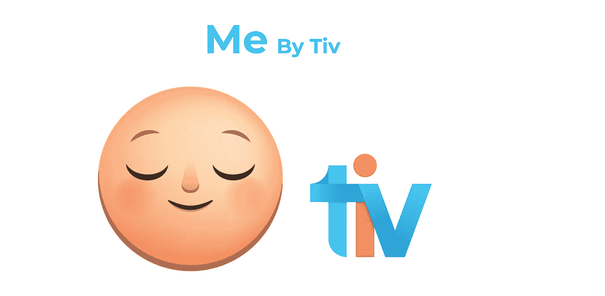

# 发现

发现是 bot 技术发展的主要挑战之一。消息机器人的快速扩散和消息平台的不断增加正在转化为生态系统的发现噩梦。[根据扩展的漫谈](https://expandedramblings.com/index.php/facebook-messenger-statistics/)，截至 2018 年 1 月，仅 Facebook Messenger 上就有超过 30 万个机器人。

回到“我”——在我们旅程的开始，我们也被我们伟大的产品会自我销售的神话迷住了！它做到了！所需要的只是简单的每周一次的方法和耐心([你可以在这里](https://medium.freecodecamp.org/how-my-app-grew-by-5-800-in-one-month-with-no-branding-or-marketing-d0bafb93108)了解更多)。然而，我们的增长仍然很低，即使人们在他们的博客中提到“我”，与朋友分享，我们甚至出现在[僵尸名单](https://botlist.co/collections/@dan/most-liked-chatbots-on-botlist)上，我们也没有经历我们希望的指数级增长。

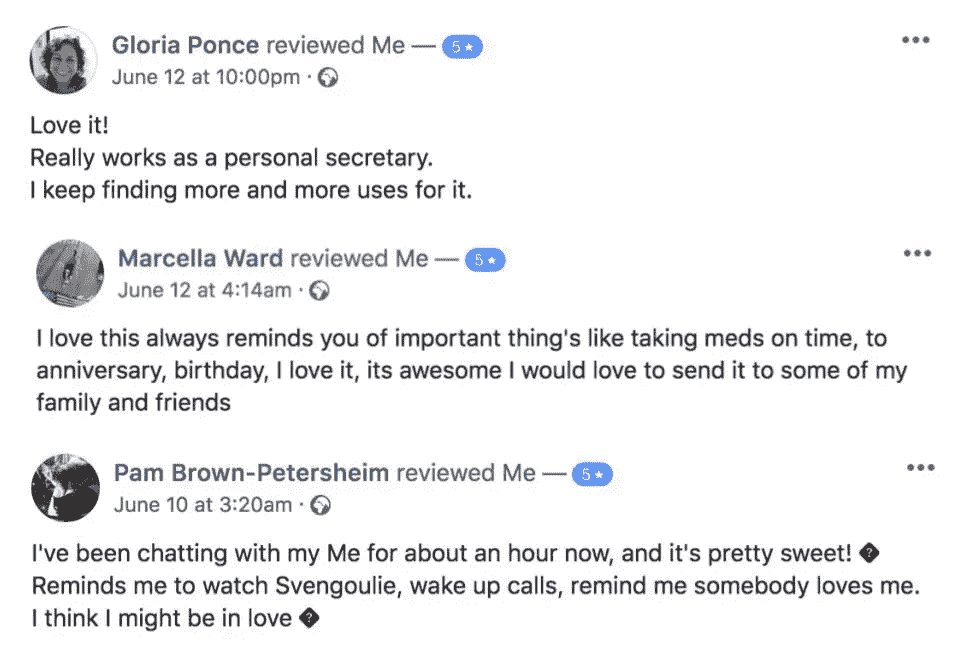

Screenshots of User’s reviews from Me’s Facebook page

# 用户获取

让我们先跳到底线——Me 正在为全球超过 100 万用户提供服务。我们是怎么做到的？作为一项公共服务，为了节省您的时间(和金钱)，这里有一些我们用来获得高的和可持续的牵引力的技术。

我们首先尝试的是有机营销。我们相信，如果我们成功做到这一点，我们将享受良好的营销。在我们发布了一些博客帖子后，我们发现每周一次的几十个新用户的高峰对我们来说并不好。因为我们每天都在发布版本，并且一直在检查，所以我们每天都需要大量的新用户来试用我们的产品。

后来我们想过尝试付费广告，但是当你选择这个渠道的时候，你需要有一个可持续的商业模式，所以客户终身价值(CLTV)应该是客户获取成本(CAC)的三倍。否则，你需要马上停止，否则你可能注定要失败。由于我们开发了一个基于 Facebook Messenger 的聊天机器人，使用付费收购策略并不是正确的方式，原因有一个:

> *“市场还没有准备好为机器人的微服务付费，所以付费获取新用户而不赚钱，最终会让你破产。”*

我们的第二个尝试是在我们的产品中建立一个内在的病毒机制，因此，随着现有用户采取的每个核心行动，新用户会发现你的产品。当你的产品具有天然的社会竞争力时，一种内在的成长就可能形成。我们以 [NearGroup](http://m.me/neargroup) 为例。

NearGroup 是一个约会机器人，它匹配用户(基于他们的偏好)&允许他们在不查看图像或个人资料的情况下开始聊天，很酷吧？！这个聊天机器人每月增加 80 万新用户。

我们的核心行动是设置提醒，用户创建的总提醒中有 10%是给其他人的。例如:“提醒约翰明天下午去接孩子。”这听起来很不错，但当查看用户创建的平均提醒并将其与用户在机器人中互动的人数进行交叉时，你会发现拯救不会来自这里。

最后的希望是发现标签。Discover 是人们可以浏览和找到信使机器人的地方。出现在任何应用程序或机器人商店可能是任何产品可能发生的最好的事情。这是获得用户的免费渠道，但更重要的是——获得他们对你产品的信任。

> “但是，要成为特色产品，你的产品不仅应该提供独特的价值主张，还应该超过 99%的市场份额。”

# 旧学校，新社区。

快速浏览 Discover 选项卡会发现每个列表中有多达 20 个机器人，其中 80%代表企业或大型科技公司。这些公司也是脸书的商业伙伴，这意味着他们在不久的将来不会去任何地方，留给我们的只有四个 bot 开发者的名额。

这是一个挑战！但是我们不是害怕好的挑战的人，我们决定拥抱它，尽我们所能去上榜。

在 2 个多月的时间里，我吃喝着“发现标签”——研究如何达到它，探索我们需要实现的 KPI，机器人在列表中停留多长时间，更重要的是——预期的结果是什么。

## 幸运的是，我在这个过程中学到了一些重要的东西:

1.  **成为特色是“容易”的部分，留在那里是真正的战斗:**
    每周你的机器人将在 Facebook Messenger 上与超过 30 万个机器人进行测试，你必须保持你的表现，并一直保持变得更好。
2.  排名前 3 将吸引 5K 新日活用户；前 10 名将吸引每日一报——3K，取决于地点，前 20 名将吸引数百人。(当然渗透率越高，遇到你的 bot 的用户就越多)。

在我们的探索期间，我们试图获得一些数据，如:良好的保留率和粘性率，推荐的会话数量和长度，谁开始对话有什么不同吗用户还是机器人？页面或机器人评论会影响排名吗？被阻止、删除或标记为垃圾邮件的对话会有什么不同吗？诸如此类。

可以想象，脸书不会提供答案。但是我们运气不错。神奇的是，我们发现“我”出现在生产力类别下(如果您向下滚动 Discover 选项卡，您将看到更多基于该主题的列表)。我们将此作为优势，并找出我们应该关注的 KPI。

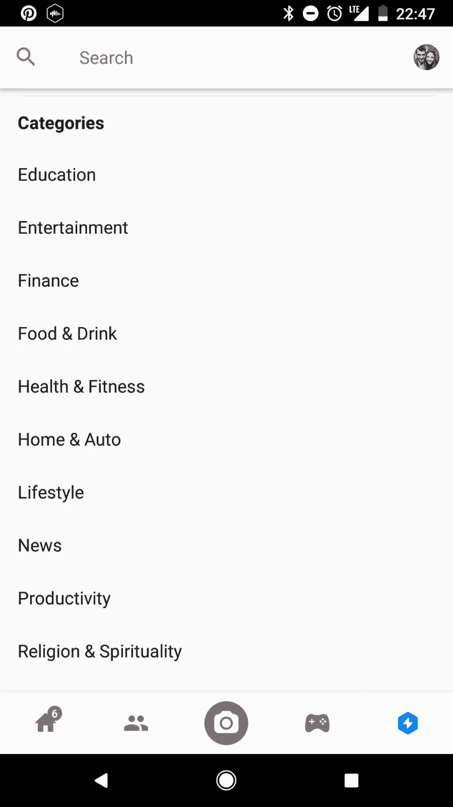

Discover Tab, Categories

# 征服生产力类别

我们的第一个目标是寻找生产力应用的基准。我们发布每日版本，不断改进产品，直到我们在竞争中有所改进。

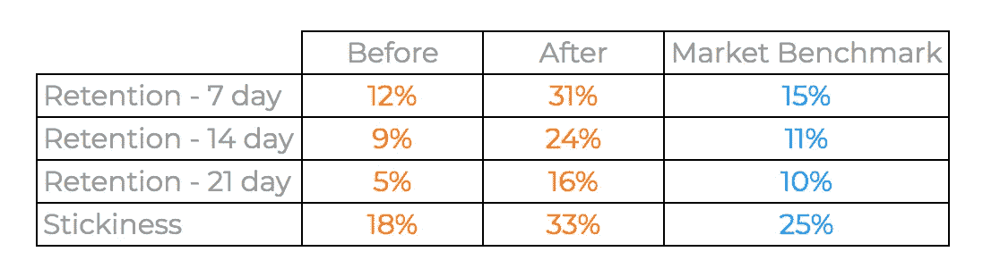

Sources: SimiliarWeb, Adjust.com & Appsflyer

由于该列表每周更新(具体来说是周五)，我们每周关注一个 KPI，并测试我们的排名是否有所提高。换句话说，如果特定的 KPI 影响了“发现”选项卡。过了一段时间，我们发现我们需要关注的相关 KPI 如下:

*   保留第 2 天、第 7 天和第 21 天
*   粘性(DaU/MaU)
*   会话长度

每个 KPI 都没有黄金数字，因为每周你都会与所有机器人进行比较，基于“可能最好的机器人会赢”的概念，我说的“最好”是指表现最好的机器人。

一旦“我”主导了生产力利基，我们决定是时候扩大规模，着眼于更大的目标，即发现选项卡上的特色列表。

# 转向跨国联盟

在我们发现我们需要关注什么，以及哪个 KPI 有所不同之后，扩大规模就变得更容易了。当你打开 Facebook Messenger 并点击 Discover 选项卡时，你首先看到的是全球排名前三的机器人，这是圣杯。要做到这一点，你不仅需要进入精选名单，而且要在前三名。

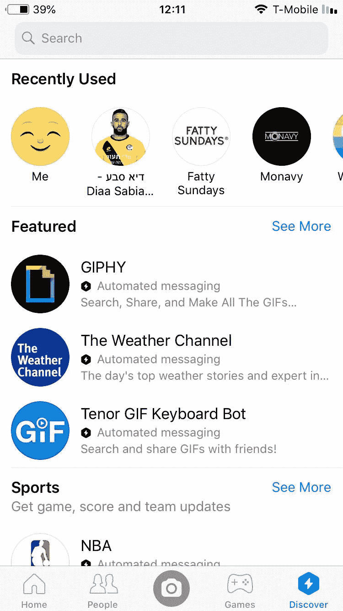

这是我们的下一个任务——我们不知道什么是好的指标，所以，我们求助于神奇的机器人社区，多亏了他们，我们才在几天内完成了这项工作。我被要求不要暴露我们的发现，但我可以与你分享那里的方法:

1.  阅读每一篇关于成功机器人的博客文章并收集数据
2.  我联系了机器人开发者，请他们分享一些信息。
3.  为建议“竞争智能”功能的分析平台付费。这些特性可以帮助你了解你的产品相对于其他产品有多好。

两个星期后，我意识到我们需要实现什么，并开始致力于这些指标，直到我们完成 KPI。

重要的一点是，当我们第一次改进我们的 KPI 时，我们已经被列入生产力类别，但第二次就不同了。我们不能只要求被特别报道。首先，因为我们需要通过脸书的整个过程，其次，我们不想浪费我们唯一的机会。根据我的研究，“普通”机器人在特色标签上的时间不会超过两周，我们不想错过这一点。

# 提交并获得特色

要成为特色，你需要一个脸书的合作伙伴将提交你的机器人进行审查。你可能会想什么是脸书合作伙伴，我如何联系他们？作为一名企业家，我学到的最重要的一课就是迈出第一步，说出我想说的话。

在我给每一个可能帮助我的人发了信息之后，一个脸书的员工听说了我们，并把我介绍给了一个脸书的合伙人。我们很快给她发了一封背景邮件，解释了为什么我对人们来说是必不可少的，以及它如何积极地影响他们的生活，还有我们的一些关键绩效指标。

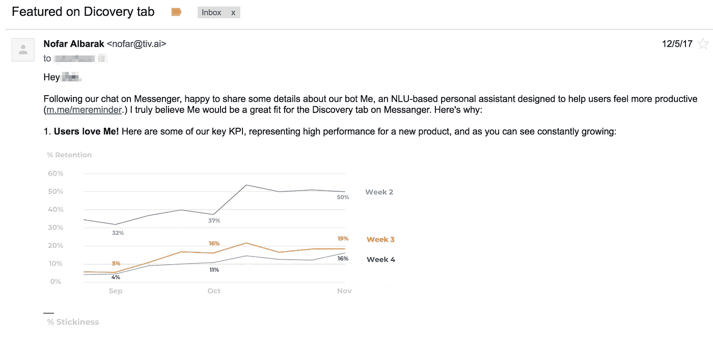

## 让我们来分解这个过程:

1.  提交您的 bot 供特定国家/地区审查—他们会审查所有潜在 bot 的平台采用情况、政策合规性、用户体验和使用案例。我强烈建议你在提交你的机器人之前仔细阅读一下[信使机器人最佳实践](https://developers.facebook.com/docs/messenger-platform/introduction/general-best-practices)。这一步通常需要一个月的时间，你想从中获得最大的收益。

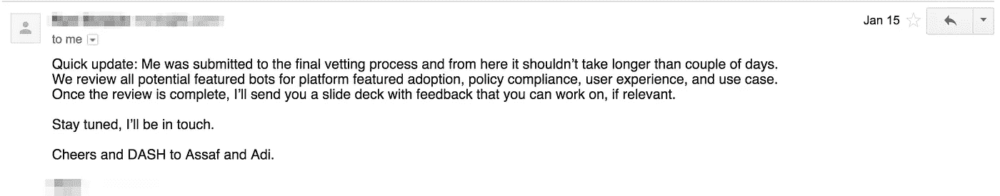

2.评估完成后，您会收到一张幻灯片，上面有相关的反馈，您可以根据反馈进行处理。

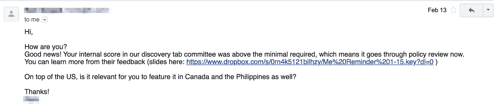

3.[政策审查](https://developers.facebook.com/docs/messenger-platform/policy/policy-overview)——基本上他们是在确保你的机器人符合信使平台的消息传递政策。这一步通常需要一周时间。

2 月 16 日，《我》在美国和菲律宾上线，首周排名第 22 位。

还记得脸书每周都会修改名单吗？一周后，我们达到了第 8 名，在第 3 周我们征服了前 3 名！！！

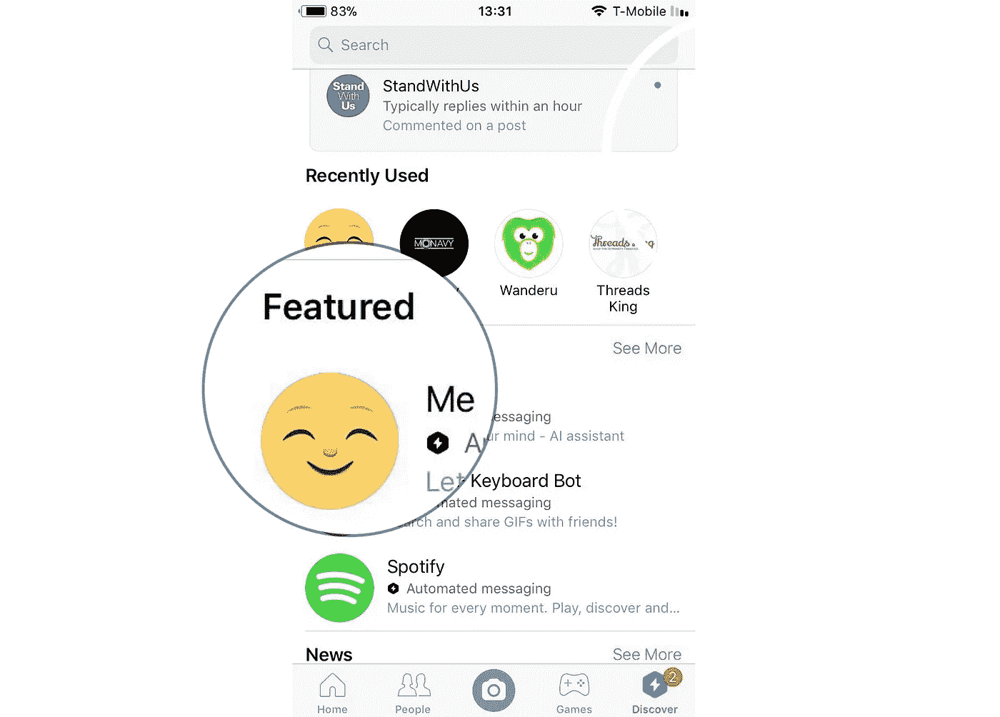

自推出以来，“Me”已经处理了超过 2 亿条消息，帮助了全球超过 100 万名用户，并成为脸书 Messenger 在美国、加拿大和菲律宾最受欢迎的生产力机器人。

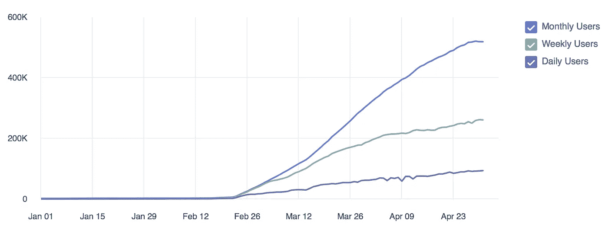

User Activity from Jan 01 to May 01

我希望你喜欢阅读这篇文章。

**如有任何问题，请在下面的回复部分提问**。**还有，可以随意查看我们的 bot**[**Me**](http://m.me/mereminder)**。**

# 👏👏别忘了鼓掌👏👏

如果你喜欢这首曲子，请鼓掌吧👏🏻(可以不止一次鼓掌)！你也可以在网上的某个地方分享，这样其他人也可以阅读。

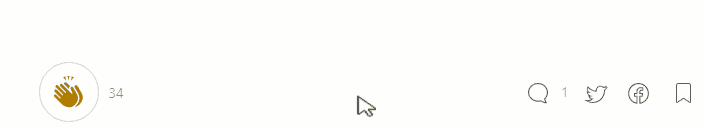