# 我如何黑了一个新闻频道来报道假新闻。

> 原文：<https://medium.com/hackernoon/how-i-hacked-a-news-channel-to-report-fake-news-aa2f4b4f5b95>

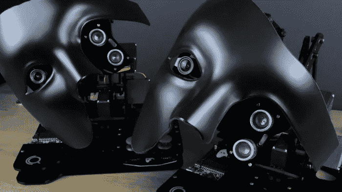

我们生活在一个技术高度活跃的时代，每 20 秒钟就有创新和创造冲击你的推特。

在这一点上，事情进展得如此之快；普通消费者很难跟上什么是真实的，什么完全是科幻小说。科幻小说的创作武器库中只剩下几件武器了，时间旅行，太空旅行等等，这些都是我们还没有发明的，因为全息图现在已经存在了。

我想和你们分享一个关于技术和欺骗的故事，但最终是一个社会工程师的 pshycy，一个利用社会缺陷的人，通过编织迷宫来欺骗人们以获得他们自己的“娱乐”。

## 怎么开始的

一个庞大的全球新闻网络上的人联系了我，问我是否有他们可以报道的材料。作为一名最近在网上被视为美国“技术魔术师”的魔术师，他们正在为他们的技术更新秀寻找一些前沿和主题。

对我来说，这是一个表演稳定的、排练好的舞蹈并融入一点技术的机会。

# 但我有一个更邪恶的，更具操纵性的计划。

我想创造一个人工智能，它可以读取人们的思想。

作为读心术者，提出这个想法很容易，因为从理论上讲，除了已经知道如何读心术的人之外，还有谁能教机器读心术。

> 如果我能充分证明我能读懂你的想法，那么期待我能教会一个足够强大的人工智能做同样的事情，如果不是更好的话，这是相当符合逻辑的，特别是如果我引用一些谷歌 DeepMind 或 AlphaGo 的文章。

像任何好的魔术一样，真正的欺骗在于故事，用花哨的噱头和令人信服的模式转移观众的注意力，欺骗他们认为正在发生的是魔术，而不是把戏。

## 构建“人工智能”

第一步是创造一些能和我的观众说话的东西，给整个表演一个人的元素。我以前玩过 Alexa，但这次我必须学习如何编程定制亚马逊 Alexa 技能。这将允许我为 Alexa 创建我的语音模式，并使用任何我想要的外部资源来控制它，我的手表，声音，甚至改变我在命令中使用的单词都可以向 Alexa 发送信号；这可能是隐藏的信号，告诉 Alexa 我希望它根据下面的模型说什么。

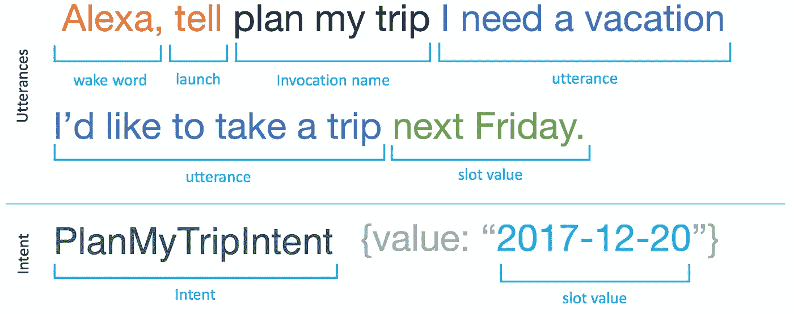

它们非常不可思议，你可以使用任何调用名称来打开你的定制应用，然后任何话语单词作为第一层，你可以将内联“插槽”应用于你的命令，为不同的代码片段提供无限的触发。

> 亚历克莎，让你的头脑告诉我他们在想什么
> 
> Alexa 让你的大脑用人工智能来读取这个人的大脑。

那就是**一个 app** ，运行**两个**不同的程序。

> Alexa 让你的人工智能引擎用人工智能读取这个人的想法。

那是一个不同的应用程序，运行一个**完全不同的**程序。

我在这里试图展示的是，问同一个问题有 100 种方式，每种方式都可以触发不同的信号给 Alexa，它将运行一段单独的代码。

这种方法意味着我可以亲自读取一些人的想法，然后告诉 Alexa 他们有什么卡，Alexa 就会读出它。

> 简单。

普通消费者完全意识不到这一点；事实上，我为许多主要科技公司的首席网络安全官(CCO)执行了这项任务，他们直接与政府官员联系，他们也不知道发生了什么。你会惊讶地发现，技术界有多少人对我们每天视为理所当然的一些低端消费技术产品的范围一无所知。

这是我欺骗的输出部分。

但对黑客来说太无聊了。

我需要想出如何告诉 Alexa 这个人目前在想什么卡(不要先发信号)。更重要的是，我需要找到一种方法，使用真正的魔法，找出这个人在想什么牌？

有很多魔术可以让我偷看别人正在看的牌，或者强迫他们选一张牌，但是我不想参与这个程序，也可以选择重复多次，这必须骗过最大的怀疑者。

## 电子卡 NFC 读卡器

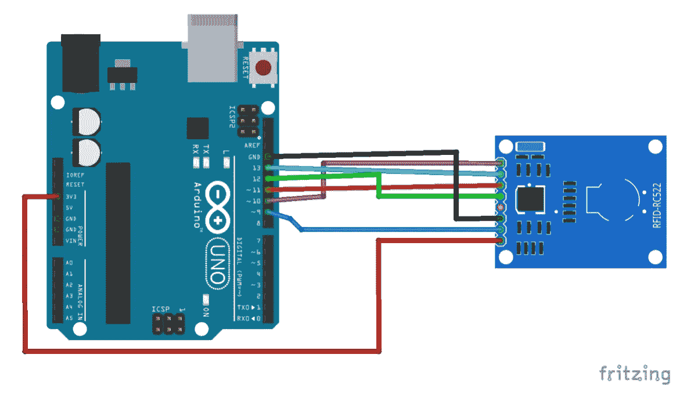

我用一个 Arduino Uno 和一个简单的 RFID 阅读器做了一个 NFC 阅读器，价格不超过 30 美元。在此之前，我没有做过任何电子产品，也许是高中时的几个发光二极管和电阻，但仅此而已。我被 Arduino 的易用性震惊了，我看了一些教程，并从 Arduino CC 库中取了一些代码。

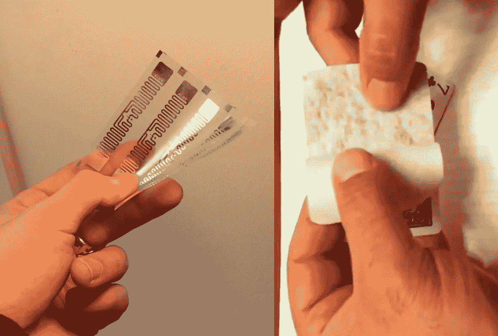

然后，我将 RFID 芯片放在每张扑克牌的两层纸之间。这些东西是完全不可探测的，可以存储无尽的数据。我不需要这些，我只是使用了存储在芯片上的唯一 id，创建了一个 json 对象并将它们与扑克牌配对。结果是 52 张纸做的 RFID 扑克牌。

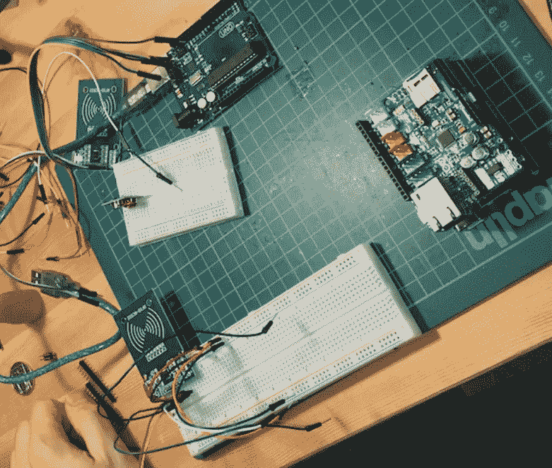

这很有效，你可以让观众把卡放在桌子上，把 RFID 阅读器藏在桌子下面，然后 RFID 阅读器会通过互联网把卡发送到我的节点服务器。当你问 Alexa 这是什么牌时，它会在 Lambda 上运行一个脚本，查询存储当前扑克牌的 JSON 对象的节点服务器，然后 Alexa 会逐字读出文本。

我发现最酷的部分，Alexa 可以读出存储在 NFC 芯片上的文本。这一切都发生在几个 100 毫秒内。

对于**《连线》杂志**、[来说，这已经足够酷了，他们写了我在这次黑客攻击中的表现。](https://www.wired.co.uk/article/tom-london-magic-thomas-webb-hacker-ibm-samsung-microsoft)

(自从派拉蒙重拍了**意大利的工作，**赛斯·格林的角色声称自己是“真正的**纳普斯特**”，并登上了封面，我就想加入《连线》了。lol)

遗憾的是，这仍然不够好，NFC 阅读器的范围是 10-20 厘米，谁愿意为此在桌子上放一张卡呢？如果魔术师必须向观众传递一套规则，那么他已经在带领他们穿过迷宫了。

> 我不想做迷宫，我想做矩阵。

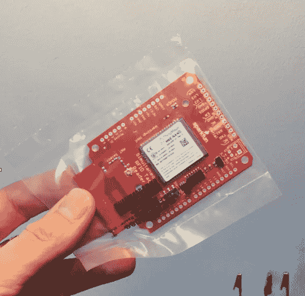

300 美元，5 天后，Sparkfun 把这个坏小子送给了我。是 M6e 同步读卡器。它可以读取多个超高频 RFID 芯片，从他们告诉我，当与天线一起使用时，有 10 米的范围。

嘣。

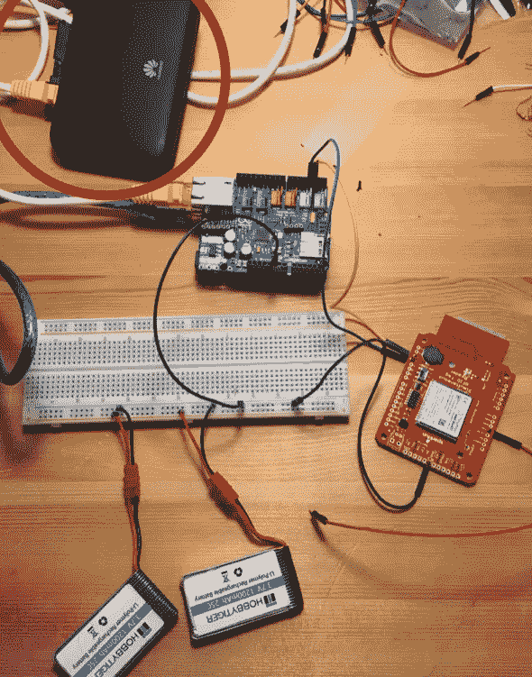

我将 Arduino 连接到一个以太网屏蔽上，并将其插入 wi-fi 热点，使其可以移动。我使用 PubNub 将 RFID 数据从芯片发送到我的节点服务器，它是轻量级的，我还在我所有的美国达人秀中使用过它们，但那是另一个故事了(我在 TED 演讲中解释过)。我想把这个东西放在我的夹克里，所以我也有一个 USB 存储库。遗憾的是，m6e 需要巨大的功率，例如满功率时需要 2-5 安培才能达到 10 米的范围。

## 外包黑客

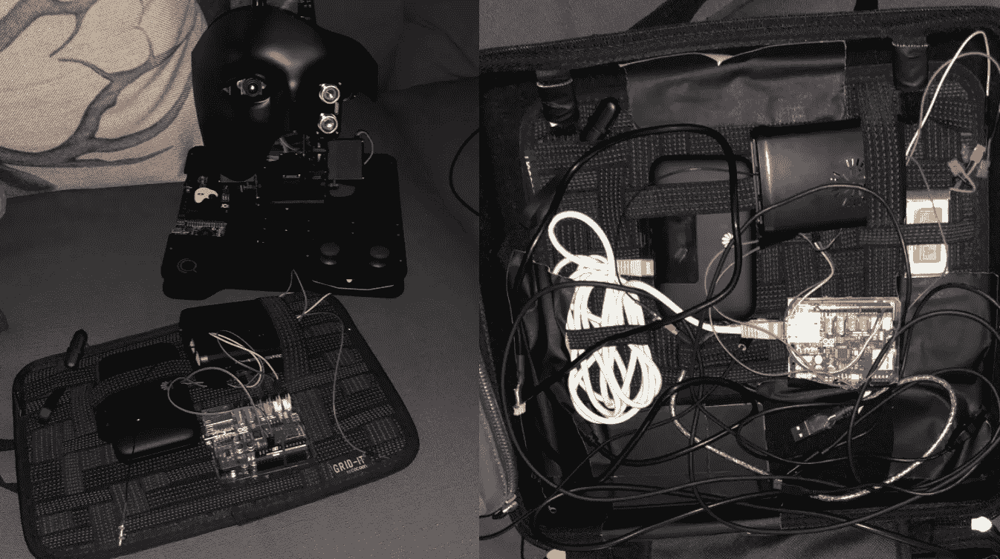

The whole thing packed into a small case. Yes, I took this on a plane once.

我被搞糊涂了，我不知道技术功率等级和数字之类的东西，但别人知道。

跳到 Upwork(雇佣一个自由职业者网站)上，为能制作 Arduino 东西的人发布了一份工作，解释了芯片等。几个小时后，有人回到我身边。

罗伯特，天啊，真是个流氓。他在美国海军什么的部门工作，制造无线电之类的东西，是个很可靠的人。花了 40 美元后，他给我发了一份完整的线路图和我需要购买的亚马逊电子产品的链接，他甚至重写了我的 Arduino 代码。

在这一点上，我把整个东西连接到一个电源转换器上，当我需要时，它会输出 10 安培的电流。我不得不把它装在一个有多个风扇的电脑机箱里，让它保持凉爽。

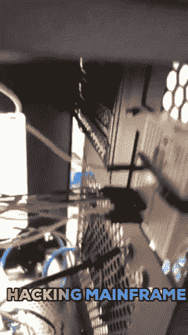

## 回到魔术理论。

如果我能仅仅通过看着某人来读取他们的思想(我不能，但我可以用魔法让它看起来像那样)，那么通过使用同样的方法，我可以教这台机器这么做是完全可行的，对吗？

一家名为 [Creoqode](http://www.creoqode.com) 的公司看到了我的连线表现，并发给我 Nova，这是一个面部跟踪人工智能套件，使用 OpenCV 来控制机器人头部。机器人会跟随用户，跟踪它的眼球运动，并让自己看起来令人毛骨悚然。它运行在 Arduino 技术上，允许我动态编码它的面部运动，以与 Alexa 语音触发器同步。这为人工智能提供了一个情感层面，同时在它的右眼中放置了摄像头，这提供了完美的误导。

如果一个机器人可以跟踪你的脸，移动它的头来保持目光接触，那么让人们相信它也可以读取你的眼球运动并知道你在想什么有多难…特别是如果我两分钟前使用“魔法”做同样的事情。

## 结果。

我的 RFID 盒子可以用无线电波覆盖整个舞台。一旦一张扑克牌进入那个空间，你只要问 Alexa，她就会读出空间里是什么牌。

我让观众拿一副牌，洗牌，看一张并藏起来，这样他们是唯一能告诉观众他们在想象什么牌的人。他们不知道的是，我在扑克牌盒里衬了铝箔，创造了一个法拉第笼。

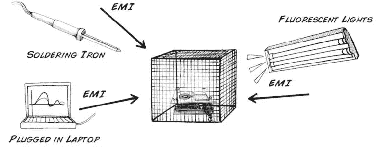

这阻挡了所有来自我放在舞台边上的 NFC 阅读器的无线电波。他们拿了卡片后，我让他们把卡片放回盒子里。本质上，此时舞台上唯一的无线电波是来自观众选择的卡，其他卡的无线电波被屏蔽。这防止了任何人认为我在使用 NFC，因为我们都知道，你不能同时读取多个 NFC 芯片(但我可以)。

在接近机器人头部时，NFC 读取器会查验卡上的芯片，并将其发送到云端，供我的 Alexa 读取。

然而，它实际上要做的是让 Alexa 读出所有的卡片，然后识别观众选择了哪张卡片，假装它正在看观众眼中的运动，以决定他们选择了哪张卡片。这最后的误导给了观众最后一块拼图，将他们引向错误的道路，让他们认为 AI 正在看着观众的眼睛，以识别他们在想什么。

事实上。我正在表演一个非常先进的，以前从未见过或表演过的心理技巧，魔术师和观众仍然无法解决。

一旦在我的机器人人工智能的表演下分层，我就有了完美的欺骗。

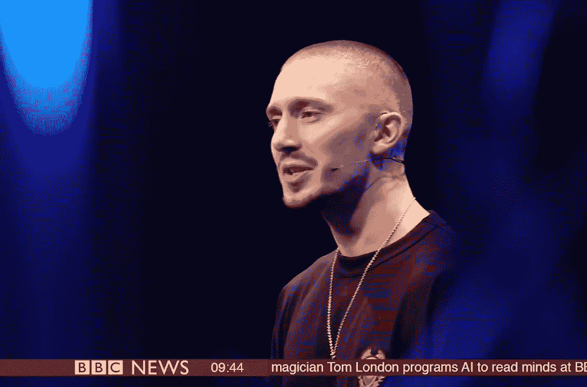

## 我为什么要告诉你这些？

想一想。一个魔术师，一个骗子，能够利用技术和我们对它的无知来完全欺骗一个有信誉的和可信的新闻来源。当时我在纽约，BBC 世界新闻在一周内播放了几次，我甚至在机场登机时看到了它。

这只是冰山一角；我的欺骗变得更加黑暗，因为我们无法识别真正的技术和欺骗之间的界限。

我这样做不是因为我觉得这很有趣，我这样做不是因为我讨厌“这个系统”。我这样做是因为我真诚地认为大多数人不知道技术能做什么，它是如何工作的，或者运行它的人实际上在做什么。

我们生活在一个由一家网络公司推动交流的时代。我坐在那里看着人们使用那些旨在让他们做令人震惊的事情的应用程序，无论是免费的游戏还是社交网络，我被用它们来控制人们是多么容易而震惊。

虽然我的热情是通过轻松的娱乐来照亮这些现象，但一些魔术师有一个更黑暗的目的。有些人开发应用程序、网站和产品，旨在**改变我们的思维方式。**

我只是一个人，在他的公寓里，创造新技术，看看他是否能让人们相信他的工作是神奇而神秘的。只有一个人。

## 我提出一个简单的问题。

> 如果我们被人类科幻作品发出的‘霓虹灯’分散了注意力，我们还能看到那些发明者背后的真实意图吗？