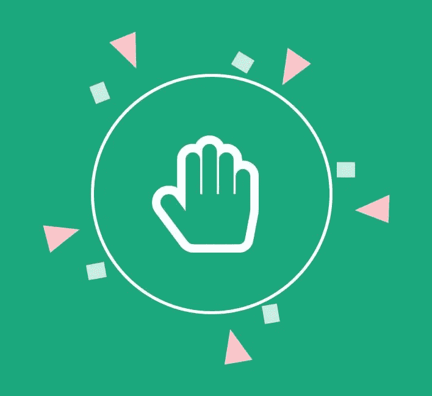
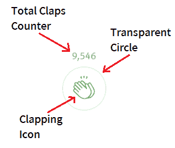
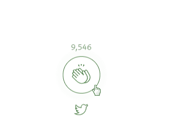
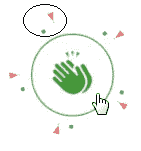
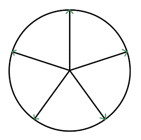
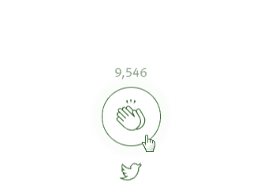
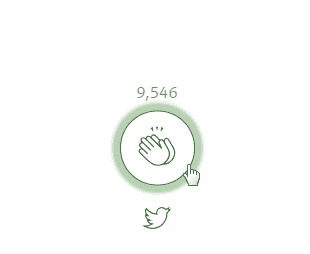

# 我是如何从零开始实现媒体鼓掌的！

> 原文：<https://medium.com/hackernoon/how-i-implemented-the-medium-clap-from-scratch-4a16ac90ad3b>

## 我是如何从头开始重新创建臭名昭著的 Medium Clap 复杂的微交互的



The Original Medium Clap Micro Interaction


My Implementation

*如果你只是想看代码你可以点击* [这里](https://github.com/JonathanDn/mediumclap) *。*

## 第一次出现的媒体鼓掌

Medium 是我发现和浏览新技术和更新的首选网站。直到大约一年前，medium 还有一个简单的“喜欢”系统，类似于脸书和诸如此类的系统，你可以通过给作者一颗“心”来简单地声明你是否喜欢某个发布的内容，从而给作者一种基于名誉/社会的欣赏令牌，增加帖子曝光率。

然后，Medium 开创了第一个鼓掌功能，将 web 交互和动画水平向前推进了一大步，进入了微交互时代。与最初的“喜欢”功能在技术上略有不同，鼓掌不是一个简单的切换按钮，而是一种更动态的“喜欢”或支持一段内容的方式，通过多次鼓掌来获得某个读者特别欣赏或喜欢的文章。

这个引人入胜的新引入的机制伴随着各种动画的触发、转换和以无缝的方式相互交织。为新兴的微交互世界引入了世界级的标准，甚至直到今天，Medium 的拍手功能仍被认为是更强大、复杂、优雅和用户友好的微交互之一。

## 良好的微观互动——烹饪对比

各种各样的用户体验增强了网络，形成了这一点点额外的东西，使我们比其他人更喜欢(下意识地)各种各样的网站，甚至没有更深入地思考和试图分析为什么和如何。

类似于餐馆里的一道非常好的菜，你只是享受一种精心规划和执行的烹饪体验的高度平衡的味道和精致的美学，而不会感到迫切需要破译这道菜是由哪些成分组成的。

而且，你只是从整体上享受了这道菜，有了一次值得记忆和推荐的经历。

## 旅程开始了

当我看到新的 clap 交互时，我立即意识到创建这样一个动画的技术复杂性。看似一个简单而微妙的鼓掌按钮，很明显，在它的设计和实现上花了很多心思，并且需要不平凡的技术来实现最终的结果。我很想冒险自己实现它，并发现从头开始实现这种交互需要什么，并享受在这样做的过程中发现和学习的旅程。我确实从这个实验中学到了很多，我很高兴向你展示我自己的 DIY 拍手互动指南。

## 逐个手指地打破鼓掌互动:

我们如何应对打破微观互动的挑战？首先让我们看看它的空闲模式，并尝试找出它的基本构件的组成。

## 基本部件



Medium Clap — Idle Mode

中型拍手按钮似乎由三部分组成:

1.  给予这篇文章的掌声总数的灰色计数器。
2.  带有灰色边框的透明圆圈
3.  双手鼓掌的图标

## **悬停效果**


Triggering the hover effect

当悬停空闲按钮时，我们清楚地看到某种脉冲从圆圈中释放出来，并均匀地向所有方向传播，当达到一定的传播长度时，该脉冲完全淡出。这让我想起了雷达或声纳效应。我还注意到，这种“声纳”效果的不透明度从它出现的那一刻开始逐渐消失，直到圆圈达到一定长度并在`opacity: 0;`中完全消失，我们所看到的是褪色的声纳后面留下的是圆圈的边界保持与声纳效果相同的绿色。

## **主**点击**事件——设定大多数动画的运动**


Triggering the Click effects

这可能是微交互中最复杂的区域，所以让我们慢慢来，注意接近每个部分。从圆圈的中心开始，我们可以清楚地看到拍手图标在变色，通过 Chrome 浏览器中的开发工具对该图标进行的简短检查表明:

## **SVG 图标**

它是一个独特的 SVG 元素:在 click 事件之前，它的内部颜色要么是透明的，要么是白色的(与背景相匹配)，SVG 的笔画是绿色的。当点击发生时，SVG 图标会改变它的`fill` & `stroke`颜色:现在拍手的“空的”中央部分被绿色填满，这立即出现在用户的眼前，边框现在是白色/透明的。这种效果可以通过多种方式实现:一种简单的方式是改变 SVG 元素上的`fill`、`stroke-width`和`color`属性。最初的 SVG 图标是有版权的，所以我用了一个简单的手形图标，在我进行这个微交互的过程中不会有太大的变化。

## **拍拍计数器元件**

我们还可以注意到，按钮正上方出现了一个带有文本“+1”的绿色圆圈，在 y 轴上有一个非常短的滑动效果。这可以在元素出现时使用`transform: translateY("desired pixels");` 来完成，然后绿色圆圈在其设定位置短暂停顿，最后在向上滑动+淡入淡出效果期间再次使用`transform: translateY("desired pixels");`和`opacity`的`transition`从 1 到 0。需要注意的是，每次点击时计数器都会增加，并重新触发上面的动画。

## **粒子弹出效果**



Particles Pop Effect — slowed down

为了只玩粒子系统并掌握代码，我邀请你点击透明按钮，看看粒子如何在这个**小提琴中形成随机角度和爆发:**

In Result — click the transparent button to see the particles formation “burst” effect

这是一个有点挑战性的数字，所以我决定录制一个简短的 GIF。

这让我可以通过放慢画面来更好地观察移动的粒子。通过`opacity: 1;` **、**可以清晰地看到粒子所在的框架，让我们更有效地分析这个复杂的部分。在最长的暂停帧中，我们可以清楚地看到粒子，我们可以在视觉元素中识别出某种模式。



A single frame — one particle group is highlighted

它只是一个大约几个像素宽和高的绿色正方形，紧挨着它的是一个金字塔形的三角形，它的顶点与正方形水平对齐，底部宽度很小，另外两个顶点的大小大约是 x1.5/2。正如我们所看到的，这个粒子组被复制了 5 次。

## 设置粒子组和形成

*   我想把重点放在一组粒子上——这种近距离的观察揭示了粒子组似乎是在按钮的内部开始它的历程的，它后面的一层似乎正确地使用了`z-index`。然后，该组还被给予一种滑动效果，该效果垂直于金字塔的顶点和按钮的核心之间的角度进行轨道运动，这使得该组从核心通过该角度向外行进。
*   我们还可以看到，在轨道运行过程中，该组的不透明度发生了几次变化，从路线的开始一直到行进了一定距离，从 0 → 1 移动`opacity`,然后从这个距离向外，从 1 → 0 再次移动`opacity`,直到该组完全消失。
*   这个粒子系统基本逻辑如何工作的一个简单例子可以很快完成，我们创建一个高度和宽度为 5 px 的 **div** ，其右侧约 10 个像素一个透明的 **div** ，具有 3 个透明边框和 1 个可见边框，将作为三角形，如这里清楚解释的，如果我们然后移动一个 **div** ，仅在 y 轴上垂直于`transform: translateY("desired pixels");`保持该组，我们可以更好地理解基本逻辑是如何简单地再现。

## 增加趣味——随机粒子群的形成角度

*   在我们理解完成这一阶段后，我们可以再看一看任何粒子组，并看到与我的例子不同，每个组以不同的角度行进——但暂停一两分钟，尝试收集粒子组之间的特定逻辑模式，我们可以看到所有 5 个粒子组共享相同的固定顶点角度大小。将一个圆分成 5 部分的简单计算可以得出这个黄金数→ 360/5 = **72 度**。然后每一组将收到它的角度，根据:0，72，144，216，288，360，我们知道需要给一个粒子集`transform: rotate("certain degree");`为了设置他们在各自的轨道方向，我发现最好的方法是试错，并根据我希望每个粒子组到达的位置进行调整，用这张图指导我。



The directions of each particle group orbit

*   现在，为了使他们在每个方向上移动，我们需要使用这个组的一个简单的副本，总共 5 个，计算每个组的轨道角度，适当使用不透明度移动会给我们带来下面看到的期望的弹出粒子动画。
*   眼尖的人现在可以看到，弹出的粒子并不总是以相同的角度“发射”，每次点击都有一组不同的角度，以整个粒子形成“爆发”效果，如图所示:



The particle groups formation changing angle randomly

*   这种随机性可以通过使用 [JavaScript](https://hackernoon.com/tagged/javascript) 和这个随机函数很容易地实现，方法是每次使用某个范围的最小值和最大值激活粒子动画时生成一个随机角度，这是:

```
function getRandomInt(min, max) {
    return Math.floor(Math.random() * (max — min + 1)) + min;
}
```

然后通过选择粒子形成 HTML 元素并直接改变它的样式。用字符串插值变换我们能够给整个粒子形成一个动态的随机角度扭曲，就像在我的小提琴中:

```
function addRandomParticlesRotation(particlesName) {
    const particles = document.getElementById(particlesName);
    const randomRotationAngle = getRandomInt(1, 72) + 'deg';
    particles.style.transform = `rotate(${randomRotationAngle})`;
}
```

## **总鼓掌计数器**

一个带有浅灰色整数的简单元素，它将某篇文章的总点击数与用户在会话中给该文章的当前点击数相加。当用户单击按钮时，该元素会立即隐藏，当拍手计数器元素完成其动画循环并向上消失时，该元素会立即出现。

## **按钮点击**后的脉冲效果



A slight change in the circular button’s size/scale on click

一个非常小但非常重要的细微差别是优雅地使用了一个小比例函数，在粒子弹出动画过程中，将按钮缩放到比它的大小大 10-20%并返回到它的原始大小，如上所示。

## 点击后点击计数器脉冲效果


A slight shrink & grow effect on the green + counter above button

在它上面的点击计数器上实现了一个类似于按钮刻度的小调整，以增强交互性。

## **奖金-X 重置按钮**

我还没有实现的微交互的一个新功能是，在用户最后一次点击按钮后的一段时间后，一个标签滑动到按钮的右侧，为用户提供一个短时间窗口来重置总的鼓掌次数，假设用户想要减少给予的鼓掌次数或取消所有鼓掌。X 按钮短暂出现，然后消失在按钮后面。

## 贡献者和审阅者

特别感谢那些对这篇文章的评论和编辑做出贡献和帮助的人们:[尤里·沙克德](https://medium.com/u/355b1dfe86ae?source=post_page-----4a16ac90ad3b--------------------------------)，[埃拉德·谢赫特尔](https://medium.com/u/9fc81237aa4e?source=post_page-----4a16ac90ad3b--------------------------------)，[约格夫·阿胡维亚](https://medium.com/u/8483893f3b6c?source=post_page-----4a16ac90ad3b--------------------------------)。

# 现在怎么办？

为了让你信服，你可以看看 github 中的代码[，](https://github.com/JonathanDn/mediumclap)

如果你喜欢这篇文章，我邀请你欣赏臭名昭著的 clap 微互动和 **clap 的优点；).**

更多我推荐的**产品设计、UX &前端**的帖子:

*   [我如何为特征发现重建脸书的微操作](https://medium.freecodecamp.org/how-facebook-designs-microinteractions-for-feature-discovery-c79cfe998a77)
*   [星级评定—让 SVG 再次伟大起来](https://uxdesign.cc/star-rating-make-svg-great-again-d4ce4731347e) —循序渐进的代码教程
*   代码艺术——为什么你应该写更多的伪代码

更多开源的 Vue 组件:

*   [Vue 动态下拉菜单](https://github.com/JonathanDn/vue-dropdown) —一个可定制的、易于使用的优雅下拉菜单
*   [Vue 动态星级](https://github.com/JonathanDn/vue-stars-rating) —一个动态 Vue 星级组件(类似 google play)

我是 Yonatan Doron，一个对以用户为中心的前端和模块化客户端架构有着极大热情的 Web 开发人员。

这些天让我兴奋的是探索**交互设计**的海洋，更具体地说是**微交互**以及它们对我们生活的影响。我通过重新创建现有的互动以及设计我自己的互动来加深我在该领域的知识。

欢迎你关注我，发微博或给我发信息，有任何问题，反馈或建议！— [推特](https://twitter.com/jodoron)