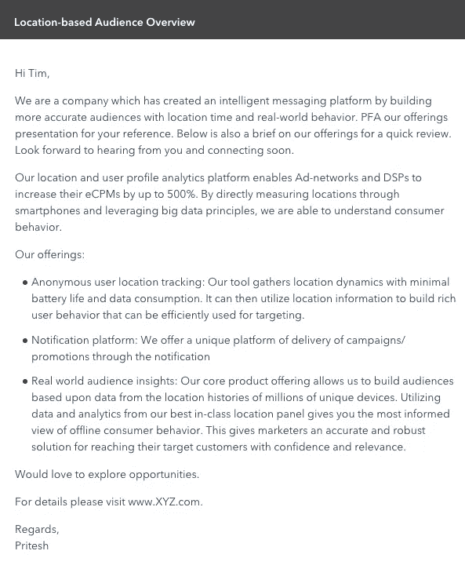
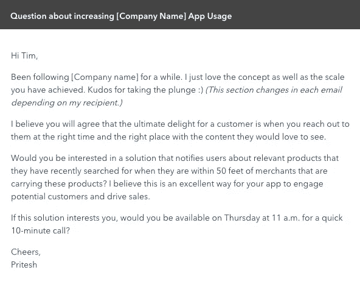

# 我如何将我的电子邮件潜在客户回复率从 1%提高到 14%

> 原文：<https://medium.com/hackernoon/how-i-increased-my-email-prospecting-response-rate-from-1-to-14-9ac80e51693f>

你上一次回复冷冰冰的邮件是什么时候？你可能不记得了——理由很充分。大多数人会简单地删除从未见过面的销售代表发来的邮件，或者将其标记为垃圾邮件。即使一些潜在客户真的阅读了电子邮件，也很少有人愿意回复。

然而，一封精心制作的潜在客户邮件是任何销售人员武器库中的有力武器。我用了七个原则让一封潜在客户邮件从糟糕变得优秀，并在这个过程中将我的回复率从 1%提高到了 14%。

在这篇[博客](https://hackernoon.com/tagged/blog)中，我将分析我修改前后发给潜在客户的真实邮件，然后解释我用来[升级我的销售邮件](https://blog.hubspot.com/sales/psychology-tips-to-upgrade-your-cold-sales-emails)的规则。

# 邮件 1:之前

# 这封邮件表现如何？

*   发送:100
*   打开:11
*   收到的答复:1

# 这封邮件哪里出错了

我不会美化它——这些结果是可悲的。这封[可怕的潜在客户邮件](https://blog.hubspot.com/sales/salespeople-please-stop-sending-terrible-prospecting-emails)中出现了许多错误。以下是最明显的错误:

*   **结构:**邮件没有有序流动，从一个点跳到另一个点。
*   **主题行:**含糊不清，缺乏上下文。潜在客户没有打开或阅读电子邮件的动机。
*   **开场白:**信息以介绍我的公司的业务开始。为什么我会想读一封陌生人发来的关于他的公司的电子邮件？2005 年的时候，人们可能愿意这样做，当时平均收到的电子邮件数量只是现在的一小部分，但今天很少有人会费心去读这个。大多数打开这封邮件的人可能没有阅读第一行以外的内容。
*   **放置不当的行动号召:**第一段包括这样一句话:“期待您的回复，并尽快联系。”这一行在邮件中没有任何意义。
*   **以销售人员为中心的内容:**提到了许多功能，但没有具体说明与收件人公司相关的任何好处。这封邮件没有提到为什么那个特定的收件人会对我提供的东西感兴趣。
*   **关闭:**邮件的结尾绝对是犯罪。它不包含任何行动号召，只是一个随机结束。
*   长度:很少有潜在客户会费心去读这么长的邮件。
*   **附件:**最后，邮件包含附件，触发了很多公司的垃圾邮件过滤器。

我可怜的回复率促使我开始学习如何写更好的潜在客户邮件。在七个月的时间里，我彻底检查了我的[邮件潜在客户](https://blog.hubspot.com/sales/sales-email-templates-guaranteed-to-get-a-response)策略，开始看到回复率为 14%，增长了 1400%。虽然你的回应率将取决于你的产品和行业的性质，但如果遵循正确的方法，这种显著的转变是很有可能的。

# 电子邮件 2:之后

这是另一封来自我最近一次潜在客户营销活动的真实邮件。

# 这封邮件表现如何？

*   发送:100
*   开放:56
*   收到的答复:14 份

# 这封邮件做对了什么？

*   **结构:**这封邮件遵循逻辑流程，这是第一封邮件中完全没有的。
*   主题行:主题行是有效的，因为它指的是我的目标受众高度感兴趣的东西。
*   **开篇句子:**邮件以谈论收件人开始。我修改了每封电子邮件的第一段，使其个性化，以向潜在客户保证，我不只是一个在黑暗中胡乱猜测的陌生人，而是一个不辞辛苦地去了解他们的人。试着建立一种联系来打破僵局，让潜在客户想进一步阅读邮件。
*   **针对特定买家的内容:**这封邮件强调了一个非常具体的问题，这个问题对我的目标受众非常重要，并且与主题一致。电子邮件的正文告诉我的潜在客户邮件中有什么内容，并鼓励他们阅读更多内容。我强调如何用简单易懂的语言引用与他们的行业相关的具体用例来提供价值。
*   **结束:**我使用明确的两部分行动号召:我要求一个小承诺(10 分钟的电话)*和*提供一个首选时间。
*   **长度:**这封邮件比之前的那封要短得多，这增加了人们从头到尾读完的可能性。

# 销售潜在客户电子邮件的 7 个制胜原则

根据我的经验，以下是你需要牢记的七个关键因素，以显著提高你的潜在客户邮件回复率。

# 1.使个性化

群发电子邮件不再有效——句号。如果你想要结果，你必须[定制你的电子邮件，用信息证明你认识收件人](https://blog.hubspot.com/sales/get-responses-to-your-sales-emails)。读者不仅会发现更容易与你的电子邮件联系起来，还会表明你已经做了功课，花了时间试图了解潜在客户的公司。

# 2.研究

在撰写电子邮件之前，研究行业和你的人物角色是很重要的，这样你就可以在第一次互动中提供价值，吸引他们的优先考虑。这是写个性化邮件的基础。

# 3.想象电子邮件的结构

在写邮件之前，先画一张邮件结构的草图。这种结构形成了你用来创建更加个性化的电子邮件的基本模板。要清楚电子邮件的不同部分是什么，以及你在每一部分想要传达什么。

这个练习会给你极大的清晰度，并给你一个强大的基础来个性化每封电子邮件。

# 4.使用独特的主题行

主题行的目的是让人们打开你的邮件。销售人员最常犯的一个错误是每封邮件都使用相同的主题。你应该根据你的人物角色创建 4-5 个不同的主题行，并根据你发送邮件的对象来使用它们。

# 5.直奔主题

潜在客户的注意力持续时间很短，因此电子邮件必须抓住要点，并且尽可能简短。如果你的邮件在最初的一两秒钟内没有引起他们的兴趣，你可以忘记他们已经读过了你的前两行，更不用说得到回复了。专注于制作一封不到 30 秒的电子邮件，快速表达你的公司如何独特地解决问题。

# 6.包括行动号召

我再怎么强调行动号召的重要性也不为过。包括一个明确的问题已经让我独自得到了这么多的回应，导致业务关闭，我总是想为什么我不早点这样做。在我的情况下，我要求回复确认会议或电话。

这是一个简单而有效的策略，可以得到更多的回应。当然，潜在的假设是你的产品解决了他们的一个重要问题，所以确保你不要直接提出没有价值的请求。

# 7.关注利益

销售的一个基本原则是谈论利益而不是特性。然而，大多数销售人员仍然过早地谈论功能。我们这样做有两个常见的原因。

首先，当你群发邮件给别人时，描述特征的邮件更容易写。我们没有投入时间去思考目标客户想要什么，以及他们试图解决的确切问题是什么。然而，如果你想要一个可观的回复率，你将不得不投入足够的时间来写具有个性化益处的电子邮件。

其次，我们经常无法区分演示文稿和宣传材料。首次接触潜在客户邮件的目的是让读者有兴趣了解更多。它不应该是网站或演示文稿的替代品(直到销售过程的后期，当你可以根据买家的具体需求定制它时，它才会有效)。在购买者旅程的后期阶段，特征会进入画面，但潜在客户邮件是第一个接触点，在这里特征是不相关的。

因此，确保你在冰冷的邮件中只关注好处。

写强有力的冷邮件不是火箭科学。如果你没有得到一个令人满意的回复率，开始把上述原则应用到你的下一批邮件中。你尝试的越多，你的邮件就会变得越好。

*作者* [*作者*](https://twitter.com/priteshvora) *。最初发表于***。**