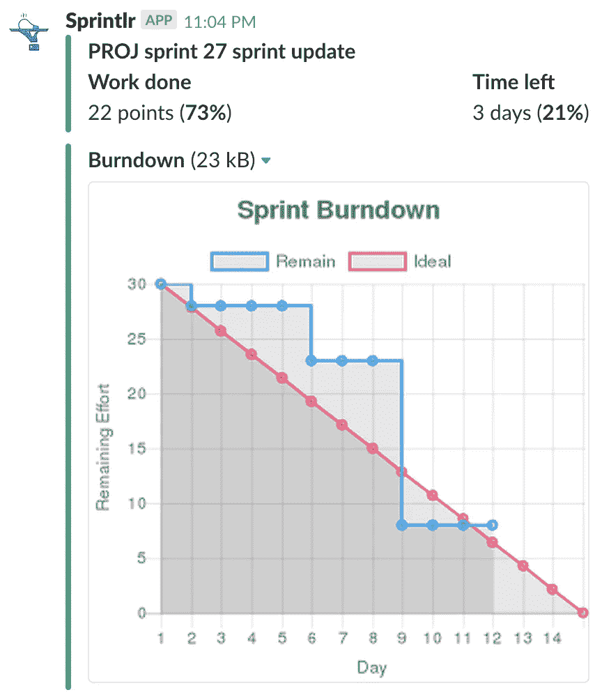

# 我如何向我的分布式 Scrum 团队引入信息辐射器

> 原文：<https://medium.com/hackernoon/how-i-introduced-an-information-radiator-to-my-distributed-scrum-teams-466200d65d68>

Remote developer

**更新**:有兴趣的话可以去看看工具的网站(【http://sprintlr.io/】T2)。

公司越来越多地雇佣远程工程师来应对人才短缺。在过去的 8 年里，我一直担任工程副总裁，我可以直接证明这一点。几乎我工作过的每个团队都有一个或多个 100%远程的团队成员。鉴于对优秀工程师的需求，这一趋势在未来可能会继续。

分布式开发团队用来协作的工具已经有了巨大的改进。[像 Skype、](https://hackernoon.com/tagged/tools) [Slack](https://hackernoon.com/tagged/slack) 和 JIRA 这样的工具被用来代替协同定位和物理 Scrum 板。分布式软件开发团队现在是主流。

但是有一件事我发现分布式团队很难做到。你如何培养对开发团队的状态和进展的共同理解？

对于同处一地的团队，我过去使用过“信息辐射器”。这些大的可见图表(BVC)贴在团队区域的墙上或咖啡机旁。团队成员将在等待 brew 时获得关于团队状态的更新。这些信息使他们能够做出权衡，这通常决定了 sprint 的成功。

分布式团队缺乏共享的物理空间来共享这种类型的信息。然而，他们几乎所有的时间都在网上度过。这让我想到用 Slack 来分发一个信息辐射器。就像一个普通的 BVC 一样，信息会来到团队，而不是团队去寻找它。它将显示团队进展的可视化摘要。它包含的可操作信息可用于站立会议、计划会议或回顾会议。

我决定建立一个工具来做这件事。

该工具从 JIRA 收集 sprint 状态信息，生成一个简明的摘要。格式化的消息被推送到开发团队的 Slack 通道。它出现在站立的时间，所以团队知道它的确切位置。

下面是 Slack 中 sprint 更新的一个例子:

正如你所看到的，sprint 更新包括了一个最新的 sprint burndown 图。该图告诉团队它在 sprint 预测上的表现。如果没有进展，图表会提示团队讨论替代方案。这也可能引发与产品负责人的讨论，以缩小 sprint 或 story 的范围。

根据我的经验，记录 sprint 燃尽的开发团队更有可能成功完成 sprint。

sprint 更新还显示了 sprint 中被阻止的(*标记的*)和正在进行的故事的摘要。受阻的故事阻碍了 sprint 的进展，应该成为 standup 的一部分。sprint 更新可以用来直接在 Slack 上开站立会议，而不需要切换到 JIRA。

我有很多进一步扩展该工具的想法，我将在这里分享我的进展。如果您想了解更多关于该工具的信息或有经验可以分享，我很乐意收到您的来信。

*马丁在*[*stack state*](https://www.stackstate.com)*担任工程副总裁，他和他的团队正在开发下一代监控和 AIOps 产品。作为一个副业项目，马丁打造了*[*techfu . io*](https://techfu.io)*，一个自动评估技术人才的工具。*