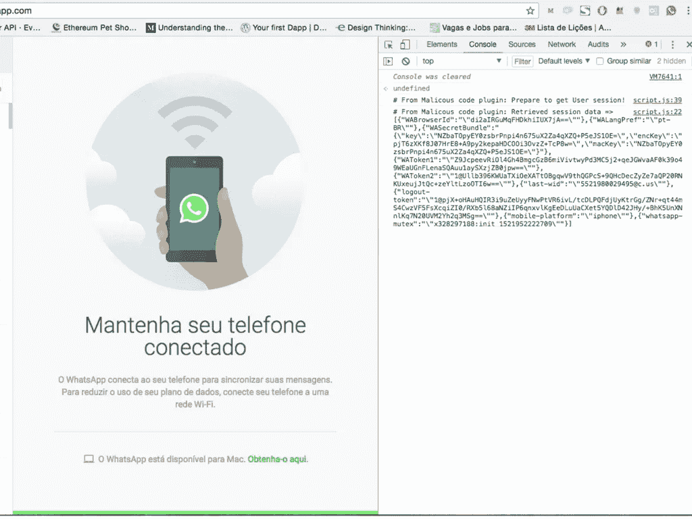
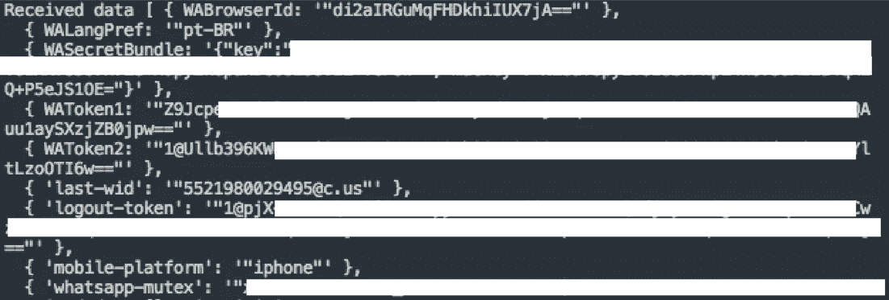

# 我是如何进入其他 WhatsApp 用户的会话的

> 原文：<https://medium.com/hackernoon/how-i-invaded-the-sections-of-other-users-through-whatsapp-b9abb5e5395a>

我最近发现了一种方法，通过恶意代码从任何用户那里获取会话，获取你的会话数据，并使用这些数据登录你在任何计算机上的帐户。

这些代码可以由任何可以访问你的 WhatsApp 网页标签的插件注入，并且这将会悄悄地完成。因此，我决定创建一个简单的 javascript 代码，它将获取这些数据，并将其发送到我的服务器，服务器将保存这些数据。

# 实验

在一个小时内，我准备好了脚本和服务器，但有人需要通过控制台注入脚本。我让我的朋友在我这边的电脑上运行 WhatsApp Web 标签中的代码，只是为了我需要做的一个测试。

我认为敏感的数据是在我的服务器上，所以我只是把这些数据复制粘贴到我的 WhatsApp 网站上，然后重启我的标签。准备好了。

正如我所料，我进入了他的 WhatsApp，可以访问一切:对话、联系人……我可以和他聊天，还可以看到他的任何对话。

很好。我对他的治疗什么也没做。我只是给他看，他很惊讶。但是，我们在同一个网络上。我想知道这对他网络之外的人是否有效。

我妻子。

我会让她把这段代码复制到她的控制台上，然后说这样会在她的 WhatsApp 上出现非常好的职位空缺通知。

我跟她打了个电话，想知道她要怎么做，就这样。我已经在我的服务器上收到了她的数据。我做了同样的程序。哇！我在她的 WhatsApp 上，可以访问所有的对话和联系人，最棒的是我们不在同一个网络上。

# 我需要更多

嗯，现在我想:从个人角度来看，这有多有害？许多人有私人谈话，秘密 chrome 插件能自动获取这些代码并发送到服务器吗？

我做到了。同样的结果。插件从我的会话中获取数据并发送到服务器。在那一点上，我认为这真的很糟糕，即使只是交谈，有其他人的号码，如果有人以你的名义发消息，更改你的照片，这将是非常尴尬的

# 我能帮上什么忙？

我通过脸书向 WhatsApp 团队报告了此次事故的详细情况，目前正在等待他们的回应。

# 结论

嗯，我只是想和你分享一下这段经历。好奇心总是带领我们找到有趣的方法，因为我喜欢创造新的解决方案，并且总是充满想法，所以尝试创造一个解决方案也不错。

那都是乡亲们！

如果你有任何问题，我可以帮助你！

# 表示你的支持

掌声表明你有多欣赏我的故事！

