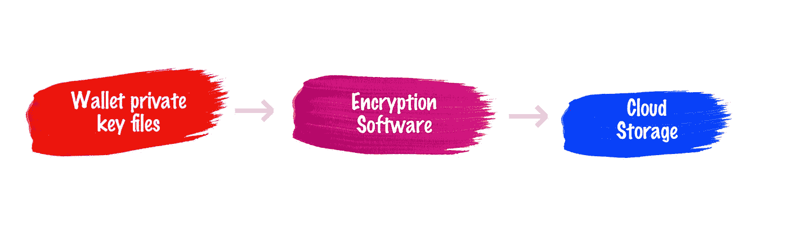

# 我如何保证我的密码安全

> 原文：<https://medium.com/hackernoon/how-i-keep-my-crypto-safe-743152776a61>

## 本地在我的硬盘上，备份在云中

Photo by [Bogdan Dada](https://unsplash.com/photos/VX9v2sxbiwc?utm_source=unsplash&utm_medium=referral&utm_content=creditCopyText) on [Unsplash](https://unsplash.com/?utm_source=unsplash&utm_medium=referral&utm_content=creditCopyText)

几个月前，我不介意将我的私钥托管在 exchange 服务器上。但是有一些我想买的硬币，它们不能储存在交易所里。

在寻找本地保存 [crypto](https://hackernoon.com/tagged/crypto) 的最佳方法的过程中，我也意识到我不应该在交换中保存它们(因为它们更有可能被攻击)。

本地钱包很吓人，因为我的笔记本电脑随时可能坏。仅仅依靠一个硬盘，我感到不舒服。我也想过把钱包里的文件复制到一个 u 盘里，但是我经常丢失大部分的 u 盘。也不安全。

然后我考虑将钱包文件保存在我的 iCloud drive 文件夹中。但是知道我的私钥在公共云上又带来了同样的问题(公共云受到攻击的可能性很高)。

我的解决方案是在本地加密所有钱包，并将加密文件保存到云中。

Save crypto safely

这样，我总是有一个可访问的钱包私钥副本。如果遭到黑客攻击，它们在很大程度上是无用的(因为你需要一个密码来解密它们)。

我在[产品搜索](https://medium.com/u/b8b4445269d0?source=post_page-----743152776a61--------------------------------)上启动了一个[线程](https://www.producthunt.com/ask/6116-what-is-the-best-way-to-encrypt-and-save-files-to-google-drive-dropbox-others)，请求最好的[工具](https://hackernoon.com/tagged/tools)进行加密。我的要求是:

*   简单的用户界面
*   标准加密算法(SHA256 或 MD5)
*   应该可以在 macOS 上使用
*   应该是手动的(不是自动同步)

有很多很棒的建议，我都试过了，最终选择了 [Cryptomator](http://Cryptomator.com) 。

Cryptomator.com

Cryptomator 是一个简单的工具(个人使用免费)。它会在您的系统上创建一个可以使用密码加密的文件夹。诀窍是在云服务提供商上同步这个文件夹。

不仅仅是钱包，如果你在 exchange 网站上使用 google 2fa，你应该备份你扫描的条形码(因为如果你丢失了手机，你将无法访问这些网站)，并加密和同步它们。

我通常每枚硬币有不止一个钱包，所以我创建了一个命名钱包的模式: **symbol-index** ，所以我的钱包被称为 xmr-0、xmr-1 等等。

希望这篇文章能帮到你。保持安全，相信数学。

—

我写销售、代码、时尚和哲学。请点击“关注”按钮了解最新信息。

—

您可能还想阅读:

 [## 区块链就像是主框架金融系统的晶体管

### 曾经有一段时间，每个政府和大学都有自己的个人主机。这是非常…

hackernoon.com](https://hackernoon.com/blockchain-is-like-the-transistor-of-the-main-frame-financial-system-b77034c2762e)