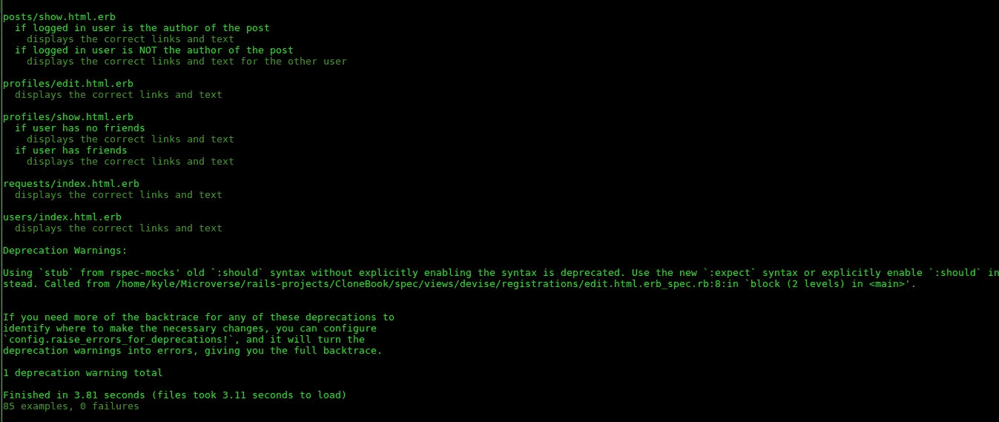
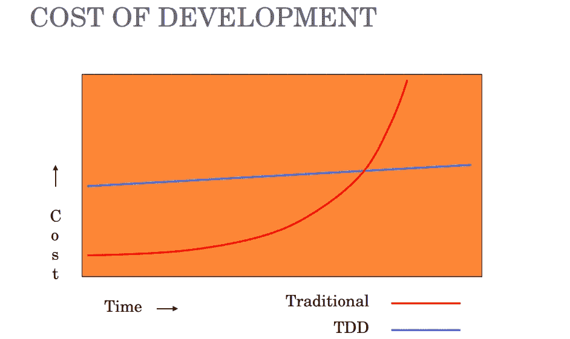
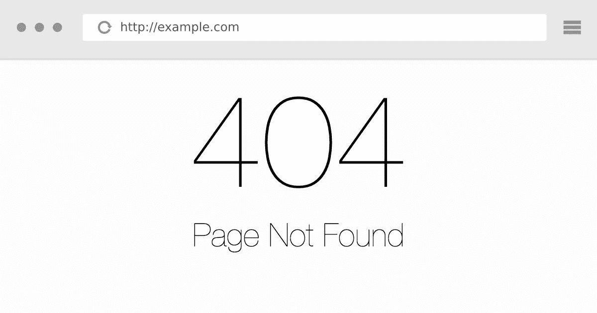

# 我是如何学会不再担心并热爱 TDD 的

> 原文：<https://medium.com/hackernoon/how-i-learned-to-stop-worrying-and-love-tdd-ea22b7b7fcaa>

## (或者至少，在构建时测试特性)

Sample RSpec results from one of my Rails apps

最近在互联网上的文章和研究中，几乎一致认为:测试驱动开发(以下简称 TDD)是开发人员创建一切的方式。但是如果你像我一样，开始比听起来要困难得多。

## 避免测试

大约六个月前，在 Odin 项目的 Ruby 课程中，我第一次接触到了 TDD。我当时就认识到了好处。这似乎是一个可以采用的明确的“最佳实践”。然而，由于我当时感觉到的一种超负荷感，我跳过了 TDD 项目，直接开始构建象棋游戏 sans-TDD。我很高兴“完成”了 Ruby 课程，这样我就可以继续在[学习](https://hackernoon.com/tagged/learning) Ruby on Rails。

当我上 Rails 课程时，使用的主要资源之一是 Michael Hartl 的优秀的 [Rails 教程](https://www.railstutorial.org/book)。本指南“采用了一种轻量级的、直观的测试方法，在方便的时候使用 TDD，而不是教条式地使用它”(第 3 章，第 3 节)。这是有道理的:虽然严格的 TDD 在企业环境中似乎是一个好主意，但这种务实的方法似乎更适合大多数 web 应用程序开发。这允许开发人员工作得更快一些，同时仍然可以构建良好的测试覆盖率。

然而，当构建我自己的应用程序时，**我发现即使是这种更轻量级的 TDD 形式也很难实现。起初，我把它归咎于项目太小。其中一些只涉及建立一两个模型，也许是一个表单。编写测试似乎没有必要，因为我可以很容易地手工测试所有的功能。**

当项目变得更大时(这里的[这里的](https://www.theodinproject.com/courses/ruby-on-rails/lessons/associations)和这里的[这里的](https://www.theodinproject.com/courses/ruby-on-rails/lessons/building-advanced-forms)，借口变成了缺少时间。弄清楚如何为每一步编写测试可能要花和构建应用程序一样长的时间。如果我不进行测试，我肯定可以更快地完成这个项目。这是真的——在某种程度上。

不测试你的代码的问题是显而易见的:它是未经测试的。是的，您已经在本地服务器上运行了该应用程序，并进行了测试，以确保满足要求，并且您可以成功浏览该应用程序。但是自动化测试不仅仅是这样——它涵盖了边缘情况和当您只是手动检查基本功能时通常不会遇到的场景。

## 潮流改变了

Odin 项目的最终 Rails 项目(脸书的克隆)告诉了我延迟测试的另一个主要缺点。如你所知，如果你一直在阅读我的文章，我目前是 [Microverse](https://www.microverse.org/) 的学生。这意味着在本文的这一点上有两件事是相关的:首先，我正在与一个[编程](https://hackernoon.com/tagged/programming)合作伙伴一起工作(因此在讨论这个项目时使用了术语*我们*)；第二，我们所有的项目都需要测试。当我们开始这个项目时，我们再次(就像我们迄今为止对每个项目所做的那样)选择推迟测试，直到应用程序功能完成。

Yes, TDD takes more time up front, but the larger the project, the more time it saves you by the end.

上面的图表(你可以在网上找到几个版本)总结了我们在这个大项目上的工作经验。很明显，到最后，我们花费了太多的时间来手动测试，并确保在我们做出更改时不会出现任何问题。如果我们在构建每个新特性的时候就实施测试(甚至在特性完成之后)，我们可以显著减少我们的手动测试并节省大量时间。

除了手工测试所浪费的时间之外，事实上我们仍然不得不编写测试，因为没有测试套件就不能(不应该)部署真正的应用程序。等到最后才写测试，我们错过了 TDD 的好处，但是仍然不得不花时间写测试。

## 真实世界中的测试

虽然脸书克隆是我们在本课程中最大的项目，但生产应用程序通常包括更多的模型和功能。随着功能列表的增长，TDD 变得更加重要和有价值。

我们最近受雇于我们的第一份自由职业合同，在一个已经上线的网站上工作。一个好的测试套件对生产应用程序的价值是显而易见的。当良好的测试覆盖到位时，确保团队中的每个人都正确地设置了开发环境就容易多了。然后，需要对添加的每个新特性进行测试，以确保它能够正常工作，这样团队中的其他人也可以很快验证它是否对他们有效。

You don’t want your users to see this error.

我认为我的测试经验在新开发人员中很典型。起初，测试似乎是浪费时间或者是一件好事。然后，我们认为这是一种“不可避免的邪恶”，最终才意识到，当正确实施时，它可以节省我们很多时间和痛苦。此外，我们在编写测试时变得越熟练和自信，我们就越有可能像我们应该的那样使用它们。

对于所有的新开发人员来说，结论是您需要直接投入到测试和 TDD 中。即使对于小项目来说这样做看起来很傻，但是当你开始构建和处理更大的应用程序时，马上养成这个习惯会有回报的。不要担心你的应用是否有效，热爱 TDD。