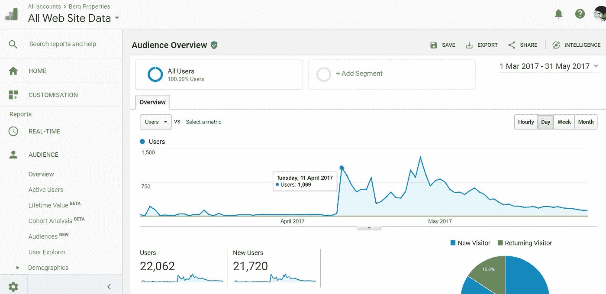

# 我如何用 SEO 在一个月内赚了一百万卢比

> 原文：<https://medium.com/hackernoon/how-i-made-a-million-rupees-in-just-a-month-with-seo-d054714b1d7a>

作为多个失败的创业公司的创始人，我总是试图找到一种廉价的广告技术，以最小的投资获得结果。在这场斗争中，有一天我遇到了搜索引擎优化( [SEO](https://hackernoon.com/tagged/seo) )，我可以自信地说，它改变了我的生活。

# **什么是 SEO？**

对于不知道什么是 SEO 的人来说，它是一个通过谷歌搜索结果增加你网站流量的[营销](https://hackernoon.com/tagged/marketing)过程。

搜索引擎优化基本上有两种类型；他们是站内 SEO 和站外 SEO。

**页面搜索引擎优化:**这种技术在您的网站中实施，以确保标题、描述、标签和内容针对目标关键词进行优化。

**离页 SEO:** 离页 SEO 是在你的网站之外进行的网页优化。这包括文章发布、目录提交、广告发布、社交媒体管理和图片提交等。

# **我的 SEO 学习阶段:**

当我确信 SEO 在广告界有多么强大时，我没有浪费一分钟，马上开始学习。开始时，这非常令人难以接受，因为我对这个过程了解有限。但当我在不同的指南和教程的帮助下深入学习时，我留下了深刻的印象。我从它的基础开始，其中关键词研究是在你的网站上实现 SEO 最重要的事情。我搜索了不同的关键词，通过 SEO 工具查看了它们的排名、竞争、成交量。

# **SEO 在我的创业公司 Berq Properties 上的实现！**

[Berq Properties](http://berqproperties.com) 是一家在线房地产中介，帮助买家购买巴基斯坦多个住房计划中的房产。它指的是提供每笔销售佣金的合作伙伴房地产机构。在对 SEO 有了足够的了解之后，我决定在我的网站上实现它。

我负责优化 SEO，写文章，我的合伙人和我一起做销售。

# **我们的战略**

我们的目标是通过使用 SEO 技术的网站收集房地产线索。我们最初的 SEO 重点是为巴基斯坦最受欢迎的房地产关键词排名，这让我们很难与旧网站竞争。(它们是高竞争关键词)。

开始时，我们设法只吸引了几百名游客。几个月后，我回顾了我的 SEO 策略，因为我知道高竞争关键词需要更多的资源、时间和金钱。所以我决定制定新的策略。

# **切换到新的 SEO 策略**

在我的新策略中，我将搜索引擎优化的重点放在了竞争关键词较少的新住宅项目上。因为未开发的关键字很容易击败 Zameen 和 Lamudi 等强大的老网站。因此，每当新的房地产项目启动，我们确保我们的工作对未开发的关键字，使网站在谷歌搜索结果的顶部。

在那段时间里，有一天我接到我合伙人的电话，他告诉我一个新项目“ [Bahria Paradise](http://berqproperties.com/bahria-town-new-projects/bahria-paradise-karachi/) ”即将启动。因此，我立即在我的网站上用相同的项目名称制作了一个新页面。因此，增加游客数量的竞赛开始了。在制作完它的页面后，我整晚都在做它的搜索引擎优化。我在上面写了几篇文章，并把它反向链接到我的登陆页面。此外，为了给它一个额外的果汁，我做了一个脸书广告，发送感兴趣的用户到我们的新页面。

# 终于，我打败了 Zameen.com 和 OLX.com.pk

随着我们不断的搜索引擎优化的努力和奉献，最终，我们的网站显示在谷歌搜索结果的顶部，并成功击败了其他著名网站，如 Zameen.com，olx.com.pk 和 bahriatown.com。这对我们来说是一个伟大的成就，因为如果任何人搜索巴哈利亚天堂卡拉奇，他们会在谷歌搜索的顶部找到我们的网站页面。由于大多数人更喜欢点击显示在顶部的网站，所以这给了我们的页面更高的点击率和更高的流量。我们的每日用户自发地从 56 个增加到 1069 个，即每日访问者增加了 1800%。下面是谷歌分析的截图:

Visitors before Publishing New Keyword Content

Visitors After Publishing New Keyword Content

这有助于我们吸引每一个潜在买家登陆我们的网站。我们开始接到数百个电话，直到一个月才停止。经过不断的努力，我们通过做中间人，在短短一个月内成功赚取了百万卢比，我们的月销售额增长了 50%。

# 有效的 SEO 技术:

从这次经历中，我得出结论，上面的 SEO 技术立即奏效。同样，您也可以应用这种技术，只需遵循以下步骤:

1.  研究你所在行业中尚未开发的关键词，这些关键词有可能在未来获得更高的流量。
2.  首先发布选定关键词的内容。
3.  为登陆页优化站内和站外 SEO。
4.  尝试通过脸书广告和谷歌 AdWords 增加登陆页面的流量。
5.  增加登录页面的社交媒体份额。
6.  确保你的网站是移动优化的。

使用这个技巧，你的搜索引擎优化工作可以给你一个额外的推动力。

# 如何通过 SEO 让你的企业成功？

SEO 不是火箭科学。任何人只要有一点计算机科学和市场营销的知识就可以学会它。这些天在我们巴基斯坦市场，好的搜索引擎优化专家很难聘请，因为这是我们的大学没有教的东西。我们的计算机科学课程是时候把数字营销作为必修选修课了。它的未来是光明的。印刷媒体将在未来几年被淘汰。对于一个企业主来说，不要晚实施搜索引擎优化，你的竞争对手可能知道搜索引擎优化，但你可能已经落后了。