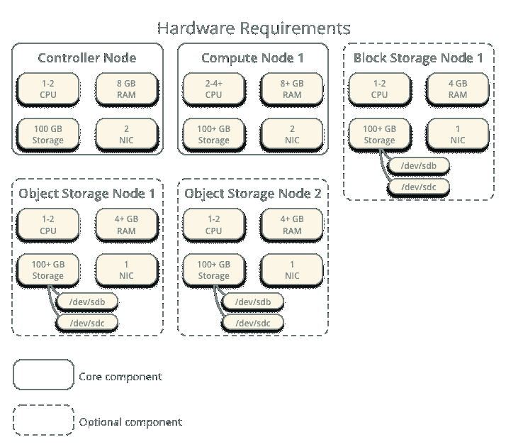
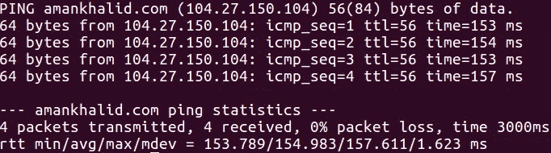

# 我如何在周末像 S3 一样提供服务

> 原文：<https://medium.com/hackernoon/how-i-made-a-service-like-s3-over-the-weekend-bfa83e224dc7>


[*Picture**Credit*](https://www.pixelstalk.net/sky-wallpapers-hd/)

首先，我说 2018 年是我人生中最糟糕的一年。到目前为止，我已经因为加密损失了一半的积蓄，毁了一笔非常昂贵的[股份](https://www.youtube.com/watch?v=5KLYz0pApq0)，而且根本没有尝试过任何新东西。这种创造力的丧失让我开始思考- *我需要休息。不是为了和我的老朋友叙旧，而是把我在网上的工作放在一边一个星期，重新和我有创造力的一面联系起来。*

我和我的联合创始人拉胡尔谈了这件事，以及它对我的重要性。我有点像一个懒惰的员工，要求他的队友为他们打掩护。他不仅同意了，还建议了一些我可能会感兴趣的东西。他知道伊利诺伊大学正在进行一个关于云计算的远程学位项目，这让我印象深刻，这是我第二喜欢的话题，仅次于人工智能，它与我的工作完全吻合。我知道对我来说这比神经网络容易得多，谁知道我什么时候有机会为一个真正的项目训练一个模型。我毫不犹豫地报名参加了这个课程。

就这样开始了，这就像是大学时代的重演..分配..演讲..和测试。在其中一项作业中，教授告诉同学们对 Globus 和 Openstack 进行比较。这两个都是实现您自己的虚拟化云计算平台的很好的解决方案，对于这篇文章，我将谈论我如何使用 openstack 实现对象存储，但是我鼓励您查看 [Globus](http://toolkit.globus.org) ，因为它也很棒。

> OpenStack 软件控制整个数据中心的大型计算、存储和网络资源池，通过仪表板或 OpenStack API 进行管理。OpenStack 与流行的企业和开源技术配合使用，是异构基础设施的理想选择。

# 服务架构

在浏览了 Openstack 的[服务列表](https://www.openstack.org/software/)后，我决定创建一个分布式对象存储，它可以像 AWS S3 一样在不同的容器中存储 blobs，但这是 openstack 提供的众多服务之一，这些服务由一个中心节点控制，该节点也有助于与这些服务或我们的对象存储进行通信。

这个分布式云中的每个节点都需要一个专用的机器，你可以使用虚拟化软件剥离它，或者像我一样，通过使用 [Vultr](https://www.vultr.com/) 创建真实的实例，基本上是任何运行全新安装的 [Ubuntu](https://hackernoon.com/tagged/ubuntu) 的机器(本文至少有 3 个)。

下图是一个示例配置，显示了云网络中的各种节点，但我的实现更短，这让我对如何安排一切有了一个基本的想法。



[Source](https://docs.openstack.org/ocata/install-guide-ubuntu/_images/hwreqs.png)

首先，我从创建一个控制器节点开始，因为它对于控制和同步我们设置中的所有其他节点是必不可少的。

> 控制器节点运行身份服务、影像服务、计算管理部分、网络管理部分、各种网络代理和控制面板。它还包括支持服务，如 SQL 数据库、消息队列和 NTP。

我分别为我的云、计算和对象存储启动了一个运行 Ubuntu 16.04 的新实例，总共 3 个，接下来确认你的机器可以访问网络，输入…

```
# ping -c 4 amankhalid.com
```

您应该在终端中看到以下输出。



请记下这 3 个节点的 IP 地址，因为它们将用于配置。在每个实例中，我将文件 **/etc/hosts 编辑为**，使其具有以下值。

```
# controller
XXX.XX.XX.X       controller

# compute1
XXX.XX.XX.X       compute1

# object1
XXX.XX.XX.X       object
```

我分别用我的控制器、计算和对象节点的 IP 地址替换了`**XXX.XX.XX.X**`。在对我的所有节点进行更改之后，我按如下方式检查了连接性。

```
# ping -c 4 controller
```

为了验证连通性，我通过我的每个实例 ping 另外两个节点，当我 ping[amankhalid.com](http://amankhalid.com)时，它们返回了类似的输出。现在是时候同步我的节点了。

# 同步节点

正如我的教授所说，在分布式环境中通信时，同步是一个重要的问题。在开放式堆栈中，每个节点都将其时钟与控制器节点同步。为了在我的设置中定义网络时间协议( [NTP](https://en.wikipedia.org/wiki/Network_Time_Protocol) )，我首先在我的控制器节点上安装了 Chrony。

```
# sudo apt-get install chrony
```

完成后，我必须确保其他节点与我的控制器同步。我在每个节点上安装了 chrony，并在它们的**/etc/chrony/chrony . conf**文件中添加了下面一行。

```
server controller iburst
```

之后，我重启了每个节点中的 chrony 服务，一切都设置好了，为了进一步验证我的节点是否引用了控制器，我运行了以下命令。

```
# chronyc sources
```

这个命令打印出源的名称或 ip 地址，在我的例子中是控制器。

# 安装 Openstack

现在，经过所有的挣扎，我的节点已经准备好真正的交易。我离实现自己的云存储又近了一步。但是首先我必须在我的每台机器上安装 Openstack 仓库。我运行了以下命令来准备好节点。

```
# sudo apt-get install software-properties-common
# add-apt-repository cloud-archive:queens# sudo apt-get install software-properties-common
# add-apt-repository cloud-archive:pike
```

最后，更新您的本地存储库列表，并在您的每台机器上安装 openstack python 客户端。

```
# sudo apt-get update && apt dist-upgrade
# sudo apt-get install python-openstackclient
```

## 数据库供应

现在是时候初始化 Openstack 的数据存储了，它用于内部目的。我们将使用 MySQL 数据库，尽管 Openstack 也支持其他数据存储，但我决定坚持使用好的 ol' MySQL。我们只需要在控制器节点上安装它，通过[这个](https://www.digitalocean.com/community/tutorials/how-to-install-mysql-on-ubuntu-16-04)指南了解基本安装步骤，我们现在只需要根用户，确保你的密码符合 MySQL 安全安装。

## 信息排队

为了在服务之间交换状态信息和协调操作，Openstack 使用消息队列。这个任务我选择了 rabbitMQ。

RabbitMQ 只在控制器节点上需要，我使用下面的命令安装了它。

```
# apt install rabbitmq-server
```

添加`**openstack**`用户，最后，允许`**openstack**`用户的配置、写和读访问:

```
# rabbitmqctl add_user openstack AMNOX_PASSWORD# rabbitmqctl set_permissions openstack “.*” “.*” “.*” Setting permissions for user “openstack” in vhost “/” …
```

用合适的密码替换`**AMNOX_PASSWORD**`。

## Memcached

Openstack 中使用缓存服务来缓存用户使用以下命令安装 memcached 时生成的令牌:

```
# apt install memcached python-memcache
```

因为有一个工具可以创建不同的用户和角色，并为他们分配服务，所以用户需要使用令牌进行身份验证，才能访问分配给他们的服务。

# 最终前沿:对象存储

我已经有了对象存储节点和完整的网络连接，现在是时候让控制器启用对象存储服务了。为此，我在我的控制器节点上创建了一个服务和一个有权访问它的用户。

## 控制器节点设置

首先，需要在将传入请求路由到对象存储节点的控制器节点上释放一个代理服务。我首先在我的控制器节点上创建一个用户。我进一步给了这个用户 admin 特权，使其能够访问我将在下一步中创建的服务。

```
# openstack user create --domain default --password-prompt swift# openstack role add --project service --user swift admin
```

接下来创建对象存储服务。

```
$ openstack service create --name swift \
  --description "OpenStack Object Storage" object-store
```

接下来，我配置了服务端点并安装了额外的包，使代理能够转发传入的请求。额外的包可以在[这里](https://docs.openstack.org/project-install-guide/object-storage/ocata/controller-install-ubuntu.html)找到。

## 存储节点设置

现在是设置存储节点的时候了，使用 Openstack 有可能拥有许多这样的存储节点。这个概念可以通过使用水平可伸缩性来进一步扩展，顺便说一下，这是现实生活服务中的规范。

```
# sudo apt-get install xfsprogs rsync
```

我们的存储节点将使用 [XFS](http://searchstorage.techtarget.com/definition/XFS-file-system) 文件系统，运行这些命令来格式化存储位置。

```
# mkfs.xfs /dev/sdb
# mkfs.xfs /dev/sdc
```

创建挂载点目录结构:

```
# mkdir -p /srv/node/sdb # mkdir -p /srv/node/sdc
```

编辑`/etc/fstab`文件并添加以下内容:

```
/dev/sdb /srv/node/sdb xfs noatime,nodiratime,nobarrier,logbufs=8 0 2 
/dev/sdc /srv/node/sdc xfs noatime,nodiratime,nobarrier,logbufs=8 0 2
```

安装设备:

```
# mount /srv/node/sdb # mount /srv/node/sdc
```

创建或编辑`/etc/rsyncd.conf`文件，以包含以下内容:

```
uid = swift
gid = swift
log file = /var/log/rsyncd.log
pid file = /var/run/rsyncd.pid
address = controller

[account]
max connections = 2
path = /srv/node/
read only = False
lock file = /var/lock/account.lock

[container]
max connections = 2
path = /srv/node/
read only = False
lock file = /var/lock/container.lock

[object]
max connections = 2
path = /srv/node/
read only = False
lock file = /var/lock/object.lock
```

编辑`/etc/default/rsync`文件并启用`rsync`服务:

```
RSYNC_ENABLE=true
```

启动`rsync`服务:

```
# sudo service rsync start
```

现在存储节点已经准备好安装必要的服务，我在启用 rsync 并指定存储格式后安装的包在这里[列出](https://docs.openstack.org/project-install-guide/object-storage/ocata/storage-install-ubuntu-debian.html)。

# 戒指:的确非常珍贵

数据驻留在 Openstack 中的环，这可以是任何数据，比如帐户、容器或对象相关的数据。对于我的用例，我需要所有这三个，因为我有一个被授权使用存储服务的帐户，通过它我将创建一个容器，它将依次存储我希望它存储的对象。

环主要管理数据的存储方式，并控制数据在设置中的复制次数(默认情况下为三次)。当您的集群在地理上分布时，比如说跨大洲分布时，这个概念更有用。但是这个迷你装置需要它来确定我们物体的位置。

> I 在**控制器**节点上为账户、容器和对象创建了如下的环。

**创建账户环**

转到`/etc/swift`目录。创建基础`account.builder`文件:

```
# swift-ring-builder account.builder create 10 3 1
```

将我们的存储节点添加到环中:

```
# swift-ring-builder container.builder \
  add --region 1 --zone 1 --ip object1 --port 6201 \
  --device sdb --weight 100
```

**创建容器环**

切换到`/etc/swift`目录。初始化`container.builder`文件:

```
# swift-ring-builder container.builder create 10 3 1
```

接下来，我将存储节点添加到环中:

```
# swift-ring-builder object.builder add \
  --region 1 --zone 1 --ip object1 --port 6200 --device sdb --weight 100
```

**创建对象环**

对象服务器使用对象环来维护本地设备上的对象位置列表。

转到`/etc/swift`目录。创建基础`object.builder`文件:

```
# swift-ring-builder object.builder create 10 3 1
```

将存储节点添加到环中

```
# swift-ring-builder object.builder add \ — region 1 — zone 1 — ip object1 — port 6200 — device sdb — weight 100
```

# 它还活着！

从对象存储源库中获取`/etc/swift/swift.conf`文件:

```
# curl -o /etc/swift/swift.conf \ [https://git.openstack.org/cgit/openstack/swift/plain/etc/swift.conf-sample?h=stable/newton](https://git.openstack.org/cgit/openstack/swift/plain/etc/swift.conf-sample?h=stable/newton)
```

编辑`/etc/swift/swift.conf`文件，并在`[swift-hash]`部分为您的环境配置散列路径前缀和后缀。

```
[swift-hash] … swift_hash_path_suffix = MY_SECRET_SUFFIX swift_hash_path_prefix = MY_SECRET_PREFIX
```

在`[storage-policy:0]`部分，配置默认存储策略:

```
[storage-policy:0] … name = Policy-0 default = yes
```

将`swift.conf`文件复制到存储节点的`/etc/swift`目录，确保您拥有对象存储节点上配置目录的所有权。最后，在对象存储节点上启动服务器。

```
# chown -R root:swift /etc/swift# swift-init all start
```

**在容器中存储文件**

登录到您的控制器节点和`**echo**`环境中的授权凭证。

```
export OS_USERNAME=admin
export OS_PASSWORD=9qZjkwmKUrkFn2dv
export OS_PROJECT_NAME=admin
export OS_USER_DOMAIN_NAME=Default
export OS_PROJECT_DOMAIN_NAME=Default
export OS_AUTH_URL=[http://controller:35357/v3](http://controller:35357/v3)
export OS_IDENTITY_API_VERSION=3
```

创建`container1`容器:

```
# openstack container create container1
```

上传一个测试文件到`container1`容器:

```
# openstack object create container1 FILE
```

列出`container1`容器中的文件:

```
$ openstack object list container1
```

您应该会看到新创建的文件。您还可以通过我们之前创建的 API 端点与您的服务进行通信。您可以为 openstack 用户创建许多这样容器，并在其中存储 blobs。请记住，这是一个非常 CPU 密集型的任务，您可能需要一个更好的实例。

对象存储只是 Openstack 的一个用例，还可以使用 [NOVA](https://www.openstack.org/software/releases/ocata/components/nova) 服务创建自己的虚拟化实例。我也鼓励你去看看 Openstack API，以获得更强大的功能。

我希望通过提高我的技术来结束今年年初以来困扰我的厄运。写这篇文章不仅帮助我加深了对云计算的理解，也让我意识到为这个帮助我成长了这么多年的社区做出了一些贡献。

> 感谢您阅读这篇文章，我非常感谢您对我的实现技术的任何建议或改进。

您可以通过[邮件](mailto:mailamankhalid@gmail.com)联系我，询问关于本文的任何问题，或者只是进行一次愉快的交谈:)