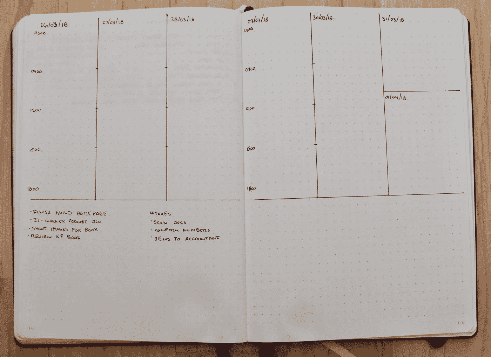
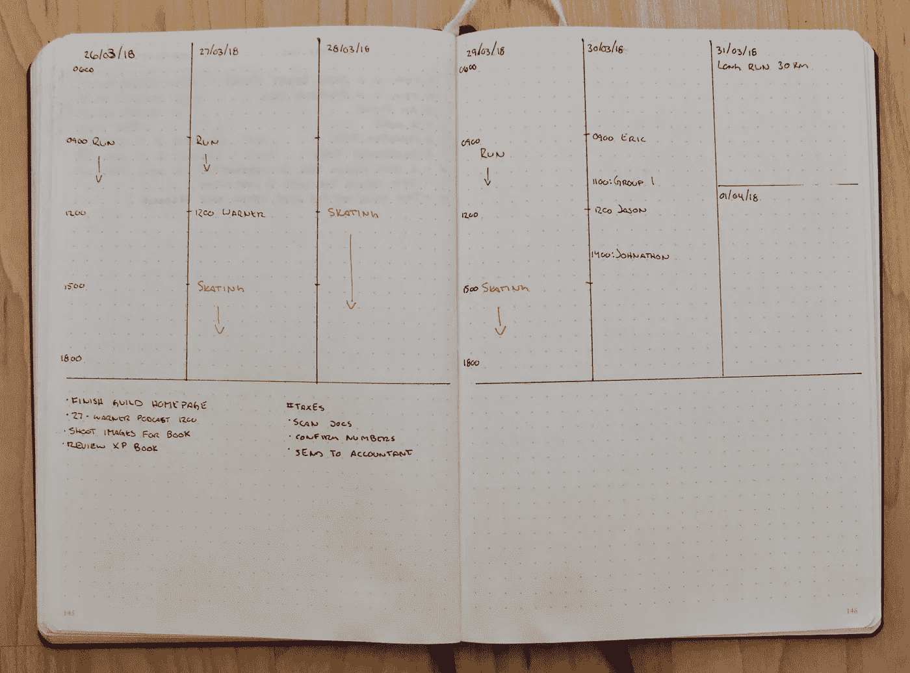
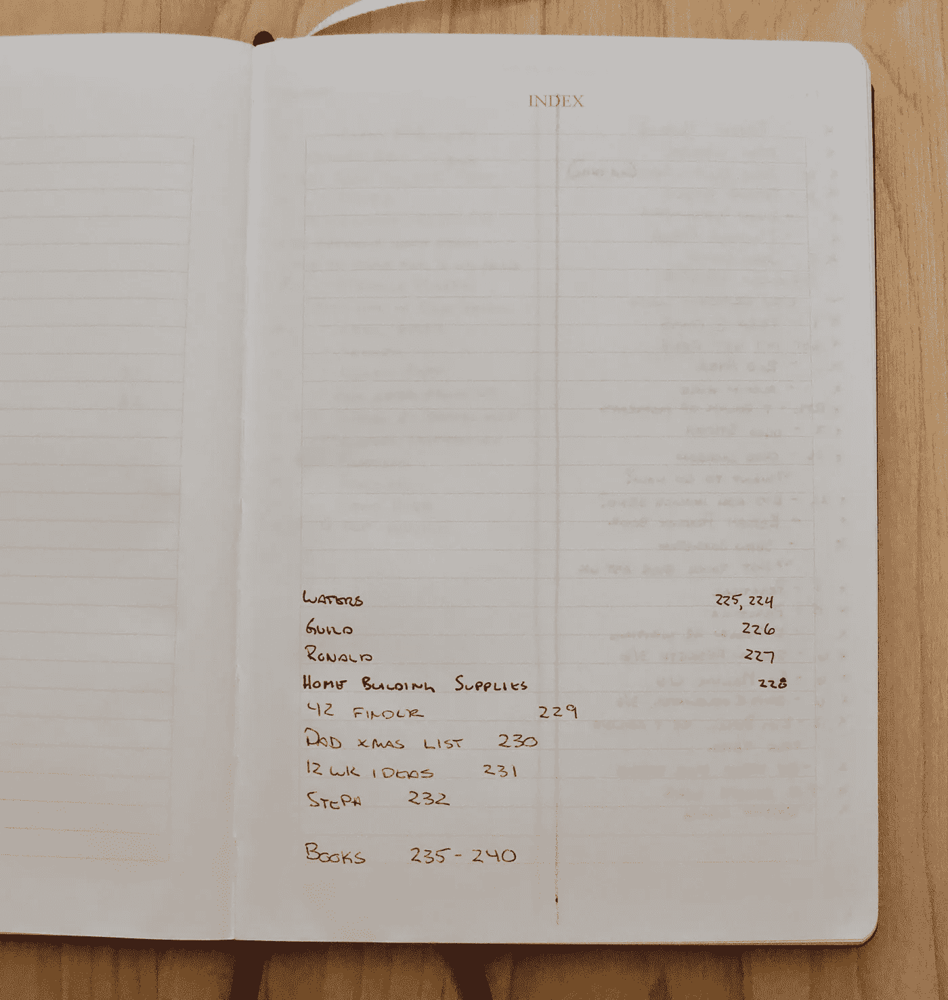
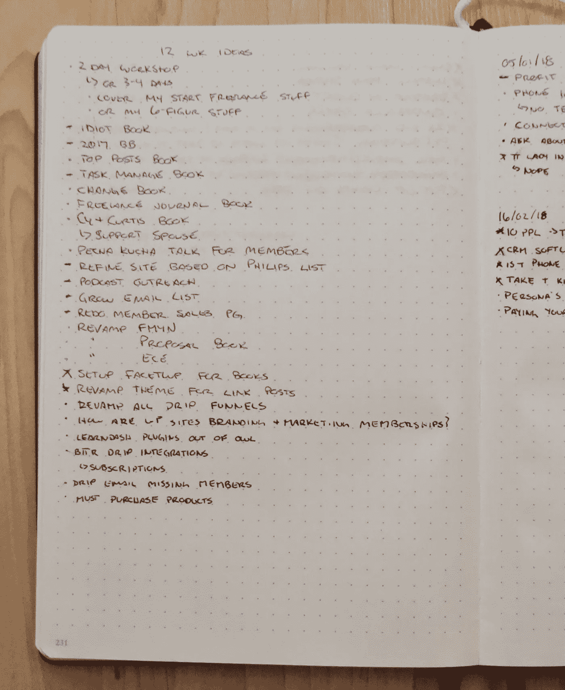

# 我如何修改子弹日志系统来运行我的在线业务

> 原文：<https://medium.com/hackernoon/how-i-modified-the-bullet-journal-system-to-run-my-online-business-5a718c291c0f>

几周前[我给了你一本关于什么是子弹日志的入门书，以便你熟悉子弹日志系统的基本规则](https://curtismchale.ca/2018/05/07/getting-started-with-bullet-journalling-for-web-developers/)。现在，我喜欢它的某些部分，但它的某些部分似乎对我不起作用。

今天，我将用笔和纸向你们展示我用来经营我的网上[业务](https://hackernoon.com/tagged/business)的确切系统。

## 我用的子弹杂志的标准部件

虽然我有一些自定义组件，根据最初的 Bullet Journal 系统，这些组件并不十分理想，但我仍然从 Bullet Journal 的核心组件开始。

我使用我的[官方子弹日志](https://curtismchale.ca/recommends/leuchtturm-1917-bullet-journal/)中提供的**索引**。它对我如何处理任何属于我的业务中的**项目**的**集合**进行了调整。

我使用了一个**未来日志**，它包含了大约 6 个月的未来，还有一个页面专门记录可能比 6 个月更远的任何事情。

我使用**月度日志**，但不是他们在官方系统中建议的那种。

我以前一天晚上写的日志开始我的一天，但之后我会加入一些我自己的东西。

我还改变了常规子弹日志系统中推荐的**符号**，因为我不断发现我必须查找哪个符号代表什么。

让我们从深入了解我是如何实现**月日志**开始。

> 为了得到我的子弹日志备忘单和我选择[工具](https://hackernoon.com/tagged/tools)，[的 10 个限制，订阅关于平衡生产力的每周电子邮件](https://curtismchale.ca/subscribe)。

## 我在线业务的每月日志

如果你还记得的话，标准的**月日志**是一张日期列表，旁边写着星期几。如果不是最重要的，这里有一个复习。

我不知道你怎么想，但那根本没有足够的空间来处理我清单上的事情。一个简单的例子是，每周五我至少有[两个辅导电话](https://curtismchale.ca/work-with-me)，两个事件不适合放在一条线上。

我通过计算出一个月中的星期来开始我的每月日志。我会在这一页的顶部写上有问题的月份，然后写下与这一周相对应的日期。

显然，不是每个月都有开始和结束的时候，所以我可以有一个干净的星期，所以我不担心。如果一周跨越两个月，我就在两个不同的月份里写下来。跨越二月的三月的第一周在二月和三月的月日志中。

重复不是一件坏事，它只是一件东西。我把重叠的几周视为一个机会，根据新的信息调整我一直在做的任何计划。

随着时间的推移，我开始使用**的符号**。我将使用项目符号来表明这是一项任务，如果它需要在一周中的某一天完成，我将添加日期，然后添加破折号，并以可操作的格式添加任务。

## 我如何处理子弹日志每周日志

在我的**月日志**中，我们已经有了每周的一些任务。但这并不能完全解释你所面临的一周。几个星期你可能有约会，或者尽管你尽了最大努力，你从过去计划的方式对未来的你来说太多了。处理这个问题就是我的**周日志**发挥作用的地方。

它从一周五个工作日的位置开始，并为周六/周日的联合时段留下一个位置。我把每天分成三个小时，从早上 6 点开始，到晚上 18 点结束。

在官方的子弹日志中，用两页纸，每天写 10 格。在每页的左边每隔 5 格写下你的时间。我用一个小勾号来表示每天三个小时的小组去了哪里。

在页面底部画一条线，然后将所有任务从你的**月日志**转移到页面底部，上面有你的时间段。如果你的一些任务已经有了日期，那就把日期带过去。否则，你还没有准备好开始考虑什么任务去哪里。

现在你做的第一件事就是把任何不能动的和家庭有关的东西放进去。这意味着我把花样滑冰的时间加到日历上了。可能是给孩子理发或任何其他与工作无关的事情，属于工作时间。我选择使用不同的颜色，这样我可以清楚地看到他们。

我不担心工作之外的事情，因为那都是指定给家人的。我几乎从来不在周末工作，所以当我查看一周的任务时，我不需要跟踪它。

接下来是任何与工作相关的约会。这里我使用子弹日志系统的标准 **O** 意符，在约会旁边加上时间。

最后，我把我的个人活动添加到日历中。对我来说，这是我添加到日历中的工作时间内的跑步。我也把每天的阅读和写作时间加进去。我几乎每天都在阅读和写作，因为对于任何自由职业者来说，最重要的技能是能够为他们的客户做出惊人的决定。

这与每个人都需要的[自我提升时间相对应，如果他们想在自己的领域保持领先](https://curtismchale.ca/2017/10/10/dont-3-hours-business-broken/)。这就是为什么它会出现在任何客户工作之前。

直到现在，我才准备好查看我的**周日志**，并开始决定什么时候做这一周的任务。如果你在此之前就开始为任务设定日期，你就在建立一个愿望清单。你希望你能在一天内完成工作，然后你的周三看起来就像我的时间一样明智，你几乎没有时间去工作。

考虑到我一周的承诺，我可以看下这一周的任务清单，在我应该在某一天完成的项目旁边放上一些日期。

你会注意到我没有列出客户的具体任务，我写下了他们的名字。也不是客户名字旁边的号码。这是我想在一周内为这个项目投入的三个小时的时间。以我现在的业务结构来看，我的目标是一个客户和花在他们身上的三个小时。

## 这个每周计划需要多长时间

当我开始时，这花了几个小时，但大部分时间都花在了计算每个项目要用多少块，或者调整前一周的布局，因为出于某种原因它没有点击。

现在，我只需花 30 分钟就能为我的一周做好准备。

虽然我每周五都会为此留出一个小时，因为我发现如果我不花时间提前计划一周，我的效率会下降 20%。

你承受不起产量下降那么多。确保你提前计划好你的一周。

## 我的每日子弹日志如何让我走上正轨

**每日日志**在前一天晚上开始。就像我们提前一周计划一样，我们需要确保提前一天做好计划。

这从回顾**月日志**开始，找出当天安排的任何任务。

这也是你获取客户名称并将其转化为可操作任务的地方。知道你有两个连续的三小时的客户项目，你需要进入你的项目管理系统(是的，我们将在后面讨论更多关于项目管理系统和代码项目任务),拿出需要完成的项目，以及足够的信息，你不需要钻研项目管理系统就可以完成任务。

在那之后，我开始偏离常规的子弹日志，开始建立一个更传统的日志。在这一天剩下的时间里，我会记录自己的感受和正在做的事情。

我感觉有效率吗？

我是不是被打扰了？

孩子们在做傻事吗？

这一切都发生在我睡觉的时候，伴随着一个简短的广告，介绍我对上床睡觉时间的感受。

我使用的格式来自我多年指导户外旅行的经验。我首先把时间放在条目的前面。然后我自由地写下此刻我脑海中的一切。

随意在列表中添加其他的随机笔记，使用你喜欢的任何符号。当我的日志迫使我开始写下一页时，我会在那一页上再次写下我的任务清单，这样它就在手边。

即使页面是对着的，也要这样做，因为这是一个很好的方式来看到你已经从你的清单上删除了一堆事情。重写要短得多，给你一个机会来推掉任何你认为不会完成的事情。

## 我如何在我的子弹日记中使用意符

是的，我知道在你的子弹日记中有两个安排或迁移任务的符号，但是我从来不记得哪一个意味着什么。所以我根本不用它们。

我使用标准的 **X** 符号来表示一项任务已经完成。我用 **O** 来代表一天中的一个事件。我唯一使用的另一个意符是 a——表示我用一个任务做了其他事情。

这涵盖了迁移到其他时间框架或**集合**的任务。如果你已经计划好或者把它移到一个**收藏**中，真的有关系吗？我从来没有发现它对我有什么影响，所以我不再试图记录它。

重要的是，你可以看看你的清单，知道你以某种方式处理了一个项目。对我来说，这也意味着我认为这个任务很愚蠢，我不会做任何事情。

我知道在官方的子弹日志系统中，a-应该代表一个笔记，但我总是在笔记旁边放上时间戳，所以我让时间戳代替了标准的子弹日志符号，并将其用于我觉得有用的东西。

## 我如何利用便签和模拟生产力

还有一个额外的东西，我每天用 Bullet Journal 管理我的 web 开发业务。可以放在页面上的便笺条。

该便笺是任何其他出现的任务的临时收件箱。不要向前或向后翻到某个**收藏**或你的**未来日志**，把项目记在笔记上，专注于你应该做的任务。

当你发现一项任务不会像你最初设想的那样在一天内完成时，你也应该使用它。将任务添加到便利贴上，在你的一天计划会议结束时，弄清楚你是否能在第二天完成它，或者它是否需要被推迟到未来的某个时间点。

> 为了得到我的子弹日志备忘单和我选择工具的 10 个限制，[订阅关于平衡生产力的每周电子邮件](https://curtismchale.ca/subscribe)。

当你反复推掉一项任务时，一定要记下来。我的经验法则是，如果我把一项任务推迟三次以上，我就有问题了。

也许这个任务或项目没有价值，我需要暂时放弃它。

也许我已经对很多事情说了“是”,我需要尽可能地对更多的事情说“不”,这样我才能专注于重要的任务。

也许我没有很好地计划我的一天，我把最重要的任务留到一天结束时，我没有精力做好这项工作。在这种情况下，我明天的计划应该马上就有时间来处理这个重要的项目。

如果你的便利贴不是一整天的，那也没关系。如果它动几下，也没事。当你集中注意力时，用它来移动任务，这样你就能保持工作的节奏。

## 我如何在项目日志中组织项目

我称之为组织项目，这些项目的官方术语是**集合**。我内心的完美主义者对于项目的最大问题是，我会把它们分散在我的笔记本上。

他们会在几天的任务和写日志之间坐着。然后，除了在我的笔记本中随机出现的项目之外，一个项目可能会在我的笔记本中的不同点跨越两到三页。

这是我无法忍受的，所以我改变了在笔记本上处理项目的方式，从后面开始。

在笔记本背面开始任何项目**收藏**的同时，我从可用于索引条目的最后一行开始索引。

我确实知道在一个给定的笔记本中我会有多少书评项目，所以我会为这些项目留出三个完整的版面，这样我就有 48 个地方可以在书的后面放置书评项目。这是任何新笔记本的最后三个完整跨页。

从那里开始，我把所有适合我 12 周收藏的项目笔记全部展开。

从那里，它是自由的。我会有一个辅导客户的名字，然后记下要在下次会议中跟进的项目。

我会有一个很大的写作项目，里面有一个任务清单，或者是一个我想在家里做的任务清单。我通常会为每一个项目留一个单独的页面，如果我需要占用另一个页面，我只需翻到前面，找到下一个可用的页面，然后用包含我的项目**集合**的另一个页面更新**索引**。

不属于这个过程的是我的客户跟进，所以让我们看看我如何使用我的子弹日志作为我业务的 CRM。

## 作为 Web 开发人员 CRM 的 Bullet Journal

在我们的业务中，我们都有很多线索需要跟进。已经通过电子邮件联系过并且仍然是潜在客户的人。伟大的长期客户，我们想确保我们接触基地每隔几个月。我们想联系的同事，这样我们就能跟上行业的发展。

这些年来，我一直在使用 Contactually 或其他 CRM 系统。 [Contactually](https://curtismchale.ca/recommends/contactually) 甚至让一个老联系人浮出水面，这个老联系人在与他们接触后的两周内带来了 1.5 万美元的收入。然而，外部 CRM 也带来了自身的问题。

我们在本书的开头谈到了这样一个事实:你的个人生产力系统应该有尽可能少的部分。添加特定的 CRM 意味着您添加了另一个部分。

正如我就业务流程向客户提供的建议一样，我一次又一次地发现，他们建立了 CRM，看到了它的好处，然后就停止使用它了。这并不是说 CRM 没有带来价值，而是它在他们常规的客户项目管理系统或他们的个人生产力流程之外的系统中。

心不在焉。即使安排了时间来做 CRM，他们也不会去做，因为需要额外的步骤来检查下一个收件箱。

我在自己的过程中发现了同样的脱节。我将无法接触，它为我建立的“任务”列表将会失去控制。我开始觉得自己像西西弗斯推着一个更大胆的上坡，而这个更大胆的上坡注定要再次滚下山，这样我就可以把它推上山了。

我甚至尝试了一个在我的常规电子邮件收件箱里的系统，结果我没有完成它出现在我面前的任务。

这些自动化工具的一个大问题是，它们可以占用你的时间做出承诺，而不需要你的任何互动。Contactually 不知道我不能在周五跟进客户，因为我是教练。它不知道我有一个大的开发项目要处理，而且一周内不能联系任何人。

通过重新控制你的客户关系管理职责，并把它们写在你的子弹日记里，你就重新控制了你为自己的时间所做的承诺。

## 我如何在我的子弹日记中做 CRM

我的子弹日志 CRM 从我的**月日志**开始。我把一个月内我想跟进的所有联系人都转移到**月日志**中，并在旁边写上日期。

我以前说过，但任何新的接触都是在周二进行的，因为那是我与联系人联系的日子。您可以在下面看到要跟进的人员列表。

从那里，名字被转移并组织到我的**周计划日志**上，日期在名字旁边。

接下来，到了星期二，他们会被放到当天的**日志**中。剩下的就是做后续的任务了。

请注意，在每个名字旁边是我需要对他们采取的行动。大多数时候是电子邮件，但偶尔也有电话。即使它总是电子邮件，将行动放在任务旁边意味着我不必花费任何脑力来计算需要采取什么行动。

还要注意的是，我在名字旁边有一个符号，上面写着我最近联系他们的次数。

> 在一篇名为[摆脱困境](https://curtismchale.ca/2018/01/09/what-you-need-make-freelance-business-successful/#three)的文章中，我写了一篇更长的关于我如何使用电子邮件来追踪我博客上的联系人的文章。你也可以[在亚马逊](https://curtismchale.ca/recommends/getting-unstuck/)上购买 Getting Unstuck，或者通过[成为会员](https://curtismchale.ca/membership)免费获得。

当我在星期二跟踪某人时，我会在每月日志**中把他们的名字转移到下一个星期二，这样我下周就可以继续跟踪了。**

如果它们在我的长期跟进列表上，那么我会在适当的月份把它们转移到**未来日志**中。我不会在他们的名字旁边写上日期，因为我无法预见未来。当我写每月日志的时候，我决定哪一个星期二他们会联系我。

这和我在子弹日记里移动所有任务的过程是一样的。除了名字旁边的 4/5 符号之外，没有额外的工作，所以我知道我在哪里跟进联系人。其他的事情和我做其他事情的过程是一样的。

我没有增加我的收件箱，我可以告诉多少人我在跟进，所以我的名单不会太长，不会成为工作的障碍。这种情况经常发生在你看 CRM 时，比如 Contactually，它会给你带来联系。

如果你从来没有进入你的客户关系管理系统去做后续工作，因为它让你感到难以承受，那么客户关系管理就是一种浪费，你应该停止为它付费。

## 把事情做好(GTD)和子弹杂志

我和 GTD 之间最大的一个问题是，你需要把所有的事情都写下来，以闭合你头脑中的开环。这听起来很好，但实际上它总是让我不知所措。

写下一切的过程给我留下了 82 个项目和 4000 个条目，也许有一天我会去做。定期复习是一个巨大的负担，这通常意味着我会跳过复习，或者通过改变 OmniFocus 中的日期，以轻松的方式将事情推给未来的我。

是的，那些问题有的都是我。我决定不决定一项任务，把它推到未来。是的，我决定不回顾，然后对一个项目或任务说不，因为它听起来太棒了。

这些项目列表通常是愿望列表。我们读到的和在我们脑海中听起来像是我们想做的事情。我们想写那本书，或者至少成为那种写书的人。所以我们把项目放在那里，没有完成。让我们每次复习都感觉不好。偷走我们的能量。

然后我们停止复习。然后我们意识到我们有太多的事情要回顾，我们改变了任务经理，因为这给了我们更多的自由去拒绝那些我们从一开始就不应该考虑的事情。

相反，我是按照这个原则行事的。

好东西会留下来。

## 为什么好东西会粘在一起

我知道你们 GTD 人说，如果我不写东西，我会在我的脑海里留下开放的循环，然后我试图记住东西。我明白了。多年来我一直这么说。

事实上，我引用的一句话来自杰克·瑞恩。是的，汤姆·克兰西虚构的人物，是这样的:

> 如果你不把它写下来，它就不会发生

如果我不写下来，就不会发生。这完全没问题。我的很多想法都很糟糕。当我问自己“今天我能做什么来让我剩下的工作变得简单或无关紧要？”几乎从来都不是那些随机出现的想法。

> 为了得到我的子弹日志备忘单和我选择工具的 10 个限制，[订阅关于平衡生产力的每周电子邮件](https://curtismchale.ca/subscribe)。

但是，那本关于习惯的书，我没有写下我想到的前五次。我没有为其创建项目的那个，卡住了。几个月来，我一直在为它收集研究和阅读资料。它会在某个时候成为一个项目，但还不是。

对你来说重要的东西会不断在你的大脑中浮现。它会不停地唠叨你，跳到你身上，到某个时候你会把它写下来。其余的东西都是垃圾。

你现在还没有决定的事情。你正在把它卸给你的任务经理，并以那些阻碍你评审的 4000 个项目结束。

## GTD 人怀念什么

为了给这本书的这一部分做更多的研究，我看了视频，读了关于 GTD 和子弹杂志的博客文章。我一直听到的是，做子弹杂志的人错过了审查过程。

他们没有跟上 GTD 的潮流，因为他们没有做检讨。这是**而不是**那些子弹杂志独有的东西。环顾所有写 GTD 的人，他们都偏离了评论的潮流，而且几乎总是归结到同一个核心问题，**摩擦**。

把所有的项目都倒回去太难了，所以你不做。你在 OmniFocus 中查看你的 4000 个项目，这是一座你没有经验去攀登的大山。

没有复习和 Bullet Journal 或者 OmniFocus 或者 2Do 关系不大，一切和你有关。

接下来，我们将看看我是如何在我的系统中处理评审的。

## 如何用子弹日记做每周回顾

任何好的生产力系统的关键之一是有一个好的回顾过程。你应该每周都了解你的项目进展如何，以及在接下来的一周里你需要处理的最重要的事情是什么。

这也是大多数人失败的地方。他们假设评审会以某种方式发生。就像伟大的评论仙女会保佑他们有上周没有的时间，他们会在本周得到他们的评论。

仙女是不存在的，如果你下周没有时间，你这周也不会有时间，除非你做出改变。

## 计划对计划

我在星期五接电话，所以我主要在星期五处理我的日程安排。这非常适合我的计划。在我的日历上，每周五我有两个小时的时间坐下来计划下周。

它几乎从来不需要两个小时，虽然一开始需要，但如果真的需要两个小时，我从来不觉得我需要匆忙完成这个过程，以继续其他任务或与家人共进晚餐。

大多数周五的第一件事就是早上 6 点。我去星巴克打开我的笔记本和 Trello(我们稍后会更详细地讨论 Trello ),看看我盘子里的每一个项目。

我回顾了一下我的 12 周计划(我们将在后面讨论如何建立它)，看看我在哪里，我应该在哪里。

就像我今天早上做的那样，我远远落后了，现在才第二周。我的下一步是找出我落后的原因。

在这种情况下，我落后于为我的网站建立一些会员功能，因为它在本周被黑客攻击，并有一些加密货币挖掘。然后我解决了这个问题，意识到运行菜单的 JavaScript 坏了，他们到底为什么要用 JS 来做这些。

因此，我正在为我的网站建立一个新的主题，将额外会员放在后面。

在这种情况下，我需要修改我的 12 周计划来考虑这一点。从好的方面来说，我可以从零开始为会员们构建一堆东西，而不是围绕一个不太适合我想要的主题来装配它们。

这一周的计划时间需要你全力以赴。没有什么可以移动它。把它放在日历上，想想如何完成剩下的工作。

这是一笔好生意中不可协商的部分。如果你想经营一家糟糕的企业，并且总是感觉落后，那就跳过你的评估吧。但是不要欺骗你自己，你正在放弃你能做的提高生产力的最好的事情之一。

好的企业主有时间计划他们的工作，然后实施他们的计划。不这样做的人，有时会经营一些可能会支付账单的爱好。

回顾完我的项目和 12 周计划后，我展望下周，开始写**周日志**，把我已经预定的时间划掉。我在一周内写下我能做的任务，然后在旁边写上日期。

每周都这样做，你会开始做得更多。

## 计划每日计划

除了每周计划，你还需要每天计划，因为事情会变。当我开始这项研究时，我的妻子正在洗澡，我所有的孩子都起床了。我 7 岁的女儿在给两个小女儿读书，这样我就可以工作了，但是一岁的女儿试图从我的床上爬起来，结果脸朝下摔了下来。

她嘴唇裂开，鼻子流了血，我处理了这件事，因为我妻子在洗澡，让一个 7 岁的孩子处理这件事有点太过分了。

今天早上我损失了大约一个小时的“有效”时间，我的目标是今天早上写 3000 字，而我有 3 个小时的时间来完成。其中至少有一个小时将被用来研究 GTD 和子弹杂志的材料，这是我在本周早些时候汇编的。

不用说，这是我一天中相当大的变化，我需要处理它。我仍然想达到每周写 9k 字的目标，并在 2 月发行时完成这本书，那么明天会有什么不同来确保目标可以实现呢？

这就是一天结束计划的目的。在这一点上，我用我有的时间来写，我会看看我能走多远。我真的很有效率，30 分钟就有 1500 个单词，所以很有可能我今天会达到 3000 个单词，明天不需要做任何改变。

在每天结束的时候做计划，你至少需要 15 分钟，但是从 30 分钟开始。把这件事放在你的日历上。我不在乎你是否有你**必须做的事情。把它放在一边，你会从计划中获得比 15 分钟工作更多的价值。**

> 为了得到我的子弹日志备忘单和我选择工具的 10 个限制，[订阅每周关于平衡生产力的电子邮件](https://curtismchale.ca/subscribe)。

在一天的最后 15 分钟，回头看看你今天想做什么。拿出一张便利贴，写下你没有完成的事情。翻到你的周计划，写下明天的其他计划任务。包括任何你应该参与的大项目。

如果你需要第二张便条纸，就用它。如果你不喜欢便利贴，就拿一张纸，或者任何有用的东西。重点是看看你需要在明天结束前完成的任务，以便保持在一个地方。

这意味着你需要看看明天的大项目，写下你需要完成的具体项目。不仅仅是代表项目的单个任务，而是项目内部应该完成的具体项目。

写下所有这些事情后，看看你的清单。这有可能实现吗？明天需要什么样子才能实现？

当我在星期二遇到问题时，我知道我不能在星期三解决它们，因为我的妻子在星期三 12:45 训练花样滑冰，所以我需要在 12:00 完成工作。这样我每天的工作时间是从早上 6 点到晚上 12 点。六个小时，如果我每分钟都很专注和有效率的话，这从来没有发生过。

知道了这一点，我会展望这周剩下的时间，如果需要的话，我会改变计划，这样到周末我就可以去我想去的地方，实现我这周的目标。

这确实意味着我放弃了那些不属于我能做的最重要的事情的任务。就像我上面提到的一些会员特征。对我来说，是提供新的会员内容更重要，还是为会员制作新的登录页面更重要？

现有会员的新内容远远超过了登陆页面，所以我放弃了它，以后再回来。

## 总是有更多的事情要做

> 无论你掌握了多少个人生产力技巧，在你可用的时间里，无论有多少时间，总会有比你能完成的更多的事情要做。——[吃那只青蛙](https://curtismchale.ca/recommends/eat-that-frog/)

正如那句名言所说，总会有更多的事情等着你去做。这么多系统的失败在于，它们巧妙地让你相信，如果你“更好地”管理时间，你就能完成所有的事情。

你不可能全部完成。

你永远也不可能全部完成。

你需要能够处理这种情况，并且知道你正在完成最重要的事情。愿意忽略那些无关紧要的东西。

我有一个收件箱，里面至少有 20 条信息，是我需要回复的人发来的。我今天可能会去，也可能不会。处理邮件并不是我能做的最重要的事情。

我今天能做的最重要的事情就是为这本书写那 3000 字，这样我就有更多的会员内容了。

我已经学会接受不收发电子邮件和许多其他事情，面对那些会让我的其他业务变得更容易或不相关的事情。

## 这就是我如何使用子弹杂志来经营网络开发业务

就这样，你已经走过了我的整个模拟系统。关于我如何在 Trello 中组织项目，以及我如何使用 Bear 来跟踪我遇到的随机数字位，您可以关注未来的帖子。我还将深入探讨我制定季度目标的过程。

如果你想确保你不会错过一篇帖子，[确保你订阅了](https://curtismchale.ca/subscribe)。

照片由:[*-*](https://www.flickr.com/photos/_-_/33583084842)