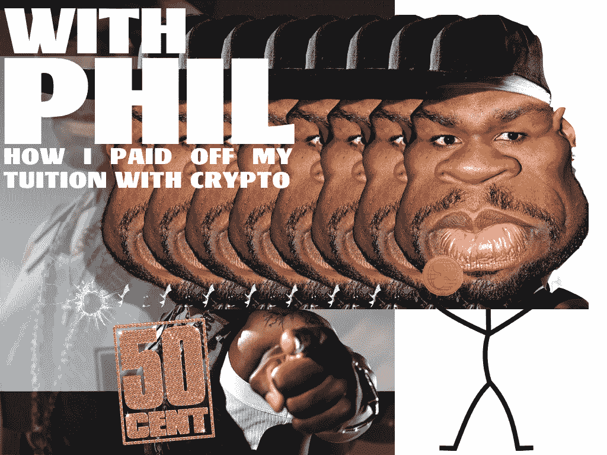

# 我是如何用密码付清学费的

> 原文：<https://medium.com/hackernoon/how-i-paid-off-my-tuition-with-crypto-da41ee2550d1>

> 我的几张钞票变成了大乐队，我感觉像 50 美分。

Be prepared for my awfully edited covers for my articles

首先，是的，标题可能有点误导。(目前)大学还没有可以用比特币或莱特币支付的功能，但有一种方式可以感谢加密货币帮助你完成教育。

其次，这不是那种保证你付清学费或任何债务的文章，这只是一个关于我所做的事情以及你如何从中受益的故事！

因此，我在大学三年级，努力在不负债的情况下度过难关。我的大学基金快用完了，去年夏天我了解了比特币的所有热潮。我听到了和你一样的成功故事，所以我对自己说‘为什么我不能像他们一样？’

你们还记得关于 Ripple 在 2018 年永远不会变成 2.00 美元以及它将如何停留在 24 美分的整个争论吗？嗯，我抓住了投资它的机会，并从中获得了一些东西，因为在今天的世界上，其他人基本上都是百万富翁。长话短说，我的几张钞票变成了大乐队，我感觉像是 50 美分。

马上，我知道 Ripple 会像其他加密货币一样突然下跌，所以我只有一个选择:兑现你的奖金，离开赌场。

我想‘伙计，我可以用这些钱做很多事情！’但是我没有足够的钱去买蓝宝，一点也没有。然而，这足以让一个 21 岁的人有成就感。我本来可以做很多事情，比如在开学前去欧洲旅行一周，或者投资一些别的东西，抓住机会。相反，我开始付清下学期的学费，并把剩下的钱存在我的银行账户里。如果你和我在同一个州，明智的做法是。

你可能想知道我是怎么做到的。这并不困难，也不简单。人们如何描述秘密投资的问题是，他们认为它就像普通投资一样。他们忘记的小事情是你钱包里的私人钥匙，你必须提交并等待整整一周的个人身份证明，以及在计时器超时前你必须知道的数百个加密代码。

在这篇文章的其余部分，我将写一下我用了什么，以及你如何能很快为自己做同样的事情。所以我开始使用 [coinsquare.io](http://coinsquare.io) ，类似于比特币基地，除了你可以投资整吨的美元和美分，而不是有限制。看看吧！注册可能需要一段时间，但它最终会带你去你想去的地方。

我既然用了就以 Ripple 为例，但你必须明白的是，你不能只买 Ripple。Ripple 的母币是比特币，所以你必须购买比特币才能购买 Ripple，明白吗？就像你必须进入麦当劳的洗手间，但你必须先穿过麦当劳。买一份巨无霸套餐，然后你就可以去洗手间了。买比特币，然后就可以交易 Ripple。

所以现在你有了 Ripple(大约 2017 年 10 月)。你等着数字上升，然后砰的一声——到新年来临的时候，你已经富有了。太好了，你真的很富有，我如何在硬币广场上兑现？我转到提取资金选项卡，然后单击直接存款。银行账户信息通过验证后，你就可以取出钱了。但是提醒你，取款时要缴纳一定比例的税，所以你不会得到你在网上存款的准确数目。我希望你还赚了一些钱！

供你参考，我知道我只是用 Ripple 作为例子，但这不是实际的交易建议，这意味着我不是告诉你购买 Ripple，你是在拿自己的钱冒险。最好是研究这些东西，让自己跟上时代！在我写这篇关于 Hacker Noon 的文章之前，我写了另一篇文章来解释我是如何开始监听加密社区的。请点击这里或我的个人资料查看！

我希望你们都能有所收获并订阅！我会每周写博客，记录我对自己的了解，这样我们都可以在旅途中学习。

下周见，干杯。