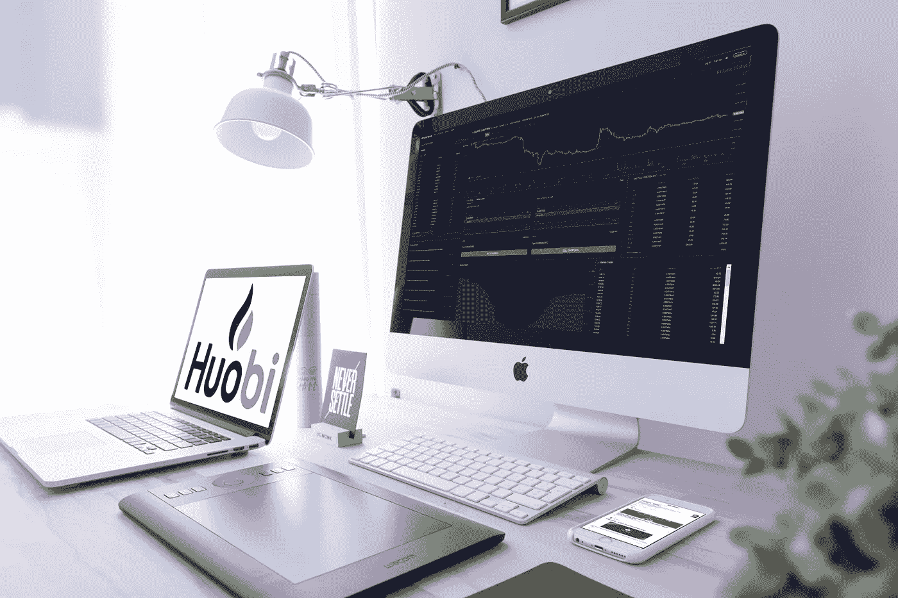
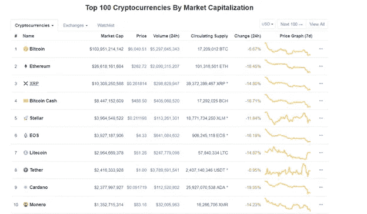
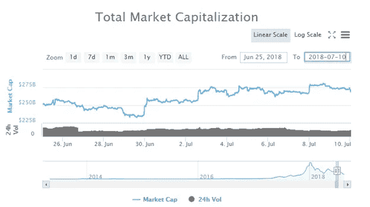
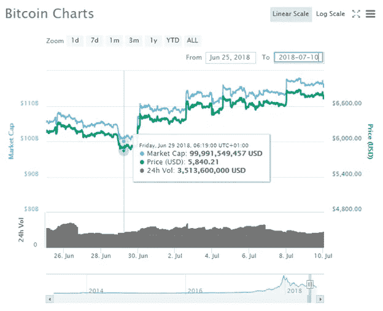
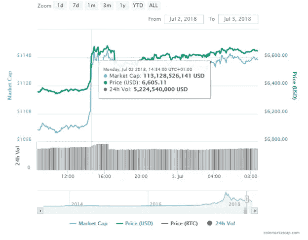

# 我如何在市场低迷时期通过多头交易获利

> 原文：<https://medium.com/hackernoon/how-i-profited-during-the-market-downturn-through-long-trading-9eb6f2052b86>

## ***免责声明:*** *而多空交易等交易手法可以在市场动荡时为投资者提供利润；它们应该只留给最有经验的交易者，他们很好的掌握了这些概念。强烈建议不熟悉这些技术的投资者和交易者要么避免这种交易模式，要么彻底**👀*

**

*[Source](https://unsplash.com/photos/EhTcC9sYXsw)*

*最近市场内的价格调整让加密社区感到非常焦虑，这是理所当然的，在过去的一周内市值蒸发了 200 亿美元。然而，尽管这些损失，目前的市场环境可以提供经验丰富的交易者实现利润，通过这些低迷。使用 [Huobi Global 的保证金交易功能](https://www.hbg.com/en-us/topic/invited/?invite_code=946q3)，更具体地说，通过 BTC 多头交易，我能够在下跌时积累健康的利润。*

# *市场大屠杀📉*

*“加密市场似乎陷入了恐慌”，这是对最近低迷时期的一个非常贴切的概括。24 小时内市值蒸发超过 190 亿美元，投资者突然发起大规模抛售，使市场跌至年度低点。在最低点，总市值在 2018 年首次跌破 2000 亿美元，这是自 11 月以来的最低数字。比特币跌破 6000 美元，而以太坊和 Ripple 受到的冲击最大，因为 Eth 的价格隔夜下跌近 18%，创下 2017 年 8 月以来的新低，交易价格为 264 美元。Ripple 同样创下年度新低，下跌 14%，收于 0.26 美元。*

**

*A sea of red descended over the crypto markets | [Source](https://coinmarketcap.com/)*

*虽然很难说出这次市场低迷的具体原因，但各种消息和因素的结合导致了抛售。Blockstream 公司首席战略官 Samson Mow 表示，*

> *大多数加密货币在很长一段时间内都被高估了……与去年相反，而不是 FOMO；人们感到恐慌，纷纷逃离。*

*回到 6 月份，当时市场反弹，特别是比特币，因为人们希望比特币支持的 ETF 将获得批准。然而，SEC 尚未批准此类事件，这与越来越多的人担心主要在 Eth 筹集资金的 ICO 项目现在正在清算加密项目的货币不谋而合。市场从 1 月份的高点下跌了 70%,这反映出投资者对商业领域的逐渐渗透和投机性投资的普遍停滞感到沮丧。*

# *潜在的市场反弹？📈*

*虽然许多人会说试图预测加密市场是徒劳的，但最近价格波动的剧烈程度自然会导致价格上涨。随着许多替代硬币的跌幅超过 50%，市场小幅上涨是可以预期的。然而，这轮回调没有确定的持续时间，也可能没有投资者希望的那么强劲。尽管许多货币达到了年度低点，但目前的价格似乎并不值得如此低。人们普遍认为，比特币 ETF 的采用有些停滞，更明显的是，人们强烈依赖并几乎预期比特币 ETF 将获得批准。然而，尽管文克莱沃斯 ETF 遭到了预期中的拒绝，但市场仍在继续下跌。这更加令人困惑，因为一些最好的加密相关新闻已经在这段时间内发布，如纽约证券交易所的所有者 [ICE 一直在致力于比特币平台](http://uk.businessinsider.com/ice-new-york-stock-exchange-owner-bitcoin-trade-platform-in-the-works-2018-5?r=US&IR=T)以及在[南韩](https://www.ccn.com/south-korea-crypto-industry-more-optimistic-than-ever-despite-bear-market/)和[英国等国家的进一步监管进展。](https://www.independent.co.uk/life-style/gadgets-and-tech/news/cryptocurrency-bitcoin-regulation-fca-price-updates-market-a8296411.html)*

# *📝利用霍碧龙策略获利*

****多头交易:*** 这是一种交易策略，交易者将购买一种资产/股票/货币，并希望价格上涨，因为他们将做多。例如，如果我以 10 美元的价格买入 100 股 ABC 股票，交易将花费我 1000 美元。如果我能以 10.50 美元出售股票，我将得到 1050 美元和 50 美元的净利润，减去任何交易费用。这将是长期交易的理想场景。或者，如果 ABC 股价跌到 9.50 美元，在 1000 美元的交易中赚回 950 美元，我损失 50 美元加上任何交易成本。*

*最近，从 6 月底到 7 月初，市场出现了价格反弹。总市值增加了 450 多亿美元，从 2350 亿美元增加到 2800 亿美元。*

**

*The markets suffered large dips late June, followed by a substantial rally early July | [Source](https://coinmarketcap.com/)*

*正是在这个上升期，我能够和霍比一起做多，并执行一些 BTC 多头交易。*

*1.6 月 29 日，利用保证金交易，我借出价值 2000 美元的 USDT 做多 BTC，通过 [Huobi Global 下单。](https://www.hbg.com/en-us/topic/invited/?invite_code=946q3)*

*2.订单是在 BTC 大约 5800 美元的时候下的。*

*3.然后，我将我的限价单设为 6600 美元的 100%资金。*

**

*The dip allowed for a very good opportunity to make a long trade at $5480 | [Source](https://coinmarketcap.com/)*

*4.7 月 2 日，BTC 价格一达到 6600 美元，我的多头订单就被执行，我所有的资金都被卖出。*

**

*The ensuing surge in prices, meant my long trade was a success | [Source](https://coinmarketcap.com/)*

*5.因此，如果我计算一下:*

**2000/5840 =****0.342465****

**0.342465 * 6600 =****$ 2260.3****

**$ 2260.3–0.3%(边际利率)**

**=****【259.49 美元****

*因此，如图所示，我能够通过我的 BTC 多头策略赚取可观的利润。请记住，我能够贷款 2000 美元购买 BTC，因为我已经做好了损失这笔投资的准备，如果价格下跌，而不是上涨。俗话说得好，只投资你能承受的损失。*

# *建议未来的策略⏲*

*这篇文章的读者，有兴趣更好地为加密价格的可能反弹定位，有这样做的选择。当试图为潜在的价格上涨找到最有利的基础时，读者应该:*

## ****综合分析价格走势****

*虽然价格大幅下跌，尤其是在非常短的时间内，通常会导致回调，但这并不总是相关的。检查以前的损失，看看复苏是如何进行的。也要特别注意任何重大新闻，这些新闻可能有正面或负面的影响；尤其是在当前的市场中，任何一种轻微的情绪都会导致市场出现相当大的波动。*

## ****有资金可用****

*虽然这可能很难做到，尤其是在严重的闪电下跌中，但为我们正在经历的损失等事件准备好资金始终是明智的。由于加密的高度易变性质，保持长期和短期方案的可访问资金将是有利的。现在，保证金交易者可能很乐意借钱，但无论如何，投资你能负担得起的才是关键。*

## ****以较小的位置开始****

*虽然在一个大的位置上做多可能很诱人，特别是当大多数替代硬币创下历史新低时，但是，这种本能需要被控制住。考虑一个买入位置，是你正常投资额的一半甚至更少。关注当前的新闻和信息，从小仓位开始，如果你早一点下单，将有助于减少更大的损失。*

# *边际交易如何提高回报💹*

*保证金交易意味着利用你的头寸购买股票或货币。这类似于从交易所贷款。它允许交易者购买比正常情况下更多的货币。*

*融资融券交易存在于借贷市场。在我们的场景中，贷款人将是交易所，他们将向交易者提供贷款，为他们提供投资更大数量硬币的能力。交易所的好处是这些贷款的利息。*

*保证金购买是在价格上涨的情况下运用杠杆将潜在利润最大化的一个例子。举个例子:*

*读者认为一枚硬币的价格，比如说月亮硬币，目前价值 20 美元，将会升值。他们想买 100 股，但只有 1000 美元。如果读者坚持购买全部 100 股，而不是他们能够负担的 50 股，读者可以从交易所借入额外的部分，比如说保证金。如果价格上涨，符合读者的预期，这是最好的结果。如果 Mooncoin 涨到每枚 30 美元，他们的投资就值 3000 美元，保证金贷款就要 1000 美元。如果投资组合被出售，总金额将支付贷款，留给读者 2000 美元。通过保证金交易，读者的钱翻了一倍。*

*如果使用得当，杠杆可以为交易者带来丰厚的利润。但必须承认，它仍然是债务，所以请注意，未偿金额最终将需要清理🤘*

****免责声明:*** *请仅将此信息作为我的* ***自己的*** *意见，在任何情况下都不应视为财务建议。在做任何决定之前，请记住****DYOR****🤓**

*♂️你好，我叫萨尔。*如果你觉得这篇文章很有用，并且想看我的其他作品，请一定要鼓掌并在 medium 上关注我！😎**