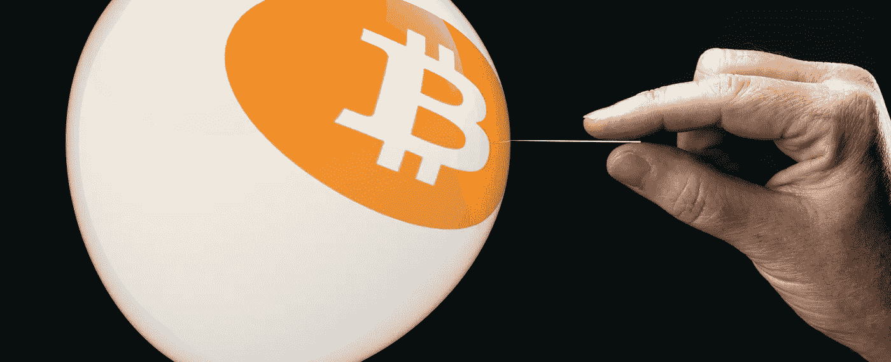
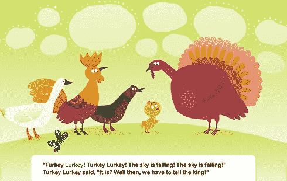
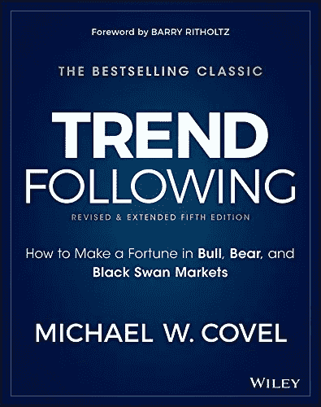
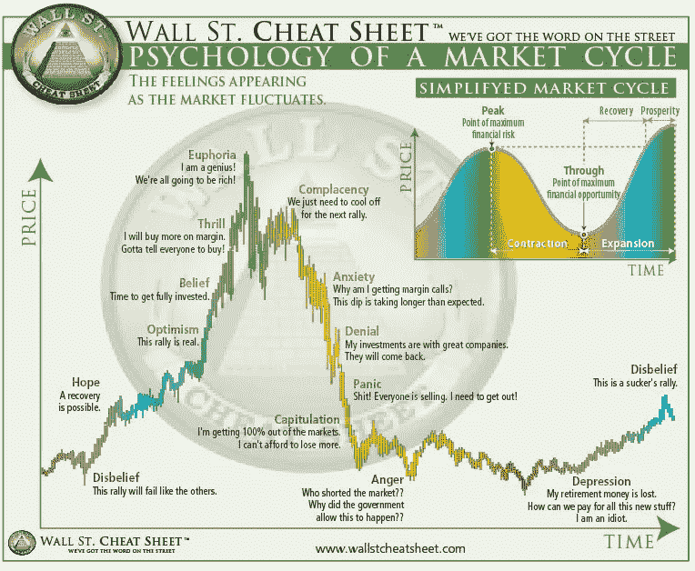
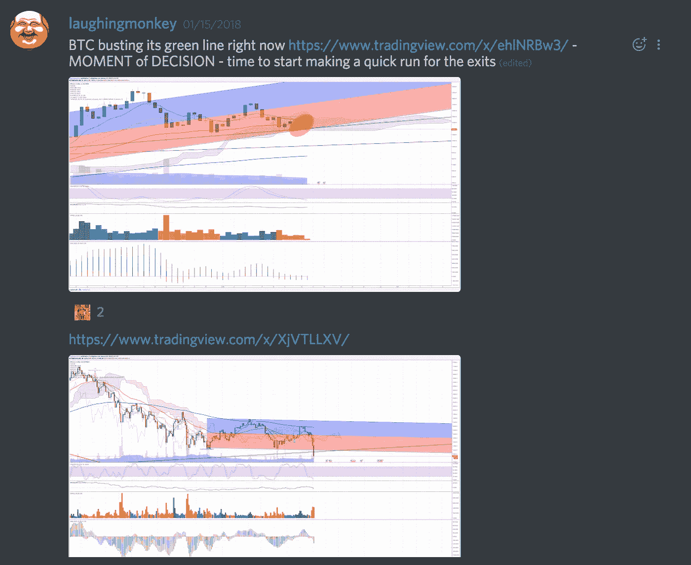
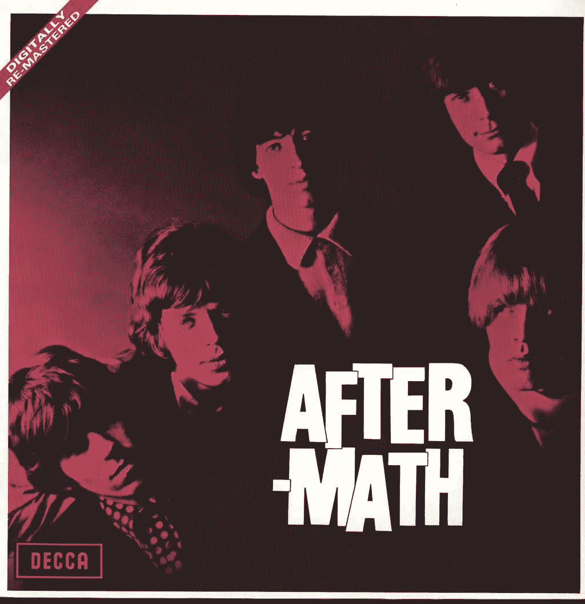
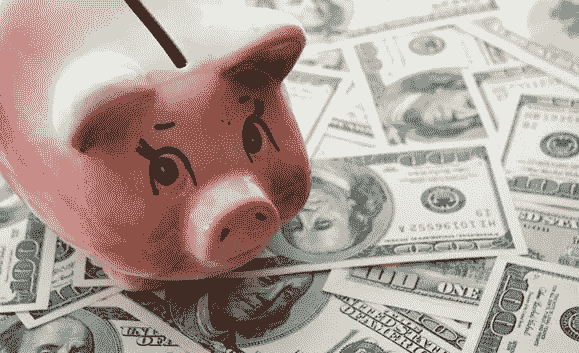
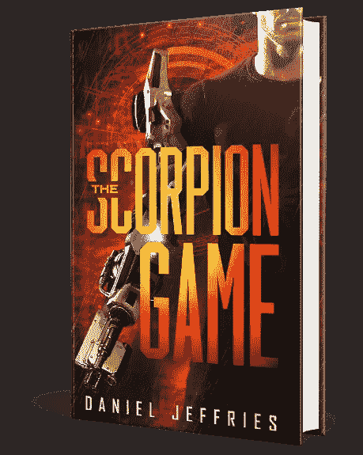
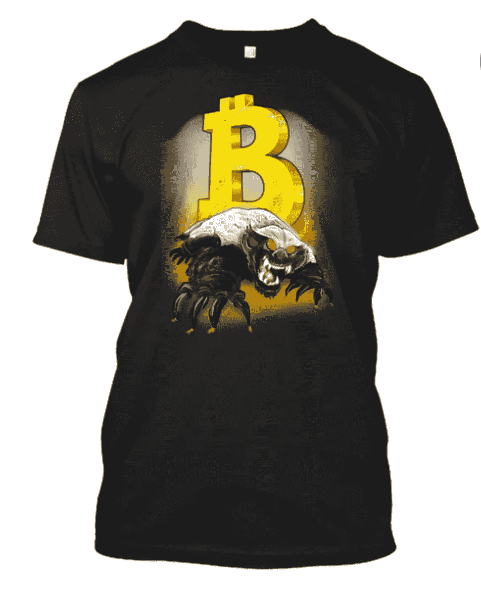

# 我如何提前五个小时预见到加密市场的崩溃，并在为时已晚之前让我的人离开

> 原文：<https://medium.com/hackernoon/how-i-saw-the-crypto-market-crash-coming-five-hours-early-and-got-my-people-out-before-it-was-too-c2f26933db23>

我向前弓着身子，双肩紧绷，目不转睛地盯着屏幕，价格在图表上飙升。

“滚出去！”我脑海中那个小小的声音尖叫道。

我像往常一样忽略了它。

[Chicken Little. The sky is falling!](https://www.speakaboos.com/story/chicken-little)

那个愚蠢的声音是胆小鬼。天总是要塌下来。它的存在是为了让你免于坏事发生，但问题是它总是认为坏事正在发生。你的大脑在每个角落都能看到灾难。它是这样连接的。

而且通常都是错的。

但是今天不一样。

有*就有*出事了。我就知道。我只是还看不清楚，因为我的头在疯狂地旋转，我的心在胸腔里打雷。

一连串令人困惑的建议冲击着我的头脑。

“不听。你很好。一切都很好。HODL。”

“还记得那次你在大逃亡前卖掉了吗，失败者？哈哈哈哈！这就是正在发生的事情。永久多头是对的。永远涨下去！”

“这是海市蜃楼。你无法预测未来。你做梦去吧。坚持住。你会错过大好时机的。”

但我也忽略了这一切。我集中注意力，在图表上激光扫描，从腹部深呼吸，放下恐惧和兴奋，这是心脏的孪生伪装。

一分钟过去了，然后又是一分钟的完全沉默，声音变得安静，回落到白噪音。我的情绪随着海浪退去，现在我很平静，看得很清楚。

“这张图表告诉了我什么？仔细检查指标。看清楚了，不带感情。不要猜测。缩小。看更长的时间线。你看到了什么？”

我翻到比特币的单日图表。

就在那里。

答案。

是时候离开了。

我悄悄地警告我不和谐的人，然后开始向消防出口走去，强迫自己慢下来，这样我就不会恐慌别人。

我看到了什么？

让我们回到过去，一帧一帧地看下去。我会让你知道我到底看到了什么，为什么我会逃出生天，并活下来继续战斗。

哦，是的，我和 T4 在每个人都不景气的时候赚了钱。

我是怎么做到的？我有上帝一样的透视能力吗？号码

嗯大部分是没有的:)

但是我有一套规则。这些规则救了我一命。

# 现在是下午四点，你知道你的止损在哪里吗？

我不会撒谎。在我的大空头之前，对我来说是丑陋的一周。我在大出血。

在经历了三四周的疯狂 alt 并为我带来一场又一场胜利后，突然我又输了。

硬币在疯狂的拉锯中破碎并被拉回。我进来得太晚，离开得太早。我很沮丧，对自己很失望，与不断查看图表的冲动作斗争，在妻子说话时不注意她。

在我的信号告诉我出了问题后，我在本周早些时候退出了。但是几天过去了，我错过了行动。我想回来。

这是第一个错误。如果你有一个系统，坚持下去。每当你感觉需要再次参与行动时，这通常是错误的选择。

记住:**现金是头寸**。

这种立场表明你看不到市场的任何清晰模式或方向。alt 正在蓬勃发展，但现在他们变得波涛汹涌。他们失去了动力，他们的财富引擎在牛市的顶端熄火了。

当这种情况发生时，最好是观望，直到市场下定决心要做什么。

我回到市场，没有任何原因，只是因为我想要果汁。非常非常糟糕的主意。

我的系统说出去，我忽略了它。

[Go grab this book right now](http://amzn.to/2BrmVuJ) because its cover is bright blue.

我的系统是什么？这是一套基于追随大师[海龟](http://amzn.to/2DKr5k4)的老派趋势和[理查德·唐奇安的](http://www.newtraderu.com/2017/08/07/richard-donchian-trading-rules/)强有力的规则的规则，最早写于 1934 年，它只是表明市场永远不会改变，因为人类的心理永远不会改变。稍后会详细介绍。

所以我回到市场，被人砍死了。几天过去了，我的交易都没有成功。我把我在强有力的、合理的交易中赚到的钱退回去，进行小规模的削减，慢慢地放血。

我开始问问题。

发生什么事了？我为什么要交易？为什么我会在这个市场？当我回来的时候有什么真正的理由吗？

答案是否定的。

我开始减仓。但即使这样也不够。我不能完全放手。

我还有大约 50%的筹码在市场上。出于某种原因，我没有听从我的高我。又一天过去了。发生了什么事？我想不通。

我在做什么？我不再做这个了。我知道如何交易。我不会做出这种愚蠢的决定，但我却像个白痴一样把事情搞砸了。这是怎么回事？

有时候会这样。不管你知道多少，你总是在和自己斗争，有时你会失败。

快进到市场崩溃的那天。

# 如果一开始你不听，就自己打醒自己

当我盯着屏幕上的匕首时，我又开始质疑我的动机。

如果你在做愚蠢的交易或违背你知道是对的，你不能让自己摆脱困境。你必须坚持下去，不断提问。

这一次，在经历了又一个亏损的夜晚后，我对自己更加严格了。

你他妈的为什么在这个市场？

这些交易中有好的吗？我看到很多红色。你的规则说出去，你还在这里玩？为什么？

The universal market cycle. NOTHING is immune. Not even your and my favorite cryptos.

3:30 我专注于比特币。那是一张难看的图表。它看起来就像著名的市场周期图，显示了一个大的运行和一个大的崩溃。你知道我说的那个，因为我以前贴过，但是让我们再放一次，以防你错过。

然而，并不是这样，因为我在上个月的大部分时间里一直看到这种模式。这不是新的。然而现在有些不同了。什么？

我缩小到一天的图表，它讲述了一个可怕的故事。让我们来看看。

这是我在 **CoinSheet Discord** 和 [**比特币泥瓦匠 Discord**](https://www.bitcoinmasons.com/r/031a2f22d6a36d878fc136c3b170276f) 上发布给我的粉丝的图表。

那是我，放大来仔细观察比特币一日图的蜡烛。

以下是我注意到的:

蜡烛正下方的红线是指数移动平均线 50 或 50。它将价格平均在 50 根棒线上，对最近的价格给予额外的权重。我不会用数学来烦你，但是你可以谷歌一下。在这个图表中，这意味着它是 50 天的平均值。

注意最近价格是如何多次突破均线 50 的？

我们可以看到，几周以来，比特币一次又一次地在这条线上徘徊，然后反弹至较低的高点。你可以看到蜡烛底部的长灯芯穿过这条线，这意味着价格穿过它，然后反弹。你也可以看到整根蜡烛多次穿过这条线。

一点都不好。

我再次拉远，数着比特币在大牛市期间突破这条线的次数。原来它只做过两次，每次都是一天，分别是在 9 月和 11 月。就是这样。两天。

在过去的几周里，它一次又一次地突破了这条线。

但平心而论，目前还不清楚事情会朝哪个方向发展。我得到了混乱的信号。

粉红色和紫色的 [**线性回归通道**](https://www.youtube.com/watch?v=zPG4NjIkCjc) 仍然指向上方。线性回归通过混乱的点模式(如股票价格)找到最佳直线。随着比特币的历史性大发展，该频道仍然指向天空。

前一天的最后一根蜡烛也以近乎完美的[道指](http://stockcharts.com/school/doku.php?id=chart_school:chart_analysis:introduction_to_candlesticks)收盘，这通常是反转的信号。随着价格在线性回归通道和 doji 的底部，它可能很容易地发出一个上升趋势回归的信号。

这才是真正的问题。

图表是混合信号城市。

这意味着不确定性，这让我想起了唐奇安的一条重要规则。

> “当市场地位不确定时，轻承诺是明智的。清晰定义的动作被频繁地发出信号，足以让生活变得有趣，专注于这些动作将防止无利可图的拉锯。”

当你不知道市场下一步会做什么的时候，就不是徘徊和期待大牛市回归的时候。是时候在市场上认真减仓了。

以下是我在不和谐中为我所有的追随者发布的内容。时间是 2018 年 1 月 15 日 4 点 30 分左右。

短语“爬行”来自另一个重要的唐奇安法则:

> "注意次要或主要趋势线的爬行或反复碰撞，准备好看到这些趋势线被打破."

这正是比特币当时正在做的事情，一路滑行。它也非常非常接近我几个月前在牛市中间画的一条绿线。你可以在图上的均线下面看到它。如果它打破了长期趋势，我知道我们就有大麻烦了，因为它甚至在近三个月内都没有接近它。

我很快开始抛售我所有的 alt 头寸，因为我知道比特币的大幅下跌会拖累所有人。有太多开仓，我知道我没有机会在大抛售中足够快地平仓。我合并到比特币，坐在那里等着看这个硬币之王下一步会做什么。没过多久就变得非常清楚了。

太平洋时间下午 5 点刚过，我的液晶显示器上出现了世界末日的第一个迹象。

**价格穿过均线*和绿色毁灭线*快速下跌。**

是时候离开了。

当市场做出如此重大的变动时，没有时间等待了。你得先卖了再问问题。

我在混乱中贴了一张便条警告人们，然后开始向出口跑去。我没有在 Twitter 上发帖，因为我不想冒险引发更大的恐慌，尤其是如果我错了。

这是我写的。

如上所述，上面的图表显示一天的蜡烛线开始低于线性回归通道，均线 50 和绿色毁灭线。它还显示了一个小时的图表，其中的运动更为明显。我不经常看一小时图表，除非我想看价格运动有多快，它就像摩天大楼上掉下的巨石一样！

我把所有东西都卖给了菲亚特，然后等待。

五个小时后，市场变成了一场血战。

在那时，这种趋势变得非常明显。下去。很快。

我回到市场，尽我所能做空每一枚硬币，因为它们都出现了重大亏损。

当全世界都在流血的时候，我却在赚钱。

# **善后事宜**

我想在这里非常非常明确。

**比特币的价格可能向两个方向发展。**

那样的话，这篇文章的标题就有点误导了。我真的不确定比特币会崩溃。

我所知道的是市场正处于一个大的转折点。这意味着出去。

为什么？

简单。

如果市场接近一个潜在的大跌幅，它通常会发生得很快。一旦你陷入滑坡，你就被困住了。没有可怕的损失几乎不可能卖出去。第二天，有人给我发消息说，他们的损失从几十万美元降到了 4 万美元或更少。多人。有些人损失更大。这就是它移动的速度。而且是毁灭性的打击。有些交易者永远不会忘记。

另一方面，假设多头控制了市场，价格回升。好的，没问题。你错过了一些跑步。那又怎样？让反弹开始真正站稳脚跟。小心点。让它超越几个小时，延伸到几天。确保它是真实的。错过 10%或 20%，然后跳上车。你保护了你所有的钱，现在你可以晚一点参加派对了。

**在交易和生活中，迟到早退。**

**那叫吃身体，留头留尾。**

你比其他人晚一点开始跑步，让别人去猜，你在跑步开始停止后退出，错过了最大跌幅。你在聚会上迟到，喝完所有的酒，吃完所有的食物，把烂摊子留给别人收拾。(好吧，生活中不要那么做，只在交易中)。

换句话说，你跑完了 70-80%的路程，还能活着继续战斗。

这又回到了交易的第一法则。

**不亏。**

这是我的交易哲学的精髓，它很有效。这是历史上最伟大的交易者的哲学，他们战胜了市场三四十年。

叫做**趋势跟随**。

趋势跟踪不同于其他系统。许多人试图预测价格走向。如果碰到这条或那条支撑线，它就会反弹。我现在忽略了那些预测，因为它们是对的，也是错的。

相反，我会等待趋势发展，然后随波逐流。像一只螳螂，我等待市场来找我，然后猛扑过去。

这是反直觉的。这违背了基本的本能和你一生中被告知的关于交易的一切。

趋势跟踪利用异常值，即偏离正常的大值。

大多数时候，市场接近其平均水平，但随后一个黑天鹅事件发生了，长期购买者和持有者被彻底摧毁。趋势跟踪在巨大的波动中赢得了所有的胜利。当市场反弹时，它的回报只是平均水平，但一旦大牛市来临，或者大抛售摧毁了一切，趋势跟踪者就会跳进市场，获得巨额回报。

当市场没有趋势时，全垒打弥补了所有的来回波动。

现在一些人似乎很困惑，当我也有文章推荐买入并持有时，我会卖出。让我为你澄清一下。我有两叠。一个是买入持有，一个是交易。两者之间的差距高达 50/50，但最近更像是 70/30 或 80/20，因为我喜欢在市场趋势时交易。如果你做得对，趋势跟踪比买入并持有有更高的回报率。

我的买入并持有也是*而不是*与大多数人的买入并持有相同。

通俗版的“买入并持有”是华尔街卖给人们的一种幻想，目的是窃取他们的钱。它基于一个叫做有效市场理论的疯狂想法，即每个人都有关于市场的完美信息，所有资产都被公平定价。

它不起作用。最终，一场黑天鹅事件不可避免地降临，抹去所有买入和持有的巨额收益，就好像它们从未存在过一样。你可以买入并持有 10 年，然后一夜之间全部抹去。华尔街从你的费用中赚钱，而在你耐心坚持的最后，你会得到一个大便三明治。不给力。

我在 [**掌握 Shitcoins:穷人致富指南**](https://hackernoon.com/mastering-shitcoins-the-poor-mans-guide-to-getting-crypto-rich-2e469b762ba9) 中提出的买入并持有策略是一个**微型风险投资策略**。虽然大多数人从来没有真正从购买和持有的投资组合中恢复过来，但小额风险投资策略投资硬币就像风险资本家投资公司一样。他们假设 80%或更多的概率为零。零分。没有。没什么。

80%?是啊。

剩下的 10%会做得很好。

但是最后的 10%才是最重要的。那些是本垒打。

全垒打弥补了所有其他的失败。这是基于概率而非希望的买入并持有。

当然，当硬币飞向月球时会发生什么？

**你卖。尽快卖出去。**

你不会永远抓住它不放。你拿了钱就跑。

你看，即使买入并持有也需要退出策略。

当你交易时你需要一个，当你持有时你需要一个。如果你的收获没有实现，你猜怎么着？它们是不现实的。这意味着在你卖掉之前它们不是你的！如果你还在计算你在比特币 20，000 美元高水位的筹码，我劝你重新考虑一下。它比那个高点低了 50%,这意味着你的筹码也是如此，而且不能保证它还会回到那里。

哦，不要误会我。我认为会，我也希望会，但希望不是一种交易策略。做最坏的打算。你必须学会在顶部附近卖出。这是交易和生活中最难学习的课程之一。

你卖了之后呢？

投资的首要目标是保护那些来之不易的收益。

**那是因为投资的魔力在于** [***复利*收益**](https://www.investopedia.com/university/beginner/beginner2.asp) **。**

让我们看一下价值 200，000 美元的交易筹码和价值 45，000 美元的交易筹码。想象一下，你能够在七年内获得 20%的回报率。

如果你在比特币热潮中成功积累了高达 20 万美元的筹码，并在大屠杀中设法保住了这一筹码，那么七年后你的筹码将会是这样的:

$716,636.

现在，让我们说你在一次重大的加密大屠杀中不惜一切代价 HODL，你看着你的筹码在几天内从 200，000 美元蒸发到 40，000 美元。如果我们取同样的 7 年和 20%，假设你首先吸取教训，然后聪明地交易，你的回报率是多少？

$143,327.

这是一个*大*的区别。

当你交易时，你必须努力保护你的资产。就这么简单。这就是为什么理查德·唐奇安的至理名言是你应该马上打印出来贴在墙上的。

> “交易就是交易，游戏的名字就是增加你的财富。交易员的工作描述非常简单:不要亏损。

或者可能是巴菲特说得最好:

> "**法则№1:永远不要亏钱。**
> 
> 规则 2:永远不要忘记规则 1。

############################################

免责声明:做个大男孩或大女孩，自己决定把辛苦赚来的钱花在哪里。我不是财务顾问，这也不是财务建议，如果我真的需要告诉你这些，那么无论如何最好把你的钱藏在床垫下，因为当你失去它时，你只会因为你的错误而责怪别人，而不是你自己。

###########################################

## 如果你喜欢我的作品，请访问我的个人主页，因为在那里我和我所有的粉丝分享特别的见解。顶级赞助人可以独家访问传奇的硬币表 Discord，在这里您可以找到:

*   **市场呼声**来自我和其他专业技术分析大师。
*   进入**硬币的**只能**私聊**。
*   **幕后**看看我和其他专业人士是如何解读市场的。
*   **您还可以独家访问每月与我虚拟会面**，在那里我将分享我正在做的一切，并让您在幕后了解我的流程。
*   我会关注每一次与**阿 Q & A 会话**的谈话。问我任何问题，我都会回答。

############################################

如果你和我一样喜欢密码空间，过来加入 [**DecStack 吧，这是密码货币和分散应用项目的虚拟合作点**](http://decstack.com/) ，在那里你可以接触多个项目。它永远是完全免费的。进来，社交，一起工作，分享代码和想法。通过反馈让你的想法更好。寻找新朋友。见见你的新家人。

############################################

想了解我对这个星球最独家的故事和最实用的硬币研究，请查阅[**战略硬币**](http://strategiccoin.com/category/news/) **！**

############################################

*关于我:我是一名作家、工程师和连续企业家。在过去的 20 年里，我涉及了从 Linux 到虚拟化和容器的广泛技术。*

## 读者称我的突破性纳米小说《蝎子游戏》T18 为“与神经癌的第一次严肃竞争”和“黑色侦探遇见约翰尼·助记”。

##################

## 最后，你可以[加入我的私人脸书小组，纳米超人刺客](https://www.facebook.com/groups/1736763229929363/)，在那里我们讨论所有的东西，科技，科幻，幻想等等。

############################################

## 你没有[金钱獾 t 恤是有原因的吗？](https://teespring.com/money-badger)你可能想要一个，因为它们比比特币便宜很多。

The [ultimate Bitcoin t-shirt](https://teespring.com/money-badger)! Grab one for your crypto loving friends for Christmas.