# 我如何设定和执行 50 年目标

> 原文：<https://medium.com/hackernoon/how-i-set-and-execute-50-year-goals-why-i-see-cutting-in-lines-as-morally-right-f4d0ce28574f>

## Serge 的其他深度文章:

 [## 我 32 岁，花了 20 万美元在生物黑客上。变得更平静、更瘦、更外向、更健康、更快乐。

### 这篇文章是关于如何使用现代科学和个性化医学让自己更健康，更有效率和…

hackernoon.com](https://hackernoon.com/im-32-and-spent-200k-on-biohacking-became-calmer-thinner-extroverted-healthier-happier-2a2e846ae113)  [## 如何生物破解你的智力——从性到莫达非尼到摇头丸

### 我在假期有一些空闲时间，写了这篇文章来展示，基于一个个人的故事，许多…

hackernoon.com](https://hackernoon.com/biohack-your-intelligence-now-or-become-obsolete-97cdd15e395f) 

# 更新时间:2019 年 1 月

> 作者注:写这篇文章以来，我想了很多。我故意让它变得非常具有攻击性，因为我想让人们谈论它并关注它。但是有些攻击性太过了，不符合我的价值观。
> 
> 我希望我们这些(像我一样)想成为后人类的人有一个美好的未来。我想鼓励所有人探索增强他们的健康、智力和生产力。如果你不这样做，就真的有被落下的危险。我也希望所有的人类共享一个惊人的、宏伟的未来，不管他们是否选择成为跨人类/后人类。
> 
> 如果我们做得好，我们将拥有无限的资源，这样每个人都能受益。人类和后人类的宏伟未来是兼容的。
> 
> 为此，我编辑了这篇文章，删除了一些我认为不能反映我如何看待这个世界的语言。要明确的是，我不会以任何方式背弃我的激进信念或目标。我刚刚意识到，我认为这些目标必须与他人的目标对立是错误的。每个人都有美好的未来。
> 
> 稍后我会写另一篇关于这个主题的文章。

# 介绍

在我之前的 [文章](https://hackernoon.com/im-32-and-spent-200k-on-biohacking-became-calmer-thinner-extroverted-healthier-happier-2a2e846ae113)中，我谈了很多关于如何利用生物黑客变得更有效率、更健康、更聪明。

i just realized why one of my favorite [blogs](https://waitbutwhy.com/) is named the way it is. brilliant.

> 编者按:这个故事包含了一些限制级的目标黑客方法。我们出版它是因为我们想让读者了解科技行业的真实情况。继续进行，风险自负。

但是，等等，它留下了一个非常重要的问题未被探究:把生产力和智力投资到什么上。为什么呢？

这是一篇关于我如何设定目标并对其进行优先排序的文章。它不是“我的目标很棒，比其他目标更好”的陈述。虽然这显然是我的感觉。

把它当做一个你可能会觉得鼓舞人心的个人故事来读。或者不是。

# 我的方法概述:

1.  **清晰、持久的长远眼光**。我非常坚定地持有自己的愿景，很少改变，视之为无限。它是我身份的核心，是我是谁的中心，也是我早上起床的理由。
2.  **将我的长期愿景转化为日常行动的线索**。长期愿景= >十年主题= >年目标= >季度目标= >周/日行动。
3.  **尽量减少那些不会推进我长期愿景的废话**。我授权、支付、忽略等。；只要我不做就没关系。

除此之外，我认为优先顺序并不重要。当我做深度工作时(你可以在我之前的[文章](https://hackernoon.com/biohack-your-intelligence-now-or-become-obsolete-97cdd15e395f)中读到如何最大化深度工作)，我只是在任何给定的时刻选择我觉得最令人兴奋的目标。这使得深层工作变得更加容易。

# 第 1 部分:长期愿景

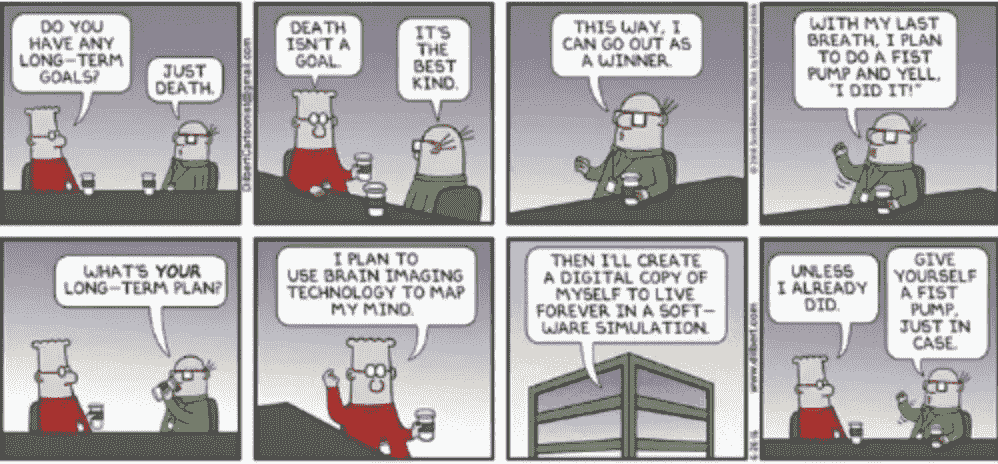

这是我的:

*打造平台公司之一，为我们带来独特性。帮助我们成为不朽的后人类神，摆脱我们生物学的限制，并传播到整个宇宙。成为这场变革的领导者。确保我的价值观(自由和追求知识)引领未来。在无限的追求更多的知识和更多的自由中度过无限的未来。*

我花了很长时间才达成这个愿景。作为(1)基础哲学(2)逻辑+数学(3)的组合，看到拥有这种愿景让我在情感上感到快乐。

让我来告诉你。

## (1)哲学:

我在科幻小说中长大，在一个科学家和工程师的家庭中，他们把知识和好奇心视为至高无上的价值。

所以对我来说，知识+追求知识的自由比其他道德价值更重要。

如在“*我深切关心有知觉的有机体追求知识/真理和自由的权利。我不在乎有知觉的生物最终会变得平等。我坚信不平等会持续下去。*

这是一种哲学和道德的观点。我能想出许多听起来很聪明的“理性”解释。例如:*生命的核心是信息处理和局部熵最小化，所以信息是生命的最高价值。*"或"*等式是不稳定的，因为进化需要无休止的迭代循环，系统的某个变体在某方面变得比其他变体更强，并传播直到下一个阶段转换。*

但实际上这只是我的一个公理。大多数人类关于为什么他们的道德价值是正确的合理化只是事后确认偏差。

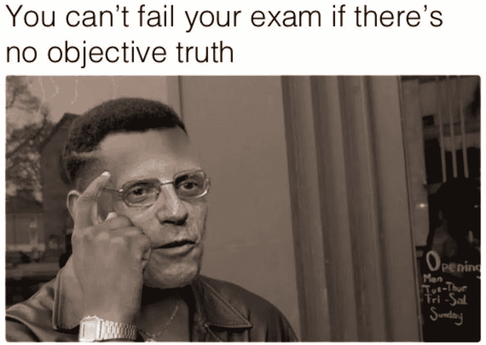

有些人会读到这里，然后说“你一点都不道德，道德必须包括平等/宗教/爱国主义等等”但事实是，道德偏好纯粹是主观的。并且随着时间、文化和许多其他事情而改变。

认为我们中的一员——相互碰撞的微小分子集合——发现了宇宙不可动摇的基本道德法则似乎有些天真。

找到自己的公理。科学的每一个分支都是以公理为基础的。没什么好尴尬的。

## (2)逻辑+数学:

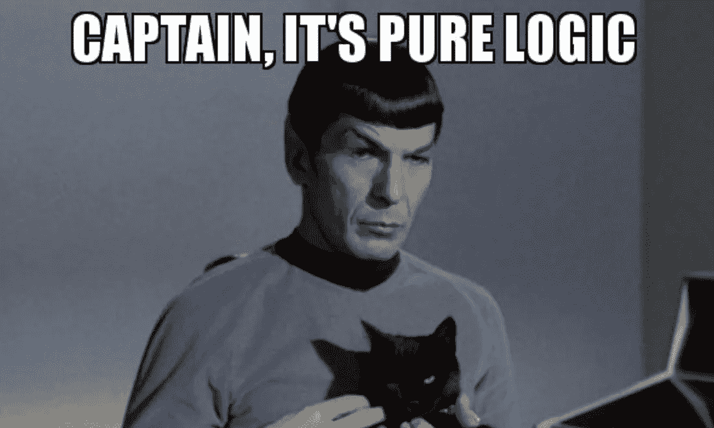

*   对我来说很明显，获取知识的最终瓶颈是时间和认知能力。
*   对我来说很明显，自由的最终瓶颈是死亡。
*   在未来 30-100 年的某个时间点，一些人类将能够获得永生和超级智慧。我的相反观点是，这几乎是必然的。根据**非常大的**假设，我们在这段时间内不会灭绝。

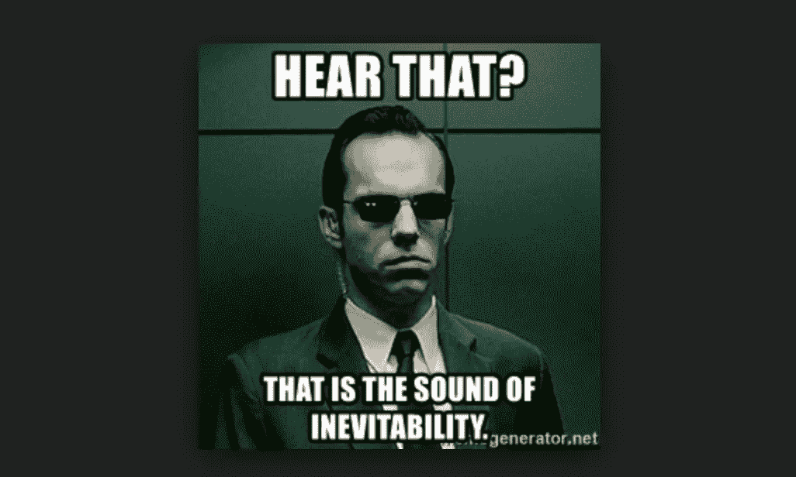

我会写一篇单独的长文，解释为什么我相信超智能和永生很快就会到来。但这里有一个跑题的概述我的推理。

> 我们将能够把人造神经元连接到大脑上；这已经是一个工程问题，而不是科学问题。
> 
> 大脑是可塑的，会整合这些额外的神经元；这将允许额外的云大脑皮层+额外的物理资源(传感器、身体、卫星备份)。
> 
> 这些身体和精神资源可以是一个有凝聚力的有机体的一部分，因为电子设备中的数据传输延迟是光速的几分之一，而有髓神经元中的数据传输延迟为 120 米/秒。有机体的内聚性依赖于潜伏期，因为低潜伏期能够在没有独立自主的个体的情况下协调决策。
> 
> 如果增加额外的资源并逐渐整合，这种有机体将保留其最初的身份和意识。
> 
> 与今天的人类相比，像这样的生物体将是真正不朽的、超智能的人类“神”。我说的不是“强壮的爱因斯坦机器人”我说的是“存在于一百个数据中心的东西，由卫星支持，与数十亿个传感器相连，比所有人类的智力总和还要多。”

> 这通常是人们开始说将有立法或干草叉来阻止这一点。游戏-理论上，阻止奇点是不可能的。
> 
> 核心原因与[囚徒困境](https://en.wikipedia.org/wiki/Prisoner%27s_dilemma)有关。加入即将到来的后人类革命的价值太高了。你为你自己，你的孩子，你爱的人获得永生和超群的智慧。为什么会有人放弃这个？
> 
> 为了阻止奇点，社会需要变成一个极权主义的全球独裁政权。面对与每个人相反的压倒性激励。这需要在未来 30-100 年内实现。
> 
> 此外，如果社会任命试图禁止它的人，很可能会看起来像一群不了解正在发生什么的人。我们这些追求独特性的人也会搬到其他国家去。
> 
> 我认为永生/超智能在本世纪不会发生的唯一情况是人类自我毁灭。我确实认为人类很有可能在本世纪灭绝。而这也是我认为人类控制的奇点需要尽快冲出来的原因之一。

> 我真的希望整个过渡会是和平的。如果我实现了我的目标，我会很乐意与他人分享。只要我感觉不到他们的威胁。宇宙显然对每个人来说都足够大。但如果人类采取行动阻止后人类的出现，将会有来自各方面的大量暴力。
> 
> 以后我会写一篇更详细的文章。感觉协调人类和后人类的兴趣是一个非常有趣的话题。

无论如何，回到目标设定:

*   获取知识的能力(这也是我的最高价值)与时间和智力成线性比例(或者更好)。因此，成为后人类的生命的价值要比没有成为后人类的生命的价值大很多数量级。人类死后的生活将会更长，智力上也更丰富。
*   这意味着，即使成为后人类的[先验概率](https://en.wikipedia.org/wiki/Prior_probability)很低(例如 1%)，花费我的生命将它从 1%增加到 1.2%比其余概率分布的总和具有更多的期望值。我(和许多其他非常聪明的人)认为先验概率比 T4 高得多。

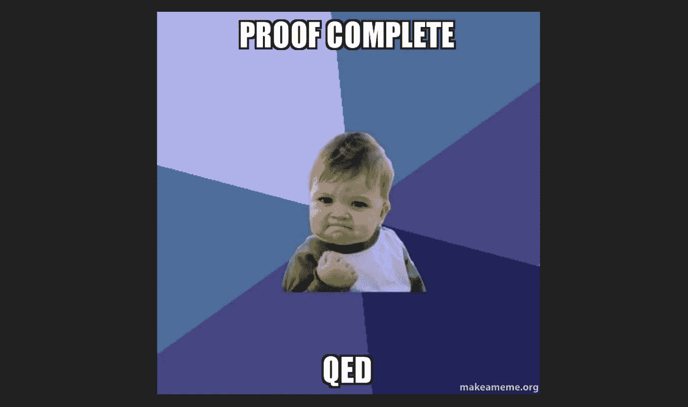

因此，从数学的角度来看，对我来说，投资于我的长期愿景之外的任何东西都是毫无意义的。

## (3)情感快乐:

我们来看两个场景:(1)我失败了(2)我成功了。

(1)如果我失败了，我会用我的一生去追求对我有深刻意义的东西。我的长期目标是我早上起床的理由，我的真北，我的 ikigai。这种意义会一直延续到最后。如果看起来我太老了，离我的目标还太远，我会把自己冷冻起来。也许以后我会复活，也许不会。但关键是我的追求永远不会无望或令人失望。即使在我的意识体验暂停或停止的那一刻，我也会看到成功的物质可能性。

(2)如果我成功了，那么成为不朽和超智能将只是向上无尽楼梯的小小的第一步。我的目标甚至不是不朽或超级智慧，而是追求知识和自由。无论我们变得多么强大，宇宙都会提供新的有趣的挑战。500 年后，我想建造一个太阳系大小的超级对撞机来模拟黑洞。或者考虑如何在光速通信延迟的情况下建立一个有凝聚力的星际文明。有趣的事情，未来数百万年的探索前景。生活永远不会无聊。因为我真正的目标是无限的。

最后一点对幸福很重要。许多人把有限的、可实现的目标作为他们生活的意义。赚钱。买房子。生孩子。一旦他们达到了这些目标，他们就会失望。多巴胺能系统会适应，就像它被编程那样。

真正充实的唯一方法是拥有无限的目标，可以无限地追求，并发现这种无限的追求会自己实现。

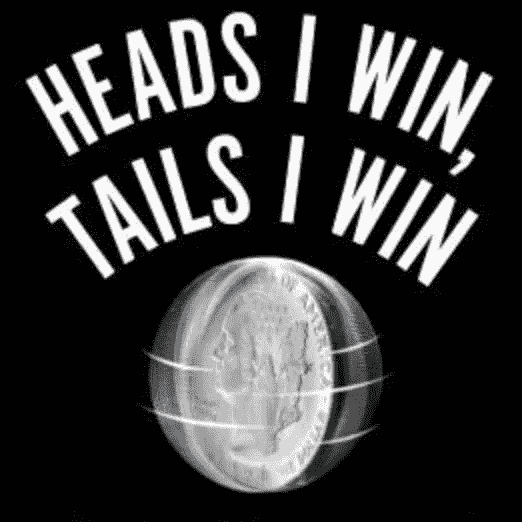

所以这是双赢。无论我是失败还是成功，对无限的未来愿景充满热情的过程在情感上令人非常满意。

## 那么如何找到自己的长期目标呢？

这整篇文章只是我如何找到自己的一个例子。我不知道你怎么能找到你的。但是我会:

*   弄清楚你最终相信什么公理。
*   想想实现这些公理的瓶颈是什么。
*   不断重复，直到你发现你的愿景非常有说服力。

这是一个漫长的过程，你的观点可能与我的大相径庭。但是我觉得没有长远眼光的人生不值得活下去。

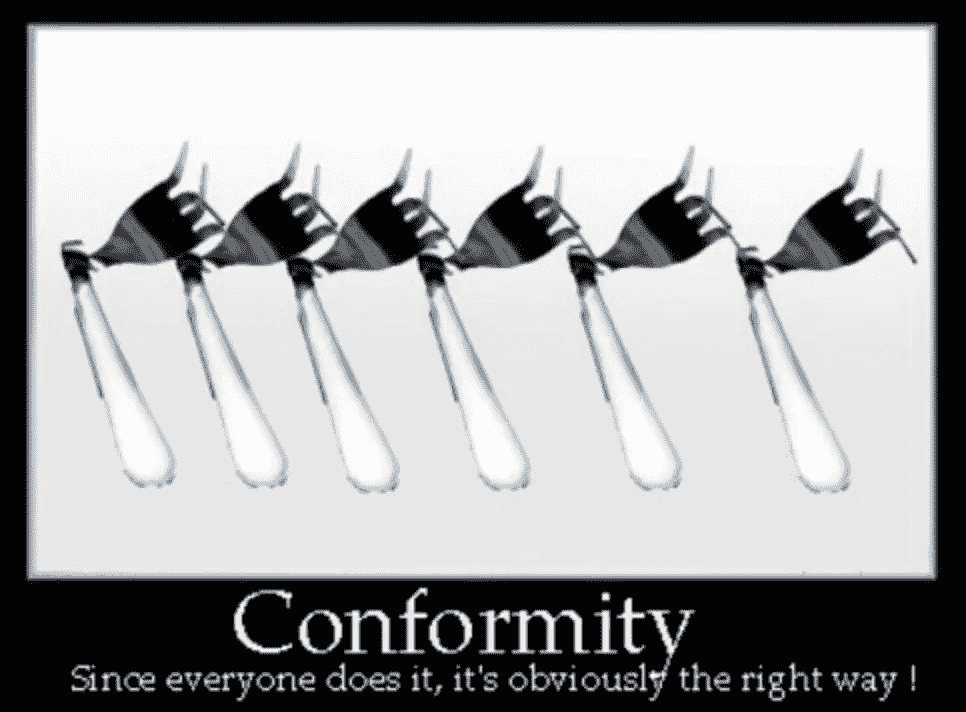

还有。如果你的愿景和很多人的愿景相似(比如前面提到的“赚钱。买房子。生孩子。”)那么你很可能只是在抄袭别人。

我小时候最初的梦想是“变得富有”不是我的，只是周围环境种在那里的。我很幸运，在 22 岁的时候赚了很多钱(通过出售我在自己创办的一家公司的股权)。买了一辆法拉利和一辆宾利；住在伦敦的梅菲尔和莫斯科的麻雀山之间；在摩纳哥的 Jimmyz 喝 Cristal，在伦敦流浪。有几个月非常棒。然后变成了彻底的失望。我被我不尊重的人包围着，做着我不喜欢的事情。

因为“变得富有”本身就是一个非常愚蠢的长期愿景，被许多非常愚蠢的人持有。而且很容易从他们那里感染。

你的视野真的需要是你自己的。反向愿景是一个暗示，它真的是你的*。因为它不是别人种在那里的。*

*不要像他妈的绵羊一样度过一生。*

# *第 2 部分:将长期愿景转化为易处理的日常行动*

*很明显，为了实现我最初的 50 年目标，我需要每天做一些事情。*

*但是怎么做呢？我是说，我想成为不朽的后人类神之一。我今天该如何推进这一点呢？我应该指出功能性数字神经元而不是写这篇文章吗？*

*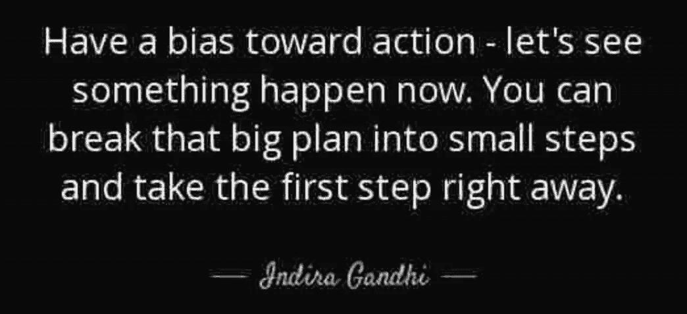*

*下一步很简单。*

*让我们从一个我如何思考的例子开始:*

*   *我成为后人类的那种奇异性最终被脑机接口(BCI)所阻碍，它可以从大脑巨大的神经突触网络的物质%中读取/写入数据。*
*   **脑机接口受到原子精确制造(APM)的瓶颈制约。如果没有高度复杂的微小、精确的装置，我们就无法读取/写入大约 1 千万亿个突触中的相当一部分。**
*   **APM 面临资源瓶颈，尤其是来自多个领域的工程人才协调。【想知道为什么，读读* [*一些埃里克·德雷克斯勒*](https://www.amazon.com/Radical-Abundance-Revolution-Nanotechnology-Civilization-ebook/dp/B06XC791KP/ref=mt_kindle?_encoding=UTF8&me=) *】。**
*   **今天的资源最终意味着“许多人一起工作，为一个共同的目标做事情。”**
*   *可以用金钱、权力或说服力来说服人类。有趣的是，如果你深入思考，这三件事是一样的。非显而易见的洞察力。*
*   **新年度目标:“增强说服力。”关键成果 1: 20 小时相关领域的专业指导。**
*   **新的季度目标:为我在 YCombinator 做的一个季度末的讲座找一个高质量的肢体语言教练。关键成果 1: 4 小时的辅导。关键成果 2:至少 50 名听众积极接受我的演讲。**
*   *新的一周目标:通过寻找可能知道一些的人来寻找候选教练。*
*   *现在要做的:写一份简短的可分享的概述，说明我想找什么样的教练。*

*现在我们有了。一段文字需要马上写出来。这一段增加了我成为 2070 年后人类神之一的可能性。*

*我每天都这样想。浏览场景。执行可行的步骤。重复一遍。*

*这个过程是:( 1)从长期愿景开始向后工作;( 2)专注于工具性目标(下面将详细介绍这些目标);( 3)在每个时间尺度上执着地寻找可行的步骤。*

## *(1)从长远的观点来看*

*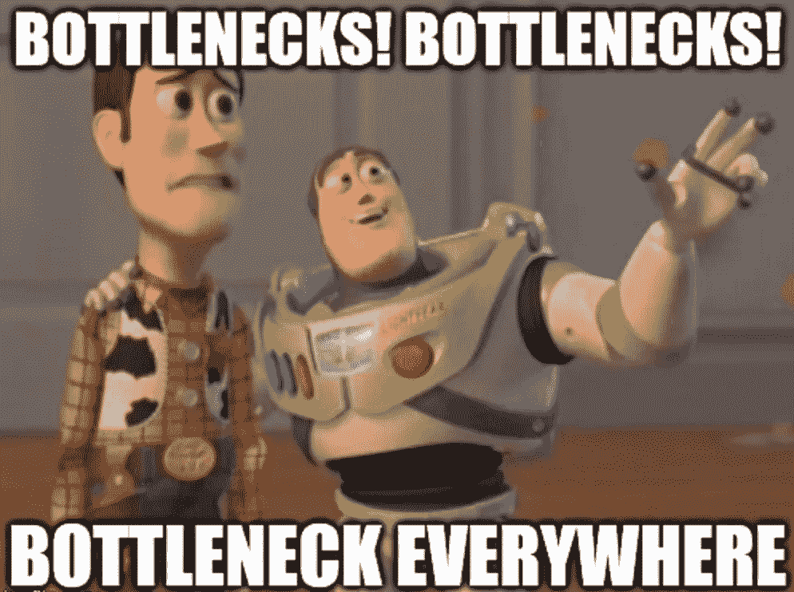*

*很明显。你有你的长远眼光。不停地问“我的 LTV 有哪些 Z 瓶颈？”然后“什么 Y 瓶颈 Z？”继续前进。总有一个瓶颈。*

*挑战在于这是一个非常投机的过程。这个世界有无限的自由度。所以未来很难预测。*

*这就是工具性目标的用武之地。*

## *(2)主要关注工具性目标*

**

*工具性目标是由人工智能理论家首先提出的一个简单而令人难以置信的强大想法，但在日常决策中有明确的应用。*

*这些目标很可能**有助于所有的长期愿景和通往它们的道路，不管细节是什么**。健康、资源、专注、生存、智力、盟友网络等都是有用的目标。*

*工具性目标的强大之处在于，它们非常容易预测，并且不会随着时间的推移而发生很大变化。*

*回到我的例子。很有可能*通向 BCIs 的技术之路将与我所想的不同。说服力、健康或财富没有用的可能性极小。**

**因此，几乎可以肯定的是，提高睾丸激素或优化睡眠会促进我的长期愿景。有些人认为我是生物黑客，因为我害怕死亡。我没有。我认为永生是一个无聊的定局。我 biohack 的真正原因是我的长期愿景的工具性目标值。**

**以下是我认为对任何长期愿景都有帮助的几个类别:**

*   ****应用智能**。专注，精力，深度工作的能力，每天的快乐。**
*   ****资源**金钱、权力、说服力、盟友、名声。**
*   ****古典情报**。智商、思维可视化技能、创造力等。**
*   ****动态智能**。学习如何学习，能够改变你的想法。**
*   ****社会智力**。说服他人的能力。**
*   ****寿命/健康跨度/生存+目标完整性**。也就是说，有更多的时间来实现你的长期愿景。**

## **(3)对行动的强迫性偏见:**

**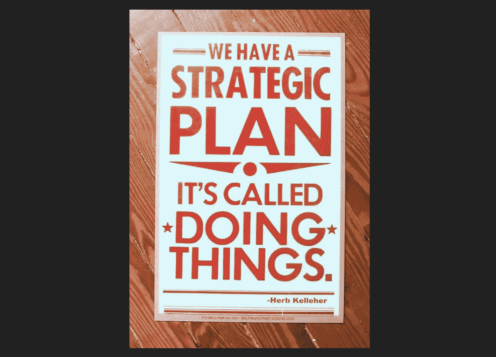**

**很明显。选择你的长期愿景+你的工具性目标，并执着地寻找具体的行动，在每个时间尺度上推进这些目标。当晋升的机会出现时，抓住它。**

**为此，我喜欢使用以下框架:**

*   **为自己写出~3 个十年主题。例:我 30 多岁时(我 32 岁)的一个主题是寻找一个有潜力的机会，在未来 30-50 年成为奇点的一个使能平台。也许开始着手做吧。**
*   **为这一年挑选 3-5 个主要目标。这些都是由长达十年的主题所决定的。作为我十年愿景的一部分，我打算在纳米技术、神经科学、生物工程等领域自学。**
*   **为本季度挑选 3-5 个目标。每个目标需要有 2-4 个可衡量的子结果，明确显示目标是否已经实现。与他人分享这些来增强责任感。例子:我有季度目标去上课、读书、会见做前沿研究的教授。**
*   **每 2-4 周评估一次进度，并利用评估来指导课程纠正措施。**
*   **每天开始的时候(在记事本上)写下大约 4 件我今天应该做的事情，这将有助于在专注的情况下实现季度目标，以及大约 2-3 件放松的事情(例如冥想、阅读、会见朋友)。**
*   **我结束了对这些日常事务的紧张工作，其中一些被延期了。我纯粹根据自己喜欢做的事情来选择在某一天做什么。这样我工作得更好。**

**请注意，我没有把健康、职业、朋友等分开。它们都是我长期愿景的工具，而且都至关重要。许多人认为工作和生活是分开的。这是一种错觉。**

# **第三部分:不要做无用的废话**

**所以，到现在为止:**

1.  **我有一个令人信服的愿景。**
2.  **我有一个推进我的愿景的可行的日常步骤清单。它们之间的优先顺序并不重要。**

**优先化的最后一点是“不断去除一切不推进长期愿景的东西。”**

## **我的总体框架:**

*   **我定期评估我如何花费时间和(更重要的)精力。通过查看日历、写下事情、查看设备等等。**
*   **我问自己“这有助于我的长期目标吗？”如果答案是“他妈的是”，那么一切都好。如果答案不是“他妈的是”，那么我会继续想办法摆脱它。**

**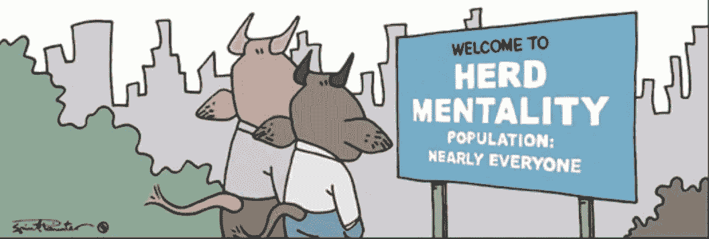**

*   **“这就是做事的方式”，“人们会怎么想？”或者“每个人都必须这样做”对我来说都不是问题。我不想和大多数人一样。所以我看不出有什么理由像大多数人那样行事。**
*   **投资自我意识。冥想、书籍、药物——所有这些都帮助我理解了我喜欢什么以及为什么喜欢。这有助于找出什么重要，什么不重要。**

**大概就是这个意思。解释这一部分的最好方法是分享例子。**

**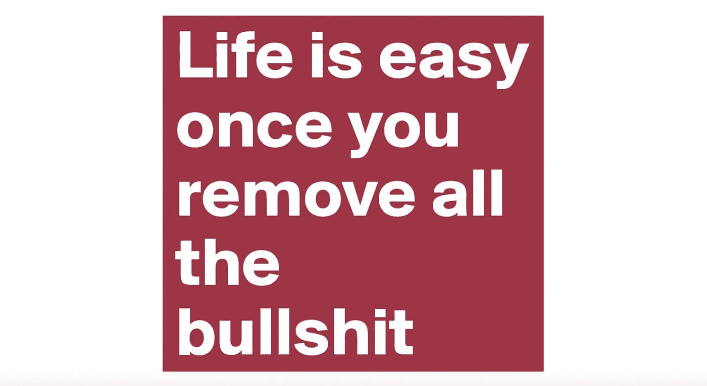**

## **1.我从生活中剔除的例子:**

*   ****我不认识的人**。除非我们是由我信任和尊重的人介绍的，否则我不会和你交往。评估你是一个伟大的人还是一个浪费时间的人的成本乘以请求的数量太高了。**
*   ****没感觉的人都很牛逼**。我唯一想第二次交流的人是那些让我感到充满活力的人，以及“我还想和他们说话吗？”是“他妈的是！”这是罕见的。**
*   **冗长的会议或没有议程的会议。即使我们是被介绍的，也要用清晰简洁的方式说出你想要的。即使我们一起工作，给我一个他妈的议程，如果你想谈谈。**
*   ****事件/会议**因为我对随机的会议不感兴趣，也不是销售人员，我认为这完全是浪费精力和时间。例外情况是非常专注/精选的人群(例如 YCombinator 演示日)。或者当我做有助于我的品牌或公共演讲技巧的重要演讲时。**

****

*   ****社交媒体**。令人上瘾的浪费时间和精力。**
*   ****信息和电子邮件**。我每天减少使用几次，很少回复。我的手机几乎总是开着“请勿打扰”人们最初会感到恼火，但随后就会习惯。有时候我会错过机会，这没什么。生活充满了机遇。**
*   ****新闻媒体**。就像我之前说的，我不在乎金正恩做什么。你也不应该。**
*   ****酒精和杂草**。酒精/大麻扰乱了我的睡眠。精神上的影响通常是不一致的，没有那么有用或愉快。酒精对健康的影响显然是负面的。我确实发现某些其他药物——MDMA、LSD 和 GHB——有用，因为如果小心使用，风险/健康成本更低，而收益更高。**

**一如既往，我认为索尔·古德曼说“不要在国际水域之外做非法的事情。”**

*   ****物流和运输**。我很少亲自去某个地方开会，我尽量减少航班。交通、机场等。产生压力，极具破坏性。**
*   ****购物，买很多东西**。我住在两个手提箱外，我喜欢这样。我也有一个助手，在我需要的时候为我买东西。**

**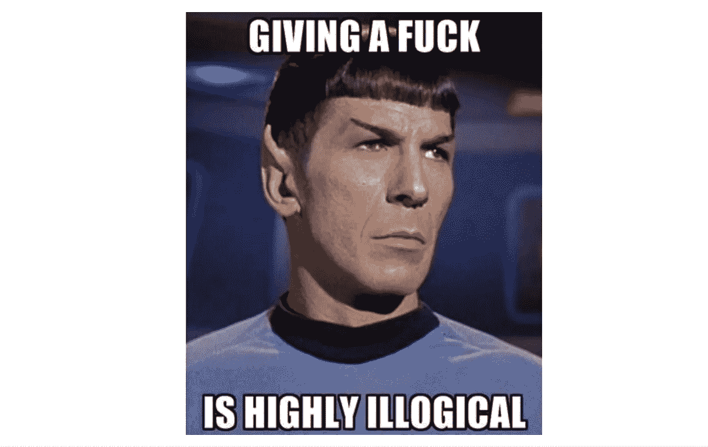**

*   ****压力过大**。大多数事情都不重要。我几乎可以对所有事情都不屑一顾。但仍有改进的余地。**
*   ****打扫卫生、洗碗、开车等**。我觉得这些东西不像有些人那样能让人沉思或放松，所以我更喜欢付钱给其他人。**
*   ****排队**。我会尽最大努力避免排队，或者付钱让别人替我排队。**

**这不是一个详尽的列表。但是去掉这些让我更有效地追求真正重要的东西。**

## **论插队**

> **我决定删除这一部分。我最初把它包括进来只是为了引起注意。就文章而言，它没有多少实际价值。这是一个实验，说一些不受欢迎的东西，最终并不真正反映我的价值观。**

## **2.我感到矛盾的事情的例子:**

**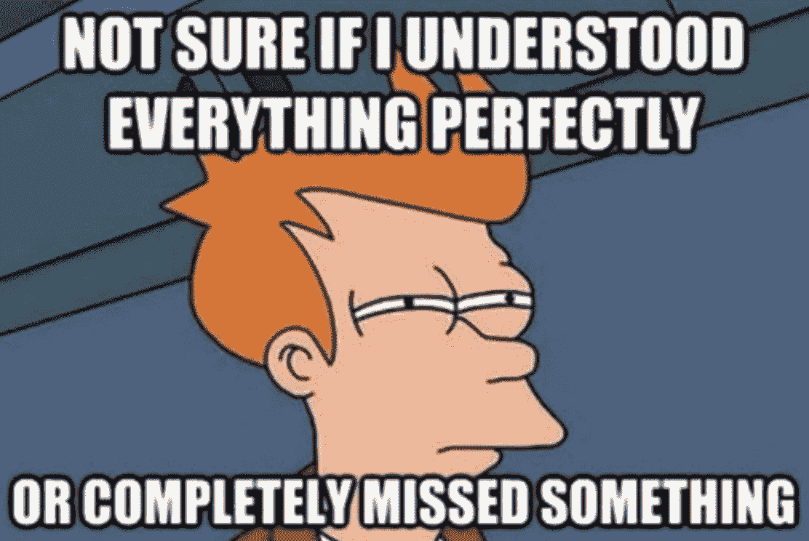**

*   ****身份象征、风格等**。一方面，我不想把时间浪费在一些明显不合理的事情上，比如穿很多衣服或者在镜子前花几个小时。另一方面，我也确实想有说服力，人类很容易受地位象征的影响。**
*   ****非流动资产所有权**。比如房子。维护它们似乎是一个巨大的麻烦，并且引入了巨大的转换成本，因为它们限制了我。另一方面，超级定制空间有一些吸引人的东西，我可以调整到我喜欢的方式。**
*   ****网飞+电脑游戏**。显然是一个上瘾的多巴胺-击中时间吸盘。但是我发现所有试图用冥想、运动、智能书等来代替它们的尝试。最终增加了我的压力。所以感觉这些确实有一些与放松有关的独特功能。我还觉得电脑游戏极大地把我的个性塑造成了我喜欢的方向。**

## **题外话:电脑游戏如何塑造了我；与现实生活的相似之处**

**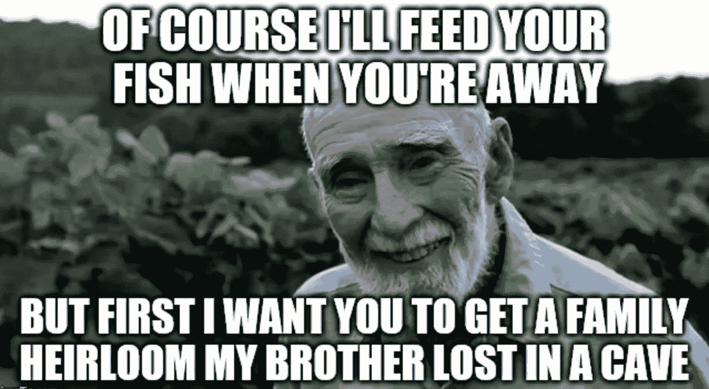**

> **我小时候玩过很多电脑游戏。大多是 RPG 和策略(回合制和 RTS)。猜测一个月 150 个小时，相当于一份全职工作，持续数年，处于神经发育形成期。这不可能对我的结局没有影响。所以，一些理论推测:**
> 
> **1.我发现大量投资于长期自我提升(沿着科技树向上爬，获得等级，通过优化一切来获得权力)的概念非常明显和有吸引力。当难度很高时，强力游戏是取胜之道。**
> 
> **我喜欢现实生活。**

****

> **2.我觉得总有办法赢的。只需要找到正确的对话框选项(它总是在那里)。这是一个非常有价值的特质，因为大多数时候坚持是有回报的，规则是灵活的，现实是可以协商的，乐观是有感染力的，等等。**
> 
> **3.我怀疑在很小的时候管理巨大的复杂性(例如 Civ 2-3)对智力发展有很大的好处。**
> 
> **这当然都是猜测。没办法做一个合适的实验。但是我发现思考这个问题很有意思。**

## **3.我认为在生活中有价值并且想要更多的例子:**

**你可以在我的其他[帖子](https://hackernoon.com/biohack-your-intelligence-now-or-become-obsolete-97cdd15e395f)中读到这些。我不想重复我自己，但是像和朋友深入交谈、学习、写作、公开演讲、冥想、运动等等。**

**我摆脱了生活中的废话。并将更多的资金投入到这些项目中。**

# **摘要**

****

1.  **找到你真正关心的目标。理想情况下，这些都是独特的，非常长期的。这是最难的部分。**
2.  **想一想今天你能做什么来朝着你的目标迈出一小步。迈出那一步。**
3.  **看看你每天都在做什么，去掉那些对你的目标没有帮助的事情。**

**再说一次，我不是说你应该和我有同样的目标。我只是分享我是如何达到我的目标的。还有一堆我如何思考的例子。**

**感谢阅读。如果你觉得有趣，请评论/分享。**

***********************************************************************

## **Serge 的其他深度文章:**

** [## 我 32 岁，花了 20 万美元在生物黑客上。变得更平静、更瘦、更外向、更健康、更快乐。

### 这篇文章是关于如何使用现代科学和个性化医学让自己更健康，更有效率和…

hackernoon.com](https://hackernoon.com/im-32-and-spent-200k-on-biohacking-became-calmer-thinner-extroverted-healthier-happier-2a2e846ae113)  [## 如何生物破解你的智力——从性到莫达非尼到摇头丸

### 我在假期有一些空闲时间，写了这篇文章来展示，基于一个个人的故事，许多…

hackernoon.com](https://hackernoon.com/biohack-your-intelligence-now-or-become-obsolete-97cdd15e395f)**