# 我如何用谷歌 Home、家庭助手和小米吸尘器设置房间清洁自动化

> 原文：<https://medium.com/hackernoon/how-i-set-up-room-cleaning-automation-with-google-home-home-assistant-and-xiaomi-vacuum-cleaner-9149e0267e6d>

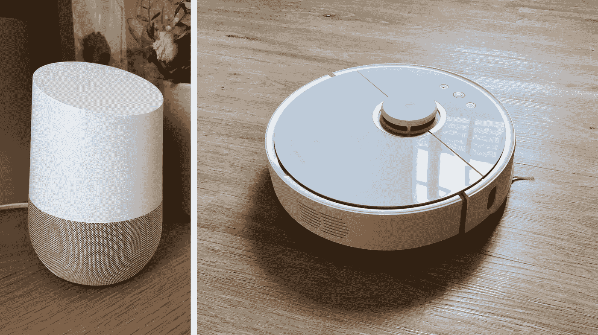

我使用运行在树莓 Pi 中的[家庭助手](https://www.home-assistant.io)作为主要中枢来自动化我所有的智能家居设备。它被设置为连接到我的[小米 Mi Roborock 吸尘器](https://www.home-assistant.io/components/vacuum.xiaomi_miio/)，具有启动、暂停和停靠吸尘器的基本接口。[米家的应用](https://itunes.apple.com/us/app/mi-home-xiaomi-smarthome/id957323480?mt=8)更先进，能够在扫描和清理房间时绘制我家的平面图。

真空吸尘器自动清洁整个房子的效果非常好。但如果我只想清洁家中的某个特定房间，我必须使用 Mi Home 应用程序在房屋平面图中的房间周围绘制一个矩形(区域)，以开始区域清洁。应用程序不会保存这个，所以每次我想打扫不同的房间时，我都必须重复相同的步骤。

如果我能实现自动化，那不是很好吗？这篇文章让我意识到实现这一点并不难。

> 嘿谷歌，打扫卧室

目标是能够向 Google Home 发出命令，告诉吸尘器只清洁家中的一小块区域。下面是我一步一步做的事情:

*   找出房间一角的坐标，计算出坐标的比例
*   绘制出家中每个房间的坐标
*   创建一个 [IFTTT](https://ifttt.com/discover) 配方，用 [Google Assistant 作为触发器](https://ifttt.com/google_assistant)，用 [webhook 作为动作](https://ifttt.com/maker_webhooks)来调用我的家庭协助服务器。

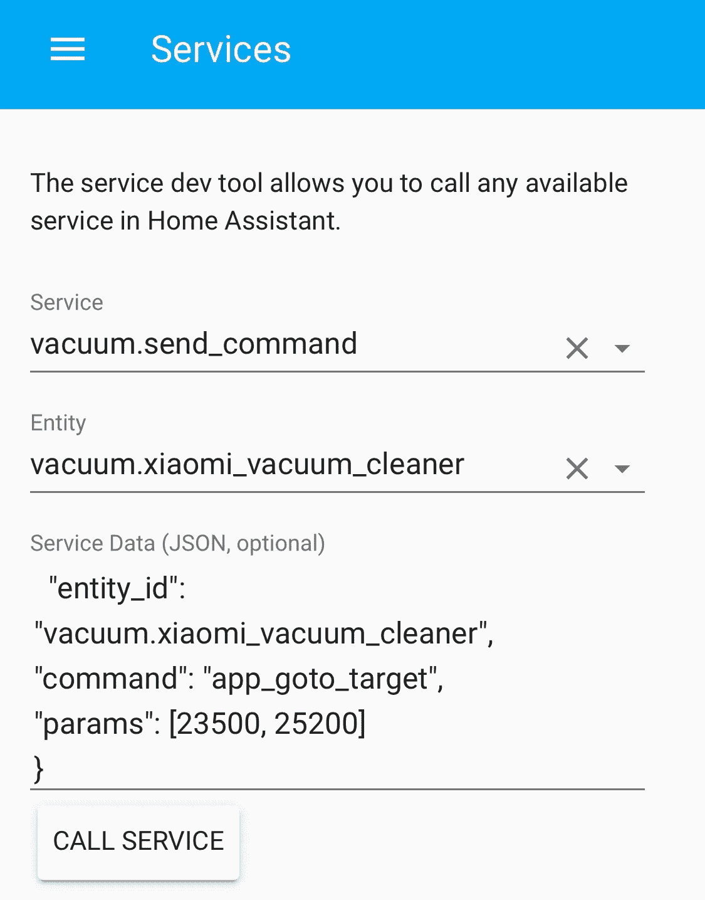

Testing app_goto_target command in service dev tool in Home-Assistant

家庭助理服务开发工具可以用来调用服务的任何设备连接到它。有一个名为 [app_goto_target](https://github.com/marcelrv/XiaomiRobotVacuumProtocol/blob/master/app_goto_target.md) 的命令可以用来将吸尘器发送到任意坐标。

真空吸尘器的对接点总是具有坐标[25500，25500]。这是我书房的某个地方。通过反复试验，我算出了书房一角的坐标。它可以是房子里的任何一点。这将为以后绘制带比例尺的地图提供参考。

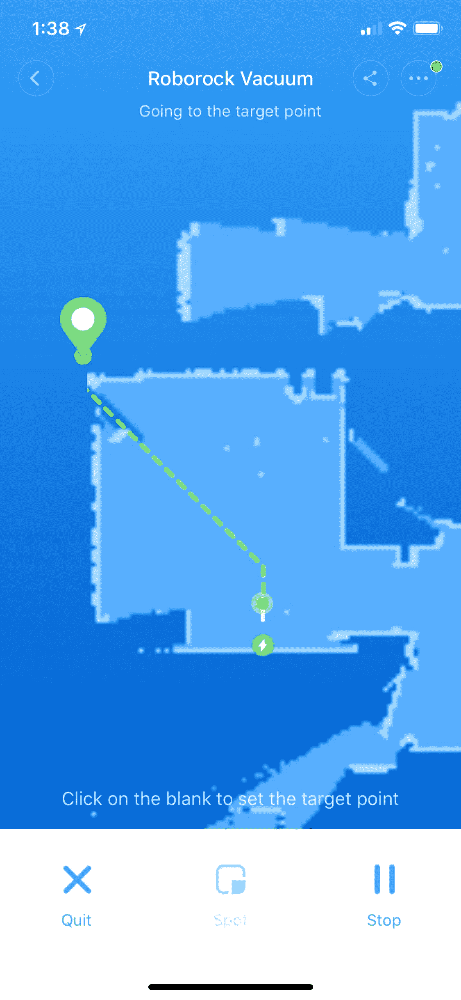

Screenshot of the Mi Home app that is used to control the Xiaomi vacuum cleaner

Mi Home 应用程序规划了我的整个家居计划。我截取了一张截图，在 Sketch 中打开，覆盖网格，画出 x 轴和 y 轴。这为房子里的所有坐标提供了一个粗略的估计。

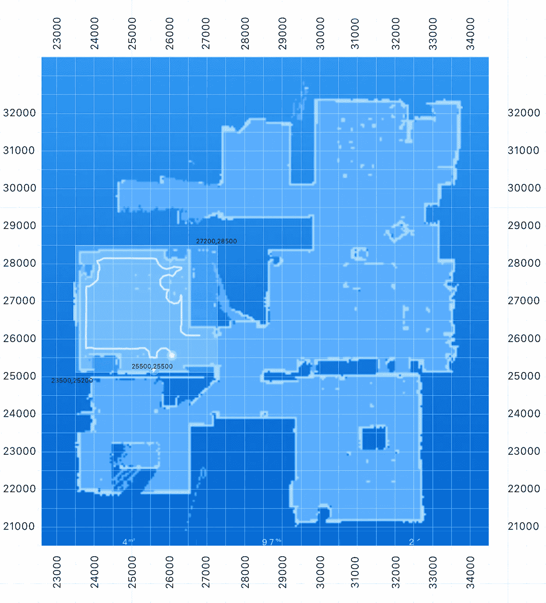

Screenshot of my home plan created by the Mi Home app, with grids and coordinates overlaid in Sketch app. The green dot with coordinate [25500,25500] is the vacuum cleaner docking station.

真空吸尘器支持名为 [app_zoned_clean](https://github.com/marcelrv/XiaomiRobotVacuumProtocol/blob/master/app_zoned_clean.md) 的区域清洁命令。它接受一个 5 位数的数组，每个数字描述一个名为 zone 的矩形—前两位是 zone 左下角的坐标，后两位是 zone 右上角的坐标，最后一位是清洁 zone 的次数。

Service data for cleaning my bedroom. The 5-digit-number is formed by the coordinates of the bottom left corner [29500, 21000], top right corner [33200, 25000], and number of times to clean the area [1]

随着所有房间坐标的绘制，我在 Home-Assistant 中测试了它们，并在必要时做了一些小的调整。该区域可以比房间稍大，但不应与另一个房间重叠。

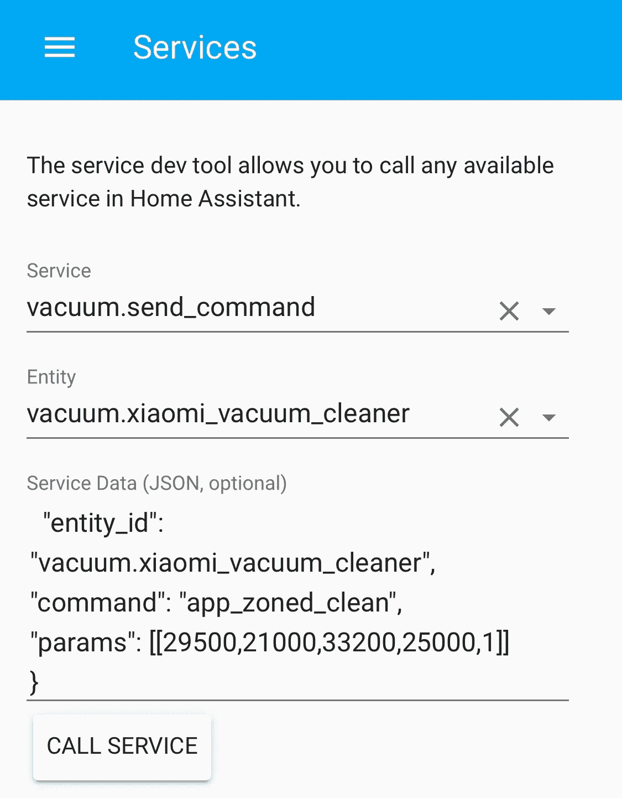

Testing app_zoned_clean command in service dev tool in Home-Assistant

随着我家所有房间的地图绘制出来，下一步是创建 IFTTT 食谱，以允许 Google Home 与 Home-Assistant 通信，将这些命令发送到我的真空吸尘器。每个食谱都是通过选择 Google Assistant 作为 IFTTT 触发器，webhook 作为 action 来创建的。

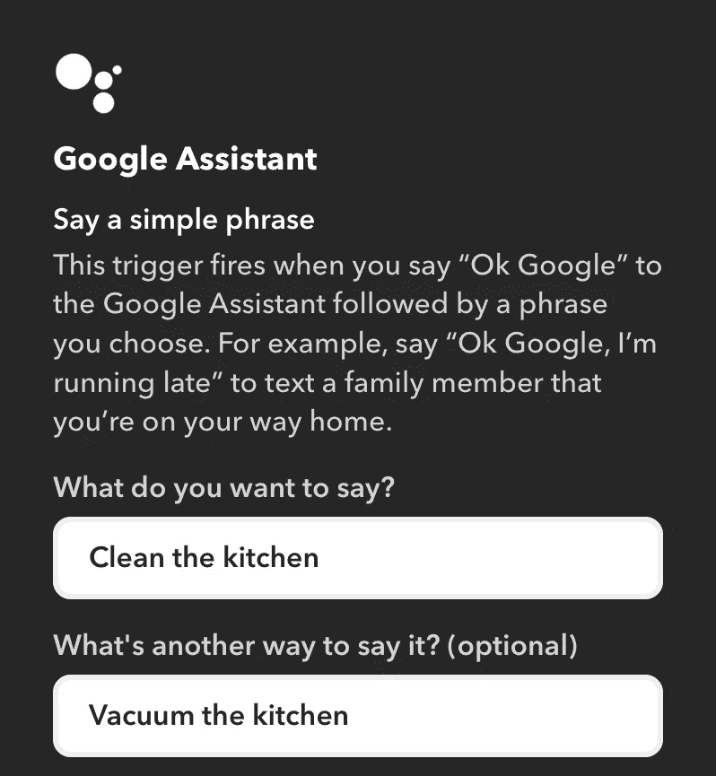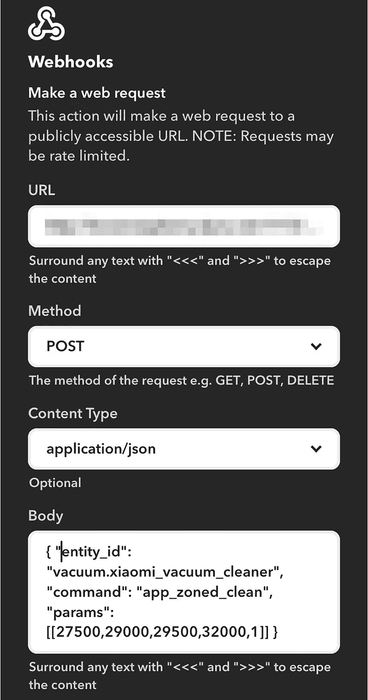

Google Assistant as IFTTT Trigger, and Webhook as Action to call API in Home-Assistant

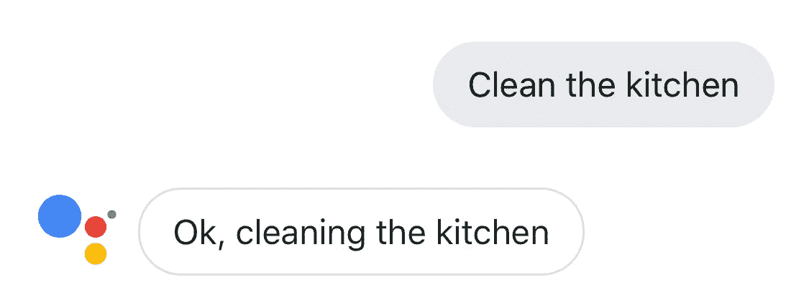

也可以创建一个配方，让真空吸尘器清洁该区域几次，因为第 5 位数字设置了清洁该区域的次数。

> 嘿谷歌，清理厨房三次

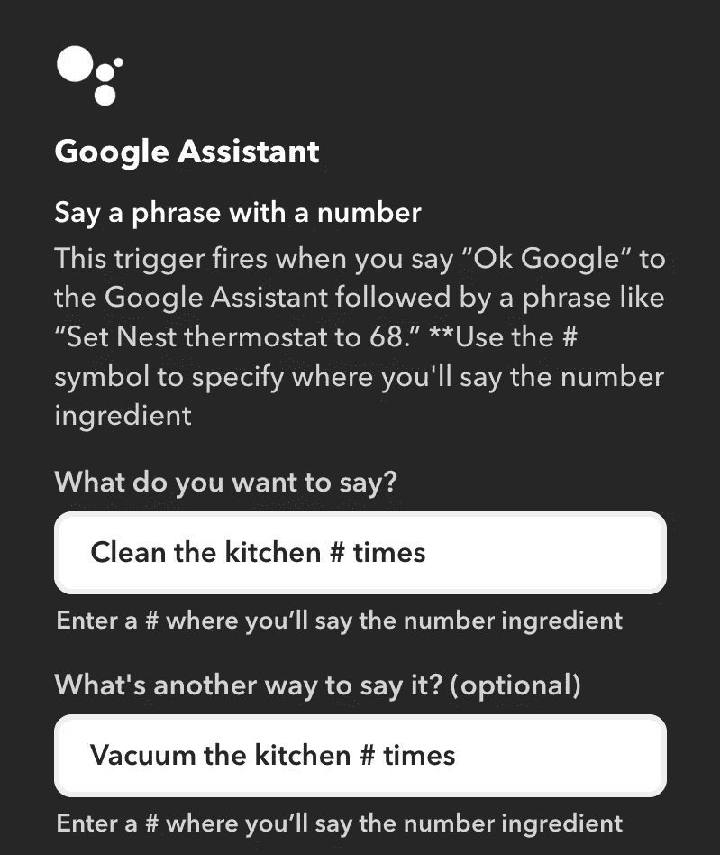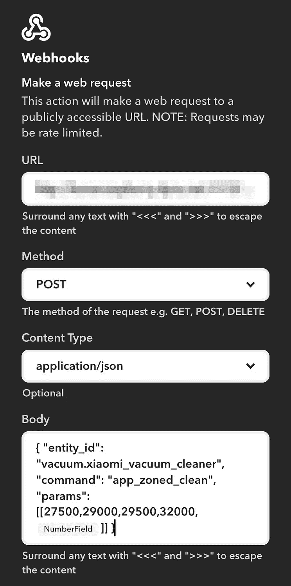

Google Assistant as IFTTT Trigger, with option to say a phrase with a number

*参数*字段接受一个区域的*阵列，因此可以创建一个自动清洁定制形状的区域。例如，当吸尘器在我的客厅拖地时，我想排除地毯所在的区域。*

> 嘿谷歌，拖我的客厅

Service data for app_zoned_clean with 4 zones to exclude the area in the middle.

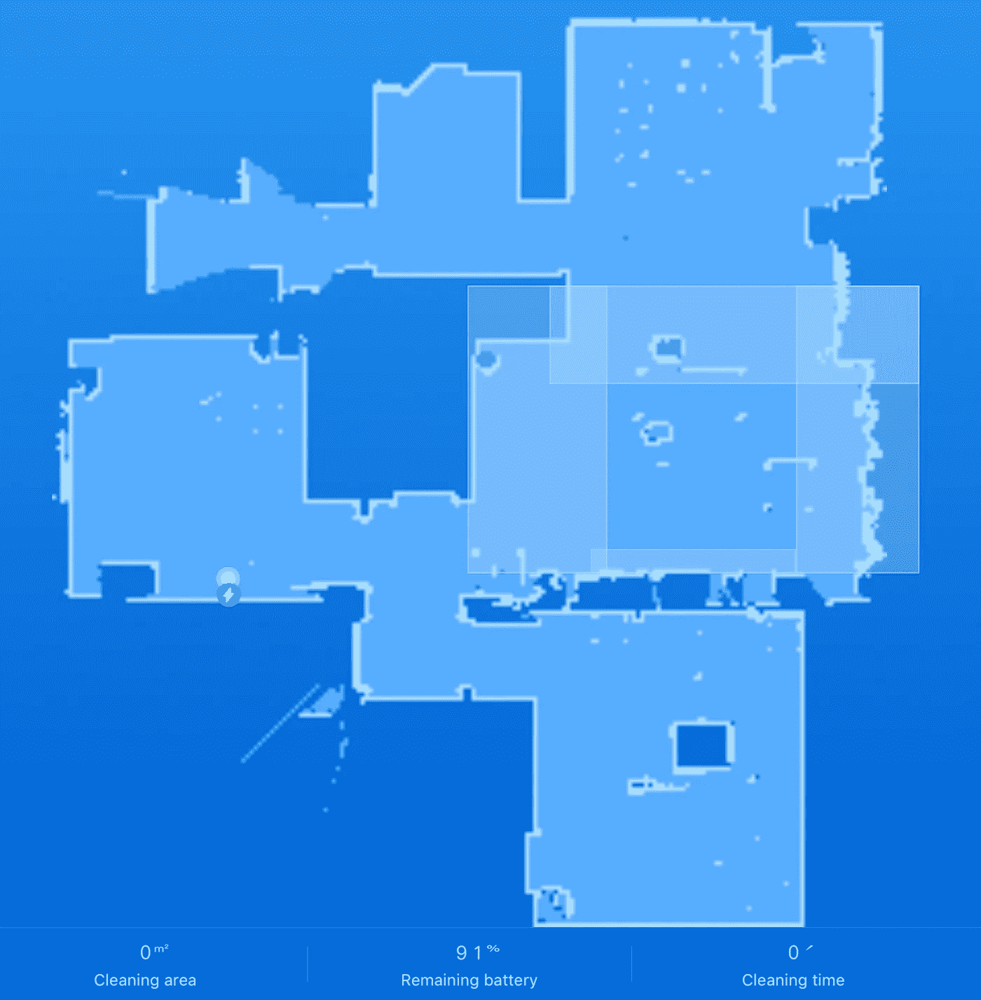

Screenshot of the Mi Home app showing the 4 zones in my living room, excluding the area where the rug is

就是这样。现在我可以让 Google Home 打扫家里的任何房间。

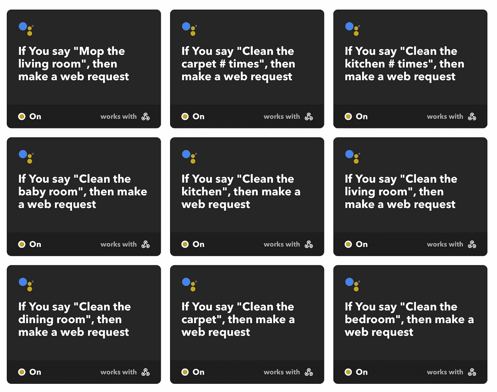

IFTTT recipes to clean rooms with Google Home and Xiaomi vacuum cleaner

**相关帖子:**

[我如何让我的吸尘器通过电报与我对话。](/@honcheng/how-i-got-my-vacuum-cleaner-to-talk-back-to-me-via-telegram-d4b471b7598c)