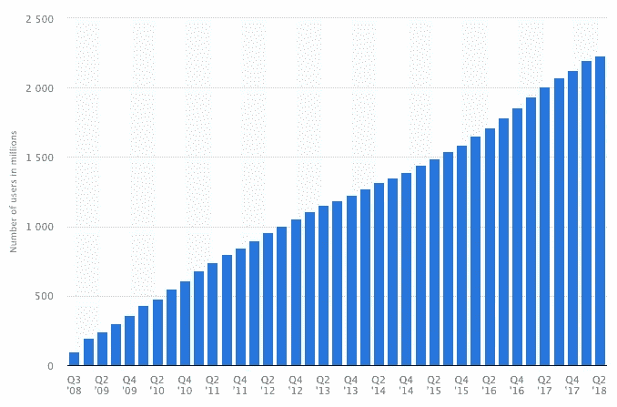
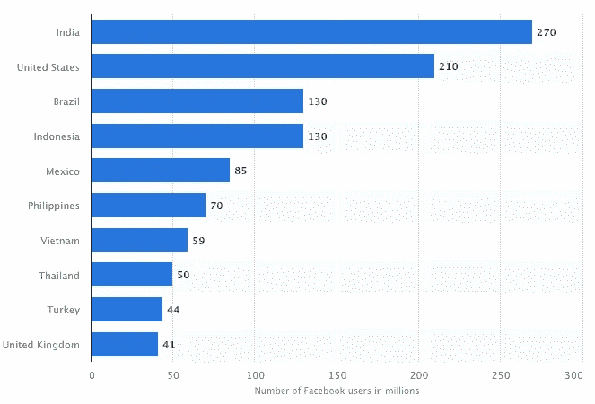
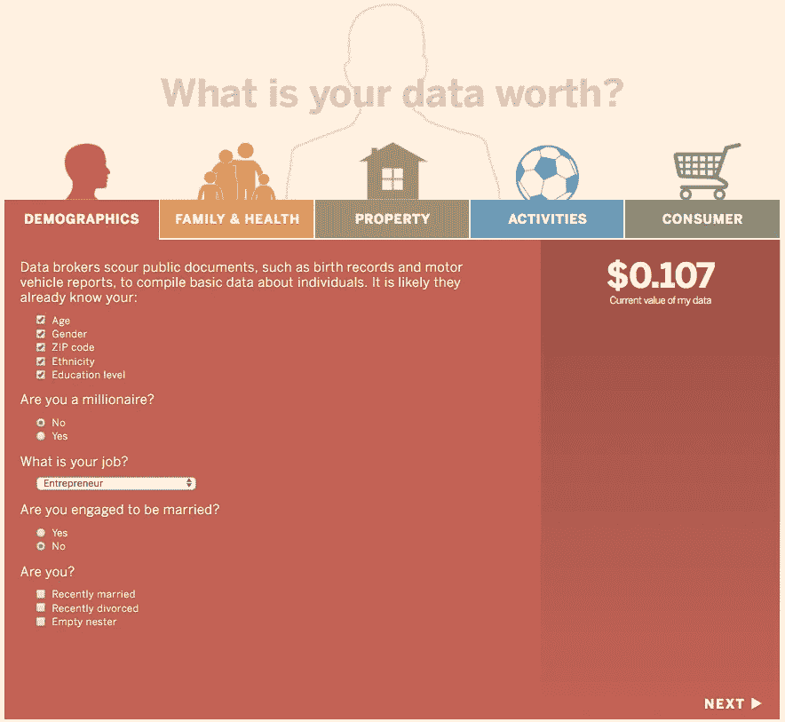
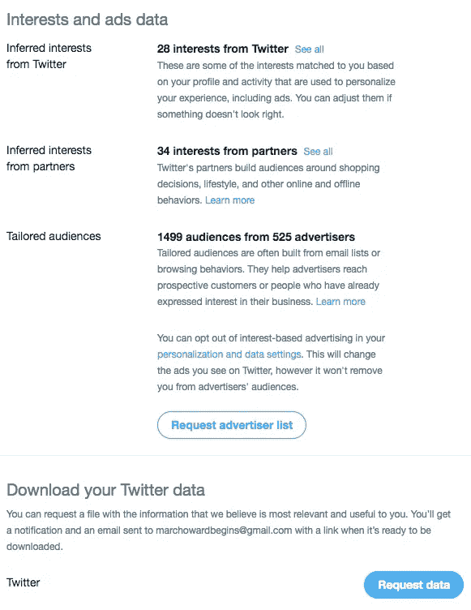
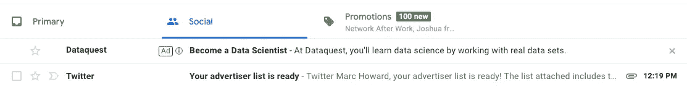
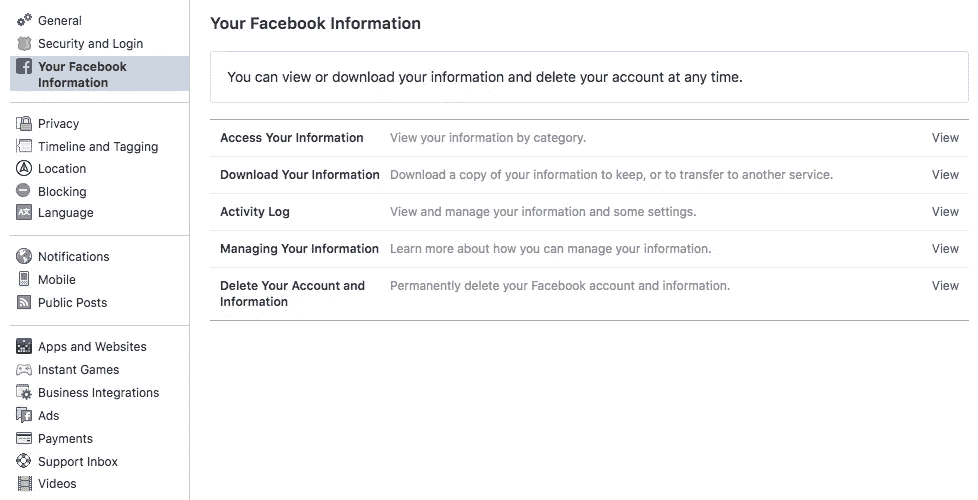
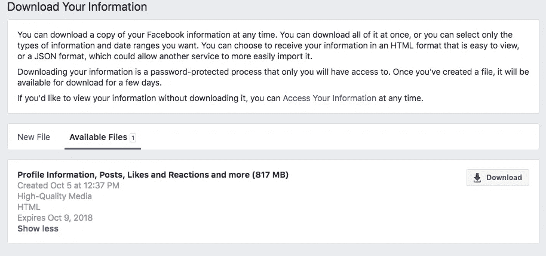
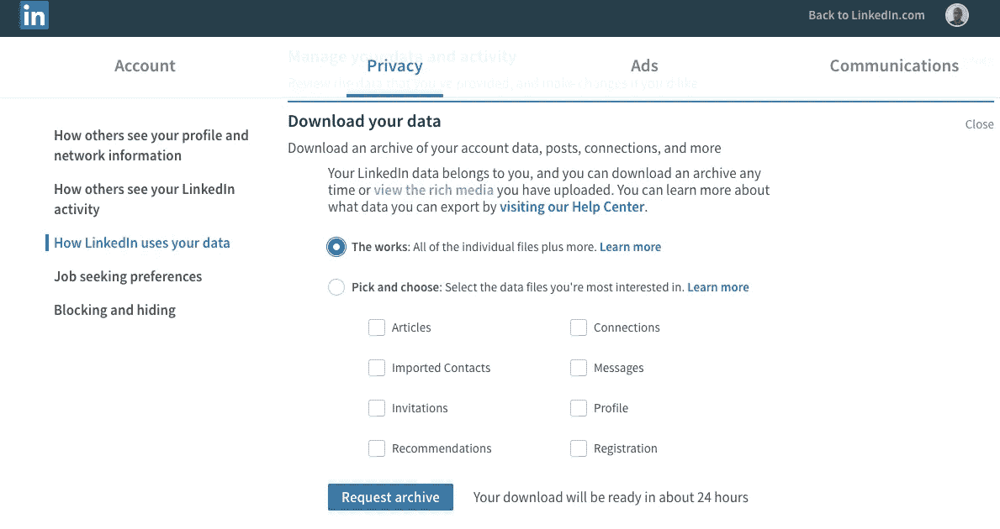

# 你的个人数据如何从 2 亿美元涨到 4 亿美元

> 原文：<https://medium.com/hackernoon/how-i-sold-myself-for-0-29-415917d4d51b>

你的个人数据值多少钱？对普通美国人来说大约是 0.2 到 0.4 美元。以下是您的数据在这些情况下的价值:

*   “已婚”或“订婚待嫁”:再加 30%。
*   “最近离婚”:再加 10–20%。
*   “期待宝宝”:又是 30%。
*   “拥有一个家”:另外 30%。

希望你是健康的，但如果不是，这对广告商来说是一座金矿。如果你有常见的生活方式疾病，如糖尿病、背痛、头痛或高胆固醇，你的个人数据价值将飙升至 0.46 美元！别担心，脸书不会问你是否有这些症状，相反，它可以从你的浏览器在网站上留下的用于预约、购买药物或搜索这些不幸症状的信息的 cookies 中判断出来。

继续读下去…它变得更加令人毛骨悚然。

那么这一切意味着什么呢？在分析了 Statistica 的数据后，[截至 Q2 2018 年，脸书拥有 2 2 亿用户](https://www.statista.com/statistics/264810/number-of-monthly-active-facebook-users-worldwide/):

显然，不同国家、人口统计和社会经济状况的个人数据价格相差很大。为了公平起见，让我们使用脸书用户数排名前十的国家，2018 年同期[约有 10 亿](https://www.statista.com/statistics/268136/top-15-countries-based-on-number-of-facebook-users/)用户:

仅考虑美国人，这意味着脸书产生约 4200 万至 8400 万美元的个人数据(2.1 亿美元 x 0.20 至 0.40 美元)。将这个数字乘以成千上万的广告客户和数据经纪人，你就可以开始理解脸书每年数十亿的收入——所有这些都来自你免费提供的数据。

英国《金融时报》创造了一个非常[有趣而又令人毛骨悚然的工具](https://ig.ft.com/how-much-is-your-personal-data-worth/)，在这里你可以回答几个关于你的生活方式、健康和行为的简单问题，它会告诉你你的个人数据对于价值数十亿美元的数据经纪行业大约值多少钱:

Personal Data Worth Calculator (Source: The Financial Times)

# 你个人能从你的个人数据中获利吗？

如果你正在读这篇文章，你的个人数据很有可能存放在脸书、LinkedIn 或 Twitter 上。也许三个都有。如果你能从这些数据中获利会怎样？毕竟，你拥有的是你的个人数据。不幸的是，除非你是数据经纪人，否则你最多只能赚几块钱。

价值在于这些数据的汇总，这就是为什么仅[九家数据经纪人](http://www.visualcapitalist.com/much-personal-data-worth/)一家就获得了超过 4 亿美元的年收入。请记住，这些只是*的中间人*。这些玩家从脸书、亚马逊、谷歌、LinkedIn 和 Twitter 收集和转发你的聚合数据。

因此，除非你从事数据聚合，或者有几千个朋友聚在一起，否则你很有可能永远也不会实现数据的真正价值。下载你的数据是一个好的开始，只是一个更加分散化的世界的开始。知识就是力量，了解你放弃了哪些数据以及这些数据是如何被使用的，可以让你做出更好的隐私决定。

# 为什么我们不能切换到一个去中心化的网络，在那里我们可以完全控制我们的个人数据并从中获利？

事实是因为这很痛苦，而且不容易做到。这是因为你所有的朋友和同事都在那里。集中的网络围绕这一事实创造了网络效应和增长。你可以在这些集中的平台上“免费”与你的朋友联系——这一切都是为了你的个人数据的低廉价格。众所周知，你的个人数据是现代集中式社交平台的主要收入模式。

如果受到激励，人们会从脸书或 Twitter 转向更好的解决方案。尽管监管试图遏制个人数据的滥用，但它只会扼杀而非创造创新。有一些解决方案正在通过像[个人数据存储](https://en.wikipedia.org/wiki/Personal_data_service) (PDS)这样的解决方案来改变游戏规则，但是人们并没有从像脸书和 LinkedIn 这样的集中组织中蜂拥而至。今天的 PDS 需要不仅仅是一个理论上的概念。关键是要弄清楚人们转向这种替代方案的动机，然后提供正确的激励。

因此，从集中式网络转换到分散式网络的真正障碍是缺乏社交图的可移植性。什么会促使你离开脸书？人们会对更快、更便宜、更安全和更私密的激励做出反应。像 PDS 这样的替代性分散解决方案没有开花结果的原因是因为他们还没有为网络效应制定出一个可靠的计划，而脸书已经做得相当成功了。对大多数人来说，这不值得“努力”。如果有一个替代解决方案能够让 PDS 无缝过渡，并为你邀请朋友提供适当的激励结构，那么网络效应就会自动显现。

# 如何才能建立一个我们完全掌控的去中心化的社交网络？

权力下放有时会让人望而生畏。不要误解我，我 100%支持权力下放。这是我的工作方式。我们只是需要一种“用户友好”的方式来做这件事。尽管从脸书、LinkedIn 和 Twitter 这样的集中服务中导出你所有的个人数据是可能的，但这是相当乏味的(见下面如何做的一步一步)。它的步骤很多，不太容易找到，但每个人都可以使用。为什么不创建一个简单的一键式工具，在几秒钟内完成这项工作，然后导入到您的新 PDS 中？该工具可以选择性地向这些提取的朋友发送邀请链接，包括一条消息，说明为什么您的 PDS 是(用您最好的形容词填空)。

如果你关注区块链和加密货币领域，你会注意到初始硬币发行(ico)的爆炸式增长。许多是基于发行一个类似于你在网络游戏中获得的令牌。代币在服务上具有效用价值，如支付高级功能、交易、红利支付、折扣等。这种“令牌化模式”可能是一种强大的激励。

许多分散的项目，特别是区块链，都是基于一个为用户提供这种价值的实用令牌。也许可以有一个 PDS 解决方案，付费给人们提供他们的个人数据给感兴趣的团体。代币也可以作为推荐点系统支付，如果有必要，可以在分散的点对点交易所交易比特币、以太坊或法定货币，如 [IDEX](https://auroradao.com/) 、[斯特勒克斯](https://www.stellarx.com/)或 [Bisq](https://bisq.network/) 。在这个例子中，PDS 解决方案将要求广告商转换成这些“PDS”令牌，以直接向个人支付他们的个人数据。这将是基于网络效应的可持续代币经济模式的开端。它将允许受控的隐私、朋友的轻松加入以及参与社区的个人经济激励。双赢的局面。

虽然我相信今天有一些项目正在试图解决这个问题，但我们大多数人都没有听说过它们的原因是因为激励措施就在那里。这种激励需要弥补从我们多年来更新和培育的舒适的社交网络中离开的痛苦。我们的朋友、自我价值和名誉似乎是内在联系在一起的！我们必须从某个地方开始，从今天开始，了解谁真正在动我们的奶酪。看下面我是如何成功地把我的灵魂卖给 525 个广告商的！

# 额外收获:如何从主要的社交网络下载你的个人数据

了解您的数据价值的第一步是访问您的数据。以下是如何在主要社交网络 Twitter、脸书和 LinkedIn 上下载和查看你所有的个人数据:

**推特**:

1.  前往 https://twitter.com/settings/your_twitter_data[点击页面底部的“请求数据”按钮。](https://twitter.com/settings/your_twitter_data)

2.你会收到一封包含你的数据的电子邮件。具有讽刺意味的是，我立即收到了一则广告，内容是“通过处理真实数据集来学习数据科学”:

3.你也可以点击“请求广告客户列表”按钮来查看谁购买了你的个人数据。如果你注意到以上我不知道的情况，我显然已经把我的灵魂卖给了 525 个广告商！

**脸书**

1.  前往[https://www.facebook.com/settings?tab = Your _ Facebook _ Information](https://www.facebook.com/settings?tab=your_facebook_information)点击“下载您的信息”按钮:

2.大约十分钟后，你可以选择下载一个包含数千个数据点的大型文件。我的差不多有 10 亿字节:

**领英**

1.  进入[https://www.linkedin.com/psettings/member-data](https://www.linkedin.com/psettings/member-data)然后点击“下载你的数据”下的“作品”来下载你所有的个人数据:

2.乘飞机到世界的另一边，因为它将需要 24 小时，直到你的下载准备好。(如果你决定去台北，来这里和我一起喝点台湾泡泡茶吧！)