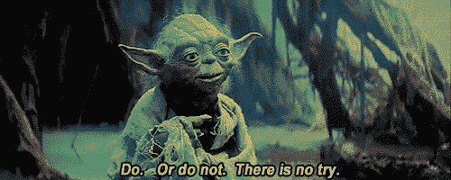

# 我是如何花了 5 万美元和 2 年时间构建一个冥想应用程序，然后在两周内零成本地转向电报机器人的

> 原文：<https://medium.com/hackernoon/how-i-spent-50k-and-2-years-building-a-meditation-app-and-then-pivoted-to-a-telegram-bot-in-2-c3f1e6273262>

Zenify Kid Character

**开始时**

我的名字是莱翁·泰尔扬，我是…嗯…很多东西的创始人。但是，在 2012 年，我决定暂时停止经营多项业务，关闭一切，开始旅行——首先去印度，然后去其他国家。我出租房地产的被动收入让我享受了一段时间的游牧生活，什么也不做(准确地说是近两年)。然后，我开始有那种想再做点什么的渴望。因为当时我在[学习](https://hackernoon.com/tagged/learning)很多关于冥想的知识，并且每天花几个小时练习，所以我想为其他人建造一些有用的东西来加入这条道路。有一天，我在沙滩上读《快速公司》，是关于一家跟踪人们睡眠的初创公司。我想“嘿，追踪人们有多清醒或多有意识是不是很酷？”很少有人知道，我们醒着的大部分时间根本不清醒。在自动驾驶中，我们无意识地行动——很少完全意识到我们正在做的事情，经常在思想、记忆或时间旅行中漫游到[的未来](https://hackernoon.com/tagged/future)。这个想法对我来说似乎很有趣，但是除了安装便携式神经扫描仪(顺便说一下，我有一套)，我不知道如何测量一个人的意识水平😀)到某人头上。但我认为至少我可以创造一个工具，通过在白天发送提醒和冥想任务，让用户的注意力从他们正在做的事情转移到自己身上，从而让人们保持清醒和有意识。这样他们就能检查自己的身体和情绪状态，回到当下。这个想法对我来说似乎很简单，只需编写一个任务和提醒的列表，并将它们发送给用户。我整理了 70 个简短的冥想任务，发给用户，要求他们关注自己的情绪、身体或精神状态，通过 6 种感官之一或通过感觉和思考让他们参与进来。我还写了一些提醒提醒，只是为了提醒用户在一天中的任意时间间隔都要在此时此地。

**我们开始吧**

我联系了摩尔多瓦的一名开发人员，他们给我的报价是 5000 美元，购买一个 iOS 和 Android 应用程序+后端+登录页面，并承诺开发时间不会超过几个月。预算对我来说似乎不错，我认为我可以承受失去那么多钱来验证这个想法。不用说，我最终花了更多的钱和时间来开发这个应用。各种各样的障碍不断出现在我的面前，开发不断被推迟，错误不断出现，承包商似乎无法解决所有问题。此外，我不熟悉精益创业方法和 MVP 的概念，我试图做好每一件事，订购讲解视频和各种营销材料。最糟糕的是，当应用程序几乎完成时，我向一位顾问展示了产品，并决定在发布前修改其中的重要部分。重新设计又花了 5 个月！

与此同时，我付钱给一个营销顾问来寻找合适的名字(顺便说一下，它叫 Zenify😀)，编写动画视频的脚本以及许多其他事情，如商标注册和为应用程序商店制作截图等。(今天我绝不会为这些东西付钱😀).

**最后**

两年后，当我花了 5 万美元终于推出这个产品时，我没有意识到经营一家初创公司最困难的部分还在后面——营销和推广。我不知道如何推广应用程序或在线业务，只是在黑暗中胡乱猜测——从脸书的广告，到价格下降和其他我将要学习的技巧。有一天，Buzzfeed 决定写一篇关于冥想应用的评论，并将 Zenify 列在第二位😀！这给了我们一个巨大的新用户高峰，不幸的是没有持续很久。一段时间后，我了解到在[推出产品搜索](https://www.producthunt.com/)是一件大事(现在，我们每周都会在那里推出一款新产品😀)这就是我所做的。这给了我们另一个流量高峰，不幸的是，我们也无法维持。我把这个应用程序翻译成了 10 种最常用的语言(包括中文、韩文和日文)，覆盖了 80-90%的潜在用户。不幸的是，我只是不能很好地推广这个应用程序来产生可观的收入。巅峰时期，这款应用的月收入约为 1000 美元。后来，收入下降到每月 500 美元，现在平均每月 300-400 美元。不过，最棒的是，除了偶尔回复支持邮件，我不需要做任何事情😀。

Explainer video for Zenify

**继续前进**

情绪疲惫和失望的这个项目，我正在寻找其他的创收方式，因为我的被动的一个是下降，由于当地货币贬值。我接着创建了 [Bubblewits](https://bubblewits.com) 和后来的 [Zeroqode](https://zeroqode.com/) ，专注于无代码产品和服务。我们构建无代码模板、插件，并为那些想要快速、低成本地构建“[无代码](https://techcrunch.com/2018/01/11/zeroqode-will-usher-us-into-a-codeless-future)”网络和移动应用的人提供无代码开发服务。我艰难地认识到了冗长而昂贵的开发过程的危险(后来证明，这个领域的大多数新手都经历过类似的事情)。我很确定应用程序的构建方式有问题。因此，在过去的几年里，我一直专注于简化 web 和移动应用程序开发过程。大约两周前，我们了解到 Telegram 计划在今年晚些时候推出他们的 ICO 并引入他们自己的货币“克”。我们意识到这款消息应用将会快速增长，并开始探索为其开发有趣内容的可能性。

**顿悟**

突然，我们意识到 Zenify 可能非常适合电报机器人——它会向用户发送日常任务和提醒。由于我向自己承诺不再通过常规开发来构建任何东西，我研究了在我们使用的平台上构建没有代码的机器人[的可能性，该平台被称为](https://zeroqode.com) [Bubble](https://bubble.is/?ref=9BJPDWAH) 。通过一些实验，我在两周内自己制作了这个机器人。登陆页面和用户资料页面的构建[没有代码](https://bubblewits.com)也没有花费一分钱。

**今天，我们将发布 Zenify Telegram Bot，如果我们收到用户的积极反馈，我们也会对 Slack 做同样的事情！点击这里查看我们的更新网站**[**zenifyapp.com**](https://zenifyapp.com)