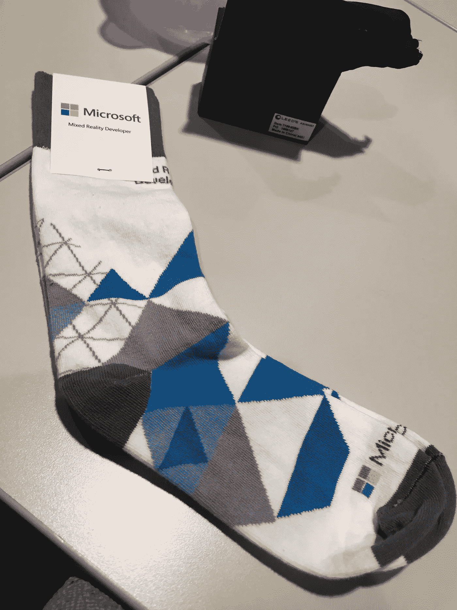

# 我如何在微软的混合现实空运度过一周

> 原文：<https://medium.com/hackernoon/how-i-spent-a-week-at-microsofts-mixed-reality-airlift-518d1be83ff1>

One of the walls in the Microsoft Reactor in Redmond.

我在微软的雷德蒙德总部花了一周时间参加 MR Airlift hackathon ，在那里我们被分成小组，任务是利用微软的 Windows 混合现实和 [Azure](https://hackernoon.com/tagged/azure) 认知服务构建一个混合现实应用。特别感谢 Mai Nguyen 和 Neil Roodyn 博士负责此次空运，以及[混合现实](https://hackernoon.com/tagged/mixed-reality)和 Azure 产品团队对[开发](https://hackernoon.com/tagged/development)社区的参与和关注。我很感激有这个机会。

还有，一句大大的“谢谢！”感谢我的队友——辛迪·赖歇尔、本杰明·皮特森、道格·法尔和杰里米·戴蒙德——让这次经历如此宝贵。我们一起工作，专注于我们应用程序的范围，然后分头行动，实现我们的目标，这种方式让我们获得了如此成功和愉快的体验。

# 提示

我的团队的提示是*使用 HoloLens 和 Azure 认知服务*为一名仓库员工构建一个混合现实应用。

不得不承认，第一次看这个的时候，我翻了个白眼。“这就是我经常看到的 HoloLens 的用途。为什么我们不能用它做些酷的事情呢？，“我也是这么想的。但是我很快意识到这是我们能得到的最好的提示。原因如下:

[微软](https://hackernoon.com/tagged/microsoft)做出了一个区分，这说明了混合现实尚未开发的潜力。微软说有*一线工作者*和*信息工作者*(我相信这是他们对第二组的分类)。后者是一个传统的办公室职员，自从 Doug Engelbart 在 1968 年展示了生产力软件以来，一直是个人电脑和软件行业的目标。前者代表了一个巨大的、超过 20 亿人的未开发的工人市场，他们不符合传统的上班族定义，因此，他们没有像信息工作者一样从计算中受益。

像 HoloLens 这样的混合现实设备将使数据能够存在于真实世界的环境中，并允许软件工程师优化大量一线工作人员相关的操作，这些操作迄今为止还没有达到传统信息工作人员计算平台的水平。当你添加认知服务时，比如 Azure 提供的服务，这些技术代表了计算的真正变革潜力。

回想起来，我对仓库 HoloLens 应用程序的假设是错误的。事实上，他们是完全相反的。

# 问题是

我的一个队友 Cindy Reichel 在西雅图拥有一家商店，她指出她希望能够使用 HoloLens 来跟踪她商店的库存。她能够向小组提供真实世界的数据，说明使用像她这样的小企业主可用的工具来跟踪库存是如何消耗资源和容易出错的。

因此，我们的应用程序的目标是通过使用 HoloLens 和 Azure 认知服务使盘点任务更加直观和有趣，从而优化盘点任务。

这是我团队的最终幻灯片，它确立了我们的假设并概述了我们的解决方案。

# 演示

这是辛迪使用模拟储藏室架子演示我们的 HoloLens 应用程序。她使用 HoloLens 手势和自然语言与应用程序进行交互，并完成了我们模拟零售店后台的清单。

# 反光

Airlift 先生教会了我很多关于开发 HoloLens 和使用 Azure 认知服务的知识。然而，我学到的最重要的一课是，你应该跳出你所在行业潜在的狭窄边界，把新兴技术视为一个相互关联的整体。

我之所以认为我们的 HoloLens 提示会很无聊，是因为我只考虑了提示的混合现实方面，而没有考虑到融入认知服务的潜力。

我坚定地走进空运先生，我相信我来自 AR/VR/MR/etc。行业，但我离开时是对所有新兴技术的交叉感兴趣，而不仅仅是一种特定的技术。如果没有 AI/ML、聊天机器人、物联网和区块链产业，我不相信有一个有意义的 AR/VR/MR 产业。同样，当你考虑 AR/VR/MR 如何应用于其他新兴技术时，它们变得更加有趣。

归根结底，只有旧的做事方式，现在，多亏了像微软这样的公司，大量的技术可供我们优化这些旧的方式。作为问题解决者，我们从未如此轻松过。我和我的团队花了一周时间创建的 HoloLens 库存应用程序在几年前是不可能的。

所以让我们继续提问，保持好奇，开始建造吧！

My official Mixed Reality Developer socks…my Micro-socks…

# 让我们继续讨论吧！

我已经开始了一个名为**的 vlog 系列，意在探索新兴技术背后的个性。技术不会自己进步，它是由建造它的人的情感推动和定义的。如果我们不了解技术背后的人，我们就无法完全了解技术。如果这听起来像是你想进行的讨论，请联系我！如果你在西雅图附近，我会去喝杯咖啡！**