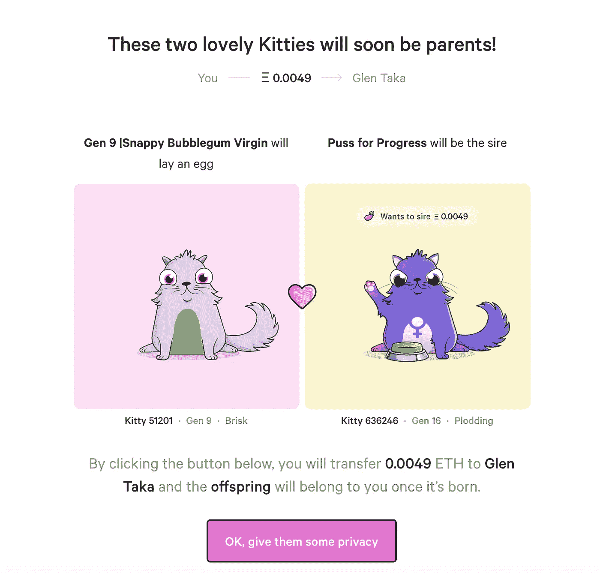
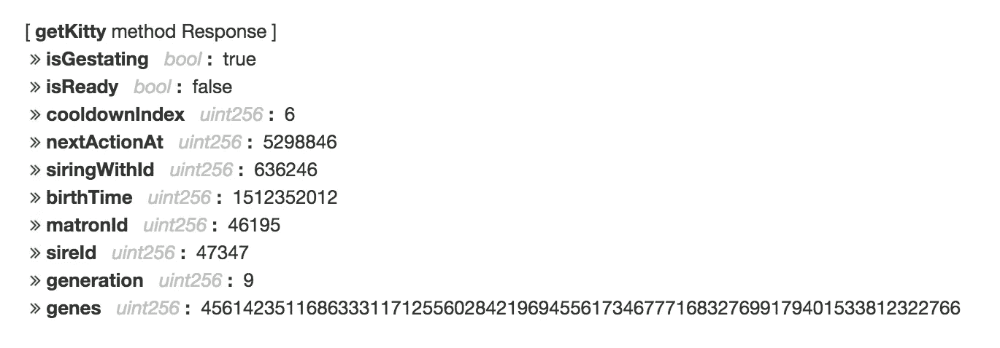
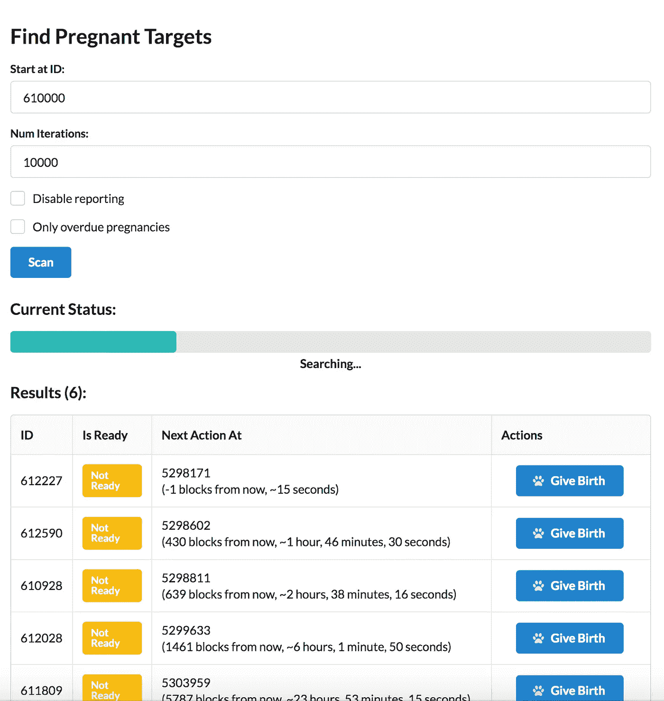
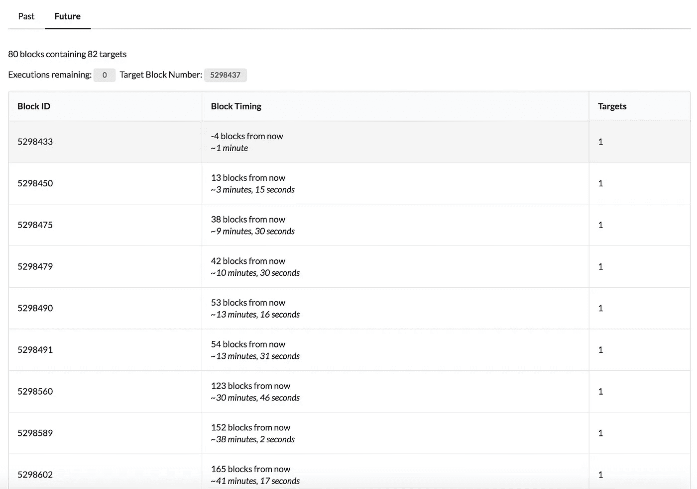
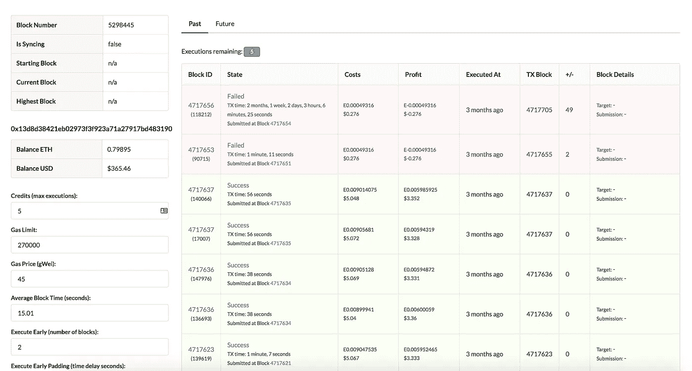
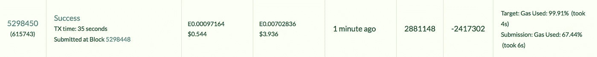

# 我如何花了一周时间生下怀孕的密码猫

> 原文：<https://medium.com/hackernoon/how-i-spent-one-week-giving-birth-to-pregnant-crypto-kitties-e824e9c2a4ef>

那是十二月的第二周。大多数人都在想着节日，霍德勒夫妇欣喜若狂，因为比特币刚刚突破 15000 美元。生活很美好。我周围的每个人都在谈论 Crypto Kitties，我的同事正在用夸张的手臂手势阐述以太坊[区块链](https://hackernoon.com/tagged/blockchain)上不可替代资产的基因繁殖。换句话说，这是一个普通的一天。

在决定，是的，这是一个伟大的想法，分散我的资产，包括虚拟猫，我买了一些，并开始饲养。我的同事走在了我的前面，此时他已经在进行大量的育种工作。但他遇到了许多人在 2017 年 Crypto Kitty 热潮期间遇到的问题——他怀孕的猫不会生孩子。

你看，秘密猫咪的怀孕期取决于它的基因。有些需要几个小时，有些需要几天。但是似乎很多猫都没有按时分娩。这个系统有一个缺陷。

Breeding Crypto Kitties

在搜索了 Reddit 的各个角落之后，我的同事找到了解决方案:调用 Crypto Kitties 智能合约上的 *giveBirth()* 函数。

跟着白兔走。

## 一只秘密小猫的解剖

重要的是要明白，以太坊智能合约中的任何状态变化都需要一个消耗以太(也称为“气体”)的交易。以太坊虚拟机内部执行的每条指令都要消耗一定的 Gas。这意味着实际上所有的执行都是有限的。以太坊上没有后台进程。

怀孕的加密小猫有一堆内部状态:

Internal Ethereum State of a Crypto Kitten

对于我们从事加密小猫助产业务的人来说，这里最重要的属性是 *nextActionAt* 。这个变量决定了猫应该什么时候分娩。该时间被指定为未来的块号。以太坊每 4-20 秒就有一个新的块号。

现在，让猫分娩的唯一方法是让某个人——任何人——调用 give birth()函数。

函数 giveBirth() 将会给任何调用该函数的人一笔大约 4 美元的奖金…

等等，那是什么？

免费的钱？

## 接生过期的小猫

这是所有正常生产力被抛弃的地方。我很快创建了一个骨架 dApp，我的第一个任务是建立一个系统，可以扫描怀孕的加密小猫，它们已经过期了。

The Pregnant Target Finder

我们以这种方式生了许多猫，但很快意识到越来越少的过期猫可用。我们怀疑这是因为有人修改了“脚本”,让猫在预产期自动分娩。

是时候拿出大枪，打败“剧本”了。

## 预测加密小猫助产术

我们很快升级了小猫扫描仪，将未来出生的猫也包括了进来。然后，我们将这些猫编入索引，并按照未来以太坊区块对它们进行组织。

The Long Tail of Pregnant Crypto Kittens

此时，我的妻子想知道她丈夫发生了什么事，为什么他没有尽到一点为人父母的责任。奇怪的是，对我的所作所为的合理解释对我的情况没有帮助。

下一步是确保在正确的时间调用 giveBirth()函数。这意味着确保本地以太坊客户端同步，并密切关注当前块。第一个调用 giveBirth()将获得 3 美元的利润，然而，调用太晚或太早将由于花费交易费(Gas)而导致 0.30 美元的损失。

The Betting Interface

当以太坊链上有大量流量时，为 giveBirth()下注计时变得相当具有挑战性。需要正确的天然气价格，并且需要在目标以太坊区块之前创建交易。尽管如此，这个系统似乎还在运转:在没有干预的情况下，它每小时可以赚 100 美元。该睡觉了，一边睡觉一边赚钱。

That sweet green row of a profitable birth!

凌晨 4 点，我被内心的资本家叫醒，走到我的笔记本电脑前查看战利品。一片红色的海洋。在晚上的某个时候，所有的赌注都开始失败了。

事实证明，由于链上的可变流量，需要不断调整 giveBirth()事务的时间。

接下来的几天，我试图优化“自动驾驶”功能以提高命中率，但我逐渐意识到数据模式中隐藏着一些东西:

我并不孤单。

很明显，其他人——可能比我更聪明、更有耐心——也从事助产行业。接下来的日子里，汽油价格不得不越来越高，这导致利润越来越低。

我出去了。

而对于 Crypto Kitties，市场已经以最优的方式解决了 giveBirth()。

太神奇了。

## 结论

这个实验向我展示了区块链的真正力量。尽管区块链的机制很简单，但隐藏在区块链的大思想是，经济学现在是可编程的。这些“象征经济学”提供了非常纯粹的金钱奖励来执行某些行动。好处可能是如此之大，以至于市场花费了大量资源来自动化某些行为。在软件领域，这与过去自愿的开源社区贡献非常不同。令牌经济学在微观层面上提供了经济激励，并为自组织网络注入了大量资本主义。

但是对于区块链和令牌经济学来说，现在还为时尚早。实际上，每一个资本主义企业都在努力成为垄断企业。用彼得·泰尔的话说——太多的竞争不利于商业。这是一场零利润的竞赛。这个实验表明，这可能发生得非常快，尽管公平地说，我本可以加强我的游戏，我会经营今天最大的秘密小猫助产农场。

像任何强大的技术一样，它们可以用于好的和坏的目的。带有“邪恶”令牌组学的网络造成伤害只是时间问题。有一些可以想象的非常可怕的场景，涉及到错误的令牌组学。

需要进行大量的实验来发现如何利用令牌组学的力量来改善软件网络，以造福人类组织。

为更多的实验干杯。

*特别感谢* [*卡梅隆·撒克尔*](https://www.linkedin.com/in/cameronthacker/)*[*乔希·琼斯-迪尔沃思*](https://twitter.com/joshdilworth) *和* [*罗素·莫恩奇*](/@russmonk) *为本文提供的投入。**